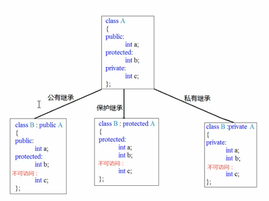
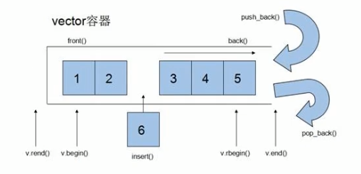
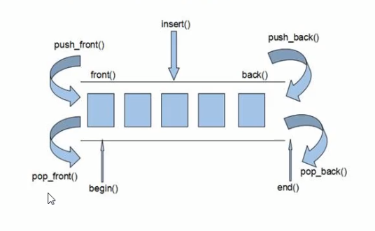
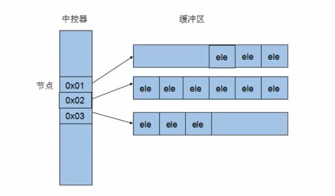
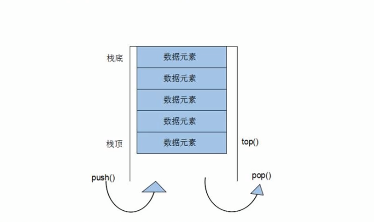
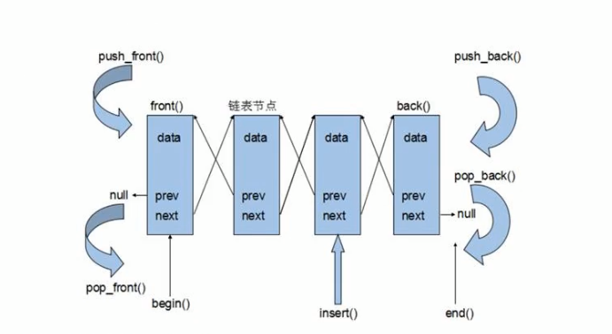

<h1 align="center"><b><p>C++学习笔记</p></b></h1>

# **C++基础**

## **1.  数据结构**

1. 整型

   ```c++
   short a = 0; // 短整型， 占2字节， 表示范围 (-2^15 ~ 2^15-1)
   int b = 0; // 整型， 占4字节， 表示范围 (-2^31 ~ 2^32-1)
   long c = 0; // 长整型， 占4字节， 表示范围 (-2^31 ~ 2^32-1)
   long long d = 0; // 长长整型， 占8字节， 表示范围 (-2^63 ~ 2^63-1)
   ```

2. 实型(浮点型) ：(默认情况下，输出一个小数，会显示6位有效数字)

   ```C++
   float a = 0; // 单精度， 占4字节 (7位有效数字)
   double b = 0; // 双精度， 占8字节 (15~16位有效数字)
   ```

3. 字符型 / 字符串型

   ```C++
   #include <string>
   using namespace std;
   
   char ch = 'a'; // 占1字节
   // 转义字符 \n, \\ \t 等等...
   // 字符串表示方法：1.字符数组， 2.string(类型)
   char arr[] = "hello world!";
   string str = "hello world!";
   
   // bool 类型
   bool right = true;
   bool wrong = false;
   ```

***

## **2. 数组**

**放在一段连续的内存中**

**数组中的每一个元素的数据类型都是相同**

### **2.1 一维数组 **

1. 可以统计整个数组在内存中的长度
2. 名表示数组的首地址，也是数组第一个元素的地址

### **2.2 二维数组**

1. 数组名可以查看二维数组占用的内存空间
2. 数组名是二维数组的首地址,也是第一行的首地址,也是第一行的第一个元素的首地址
3.  获取二维数组的行数列数

**示例：**

```C++
#include <iostream>
using namespace std;

int main()
{
    // 一位数组
    int arr[5];
    int arrLen = sizeof(arr) / sizeof(arr[0]);
    for(size_t i = 0; i < arrLen; i++)
    {
        arr[i] = i;
    }
    for(size_t i = 0; i < arrLen; i++)
    {
        cout << "arr[" << i << "]" << arr[i] << endl;
    }
    cout << "arr数组的首地址：" << arr << " or " << &arr[0] << endl; 

    // 二维数组
    int arrTwo[2][3];
    size_t lenTotal = sizeof(arrTwo);
    size_t rows = sizeof(arrTwo) / sizeof(arrTwo[0]); // 行数
    size_t columns = sizeof(arrTwo[0]) / sizeof(arrTwo[0][0]); // 列数
	
    return 0;
}

```

***

## **3. 函数**

**示例：**

```C++
返回值类型 函数名(参数1, 参数2, ...)
{
	函数体;
	return 返回值;
}
```

### **3.1 函数默认参数**

**注意事项：**

- 如果某个位置已经有了默认参数，那么从这个位置往后，从左到右都必须有默认参数
- 如果函数的声明有默认参数，函数的实现就不能有默认参数(函数声明和实现只能有一个默认参数)

```C++
返回值类型 函数名(参数1 = 默认值1, 参数2 = 默认值2, ...)
{
    函数体;
    return 返回值;
}
```

### **3.2 函数占位参数**

C++中函数的形参列表里可以有占位符，用来作占位，调用函数时必须填补该位置

**示例语法：**

```C++
返回值类型 函数名 (数据类型)
{
	函数体;
    return 返回值;
}
// 占位参数也可以有默认参数
void func(int a, int)
{
    cout << "a = " << a << endl;
}
// 调用 , 第二个参数无意义，但是调用必须传入一个参数
func(10, 20);
```

### **3.3 函数重载**

**作用：**函数名可以相同，提高复用性

**函数重载满足条件：**

- 同一个作用域下
- 函数名相同
- 函数参数 **类型不同** 或者 **个数不同** 或者 **顺序不同**

**注意事项：**

- 函数的返回值不可以作为函数重载的条件
- 引用作为重载条件

**示例：**

```C++
void func(int &a)
{
    cout << "func(int &a)" << endl;
}
void func(const int &a)
{
    cout << "func(const int &a)" << endl;
}
int main()
{
    int a = 10;
    func(a); // 调用：void func(int &a); 这个函数
    
    func(10); // 调用：void func(const int &a); 这个函数 因为 const int &a = 10; 合法，   int &a = 10; 不合法
    
    return 0;
}
```

- 函数重载遇到函数的默认参数

**示例：**

```C++
void func(int a)
{
    cout << "func(int a)" << endl;
}
void func(int a, int b = 20)
{
    cout << "func(int a, int b = 20)" << endl;
}
int main()
{
    int a = 10;
    // 当函数重载遇到默认参数，就会出现歧义，报错， 尽量避免默认参数
    //func(10);
    return 0;
}
```


***

## **4. 指针**

**指针作用：** 可以通过指针间接访问内存

- 内存编号是从0开始记录的，一般用十六进制数字表示
- 可以利用指针变量保存地址

**指针定义：** 指针类型 * 变量名;

**占用内存空间：**

- 在32位操作系统下，不管指针是什么数据类型都占用4个字节空间大小
- 在64位操作系统下，不管指针是什么数据类型都占用8个字节空间大小

### **4.1 空指针**

**定义：** 指针变量指向内存中编号为0的空间

**用途：** 初始化指针变量

**注意：** 空指针指向的内存是不可以访问的

**示例：空指针**

```C++
int main()
{
    // 空指针不可以访问
	// 内存编号 0 ~ 255 为系统占用内存，不允许用户访问
	int * p = NULL;
    
    return 0;
}
```

### **4.2 野指针** 

**定义：** 指针变量指向非法的内存空间

```C++
int main()
{
	// 指针变量p指向内存编号地址为 0x11000的空间
    // 访问野指针会报错
	int * p = (int *)0x11000;
    
    return 0;
}
```

### **4.3 const 修饰指针**

1. const 修饰指针	--- 指针常量

   ```C++
   int a = 10;
   // 指针指向不可以改，指针指向的值可以改
   int * const p = &a
   ```

2. const 修饰常量    --- 常量指针

   ```C++
   int a = 10;
   // 指针指向可以改， 指针指向的值不可以改
   const int * p = &a;
   ```

3. const 既修饰指针，又修饰常量

   ```C++
   int a = 10;
   // 指针的指向和指针指向的值都不可以改
   const int * const p = &a;
   ```

### **4.4 指针和数组**

**示例：**

```c++
int main()
{
    // 定义一个数组
    int arr[10] = { 1, 2, 3, 4, 5, 6, 7, 8, 9, 10 };
	// 定义一个(int型)指针
    int * p = arr;
    // 一次往后偏移4个字节
    p++; 
    return 0;
}
```

### **4.5 指针、数组、函数**

**示例：冒泡排序**

```C++
#include<iostream>
using namespace std;

void bubbleSort(int * arr, int length);

int main()
{
    // 声明一个数组
    int arr[10] = { 4, 2, 6, 9, 1, 2, 10, 8, 7 }
    int length = sizeof(arr) / sizeof(arr[0]);
    bubbleSort(arr, length);
}
// 冒泡排序
void bubbleSort(int * arr, int length)
{
    for(int i = 0; i < length - 1; i++)
    {
        for(int j = 0; j < length - i - 1; j++)
        {
            if(arr[j] > arr[j + 1])
            {
                int temp = arr[j];
                arr[j] = arr[j + 1];
               	arr[j + 1] = temp;
            }
        }
    }
}
```

***

## **5. 结构体**

### **5.1 概念**

- 结构体属于用户==自定义的数据类型==，允许用户存储不同的数据类型

### **5.2 结构体定义和使用**

**语法：** <u>struct 结构体名 {结构体成员表};</u>

通过结构体创建变量的方式有三种：

- struct 结构体名 变量名;
- struct 结构体名 变量名 = {成员1值, 成员2值, ...}
- 定义结构体时顺便创建变量

**示例：**

```C++
#include<iostream>
#include<string>

using namespace std;

// 自定义的数据类型，一些类型集合组成的一个类型
struct Student
{
    // 成员列表
    string name;
    int age;
    int score;
}std3; // 创建结构体变量

int main()
{
    struct Student std1;
    std1.name = "lisi";
    std1.age = 16;
    std1.score = 76;
    
    struct Student std2 = { "zhangsan", 18, 83 };
    
    std3.name = "wangwu";
    std3.age = 26;
    std3.score = 78;
    
    return 0;
}
```

**总结：**

1. 定义结构体时的关键字是struct，不可以省略
2. 创建结构体变量时，关键字struct可以省略
3. 结构体变量利用操作符 '.' 访问结构体成员

### **5.3 结构体数组**

**作用：**将自定义的结构体放入到数组中方便维护

**语法：**struct 结构体名 数组名[元素个数] = { {}, {}, {}, ... }

**示例：**

```C++
#include<iostream>
#include<string>

using namespace std;

// 自定义的数据类型，一些类型集合组成的一个类型
struct Student
{
    // 成员列表
    string name;
    int age;
    int score;
}std3; // 创建结构体变量

int main()
{
    struct Student stds[2]
    {
        { "zhangsan", 18, 78 },
        { "lisi", 16, 76 },
        { "wangwu", 19, 86 }
    };

    return 0;
}
```

### **5.4 结构体指针**

**作用：**通过指针访问结构体成员

- 利用操作符 -> 可以通过结构体指针访问结构体属性

### **5.5 结构体-结构体嵌套结构体**

**示例：**

```C++
#include<iostream>
#include<string>
#include<ctime>
using namespace std;

struct Student
{
	string name;
	int age;
	int score;
}stdInit; // 创建结构体变量

struct Teacher
{
	int id;
	string name;
	int age;
	struct Student std;
};

int main()
{
    // 生成一个随机数种子 (按照时间计算)
	srand((unsigned int)time(NULL));
    
    struct Teacher tea = { 102, "张老师", 19, { "小李", 18, 86 } };
	tea.id = 10012;
	tea.name = "王老师";
	tea.age = 18;
	tea.std.age = 5;
	tea.std.name = "小王";
	tea.std.score = 90;

	system("pause");
	return 0;
}
```

**总结：**在结构体中可以定义另一个结构体作为成员，用来解决实际问题

### **5.6 结构体做函数参数**

**作用：**将结构体作为参数向函数中传递

传递方式有两种：

- 值传递
- 地址传递(指针传递) (可以节省空间)

**const 使用场景：**使用const 修饰函数形参， 可以防止数据的误操作

***

# **C++核心编程**

## **1. 内存分区模型**

C++程序执行时，将内存大方向划分为**4个区域**

- **代码区：**存放函数体的二进制代码，由操作系统进行管理的
- **全局区：**存放全局变量和静态变量以及常量
- **栈区：**由编译器自动分配释放，存放函数的参数值、局部变量等
- **堆区：**由程序员分配和释放，若程序员不释放，程序结束时由操作系统回收

**内存四区意义：**

不同区存放的数据，赋予不同的生命周期，给我们更大的灵活编程

### **1.1 程序运行前**

> 在程序编译后，生成了exe可执行文件，**未执行该程序前**分为两个区域

**代码区：**

> 存放CPU执行的机器指令
>
> 代码区是**共享**的，共享的目的是对于频繁执行的程序，只需要在内存中有一份代码即可
>
> 代码区是**只读**的，使其只读的原因是防止程序以外的修改了它的指令

**全局区：**

> 全局变量和静态变量存放在此.
>
> 全局区还包含了常量区，字符串常量和其他常量也存放在此.
>
> ==该区域的数据在程序结束后由操作系统释放.==

### **1.2 程序运行后**

**栈区：**

> 由编译器自动分配释放，存放函数的参数值、局部变量等
>
> 注意事项：不要返回局部变量的地址，栈区开辟的数据由编译器自动释放

**堆区：**

> 由程序员分配释放，若程序员不释放，程序结束时由操作系统回收
>
> 在C++中主要利用new在堆区开辟内存

**new 基本语法：** new 数据类型;

> 在堆区开辟一块内存
>
> 利用new创建的数据， 会返回该数据对应的类型的指针
>
> 释放堆区的数据，利用关键字 delete， 数组 delete[] arr;

**示例：**

```C++
#include<iostream>
using namespace std;

int * func()
{
    int * p = new int(20);
    return p;
}

void func1()
{
    // 创建10个整型数据的数组， 在堆区
    int * arr = new int[10];
    for(int i = 0; i < 10; i++)
    {
        arr[i] = i + 100;
    }
    for(int i = 0; i < 10; i++)
    {
        cout << arr[i] << endl;
    }
    // 释放堆区的数组
    delete[] arr;
}

int main()
{
    int * p = func();
    
    cout << *p << endl;
    delete p;
    // 内存已经被释放，再次访问是非法操作，会报错
    //cout << *p << endl;
    
    system("pause");
    return 0;
}
```

***

## **2.引用**

### **2.1 引用的基本使用**

**作用：**给变量起别名

**语法：**数据类型 &别名 = 原名;

**注意事项：**

1. 引用必须要初始化.
2. 引用一旦初始化，就不可以跟改.

**示例：**

```C++
int a = 10;
int &b = a;
cout << "a = " << a << "   b = " << b << endl;
// 错误的， 引用必须要初始化
//int &c;
```

### **2.2 引用做函数参数**

**作用：**函数传参时，可以利用引用的技术让形参修饰实参.

**优点：**可以简化指针修改实参.

**示例：**

```C++
// 引用传递， 和地址传递效果是一样的， 操作形参实际就是操作实参
void func(int &a, int &b)
{
    int temp = a;
    a = b;
    b = temp;
}
```

**总结：**通过引用参数产生的效果同按地址传递是一样的，引用的语法更清楚简单.

### **2.3 引用做函数的返回值**

**作用：**引用是可以作为函数的返回值存在的

**用法：**函数调用作为左值

**注意：**==不要返回局部变量的引用==

**示例：**

```C++
// 1. 不要返回局部变量的引用
// 调用函数后，第一次打印数据是对的(因为编译器给我们做了一次数据保留)，第二次打印数据就错了(因为局部变量已经被释放，操作属于非法操作)
//int & func()
//{
//    int a = 10;
//    return a;
//}
// 2. 函数的调用可以作为左值
int & func1()
{
    // 静态变量，存放在全局区， 全局区上的数据在程序结束后被系统释放
    static int a = 10;
    return a;
}
// 常规用法：
int &ref = func1();
// 左值用法：
func1() = 100; // 如果函数的返回值是个引用，这个函数的调用可以作为左值
```

### **2.4 引用的本质**

本质：**引用的本质在C++内部实现是一个指针常量.**

**示例：**

```C++
int a = 10;
int& ref = a; // 内部自动转换，int* const ref = &a;
ref = 20; // 内部自动转换： *ref = 20；
```

### **2.5 常量引用**

**使用场景：**用来修饰形参，防止误操作.

- 引用必须引用一块合法的内存空间

**示例：**

```C++
// 加上const 编译器将代码修改 int temp = 10;  const int& ref = temp;
const int& ref = 10;

void showValue(const int& value)
{
    //value = 1000;  // 不可以修改
 	cout << "value = " << value << endle;   
}
```

***

## **3. 类和对象**

C++面向对象的三大特性：**封装** 、**继承 **、**多态**

C++认为==万事万物都皆为对象==，对象上有其属性和行为，具有相同性质的==对象==，我们可以抽象称为==类==，人属于人类，车属于车类.

### **3.1 封装**

**意义：**

- 将属性和行为作为一个整体，表现生活中的事物
- 将属性和行为加以权限控制

**语法：**

```C++
class 类名 
{
	访问权限: 属性 / 行为
};
```

类中的属性和行为都称为**成员**

**属性：** 成员属性、成员变量

**行为：** 成员方法、成员函数

访问权限有三种：

1. **public** 		公共权限 (类**内**、**外**都可以访问)
2. **protected**   保护权限 (类**内**可以访问、类**外**不能访问，但是**子类**可以访问)
3. **private**       私有权限 (只有类内部才能访问)

**struct 和 class 的区别**

在C++中 struct 和 class 唯一的**区别**就在于**默认的访问权限不同**

区别：

- struct 默认的权限是公共权限
- class 默认的权限是私有权限

**成员属性设置为私有：**

**优点1：**将所有成员属性设置为私有，可以自己控制读写权限

**优点2：**对于写权限，我们可以检测数据的有效性

**示例：**

```C++
#include<iostream>
#include<string>
using namespace std;

class Student
{
    // 默认权限是私有权限
    int m_classID;
	// 公共权限
public:
	string Name;
	int ID;

	// 保护权限
protected:
	string m_Car;

	// 私有权限
private:
	int m_passworld;

public:
	void SetName(string _name)
	{
		Name = _name;
	}

	void SetPassword(int _password)
	{
		m_passworld = _password;
	}

	void ShowStudent()
	{
		cout << "Name: " << Name << "  ID: " << ID << endl;
	}
};

struct MyStruct
{
	// 默认权限是公共权限
	int m_structID;
};
```

### **3.2 对象的初始化和清理**

* C++中的面向对象来源于生活，每个对象也都会有初始化的设置以及对象销毁前的清理数据的设置。

#### **3.2.1 构造函数和析构函数**

对象**初始化**和**清理**也是两个非常重要的安全问题

- 一个对象或者变量没有初始状态，对其使用后果是未知的
- 同样使用完一个对象或者变量，没有及时清理，也会造成一定的安全问题

C++利用了**构造函数**和**析构函数**解决上述问题，这两个函数将会被编译器自动调用，完成对象初始化和清理工作。

对象的初始化和清理工作是编译器强制要求我们做的事情，因此**如果我们不提供构造和析构，编译器会提供构造函数和析构函数的空实现**。

* **构造函数：**主要作用在于对象**创建时**为对象的成员属性赋值，构造函数由编译器自动调用，无需手动调用。

  **语法：**

  ```C++
  // 构造函数
  类名() { }
  ```

  1. 构造函数，没有返回值也不用写void
  2. 构造函数名称与类名相同
  3. 构造函数可以有参数，因此可以发生重载
  4. 程序在调用对象时候会自动调用构造函数，无须手动调用，而且只会调用一次

  

* **析构函数：**主要作用在于对象**销毁前**系统自动调用，执行一次清理工作。

  **语法：**

  ```C++
  // 析构函数
  ~类名() { }
  ```

  1. 析构函数没有返回值，也不用写void
  2. 函数名称和类名相同，在名称前加上符号 ~
  3. 析构函数不可以有参数， 因此不可以发生重载
  4. 程序在对象销毁前会自动调用析构，无须手动调用，而且只会调用一次

#### **3.2.2 构造函数的分类及调用**

两种分类方式：

* 按照参数分为：**有参构造和无参构造**
* 按照类型分为：**普通构造和拷贝构造**

三种调用方式：

1. 括号法
2. 显示法
3. 隐式法

注意事项：

* 调用默认构造函数的时候，不要加小括号 ‘()’，加括号'()' ，就不会创建一个对象了(因为编译器会认为这是一个函数声明)
* 匿名对象，特点：当前执行结束后，系统会立即回收掉匿名对象
* 不要用拷贝构造函数初始化匿名对象,编译器会认为 Student(stu2) 等价于 Student stu2; 对象声明重定义

**示例：**

```C++
class Student
{
public:
    // 构造函数
    Student() { }
    Student(int age) { }
	// 拷贝构造 使用引用的方式传递
	Student(const Student &stu) { }
    // 其他的都是普通构造
    
    // 析构函数
    ~Student() { }
}

int main()
{
    // 这样写法，编译器会认为这是一个函数声明，不会创建对象
    //Student stu1();
    Student stu2;
    // 匿名对象，特点：当前执行结束后，系统会立即回收掉匿名对象
    Student(10);
    // 不要用拷贝构造函数初始化匿名对象,编译器会认为 Student(stu2) == Student stu2; 对象声明重定义
    //Student(stu2)
    // 隐式转换法
    Student stu3 = 10; // 调用有参构造函数
    Student stu4 = stu3; // 调用拷贝构造函数
    // 对象作为值传递 或者 作为值方式返回局部变量，实际调用了一次拷贝构造函数
    
    return 0;
}
```

#### **3.2.3 构造函数调用规则**

默认情况下，C++编译器至少给一个类添加3个函数

1. 默认构造函数(无参，函数体为空)
2. 默认析构函数(无参，函数体为空)
3. 默认拷贝构造函数，对属性值进行拷贝

构造函数调用规则如下：

- 如果用户定义有参构造函数，C++不在提供默认无参构造函数，但是会提供默认拷贝构造
- 如果用户定义了拷贝构造函数，C++不会再提供其他构造函数

#### **3.2.3 浅拷贝和深拷贝**

浅拷贝：**简单的赋值拷贝操作**

* 编译器提供的拷贝构造函数会做浅拷贝操作(普通的等号(=)操作)
* 对于堆区的数据，浅拷贝带来的问题就是堆区的内存重复释放(这个问题可以使用自定义的拷贝构造函数进行深拷贝操作)

深拷贝：**在堆区重新申请空间，进行拷贝操作**

**总结：**如果属性有在堆区开辟，一定要自己提供拷贝构造函数，防止浅拷贝带来的内存重复释放的问题

#### **3.2.4 初始化列表**

**作用：**C++提供了初始化列表的语法，用来初始化属性

**语法：**

```C++
构造函数(): 属性1(值1), 属性2(值2), ... {}
```

**示例：**

```C++
class Student
{
public:
    string Name;
    int ID;
	// 初始化列表初始化属性
	Student(string _name, int _id) :Name(_name), ID(_id)
	{
		
	}
}
```

#### **3.2.5 类对象作为类成员**

C++类中的成员可以是另一个类的对象，我们称该成员为**对象成员**

* 当其他类对象作为本类成员， 构造时先构造其他类对象，在构造自身，析构的顺序与构造顺序相反

#### **3.2.6 静态成员**

静态成员就是在成员变量和成员函数前加上关键字 **static** ，称为静态成员。

静态成员分为：

1. **静态成员变量**
   * 所有对象共享同一份数据
   * 在编译阶段分配内存
   * 类内声明，类外初始化
2. **静态成员函数**
   * 所有对象共享同一个函数
   * 静态成员函数只能访问静态成员变量

静态函数两种访问方式：

* 对象访问
* 类名访问

### **3.3 C++对象模型和this指针**

在C++中，类内的成员变量和成员函数是分开存储的

只有非静态成员变量和函数才属于类的对象上

* 空对象占用的内存空间是 1个字节

  **原因：**

  1. C++编译器会给每个空对象也分配一个字节空间，是为了区分空对象占内存的位置
  2. 每个空对象也应该有一个独一无二的内存地址

**示例：**

```C++
class Student
{
    int m_A; // 非静态成员变量，属于类的对象上
    static int m_B; // 静态成员变量，不属于类对象上
    void func1(); // 非静态成员函数，不属于类对象上
    static void func2(); // 静态成员函数，不属于类的对象上
}
```

**总结：**只有非静态成员变量才属于类的对象上，其他成员都不属于类对象上

#### **3.3.1 this指针**

概念：**this指针指向被调用的成员函数所属的对象**

* this 指针是隐含每一个非静态成员函数内的一种指针
* this 指针不需要定义，直接使用即可
* this 指针的本质是指针常量， 指针的指向是不可以修改的，指针指向的值是可以修改的

this 指针的用途：

1. 当形参和成员变量同名时，可用 this 指针来区分

2. 在类的非静态成员函数中返回对象本身，可使用 return *this;

   * 一般使用 引用方式返回这样会返回当前的对象，如果采用值返回，会返回一个当前对象的拷贝对象后的返回 

     ```C++
     class Student
     {
     public:
         void ShowStudent()
         {
             // this 指针不可以修改指针的指向的
             // 本质 ： const Student * const this;
             //this = NULL;
         }
         // 值返回 会调用拷贝构造重新生成一个对象
         Student GetStudentA()
         {
             return *this;
         }
         // 引用返回 返回当前对象
         Student& GetStudentA()
         {
             return *this;
         }
     };
     ```

     

#### **3.3.2 空指针调用成员函数**

C++中空指针也是可以调用成员函数的，但是也要注意有没有用到this指针，如果用到this指针，需要加以判断保证代码的健壮性

空对象也是可以调用成员函数的：

```C++
class Student
{
public:
    int m_A;
    void ShowUI()
    {
        cout << "show UI" << endl;
    }
    void ShowThisUI()
    {
        // 在对象为NULL的时候 需要判断 this 是否为 NULL 否则会报错
        if(this == NULL) return;
        cont << "show This UI: " << this->m_A << endl;
    }
};

int main()
{
    Student stu = NULL;
    stu.ShowUI(); // 正常
    stu.ShowThisUI(); // 判断 this 是否为 NULL    
    return 0;
}
```

#### **3.3.3 const修饰成员函数**

**常函数：**

* 成员函数后加 const 后我们称这个函数为**常函数**
* 常函数内不可以修改成员属性
* 成员属性声明时加关键字 mutable 后，在常函数中就可以修改

**常对象：**

* 声明对象前加 const 称该对象为常对象
* 常对象只能调用常函数

```C++
class Student
{
public:
    int m_A;
    // m_B 特殊属性， 既可以在常函数中修改，也能在常对象中修改
    mutable int m_B;
    
    // 常函数
    void ShowStudent() const
    {
        // 在常函数不能修改成员属性， 但是在成员属性前加 mutable 就可以修改了
        //this->m_A = 10; // 报错
        this->m_B = 20;
    }    
};

int main()
{
    // 常对象, 只能调用常函数
    const Student stu;
    stu.ShowStudent();
    
    return 0;
}
```

### **3.4 友元**

在程序里，有些私有属性也想让类外的特殊的一些函数或者类进行访问，就需要用到友元的技术

友元的目的就是让一个函数或者类访问另一个类中的私有成员

友元的关键字：**friend**

友元的三种实现：

1. 全局函数做友元
2. 类做友元
3. 成员函数做友元

**示例：友元**

```C++
#include<iostream>
#include<string>
using namespace std;

class GoodGay
{
public:
	GoodGay()
    {
        this->m_build = new Build;
    }
	~GoodGay()
    {
        delete this->m_build;
		this->m_build = NULL;
    }
	void Visit()
    {
        cout << "Good Gay Visit Build: " << this->m_build->m_sittingRoom << endl;
        // GoodGay 类做 Build 的友元， GoodGay类中就可以访问Build类中的私有成员
        cout << "Good Gay Visit Build: " << this->m_build->m_bedRoom << endl;
    }
   
    
private:
	Build * m_build;
};

class GoodGay2
{
public:
    GoodGay()
    {
        this->m_build = new Build;
    }
	~GoodGay()
    {
        delete this->m_build;
		this->m_build = NULL;
    }
    void Visit()
    {
        cout << "Good Gay Visit Build: " << this->m_build->m_sittingRoom << endl;
        // GoodGay 类做 Build 的友元， GoodGay类中就可以访问Build类中的私有成员
        cout << "Good Gay Visit Build: " << this->m_build->m_bedRoom << endl;
    }
private:
	Build * m_build;
}

class Build
{
	// 友元函数， 此时 goodGay 函数就可以访问 Build 类中的私有成员了
	friend void goodGay(Build * _build);
    // 类做友元, 此时 GoodGay 类中就可以访问 Build 类中的私有成员了
    friend class GoodGay;
    // 成员函数作为友元  GoodGay2 类中 的 Visit做友元
    friend void GoodGay2::Visit();
public:
	Build(){ }
	~Build(){ }
	string m_sittingRoom;
    
private:
	string m_bedRoom;
};
// 全局函数
void goodGay(Build * _build)
{
	cout << "访问 sittingroom： " << _build->m_sittingRoom << endl;
	// 将 goodGay 作为 Build 友元函数 就可以访问 Build 的私有成员了
	cout << "访问 bedgroom： " << _build->m_bedRoom << endl;
}
```

### **3.5 运算符重载**

概念：对已有的运算符重新进行定义，赋予其另一种功能，以适应不同的数据类型

运算符重载，也可以发生运算符函数的函数重载

1. 对于内置的数据类型的表达式的运算符是不可能发生重载的
2. 不要滥用运算符重载

* 全局函数重载

  ```C++
  // 全局的
  类名 operation(运算符) (参数1, 参数2, ...) { }
  ```

* 成员函数重载

  ```C++
  class 类名
  {
  public:
      返回值 operation(运算符) (参数1, 参数2, ...)
      {
          函数体;
          return 返回值;
      }
  }
  ```

#### **3.5.1 加号运算符重载**

* 成员函数运算符重载
* 全局函数运算符重载

**作用：**实现两个自定义数据类型相加的运算

```C++
class Vector3
{
public:
	Vector3();
	Vector3(float x);
	Vector3(float x, float y);
	Vector3(float x, float y, float z);
	~Vector3();

	Vector3 operator + (Vector3 & v3);
	Vector3 operator - (Vector3 & v3);
	float Dot(Vector3 & v3);
	Vector3 Cross(Vector3 & v3);

private:
	float m_x;
	float m_y;
	float m_z;
};
Vector3::Vector3(float x, float y, float z)
{
	this->m_x = x;
	this->m_y = y;
	this->m_z = z;
}

Vector3 & Vector3::operator+(Vector3 & v3)
{
	this->m_x += v3.m_x;
    this->m_y += v3.m_y;
    this->m_z += v3.m_z;
    return *this;
}


int main()
{
    Vector3 v1 = Vector3(1,2,3);
    Vector3 v2 = Vector3(1,2,3);
    // 成员函数运算符重载
    // 本质： Vector3 v3 = v1.operator+(v2);
    Vector3 v3 = v1 + v2;
    
    return 0;
}
```

#### **3.5.2 左移运算符重载**

**作用：**可以输出自定义类型

**只能通过全局函数实现左移运算符重载**

```C++
#include<ostream>
using namespace std;

class Vector3
{
    // 全局函数 做友元
	friend ostream & operator<<(ostream & cout, Vector3 & ve3);
public:
	Vector3(float x, float y, float z)
    {
        this->m_x = x;
        this->m_y = y;
        this->m_z = z;
    }
private:
	float m_x;
	float m_y;
	float m_z;
};
// 左移运算符重载
ostream & operator<<(ostream & cout, Vector3 & ve3)
{
    cout << "X: " << ve3.m_x << ", Y:" << ve3.m_y << ", Z:" << ve3.m_z;
	return cout;
}

int main()
{
    Vector3 v3 = Vector3(1,2,3);
    cout << v3 << endl;
    return 0;
}

```

#### **3.5.3 递增运算符重载**

**作用：**通过重载递增运算符，实现自己的整型数据

1. 重载前置 ++ 运算符
2. 重载后置 ++ 运算符

```C++
#include<ostream>
using namespace std;

class MyInteger
{
	// 全局函数做友元
	friend ostream & operator<<(ostream & cout, MyInteger & num);

public:
	MyInteger() :m_num(0){ }
	MyInteger(int num) : m_num(num){ }
    
	// 前置 ++ 运算符重载， 返回的是引用
	MyInteger& operator++()
  	{
        this->m_num++;
        return *this;
	}
    
	// 后置 ++ 运算符重载， 返回的是值
	// int 代表占位参数，可以用于区分前置和后置递增
	MyInteger operator++(int)
    {
        MyInteger preNum = *this;
        this->m_num++;
        return preNum;
    }
    
	~MyInteger();
private:
	int m_num;
};

ostream & operator<<(ostream & cout, MyInteger & num)
{
	cout << num.m_num;
	return cout;
}

int main()
{
    MyInteger num = MyInteger(10);
	cout << (++num)++ << endl; // 输出 11 
	cout << num << endl; // 输出 12

	system("pause");
    return 0;
}
```

#### **3.5.4 赋值运算符重载**

C++编译器至少给一个类添加4个函数

1. 默认构造器(无参，函数体为空)
2. 默认析构函数(无参，函数体为空)
3. 默认拷贝构造函数，对属性进行值拷贝
4. 赋值运算符 operator= ，对属性进行值拷贝

如果类中有属性指向堆区，做赋值操作时也会出现深浅拷贝的问题。

```C++
#include<iostream>
using namespace std;

class Person
{
private:
	int *m_Age = NULL;

public:
	Person(int _age)
    {
        this->m_Age = new int(_age);
    }
	~Person()
    {
        if (this->m_Age != NULL)
        {
            delete this->m_Age;
            this->m_Age = NULL;
        }
    }
    // 重载赋值运算符
	Person& operator=(Person & p)
    {
        // 编译器是提供浅拷贝
        //this->m_Age = p.m_Age;

        // 应该先判断是否有属性在堆区， 如果有先释放干净，然后再深拷贝
        if (this->m_Age != NULL)
        {
            delete this->m_Age;
            this->m_Age = NULL;
        }
        // 深拷贝
        this->m_Age = new int(*p.m_Age);
        // 返回对象本身
        return *this;
    }
};
int main()
{
    Person p1 = Person(18);
	Person p2 = Person(20);
	Person p3 = Person(30);

	p2 = p1 = p3;
    system("pause");
    return 0;
}
```

#### **3.5.5 关系运算符重载**

**作用：**重载关系运算符，可以让两个自定义类型对象进行对比操作

**示例：**

```C++
#include<iostream>
#include<string>
using namespace std;

class Person
{
private:
	string m_Name;
	int *m_Age = NULL;

public:
	Person(string _name, int _age)
    {
        this->m_Name = _name;
		this->m_Age = new int(_age);
    }
	~Person();

	Person& operator=(Person & p)
    {
        // 编译器是提供浅拷贝
        //this->m_Age = p.m_Age;

        this->m_Name = p.m_Name;

        // 应该先判断是否有属性在堆区， 如果有先释放干净，然后再深拷贝
        if (this->m_Age != NULL)
        {
            delete this->m_Age;
            this->m_Age = NULL;
        }
        this->m_Age = new int(*p.m_Age);

        return *this;
    }
	bool operator==(Person & p)
    {
        if (this->m_Name == p.m_Name && *this->m_Age == *p.m_Age)
        {
            return true;
        }
        return false;
    }
	bool operator!=(Person & p)
    {
        if (this->m_Name == p.m_Name && *this->m_Age == *p.m_Age)
        {
            return false;
        }
        return true;
    }

	int GetAge()
   	{
		return this->m_Name;
	}
	string GetName()
   	{
		return this->m_Name;
	}
};
int main()
{
    Person p1 = Person("Tom", 18);
	Person p2 = Person("Jack", 20);
	Person p3 = Person("Jame", 30);
	//p2 = p1 = p3;
	bool yes = p1 == p2;
	cout << (yes == true ? "Yes" : "No") << endl;
	system("pause");
	return 0;
}
```

#### **3.5.6 函数调用运算符重载**

* 函数调用运算符 () 也可以重载
* 由于重载后使用的方式非常像函数的调用，因此称为仿函数
* 仿函数没有固定的写法，非常灵活

**示例：**

```C++
#include<iostream>
#include<string>
using namespace std;

// 函数调用运算符重载
class MyPrint
{
public:
	MyPrint();
	~MyPrint();

	void operator()(string msg)
    {
        cout << msg << endl;
    }

    int operator()(int num1, int num2)
    {
        return num1 + num2;
    }
};
int main()
{
    // 函数调用运算符重载
	MyPrint print;
	// 由于调用起来非常像一个函数调用， 所以被称为仿函数
	print("Hello world.");
	// 仿函数非常灵活
	cout << print(100, 100) << endl;

	// 匿名函数对象
	cout << MyPrint()(100, 100) << endl;

	system("pause");
	return 0;
}
```

***

### **3.6 继承**

**继承是面向对象三大特性之一**

* 子类除了拥有父类的共性，还有自己的特点(从基类继承的表现其共性，而新的成员体现了其个性)
* 继承可以减少重复的代码

**语法：**

```C++
class 子类 : 继承方式 父类
```

* 子类也称为**派生类**
* 父类也称为**基类**

#### **3.6.1 继承方式**

继承语法：

```C++
class 子类 : 继承方式 父类
```

**继承方式有三种：**

* 公共继承
* 保护继承
* 私有继承



#### **3.6.2 继承中的对象模型**

父类中所有的非静态的成员都会被子类继承下去，父类中私有成员的属性是被编译器隐藏了访问不到，但是确实被继承下去了

* 利用**''开发人员命令提示工具''**查看对象模型

  跳转盘符 -> 跳转文件路径( cd 具体文件路径下 ) -> 输入命令( cl d1 reportSingleClassLayout类名 "文件名" )

#### **3.6.3 继承中构造和析构顺序**

子类继承父类后，当创建子类对象，也会调用父类的构造函数

**顺序：**

* 先构造父类，在构造子类。
* 先析构子类，在析构父类。

#### **3.6.4 继承中同名成员处理方式**

* 访问子类同名属性成员 直接访问即可

* 访问父类同名属性成员 需要加作用域

  语法：

  ```C++
  Son s;
  cout << "Son  m_A = " << s.m_A << endl;
  cout << "Base m_A = " >> s.Base::m_A << end;
  ```

* 访问子类同名函数成员 直接访问即可

* 访问父类同名函数成员 需要加作用域

  语法：

  ```C++
  Son s;
  s.func();
  s.Base::func();
  ```

* 如果子类中出现和父类同名的成员函数，子类的同名成员会隐藏掉父类中所有同名成员函数，如果想访问到父类中被隐藏的同名成员函数，需加作用域

#### **3.6.6 继承同名静态成员处理方式**

静态成员和非静态成员出现同名，处理方式一致

* 访问子类同名成员 直接访问即可
* 访问父类同名成员 需要加作用域

#### **3.6.7 多继承语法**

C++允许一个类继承多个父类

**语法：**

```C++
class 子类 : 继承方式 父类1, 继承方式 父类2, ...
```

多继承可能会引发父类中有同名成员出现，需要加作用域区分

**C++实际开发中不建议用多继承**

#### **3.6.8 菱形继承**

**概念：**

* 两个派生类继承同一个基类，又有某一个类同时继承两个派生类，这种继承被称为**菱形继承**，或者**钻石继承**

**菱形继承的问题：**

1. 羊继承了动物的数据，驼也继承了动物的数据，当羊驼使用数据的时候，会产生二义性？
   * 解决：加作用域可以区分
2. 羊驼继承自动物数据继承了两份，但是羊驼只需要一份数据就行了(资源浪费)，但是这一份应该是来自羊的还是来自驼的？
   * 解决：利用虚继承（在继承之前加上关键字：virtual ，最前面的基类称为：虚基类）
   * **vbptr：** v -> virtual ，b -> base ，pt -> pointer

***

### **3.7 多态**

#### **3.7.1 多态的基本概念**

**多态是C++面向对象三大特性之一**

多态分为两类：

* 静态多态：函数重载和运算符重载属于静态多态，复用函数名
* 动态多态：派生类和虚函数实现运行时多态

静态多态和动态多态区别：

* 静态多态的函数地址早绑定 - 编译阶段确定函数地址
* 动态多态的函数地址晚绑定 - 运行阶段确定函数地址

```C++
#include<iostream>
using namespace std;

class Animal
{
public:
	Animal();
	~Animal();
	// 虚函数 
    // 函数前面加上 virtual 关键字，变成虚函数，那么编译器在编译的时候就不能确定函数的调用了，即：函数地址晚绑定
	virtual void Speak()
    {
        cout << "Animal Speak." << endl;
    }
};
class Cat : public Animal
{
public:
	Cat();
	~Cat();
	// 重写 Animal 里的虚函数 
    // 重写概念：函数返回值类型、函数名、参数列表，完全相同
	void Speak()
    {
        cout << "Cat Speak." << endl;
    }
};
// 我们希望传入什么对象，那么就调用什么对象的函数
// 如果函数地址在编译阶段就能确定，那么是静态联编
// 如果函数地址在运行阶段才能确定，那么是动态联编
void DoSpeak(Animal& animal)
{
	animal.Speak();
}

int main()
{
	Cat cat = Cat();
    DoSpeak(cat); // Cat Speak.
    
	Dog dog = Dog();	
	DoSpeak(dog); // Dog Speak.

	system("pause");
	return 0;
}
```

使用多态提倡开闭原则：

* 对扩展进行开放，对修改进行关闭

**总结：**

* 动态多态满足条件
  1. 有继承关系
  2. 子类重写父类的虚函数
* 动态多态使用
  1. 父类的指针或者引用 执行子类的对象
* 重写
  1. 函数返回值类型、函数名、参数列表，完全一致称为重写
* 多态的好处：
  1. 组织结构清晰
  2. 可读性强
  3. 对于前、后期可扩展和维护性高

#### **3.7.2 纯虚函数和抽象类**

**纯虚函数语法：**

```C++
virtual 返回值类型 函数名 (参数列表) = 0;
```

当类中有纯虚函数，这个类也称为抽象类。

**抽象类特点：**

* 无法实例化对象
* 子类必须要重写抽象类中的纯虚函数，否则也属于抽象类

```C++
class Base
{
public:
	Base();
	~Base();
	// 纯虚函数 -> 只要有一个纯虚函数这个类称为抽象类
	// 抽象类特点：
	// 1. 无法实例化对象
	// 2. 抽象类的子类必须要重写纯虚函数，否则子类也属于抽象类，也无法实例化对象
	virtual void Func() = 0;
};
class Son : public Base
{
    virtual void Func()
    {
        cout << "Son Func." << endl;
    }
}
```

#### **3.7.3 虚析构和纯虚析构**

在多态使用的时候，如果父类中没有虚析构或者纯虚析构，在子类对象析构时候是无法调用到子类的析构函数

多态使用时，如果子类中有属性开辟到堆区，那么父类指针在释放时无法调用到子类的析构代码

解决方式：将父类中的析构函数改为**虚析构**或者**纯虚析构**

虚析构和纯虚析构共性：

* 可以解决父类指针释放子类对象
* 都需要有具体的函数实现

虚析构和纯虚析构区别：

- 如果是纯虚析构，该类属于抽象类，无法实例化

虚析构语法：

```C++
virtual ~类名() {}
```

纯虚析构语法：

```C++
virtual ~类名() = 0;
```

**总结：**

1. 虚析构和纯虚析构就是用来解决通过父类指针释放子类对象
2. 如果子类中没有堆区数据，可以不写虚析构或者纯虚析构
3. 拥有纯虚析构函数的类也属于抽象类

***

## **4. 文件操作**

程序运行时产生的数据都属于临时数据，程序一旦结束都会被释放掉

通过**文件可以将数据持久化**

C++中对文件的操作需要包含头文件==<fstream>==

文本类型分为两种：

1. **文本文件**	 - 文件以文本的**ASCII码**形式存储在计算机中
2. **二进制文件** - 文件以文本的**二进制**形式存储在计算机中，用户一般不能直接读懂他们

操作文件的三大类：

1. ofstream : 写操作
2. ifstream  : 读操作
3. fstream   : 读写操作

### **4.1 文本文件**

**文本文件**

* 文件以文本的**ASCII码**形式存储在计算机中

#### **4.1.1 写文本文件**

写文件的步骤：

1. 包含头文件

   #include<fstream>

2. 创建流对象

   ofstream ofs;

3. 打开文件

   ofs.open("文件路径", 打开方式);

4. 写数据

   ofs << "写入的数据";

5. 关闭文件

   ofs.close();

文件打开方式：

| **打开方式** | **解释**                   |
| :----------- | -------------------------- |
| ios::in      | 为读文件而打开文件         |
| ios::out     | 为写文件而打开文件         |
| ios::ate     | 初始位置：文件尾           |
| ios::app     | 追加方式写文件             |
| ios::trunc   | 如果文件存在先删除，在创建 |
| ios::binary  | 二进制方式                 |

**注意：**文件打开方式可以配合使用，利用 | 操作符

**示例：** 用二进制方式写文件：ios::binary | ios::out

```C++
#include<iostream>
#include<string>
// 包含头文件
#include<fstream>
using namespace std;
int main()
{
	// 1. 包含头文件 fstream
	// 2. 创建流对象
	ofstream ofs;
	// 3. 指定打开方式
	ofs.open("test.txt", ios::trunc | ios::out);
	// 4. 写内容
	ofs << "Name: Tom" << endl;
	ofs << "Age: 18" << endl;
	// 5. 关闭文件
	ofs.close();

	system("pause");
	return 0;
}
```

**总结：**

* 文件操作必须包含头文件 fstream
* 读文件可以利用 ofstream ，或者 fstream 类
* 打开文件时候需要指定操作文件的路径，以及打开方式
* 利用 << 可以向文件中写数据
* 操作完毕，要关闭文件

#### **4.1.2 读文本文件**

读文件与写文件步骤相似，但是读取方式相对比较多

读文件步骤如下：

1. 包含头文件

   #include<fstream>

2. 创建流对象

   ifstream ifs;

3. 打开文件并判断文件是否打开成功

   ifs.open("文件路径", 打开方式);

4. 读数据

   四种方式读取

5. 关闭文件

   ifs.close();

```C++
#include<iostream>
#include<string>
// 包含头文件
#include<fstream>
using namespace std;

int main()
{
	// 1. 包含头文件 fstream
	// 2. 创建流对象
	ifstream ifs;
	// 3. 指定打开方式
	ifs.open("test.txt", ios::in);
	// 判断是否打开成功
	if (!ifs.is_open())
	{
		// 没有打开成功
		cout << "file open failed." << endl;
         system("pause");
		return 0;
	}
	// 4. 读文件
	// 第一种方式：
	//char buf[1024] = { 0 };
	//while (ifs >> buf)
	//{
	//	cout << buf << endl;
	//}
	// 第二种方式
	//char buf[1024] = { 0 };
	//while (ifs.getline(buf, sizeof(buf)))
	//{
	//	cout << buf << endl;
	//}
	// 第三种方式
	string buf;
	while (getline(ifs, buf))
	{
		cout << buf << endl;
	}
	// 第四种方式 -- 不推荐
	//char c;
	//while ((c = ifs.get()) != EOF) // EOF end of File
	//{
	//	cout << c;
	//}

	// 5. 关闭文件
	ifs.close();

	system("pause");
	return 0;
}
```

**总结：**

* 读文件可以利用 ifstream ， 或者 fstream 类
* 利用 is_open 函数可以判断文件是否打开
* close 关闭文件

### **4.2 二进制文件**

以二进制的方式对文件进行读写操作

打开方式要指定：==ios::binary==

#### **4.2.1 写二进制文件**

二进制方式写文件主要利用流对象调用成员函数 write

函数原型：ostream& write(const char * buffer, int len);

参数解释：字符指针 buffer 指向内存中一段存储空间， len 是写入的字节数

**示例：**

```C++
#include<iostream>
#include<string>
#include<fstream> 
using namespace std;

class Person
{
public:
	char Name[64];
	int Age;
};
int main()
{
	// 1. 包含头文件
	// 2. 创建流对象
	ofstream ofs("person.txt", ios::out | ios::binary);
	// 3. 打开文件
	//ofs.open("person.txt", ios::out | ios::binary);
	// 4. 写文件
	Person p = { "Jack", 18 };
	ofs.write((const char *)&p, sizeof(Person));
	// 5. 关闭文件
	ofs.close();
	cout << "Write Binary Success." << endl;
    
	system("pause");
	return 0;
}
```

**总结：**

* 文件输出流对象可以通过 write 函数，以二进制方式写数据

#### **4.2.2 读二进制文件**

二进制方式读文件只要利用流对象调用成员函数 read

函数原型：istream& read(char * buffer, int len);

参数解释：字符指针 buffer 指向内存中一段存储空间， len 是读的字节数

**示例：**

```C++
#include<iostream>
#include<string>
#include<fstream> 
using namespace std;

class Person
{
public:
	char Name[64];
	int Age;
};
int main()
{
	// 1. 包含头文件
	// 2. 创建流对象
	ifstream ifs("person.txt", ios::in | ios::binary);
	// 3. 打开文件
	//ofs.open("person.txt", ios::out | ios::binary);
	// 判断文件是否已打开
	if (!ifs.is_open())
	{
		cout << "File Open Failed." << endl;
		system("pause");
		return 0;
	}
	// 4. 读文件
	Person p;
	ifs.read((char *)&p, sizeof(Person));
	// 5. 关闭文件
	ifs.close();

	cout << "Person Name:" << p.Name << "  Age:" << p.Age << endl;

	cout << "Read Binary Success." << endl;
	system("pause");
	return 0;
}
```

**总结：**

* 文件输入流对象可以通过 read 函数，以二进制方式读取数据.

***

# **C++提高编程**

* 本阶段主要针对C++==泛型编程==和==STL==技术详细讲解，探讨C++更深层的使用

## **1. 模板**

**概念：**

* 模板就是建立**通用的模具**，大大**提高复用性**
* C++提供两种模板机制：**函数模板**和**类模板**

**特点：**

* 模板不可以直接使用，它只是一个框架
* 模板的通用并不是万能的

### **1.1 函数模板**

* C++另一种编程思想称为==泛型编程==，主要利用的技术就是模板

**作用：**

* 建立一个通用的函数，其函数返回值类型和形参类型可以不具体制定，用一个**虚拟的类型**来代表。

**语法：**

```C++
template<typename T>
函数声明或定义
```

**解释：**

template	--	声明创建模板

typename  --	表示其后面的符号是一种数据类型，可以用 class 代替

T			   -- 	通用的数据类型，名称可以替换，通常为大写字母	

**示例：**

```C++
#include <iostream>
using namespace std;

// 函数模板
// 交换两个数
template<typename T>
void mySwap(T &a, T &b)
{
	T temp = a;
	a = b;
	b = temp;
}

int main()
{
	int a = 10;
	int b = 20;
	//利用函数模板交换数据
	// 两种方式使用函数模板
	// 1. 自动类型推导
	mySwap(a, b);
	cout << "a=" << a << endl;
	cout << "b=" << b << endl;
	// 2. 显示指定类型
	mySwap<int>(a, b);
	cout << "a=" << a << endl;
	cout << "b=" << b << endl;
	system("pause");
	return 0;
}
```

**总结：**

* 函数模板利用关键字 template
* 使用函数模板有两种方式：自动类型推导、显示指定类型
* 模板的目的是为了提高代码复用性，将类型参数化

#### **1.1.1 函数模板注意事项**

* 自动类型推导，必须要推导出一致的数据类型 T ，才可以使用

  ```c++
  #include <iostream>
  using namespace std;
  
  template<typename T>
  void mySwap(T &a, T &b)
  {
  	T temp = a;
  	a = b;
  	b = temp;
  }
  
  int main()
  {
      int a = 10;
  	char b = 'a';
      //mySwap(a, b); // 报错， 推导出不一致的数据类型
      system("pause");
  	return 0;
  }
  ```

* 模板必须要确定出 T 的数据类型才能使用

  ```C++
  #include <iostream>
  using namespace std;
  
  template<typename T>
  void mySwap()
  {
  	cout << "调用 mySwap 函数" << endl;
  }
  
  int main()
  {
      //mySwap(); // 报错，没有指定T的数据类型
      mySwap<int>();
      system("pause");
  	return 0;
  }
  ```

**总结：**

* 使用模板时必须要确定出通用数据类型 T ，并且能够推导出一致的类型

#### **1.1.2 普通函数和函数模板的区别**

**区别：**

* 普通函数调用时可以发生自动类型转换（隐式类型转换）
* 函数模板调用时，如果利用自动推导类型，不会发生隐式类型转换
* 函数模板调用时，如果利用指定类型的方式，可以发生隐式类型转换

**总结：**建议使用显示指定类型的方式，调用函数模板，因为可以自己确定通用类型 T

#### **1.1.3 普通函数与函数模板的调用规则**

**调用规则如下：**

1. 如果函数模板和普通函数都可以实现，优先使用普通函数
2. 可以通过空模板参数列表来强制调用函数模板
3. 函数模板也可以发生重载
4. 如果函数模板可以产生更好的匹配，优先调用函数模板

#### **1.1.4 模板的局限性**

**局限性：**

* 模板的通用性并不是万能的

```C++
// 例如自定义的类型 进行比较 模板就不能实现了
// 采用 模板的重载
class Person
{
public:
    int m_ID;
}
template<typename T>
bool myComplete(T &p1, T &p2)
{
    return p1 == p2;
}
// 重载
template<> bool myComplete(Person &p1, Person &p2)
{
    return (pi.m_ID == p2.m_ID);
}
```

**总结：**

* 利用具体化的模板，可以解决自定义类型的通用化
* 学习模板并不是为了写模板，而是在 STL 能够运用系统提供的模板

***

### **1.2 类模板**

**类模板的作用：**

* 建立一个通用类，类中的成员数据类型可以不具体指定，用一个**虚拟的类型**来代表

**语法：**

```C++
template<class T1, class T2, ..., class Tn = int>// 可以有多个, 可以有默认参数类型
class 类名 {}
```

**解释：**

* template		--	声明创建模板

* typename	  --	表示其后面的符号是一种数据类型，可以用 class 代替

* T				   --	通用的数据类型，名称可以替换，通常为大写字母

**示例：**

```C++
#include<iostream>
#include<string>
using namespace std;

// 类模板
template<class NameType, class AgeType>
class Person
{
public:
	Person(NameType _name, AgeType _age)
	{
		this->m_Name = _name;
		this->m_Age = _age;
	}

	void ShowPerson()
	{
		cout << "Name:" << this->m_Name << " , Age:" << this->m_Age << endl;
	}

public:
	NameType m_Name;
	AgeType m_Age;
};

int main()
{
	Person<string, int>p1("Jack", 18);
	p1.ShowPerson();

	system("pause");
	return 0;
}
```

#### **1.2.1 类模板与函数模板区别**

区别主要在两点：

1. 类模板没有自动类型推导的使用方式
2. 类模板在模板参数列表中可以有默认参数

**示例：**

```C++
#include<iostream>
#include<string>
using namespace std;

// 类模板
template<class NameType, class AgeType = int>
class Person
{
public:
	Person(NameType _name, AgeType _age)
	{
		this->m_Name = _name;
		this->m_Age = _age;
	}

	void ShowPerson()
	{
		cout << "Name:" << this->m_Name << " , Age:" << this->m_Age << endl;
	}

public:
	NameType m_Name;
	AgeType m_Age;
};

// 类模板没有自动类型推导的使用方式
// 类模板在模板参数列表中可以有默认参数
int main()
{
	//Person p1("Jack", 18); // 报错无法用数据类型推导
	Person<string, int> p1("Jack", 18); // 只能用显示指定类型
	p1.ShowPerson();

	Person<string> p2("Tom", 20);// 类模板的类型的默认参数 默认
	p2.ShowPerson();

	system("pause");
	return 0;
}
```

**总结：**

* 类模板使用只能用显示指定类型方式
* 类模板中模板参数列表可以有默认参数，切默认参数只能放到最后（与函数的默认参数相似）

#### **1.2.2 类模板中成员函数创建时机**

类模板中成员函数和普通类中的成员函数创建时机是有区别的：

* 普通类中的成员函数一开始就可以创建
* 类模板中的成员函数在调用时才创建

```C++
#include<iostream>
#include<string>
using namespace std;

class Person1
{
public:
	void showPerson1()
	{
		cout << "Show Person1" << endl;
	}
};

class Person2
{
public:
	void showPerson2()
	{
		cout << "Show Person2" << endl;
	}
};

// 类模板
template<class T>
class MyClass
{
public:
	T obj;

	void func1()
	{
		obj.showPerson1();
	}

	void func2()
	{
		obj.showPerson2();
	}
};
// 1. 类模板中的成员函数是在调用的时候才开始编译的

int main()
{
	MyClass<Person1> p1;
	p1.func1();

	MyClass<Person2> p2;
	p2.func2();

	system("pause");
	return 0;
}
```

**总结：**类模板中的成员函数并不是一开就创建的，而是在调用的时候才去创建

#### **1.2.3 类模板对象做函数参数**

一共三种传入方式：

1. 指定传入的类型	---	直接显示对象的数据类型
2. 参数模板化           ---    将对象中的参数变为模板进行传递
3. 整个类模板化       ---    将这个对象类型模板化进行传递

**示例：**

```C++
#include<iostream>
#include<string>
using namespace std;
// 类模板
template<class T1, class T2>
class Person
{
public:
	Person(T1 _name, T2 _age)
	{
		this->m_Name = _name;
		this->m_Age = _age;
	}
	void ShowPerson()
	{
		cout << "Name: " << this->m_Name << "\tAge: " << this->m_Age << endl;
	}
public:
	T1 m_Name;
	T2 m_Age;
};
// 指定传入类型 -- 常用
void printPerson01(Person<string, int> &p)
{
	p.ShowPerson();
}
// 参数模板化
template<class T1, class T2>
void printPerson02(Person<T1, T2> &p)
{
	p.ShowPerson();
	cout << "T1 Type:" << typeid(T1).name() << endl;
	cout << "T2 Type:" << typeid(T2).name() << endl;
}
// 整个类模板化
template<class T>
void printPerson03(T &p)
{
	p.ShowPerson();
	cout << "T Type:" << typeid(T).name() << endl;
}
int main()
{
	Person<string, int> p1("Tom", 18);
	//printPerson01(p1);
	//printPerson02(p1);
	printPerson03(p1);

	system("pause");
	return 0;
}
```

**总结：**

* 通过类模板创建的对象，可以有三种方式向函数中进行传参
* 使用比较广泛是第一种：指定传入的类型

#### **1.2.4 类模板与继承**

当类模板遇到继承的时候，需要注意以下几点：

1. 当子类继承的父类是一个类模板时，子类在声明的时候，要指定出父类中 T 的类型
2. 如果不指定，编译器无法给子类分配内存
3. 如果想灵活指定出父类中 T 的类型，子类也需变为类模板

**示例：**

```C++
#include<iostream>
#include<string>
using namespace std;

// 类模板与继承
template<class T>
class Base
{
	T m_t;
};
//class Son :public Base// 错误必须要知道父类中 T 的类型才能继承给子类
class Son1 :public Base<int>
{

};
// 子类也变成一个类模板
template<class T1, class T2>
class Son2 :public Base<T2>
{
public:
	Son2()
	{
		cout << "T1 Type:" << typeid(T1).name() << endl;
		cout << "T2 Type:" << typeid(T2).name() << endl;
	}
public:
	T1 obj;
};
int main()
{
	Son1 s1; // 此时 Base 的 T 只能是 int 类型
	Son2<int, char> s2; // 此时 Base 的 T 是 char 类型
	system("pause");
	return 0;
}
```

**总结：**如果父类是类模板，子类需要指定出父类中 T 的数据类型

#### **1.2.5 类模板成员函数类外实现**

学习目标：能够掌握类模板中的成员函数类外实现

```C++
#include<iostream>
#include<string>
using namespace std;
// 模板类
template<class T1, class T2>
class Person {
public:
	Person(T1 name, T2 age);
	void ShowPerson();
public:
	T1 m_Name;
	T2 m_Age;
};
// 构造函数类外实现
template<class T1, class T2>
Person<T1, T2>::Person(T1 name, T2 age)
{
	this->m_Name = name;
	this->m_Age = age;
}
// 成员函数类外实现
template<class T1, class T2>
void Person<T1, T2>::ShowPerson()
{
	cout << "Name:" < m_Name << ", Age:" << m_Age << endl;
}
```

**总结：**类模板中成员函数类外实现时，需要加上模板参数列表.

#### **1.2.6 类模板分文件编写**

**问题：**

* 类模板中成员函数创建时机是在调用阶段，导致分文件编写时链接不到

**解决：**

* **解决方式1：**直接包含.cpp源文件
* **解决方式2：**将声明和实现写到同一个文件中，并更改后缀名为 .hpp ，hpp是约定的名称并不是强制

**总结：**主流解决方式使用第二种，将类模板成员函数写到一个文件中，并将文件后缀名改为：.hpp

#### **1.2.7 类模板与友元**

**学习目标：**

* 掌握类模板配合友元函数的类内和类外实现

全局函数类内实现 - 直接在类内声明友元即可

全局函数类外实现 - 需要提前让编译器知道全局函数的存在

```C++
#include <iostream>
#include <string>
using namespace std;

// 提前让编译器知道Person类的存在
template<class T1, class T2> class Person;

template<class T1, class T2>
void PrintPerson(Person<T1, T2> &p)
{
	cout << typeid(T1).name() << "  " << typeid(T2).name()<< endl;
	
	cout << "Name:" << p.m_Name << ", Age:" << p.m_Age << endl;
}

template<class T1, class T2>
class Person {
	// 全局函数类外实现
	friend void PrintPerson<>(Person<T1, T2> &p);

	// 全局函数类内实现
	friend void PrintPerson2(Person<T1, T2> &p)
	{
		cout << typeid(T1).name() << "  " << typeid(T2).name() << endl;

		cout << "Name:" << p.m_Name << ", Age:" << p.m_Age << endl;
	}

public:
	Person(T1 name, T2 age)
	{
		this->m_Name = name;
		this->m_Age = age;
	}

private:
	T1 m_Name;
	T2 m_Age;
};

int main()
{
	Person<string, int> p1("Jack", 18);
	// 全局函数类外实现
	PrintPerson(p1);
	// 全局函数类内实现
	PrintPerson2(p1);

	system("pause");
	return 0;
}
```

**总结：**建议全局函数类内实现，用法简单，而且编译器可以直接识别

***

## **2. STL初识**

### **2.1 STL的诞生**

* 长久以来，软件界一直希望建立一种可重复利用的东西
* C++的**面向对象**和**泛型编程**思想，目的就是**复用性的提升**
* 大多情况下，数据结构和算法都未能有一套标准导致被迫从事大量重复工作
* 为了建立数据结构和算法的一套标准，诞生了**STL**

### **2.2 概念**

* STL(Standard Template Library, **标准模板库**)
* STL从广义上分为：**容器(container)、算法(algorithm)、迭代器(iterator)**
* **容器**和**算法**之间通过**迭代器**进行无缝连接
* STL几乎所有的代码都采用了模板类或者模板函数

### **2.3 STL六大组件**

STL大体分为六大组件，分别是：**容器、算法、迭代器、仿函数、适配器（配接器）、空间配置器**

1. **容器**：各种数据结构，如：vector、list、deque、set、map等，用来存放数据。
2. **算法**：各种常用的算法，如：sort、find、copy、for_each等。
3. **迭代器**：扮演了容器与算法之前的胶合剂。
4. **仿函数**：行为类似函数，可作为算法的某种策略。
5. **适配器**：一种用来修饰容器或者仿函数或迭代器接口的东西。
6. **空间配置器**：负责空间的配置与管理。

### **2.4 STL中容器、算法、迭代器**

**容器：**置物之所也

STL**容器**就是将运用**最广泛的一些数据结构**实现出来

常用的数据结构：**数组、链表、树、栈、队列、集合、映射表**等

这些容器分为**序列式容器**和**关联式容器**两种：

* **序列式容器**：强调值的排序，序列式容器中的每个元素均有固定位置。
* **关联式容器**：二叉树结构，各元素之间没有严格物理上的顺序关系。

**算法：**问题之解法也

有限的步骤，解决逻辑或数学上的问题，这一门学科我们叫做算法(Algorithms)。

算法分为：**质变算法**和**非质变算法**

* **质变算法**：是指运算过程中会更改区间内的元素的内容，例如：拷贝、替换、删除等等。
* **非质变算法**：是指运算过程中不会更改区间内的元素的内容，例如：查找、计数、遍历、寻找极值等等。

**迭代器：**容器和算法之间粘合剂

提供一种方法，使之能够依序寻访某个容器所含的各个元素，而又无需暴露该容器的内部表达方式。

每个容器都有自己专属的迭代器

迭代器使用非常类似于指针，初学阶段我们可以先理解迭代器为指针

**迭代器种类：**

|    **种类**    |                         **功能**                         |               **支持运算**                |
| :------------: | :------------------------------------------------------: | :---------------------------------------: |
|   输入迭代器   |                     对数据的只读访问                     |          只读，支持：++、==、!=           |
|   输出迭代器   |                     对数据的只写访问                     |              只写，支持：++               |
|   前向迭代器   |               读写操作，并能向前推进迭代器               |          读写，支持：++、==、!=           |
|   双向迭代器   |               读写操作，并能向前和向后操作               |            读写，支持：++、--             |
| 随机访问迭代器 | 读写操作，可以以跳跃的方式访问任意数据，功能最强的迭代器 | 读写，支持：++、--、[n]、-n、<、<=、>、>= |

常用的容器中迭代器种类为双向迭代器，和随机访问迭代器

### **2.5 容器、算法、迭代器初识**

了解STL中容器、算法、迭代器概念之后，我们利用代码感受STL的魅力

STL中最常用的容器为Vector，可以理解为数组，下面我们将学习如何向这个容器中插入数据，并遍历这个容器

#### **2.5.1 vector存放内置数据类型**

容器：==vector==

算法：==for_each==

迭代器：==vector<int>::iterator==

**叙述：**

* vector容器的**内存自增长**，与其他容器不同，其**内存空间只会增长，不会减小**。
* 关于 vector 的内存空间，有两个函数需要注意：size() 成员指当前拥有的元素个数，capacity() 成员指当前(容器必须分配新存储空间之前)可以存储的元素个数。reserve() 成员可以用来控制容器的预留空间。vector 另外一个特性在于它的内存空间会自增长，每当 vector 容器不得不分配新的存储空间时，会以加倍当前容量的分配策略实现重新分配。

**示例：**

```C++
#include <iostream>
#include <vector>
#include <algorithm>// 标准算法的头文件
using namespace std;

int main()
{
	vector<int> vec;
	// 尾部插入元素
	vec.push_back(10);
	vec.push_back(20);
	vec.push_back(30);
	vec.push_back(40);
	vec.push_back(50);
	// 插入元素 在第2个元素后面插入 25;
	vec.insert(vec.begin() + 2, 25);
	// 删除元素  删除第 2 个元素
	vec.erase(vec.begin() + 1);
	// 使用下标访问元素
	cout << "Vector Second Data:" << vec[2] << endl;
	// 容器大小
	cout << "Vector Size:" << vec.size() << endl;
	// 通过迭代器访问容器中的数据
	vector<int>::iterator itBegin = vec.begin();// 指向第一个元素
	vector<int>::iterator itEnd = vec.end(); // 指向最后一个元素的下一个元素
	// 第一种遍历方式
	while (itBegin != itEnd)
	{
		cout << *itBegin << endl;
		itBegin++;
	}
	// 第二种遍历方式
	for (vector<int>::iterator itBegin2 = vec.begin(); itBegin2 != vec.end(); itBegin2++)
	{
		cout << *itBegin2 << endl;
	}
	// 第三种遍历方式
	for_each(vec.begin(), vec.end(), [](int value)
	{
		cout << value << endl;
	});
	// 清空 容器  清空之后，vec.size()为0
	vec.clear(); 

	system("pause");
	return 0;
}
```

#### **2.5.2 vector存放自定义数据类型**

**示例：**

```C++
#include <iostream>
#include <vector>
#include <algorithm>
#include <string>

using namespace std;

// 自定义一个数据类型
class Person {
public:
	string	m_Name;
	int m_Age;

	Person(string name, int age)
	{
		this->m_Name = name;
		this->m_Age = age;
	}
};

int main()
{
	Person p1("Tom", 15);
	Person p2("Jack", 17);
	Person p3("Mark", 18);
	Person p4("Jame", 16);
	Person p5("XiaoMing", 26);
	// 容器存放对象
	vector<Person> vec;
	// 向容器中插入数据
	vec.push_back(p1);
	vec.push_back(p2);
	vec.push_back(p3);
	vec.push_back(p4);
	vec.push_back(p5);
	// 遍历容器中数据
	for (vector<Person>::iterator it = vec.begin(); it != vec.end(); it++)
	{
		// it 实际是元素数据类型的指针
		cout << "Name:" << it->m_Name << ", Age:" << it->m_Age << endl;
	}
	cout << "-------------------------" << endl;
	for_each(vec.begin(), vec.end(), [](Person p) {
		cout << "Name:" << p.m_Name << ", Age:" << p.m_Age << endl;
	});
	cout << "##################################" << endl;
	// 容器存放指针
	vector<Person *> vec1;
	vec1.push_back(&p1);
	vec1.push_back(&p2);
	vec1.push_back(&p3);
	vec1.push_back(&p4);
	vec1.push_back(&p5);
    // 遍历容器中数据
	for (vector<Person *>::iterator it = vec1.begin(); it != vec1.end(); it++)
	{
		Person * per = *it;
		cout << "Name:" << per->m_Name << ", Age:" << per->m_Age << endl;
	}
	cout << "-------------------------" << endl;
	for_each(vec1.begin(), vec1.end(), [](Person * p) {
		cout << "Name:" << p->m_Name << ", Age:" << p->m_Age << endl;
	});
	cout << "##################################" << endl;
	system("pause");
	return 0;
}
```

#### **2.5.4 vector容器中嵌套容器**

学习目标：容器中嵌套容器，我们将所有的数据进行遍历输出

**示例：**

```C++
#include <iostream>
#include <vector>
#include <algorithm>
#include <string>

using namespace std;
// 容器嵌套容器
int main()
{
	vector<vector<int>> vec;
	// 循环添加容器元素
	for (int i = 0; i < 5; i++)
	{
		vector<int> v;
		for (int j = 0; j < 5; j++)
		{
			v.insert(v.begin() + j, j + i);
		}
		vec.push_back(v);
	}
	// 遍历 容器元素
	for (vector<vector<int>>::iterator it = vec.begin(); it != vec.end(); it++)
	{
		vector<int> v = *it;
		for (vector<int>::iterator it1 = v.begin(); it1 != v.end(); it1++)
		{
			cout << *it1 << "  ";
		}
		cout << endl;
	}
	cout << "---------------------" << endl;
	for_each(vec.begin(), vec.end(), [](vector<int> v) {
		for_each(v.begin(), v.end(), [](int value) {
			cout << value << "  ";
		});
		cout << endl;
	});


	system("pause");
	return 0;
}
```

***

## **3. STL - 常用容器**

### **3.1 string容器**

#### **3.1.1 string基本概念**

**本质：**

* string 是 C++ 风格的字符串，而 string 本质上是一个类

**string 和 char * 区别**

* char * 是一个指针
* string 是一个类，类内部封装了 char * ，管理这个字符串，是一个 char * 型的容器

**特点：**

* string 类内部封装了很多成员方法

  例如：**查找 find，拷贝 copy，删除 delete，替换 replace，插入 insert

* string 管理 char * 所分配的内存，不用担心复制越界和取值越界等，由类内部进行负责

#### **3.1.2 string构造函数**

构造函数原型：

* ```C++
  string();					// 创建一个空的字符串， 例如：string str;
  ```

* ```C++
  string(const char* s);       // 使用字符串 s 初始化
  ```

* ```C++
  string(const string& str); 	// 使用一个 string 对象初始化另一个 string 对象
  ```

* ```C++
  string(int n, char c);    	// 使用 n 个字符 c 初始化
  ```

**示例：**

```C++
#include <iostream>
#include <string>
using namespace std;
// string 构造函数
int main()
{
	// 无参构造
	string s1;
	// char * 初始化字符串
	const char * chs = "Hello World.";
	string s2(chs);
	cout << "s2= " << s2 << endl;
	cout << "---------------------" << endl;
	// 字符串初始化字符串
	string s3(s2);
	cout << "s3= " << s3 << endl;
	cout << "---------------------" << endl;
	// 字符个数 初始化字符串
	string s4(10, 'a');
	cout << "s4= " << s4 << endl;
	cout << "---------------------" << endl;

	system("pause");
	return 0;
}
```

#### **3.1.3 string赋值操作**

功能描述：

* 给string字符串进行赋值

赋值的函数原型：

* ```C++
  string& operator=(const char* s);		// cahr * 类型字符串，赋值给当前字符串
  ```

* ```C++
  string& operator=(const string& s);     // 把字符串 s 赋值给当前字符串
  ```

* ```C++
  string& operator=(char c);             	// 字符赋值给当前字符串
  ```

* ```C++
  string& assign(const char* s);         	// 把字符串 s 赋值给当前字符串
  ```

* ```C++
  string& assign(const char* s, int n);  	// 把字符串 s 的前 n 个字符赋值给当前字符串
  ```

* ```C++
  string& assign(const string &s, int n);	// 把已存在变量字符串 s 的第 n 个字符以后的字符串赋值给当前字符串 
  ```

* ```C++
  string& assign(const string& s);        // 把字符串 s 赋值给当前字符串
  ```

* ```C++
  string& assign(int n, char c);         	// 用 n 个字符 c 赋给当前字符串
  ```

**示例：**

```C++
#include <iostream>
#include <string>

using namespace std;
// string 赋值
int main()
{
    // cahr * 类型字符串，赋值给当前字符串
	string str1;
	str1 = "Hello World.";
	cout << "str1= " << str1 << endl;
 	// 把字符串 s 赋值给当前字符串
	string str2;
	str2 = str1;
	cout << "str2= " << str2 << endl;
	// 字符赋值给当前字符串
	string str3;
	str3 = 'a';
	cout << "str3= " << str3 << endl;
	// 把字符串 s 赋值给当前字符串
	string str4;
	str4.assign("Hello C++123");
	cout << "str4= " << str4 << endl;
	// 把字符串 s 的前 n 个字符赋值给当前字符串
	string str5;
	str5.assign("Hello C++", 5);
	cout << "str5= " << str5 << endl;
	// 把字符串 s 赋值给当前字符串
	string str6;
	str6.assign(str5);
	cout << "str6= " << str6 << endl;
	// 用 n 个字符 c 赋给当前字符串
	string str7;
	str7.assign(10, 'w');
	cout << "str7= " << str7 << endl;
	// 把已存在变量字符串 s 的第 n 个字符以后的字符串赋值给当前字符串 
	string str8;
	str8.assign(str4, 5);
	cout << "str8= " << str8 << endl;

	system("pause");
	return 0;
}
```

#### **3.1.4 string字符串拼接**

**功能描述：**

* 实现在符串末尾拼接字符串

**函数原型：**

* ```C++
  string& operator+=(const char* str); 				// 重载 += 操作符
  ```

* ```C++
  string& operator+=(const char c);                  	// 重载 += 操作符
  ```

* ```C++
  string& operator+=(const string& str);             	// 重载 += 操作符
  ```

* ```C++
  string& append(const char* s);                     	// 把字符串 s 连接到当前字符串结尾
  ```

* ```C++
  string& append(const char* s, int n);             	// 把字符串 s 的前 n 个字符连接到当前字符串结尾
  ```

* ```C++
  string& append(const string &s);                   	// 同 operator+=(const string& str);
  ```

* ```C++
  string& append(const string &s, int pos, int n);  	// 字符串 s 中从 pos 开始的 n 个字符连接到字符串结尾
  ```

**示例：**

```C++
#include <iostream>
#include <string>

using namespace std;
// string 拼接
int main()
{
	string str1 = "I";
	// 重载 += 操作符
	str1 += " Love ";
	// 重载 += 操作符
	str1 += 'C';
	string str2("++");
	// 重载 += 操作符
	str1 += str2;
	//把字符串 s 连接到当前字符串结尾
	str1.append(", Python");
	//把字符串 s 的前 n 个字符连接到当前字符串结尾
	str1.append(", C#...", 4);
	string str3(", C, Java");
	str1.append(str3);
	// 字符串 s 中从 pos 开始的 n 个字符连接到字符串结尾
	string str4(".., MySql;...");
	str1.append(str4, 2, 8);
	cout << "str1= " << str1 << endl;

	system("pause");
	return 0;
}
```

#### **3.1.5 string查找和替换**

**功能描述：**

* 查找：查找指定字符串是否存在
* 替换：在指定的位置替换字符串

**函数原型：**

- ```C++
  int find(const string& str, int pos = 0) const; 	  	// 查找 str 第一次出现位置， 从 pos 开始查找
  ```

- ```C++
  int find(const char* s, int pos = 0) const;            	// 查找 s 第一次出现位置，从 pos 开始查找
  ```

- ```C++
  int find(const char* s, int pos, int n) const;         	// 从 pos 位置查找 s 的前 n 个字符第一次位置
  ```

- ```C++
  int find(const char c, int pos = 0) const;             	// 查找字符 c 第一次出现的位置
  ```

- ```C++
  int rfind(const string& str, int pos = npos) const;   	// 查找 str 最后一次位置，从 pos 开始查找
  ```

- ```C++
  int rfind(const char* s, int pos = npos) const;        	// 查找 s 最后一次出现的位置， 从 pos 开始查找
  ```

- ```C++
  int rfind(const char* s, int pos, int n) const;        	// 从 pos 查找 s 的前 n 个字符最后一次位置
  ```

- ```C++
  int rfind(const char c, int pos = 0) const;           	// 查找字符 c 最后一次出现的位置， 从 pos 开始查找
  ```

- ```C++
  string& replace(int pos, int n, const string& str);  	// 替换从 pos 开始的 n 个字符为字符串 str
  ```

- ```C++
  string& replace(int pos, int n, const char* s);       	// 替换从 pos 开始的 n 个字符为字符串 s
  ```

**示例：**

```C++
#include <iostream>
#include <string>

using namespace std;
// string查找和替换**
int main()
{
	string str("abcdefgde");
	int pos = -1;
	// 查找
	pos = str.find("de");
	cout << "pos: " << pos << endl;
	// rfind 和 find 区别
	// rfind 从右往左查，  find 从左往右查
	pos = str.rfind("de");
	cout << "pos: " << pos << endl;
	// 替换
	str.replace(1, 3, "1111"); // 从 1 号位置起 3个字符 替换为 "1111"
	cout << "str = " << str << endl;

	system("pause");
	return 0;
}
```

**总结：**

* find 查找是从左往右， rfind 从右往左，查找字符串第一次出现的位置
* find 和 rfind 找到字符串后返回查找的第一个字符位置，找不到返回 -1
* replace 在替换时，要指定从哪个位置起，多少个字符，替换成什么样的字符串

#### **3.1.6 string字符串比较**

**功能描述：**

* 字符串之间的比较

**比较方式：**

- 字符串比较是按照字符的ASCII码进行对比
- 相等返回 0 、 大于返回 1 、 小于返回 -1

**函数原型：**

* ```C++
  int compare(const string &s) const;  // 与字符串 s 比较
  ```

* ```C++
  int compare(const char *s) const;     // 与字符串 s 比较
  ```

  

**示例：**

```C++
#include <iostream>
#include <string>

using namespace std;
// string 字符串比较
int main()
{
	string str("abcdefg");
	string str1("abcdef");
	if (str.compare(str1) < 0)
	{
		cout << "str < str1" << endl;
	}
	else if (str.compare(str1) > 0)
	{
		cout << "str > str1" << endl;
	}
	else
	{
		cout << "str == str1" << endl;
	}

	system("pause");
	return 0;
}
```

**总结：**字符串对比主要用于比较两个字符串是否相等，判断谁大谁小的意义并不是很大

#### **3.1.7 string字符存取**

string 中单个字符存取方式有两种：

- ```C++
  char& operator[](int n);	//  通过 [] 方式取字符
  ```

- ```C++
  char& at(int n);			// 通过 at 方法获取字符
  ```

**示例：**

```C++
#include <iostream>
#include <string>

using namespace std;
// string 字符存取
int main()
{
	string str("abcdefg");
	cout << "str = " << str << endl;

	// 通过 [] 访问单个字符
	for (int i = 0; i < str.size(); i++)
	{
		cout << " " << str[i];
	}
	cout << endl;
	// 通过 at 方法访问单个字符
	for (int i = 0; i < str.size(); i++)
	{
		cout << " " << str.at(i);
	}
	cout << endl;
	// 修改
	str[1] = 'x';
	cout << "str = " << str << endl;

	str.at(0) = 'w';
	cout << "str = " << str << endl;

	system("pause");
	return 0;
}
```

#### **3.1.8 string插入和删除**

**功能描述：**

- 对 string 字符串进行插入和删除字符操作

**函数原型：**

- ```c++
  string& insert(int pos, const char* s);		// 插入字符串
  ```

- ```C++
  string& insert(int pos, const string& str);	// 插入字符串
  ```

- ```C++
  string& insert(int pos, int n, char c);		// 在指定位置插入 n 个字符 c
  ```

- ```C++
  string& erase(int pos, int n = npos);		// 删除从 pos 开始的 n 个字符
  ```

**示例：**

```C++
#include <iostream>
#include <string>

using namespace std;
// string 字符串插入和删除
int main()
{
	string str("abcdefg");
	cout << "str = " << str << endl;

	// 插入
	str.insert(1, "111");
	cout << "str = " << str << endl;
	str.insert(2, 2, 'x');
	cout << "str = " << str << endl;
	// 删除
	str.erase(1, 3);
	cout << "str = " << str << endl;

	system("pause");
	return 0;
}
```

#### **3.1.9 string子串**

**功能描述：**

- 从字符串中获取想要的子串

**函数原型：**

- ```C++
  string substr(int pos = 0, int n = npos) const;		// 返回由 pos 开始的 n 个字符组成的字符串
  ```

**示例：**

```C++
#include <iostream>
#include <string>

using namespace std;
// string 字符串子串
int main()
{
	string str("abcdefg");
	cout << "str = " << str << endl;

	string substr = str.substr(1, 3);
	cout << "substr = " << substr << endl;

	string email = "hello@emil.com";
	int pos = email.find('@');
	if (pos >= 0)
	{
		cout << "emil name: " << email.substr(0, pos) << endl;
	}
	else
	{
		cout << "not Email." << endl;
	}

	system("pause");
	return 0;
}
```

***

### **3.2 vector容器**

#### **3.2.1 vector基本概念**

**功能：**

- vector 数据结构和**数组非常相似**，也称为**单端数组**

**vector 与普通数组区别：**

- 不同之处在于数组是静态空间，而 vector 可以**动态扩展**

**动态扩展：**

- 并不是在原空间之后续接新空间，而是找更大的内存空间，然后将原数据拷贝到新空间，释放原空

  

- vector 容器的迭代器是支持随机访问的迭代器

#### **3.2.2 vector构造函数**

**功能描述：**

- 创建 vector 容器

**函数原型：**

- ```C++
  vector<T> v;					// 采用模板实现类实现，默认构造函数
  ```

- ```C++
  vector<T>(v.begin(), v.end());		// 将 v[begin(), end()) 区间中的元素拷贝给本身
  ```

- ```C++
  vector<T>(n, elem);				// 将构造函数将 n 个 elem 拷贝给本身
  ```

- ```C++
  vector<T>(const vector &vec);		// 拷贝构造函数
  ```

**示例：**

```C++
#include <iostream>
#include <string>
#include <vector>
#include <algorithm>

using namespace std;

void printVector(vector<int> vec)
{
	for_each(vec.begin(), vec.end(), [](int value) {
		cout << " " << value;
	});
	cout << endl;
}

// vector 构造函数
int main()
{
	vector<int> vec; // 默认构造， 无参构造
	for (int i = 0; i < 10; i++)
	{
		vec.push_back(i);
	}
	printVector(vec);

	vector<int> vec1(vec.begin() + 2, vec.end());
	printVector(vec1);
	vector<int> vec2(10, 5);
	printVector(vec2);
	vector<int> vec3(vec);
	printVector(vec3);
	system("pause");
	return 0;
}
```

#### **3.2.3 vector赋值操作**

**功能描述：**

- 给vector容器进行赋值

**函数原型：**

- ```C++
  vector& operator=(const vector &vec);		// 重载 = 号操作符
  ```

- ```C++
  assign(begin(), end());					// 将[beg, end) 区间中的数据拷贝赋值给本身
  ```

- ```C++
  assign(n, elem);						// 将 n 个 elem 拷贝赋值给本身
  ```

**示例：**

```C++
#include <iostream>
#include <string>
#include <vector>
#include <algorithm>

using namespace std;

void printVector(vector<int> vec)
{
	for_each(vec.begin(), vec.end(), [](int value) {
		cout << " " << value;
	});
	cout << endl;
}

// vector 赋值操作
int main()
{
	vector<int> vec; // 默认构造， 无参构造
	for (int i = 0; i < 10; i++)
	{
		vec.push_back(i);
	}
	printVector(vec);

	vector<int> vec1 = vec;
	printVector(vec1);
	vector<int> vec2;
	vec2.assign(vec.begin(), vec.end());
	printVector(vec2);
	vector<int> vec3;
	vec3.assign(10, 9);
	printVector(vec3);

	system("pause");
	return 0;
}
```

**总结：**vector 赋值方式比较简单，使用 operator= ，或者 assign 都可以

#### **3.2.4 vector容量和大小**

**功能描述：**

- 对 vector 容器的容量和大小操作

**函数原型：**

- ```C++
  bool empty(); 			//判断容器是否为空
  ```

- ```C++
  int capacity();			// 容器的容量
  ```

- ```C++
  int size();				// 返回容器中元素的个数
  ```

- ```C++
  resize(int num);		// 重新指定容器的长度为 num，若容器变长，则以默认值填充新位置，如果容器变短，则末尾超出容器长度的元素被删除
  ```

- ```C++
  resize(int num, elem);	// 重新指定容器的长度为 num，若容器变长，则以 elem 值填充新位置，如果容器变短，则末尾超出容器长度的元素被删除
  ```

**示例：**

```C++
#include <iostream>
#include <string>
#include <vector>
#include <algorithm>

using namespace std;

void printVector(vector<int> vec)
{
	for (vector<int>::iterator it = vec.begin(); it != vec.end(); it++)
	{
		cout << " " << *it;
	}
	//for_each(vec.begin(), vec.end(), [](int value) {
	//	cout << " " << value;
	//});
	cout << endl;
}

// vector 容量和大小
int main()
{
	vector<int> vec; // 默认构造， 无参构造
	for (int i = 0; i < 10; i++)
	{
		vec.push_back(i);
	}
	printVector(vec);

	if (vec.empty())
	{
		cout << "Vector is Empty." << endl;
	}
	else
	{
		cout << "Vector is Not Empty." << endl;

		cout << "vec size: " << vec.size() << endl; // 大小
		cout << "vec capacity: " << vec.capacity() << endl; // 容量 大于等于 大小
	}
	// 重新指定大小
	//vec.resize(15); // 如果重新指定的比原来的长了， 默认用 0 填充
	//printVector(vec);

	vec.resize(15, 100); // 如果重新指定的比原来的长了， 指定使用 100 填充
	printVector(vec);

	vec.resize(5);		// 如果重新指定的比原来的短了， 超出的部分被删除
	printVector(vec);

	system("pause");
	return 0;
}
```

**总结：**

- 判断是否为空 --- empty
- 返回元素个数 --- size
- 返回容器容量 --- capacity
- 重新指定大小 --- resize

#### **3.2.5 vector插入和删除**

**功能描述：**

- 对 vector 容器进行插入、删除操作

**函数原型：**

- ```C++
  push_back(T elem);									// 尾部插入元素 elem
  ```

- ```C++
  pop_back();											// 删除最后一个元素
  ```

- ```C++
  insert(const_iterator pos, elem);					// 迭代器指向位置 pos 插入元素 elem 
  ```

- ```C++
  insert(const_iterator pos, int count, elem);		// 迭代器指向位置 pos 插入 count 个元素 elem 
  ```

- ```C++
  erase(const_iterator start, const_iterator end);	// 删除迭代器从 start 到 end 之间的元素
  ```

- ```C++
  clear();										// 删除容器中的所有元素， 清空
  ```

**示例：**

```C++
#include <iostream>
#include <string>
#include <vector>
#include <algorithm>

using namespace std;

void printVector(vector<int> &vec)
{
	for (vector<int>::iterator it = vec.begin(); it != vec.end(); it++)
	{
		cout << " " << *it;
	}
	//for_each(vec.begin(), vec.end(), [](int value) {
	//	cout << " " << value;
	//});
	cout << endl;
}

// vector 插入和删除
int main()
{
	vector<int> vec; // 默认构造， 无参构造
	for (int i = 0; i < 10; i++)
	{
		// 尾部插入数据
		vec.push_back(i);
	}
	printVector(vec);
	// 尾部数据被删除
	vec.pop_back();
	printVector(vec);
	// 插入
	vec.insert(vec.begin() + 1, 100);
	printVector(vec);

	vec.insert(vec.begin(), 2, 1000);
	printVector(vec);
	// 删除
	vec.erase(vec.begin());
	printVector(vec);

	vec.erase(vec.begin(), vec.begin() + 3);
	printVector(vec);
	// 清空
    vec.clear();
    
	system("pause");
	return 0;
}
```

**总结：**

- 尾插 --- push_back
- 尾删 --- pop_back
- 插入 --- insert    (位置迭代器)
- 删除 --- erase   (位置迭代器)
- 清空 --- clear

#### **3.2.6 vector数据存取**

**功能描述：**

- 对 vector 中的数据的存取操作

**函数原型：**

- ```C++
  at(int index);		// 返回索引 index 所指的数据
  ```

- ```C++
  operator[](int index);			// 返回索引 index 所指的数据
  ```

- ```C++
  front();			// 返回容器中第一个元素
  ```

- ```C++
  back();				// 返回容器中最后一个元素
  ```

**示例：**

```C++
#include <iostream>
#include <string>
#include <vector>
#include <algorithm>

using namespace std;

void printVector(vector<int> &vec)
{
	for (vector<int>::iterator it = vec.begin(); it != vec.end(); it++)
	{
		cout << " " << *it;
	}
	//for_each(vec.begin(), vec.end(), [](int value) {
	//	cout << " " << value;
	//});
	cout << endl;
}

// vector 数据存取
int main()
{
	vector<int> vec; // 默认构造， 无参构造
	for (int i = 0; i < 10; i++)
	{
		// 尾部插入数据
		vec.push_back(i);
	}
	printVector(vec);

	int elem = vec[2];

	int elem1 = vec.at(3);
	cout << "[2]= " << elem << ",  at(3)= " << elem1 << endl;

	cout << "first= " << vec.front() << ",  end= " << vec.back() << endl;

	system("pause");
	return 0;
}
```

**总结：**

- 除了用迭代器获取 vector 容器中的元素， [] 和 at 也可以
- front 返回容器的第一个元素
- back 返回容器中最后一个元素

#### **3.2.7 vector互换容器**

**功能描述：**

- 实现两个容器内元素进行互换

**函数原型：**

- ```C++
  swap(vec); 	// 将 vec 与本身的元素互换
  ```

**示例：**

```C++
#include <iostream>
#include <string>
#include <vector>
#include <algorithm>

using namespace std;

void printVector(vector<int> &vec)
{
	for (vector<int>::iterator it = vec.begin(); it != vec.end(); it++)
	{
		cout << " " << *it;
	}
	//for_each(vec.begin(), vec.end(), [](int value) {
	//	cout << " " << value;
	//});
	cout << endl;
}

// vector 数据存取
int main()
{
	vector<int> vec; // 默认构造， 无参构造
	for (int i = 0; i < 10000; i++)
	{
		// 尾部插入数据
		vec.push_back(i);
	}
	//cout << "vec= ";
	//printVector(vec);

	//vector<int> vec1;
	//for (int i = 0; i < 5; i++)
	//{
	//	vec1.insert(vec1.begin() + i, i);
	//}
	//cout << "vec1= ";
	//printVector(vec1);
	//cout << "swap befor -> after" << endl;
	//vec1.swap(vec);
	//cout << "vec= ";
	//printVector(vec);
	//cout << "vec1= ";
	//printVector(vec1);
	// 可以巧用 swap 可以收缩内存空间
	cout << "vec capacity:" << vec.capacity() << endl; // 12138
	cout << "vec size:" << vec.size() << endl; // 10000
	vec.resize(3);
	cout << "vec capacity:" << vec.capacity() << endl; // 12138
	cout << "vec size:" << vec.size() << endl; // 3
	// vector<int>(vec) 匿名对象  当 匿名对象这行执行完了， 系统会自动帮助回收匿名对象所占的内存
	vector<int>(vec).swap(vec);
	cout << "vec capacity:" << vec.capacity() << endl; // 3
	cout << "vec size:" << vec.size() << endl; // 3


	system("pause");
	return 0;
}
```

**总结：**

- swap 可以使两个容器互换，可以达到实用的收缩内存效果

#### **3.2.8 vector预留空间**

**功能描述：**

- 减少 vector 在动态扩展容量时的扩展次数

**函数原型：**

- ```C++
  reserve(int len); 	// 容器预留 len 个元素长度，预留位置不初始化，元素不可访问
  ```

**示例：**

```C++
#include <iostream>
#include <string>
#include <vector>
#include <algorithm>

using namespace std;
// vector 预留空间
int main()
{
	vector<int> vec; // 默认构造， 无参构造
	int capacity = 0;
	int * p = NULL;
	int num = 0;
	vec.reserve(100000);
	for (int i = 0; i < 100000; i++)
	{
		// 尾部插入数据
		vec.push_back(i);
		if (p != &vec[0])
			//if (capacity != vec.capacity())
		{
			capacity = vec.capacity();
			p = &vec[0];
			num++;
		}
	}
	// 重新开辟的内存次数  reserve 之前：30次   之后：1次
	cout << "num: " << num << endl;
	cout << "vec capacity:" << vec.capacity() << endl;
	cout << "vec size:" << vec.size() << endl;

	system("pause");
	return 0;
}
```

***

### **3.3 deque容器**

#### **3.3.1 deque容器基本概念**

**功能：**

- 双端数组，可以对头端进行插入、删除操作

**deque 和 vector 区别：**

- vector 对于头部的插入、删除效率低，数据量越大，效率越低
- deque 相对而言，对头部的插入、删除速度会比 vector 快
- vector 访问元素时的速度会比 deque 快，这和两者的内部实现有关



deque 内部工作原理：

deque 内部有个**中控器**，维护每段缓冲区中的内容，缓冲区中存放真实数据

中控器维护的是每个缓冲区的地址，使得使用 deque 时像一片连续的内存空间



- deque 容器的迭代器也是支持随机访问的

#### **3.3.2 deque构造函数**

**功能描述：**

- deque 容器构造

**函数原型：**

- ```C++
  deque<T> deqT;					// 默认构造函数
  ```

- ```C++
  deque<T>(begin(), end());		// 构造函数将 [begin(), end()) 区间中的元素拷贝给本身 
  ```

- ```C++
  deque<T>(int n, elem);			// 构造函数将 n 个 elem 元素拷贝给本身
  ```

- ```C++
  deque<T>(const deque &deq);		// 拷贝构造函数
  ```

**示例：**

```C++
#include <iostream>
#include <deque>

using namespace std;
// deque 构造函数
//参数 是 const 状态 -> 迭代器 也需要是 const_iterator
void printDeque(const deque<int>& deq)
{
	for (deque<int>::const_iterator it = deq.begin(); it != deq.end(); it++)
	{
		cout << *it << " ";
	}
	cout << endl;
}

int main()
{
	deque<int> deq;

	for (int i = 0; i < 10; i++)
	{
		deq.push_back(i);
	}
	printDeque(deq);

	deque<int> deq1(deq.begin(), deq.end());
	printDeque(deq1);

	deque<int> deq2(10, 5);
	printDeque(deq2);

	deque<int> deq3(deq);
	printDeque(deq3);

	system("pause");
	return 0;
}
```

**总结：**deque 容器和 vector 容器的构造方式几乎一样，灵活使用即可

#### **3.3.3 deque赋值操作**

**功能描述：**

- 给 deque 容器进行赋值

**函数原型：**

- ```C++
  deque& operator=(const deque& deq);	// 重载等号操作符
  ```

- ```C++
  assign(begin(), end());				// 将[begin(), end()) 区间中的数据拷贝赋值给本身
  ```

- ```C++
  assign(int n, elem);				// 将 n 个 elem 拷贝赋值给本身
  ```

**示例**：

```C++
#include <iostream>
#include <deque>

using namespace std;
// deque 赋值操作
//参数 是 const 状态 -> 迭代器 也需要是 const_iterator
void printDeque(const deque<int>& deq)
{
	for (deque<int>::const_iterator it = deq.begin(); it != deq.end(); it++)
	{
		cout << *it << " ";
	}
	cout << endl;
}

int main()
{
	deque<int> deq;

	for (int i = 0; i < 10; i++)
	{
		deq.push_back(i);
	}
	printDeque(deq);

	deque<int> deq1 = deq;
	printDeque(deq1);

	deque<int> deq2;
	deq2.assign(deq.begin(), deq.end());
	printDeque(deq2);

	deque<int> deq3;
	deq3.assign(10, 5);
	printDeque(deq3);

	system("pause");
	return 0;
}
```

#### **3.3.4 deque大小操作**

**功能描述：**

- 对 deque 容器的大小进行操作

**函数原型：**

- ```C++
  bool empty();		// 判断容器是否为空
  ```

- ```C++
  int size();			// 返回容器中元素的个数
  ```

- ```C++
  void resize(int len);	// 重新指定容器的长度为 len，若容器变长，则以默认值填充，如果容器变短，则末尾超出容器长度的元素被删除
  ```

- ```C++
  void resize(int len, T elem);	// 重新指定容器的长度为 len，若容器变长，则以 elem 为默认值填充，如果容器变短，则末尾超出容器长度的元素被删除
  ```

**示例：**

```C++
#include <iostream>
#include <deque>

using namespace std;
// deque 大小操作
//参数 是 const 状态 -> 迭代器 也需要是 const_iterator
void printDeque(const deque<int>& deq)
{
	for (deque<int>::const_iterator it = deq.begin(); it != deq.end(); it++)
	{
		cout << *it << " ";
	}
	cout << endl;
}

int main()
{
	deque<int> deq;

	bool isEmpty = deq.empty();
	if (isEmpty)
	{
		cout << "deq is Empty." << endl;
	}
	else
	{
		cout << "deq is Not Empty." << endl;
	}	

	for (int i = 0; i < 10; i++)
	{
		deq.push_back(i);
	}
	printDeque(deq);

	cout << "Size= " << deq.size() << endl;
	
	deq.resize(20, 100);
	cout << "Size= " << deq.size() << endl;
	printDeque(deq);

	deq.resize(30);
	cout << "Size= " << deq.size() << endl;
	printDeque(deq);	

	system("pause");
	return 0;
}
```

**总结：**

- deque 没有容量的概念
- 判断是否为空 --- empty
- 返回元素个数 --- size
- 重新指定个数 --- resize

#### **3.3.5 deque插入和删除**

**功能描述：**

- 向 deque 容器中插入和删除数据

**函数原型：**

两端插入操作：

- ```C++
  void push_back(T elem);		// 在尾部添加一个数据
  ```

- ```c++
  void push_front(T elem);	// 在容器头部插入插入一个数据
  ```

- ```C++
  void pop_back();			// 删除容器最后一个元素
  ```

- ```C++
  void pop_front(); 			// 删除容器第一个元素
  ```

指定位置操作：

- ```C++
  deque<T>::iterator insert(pos = begin(), T elem);		// 在 pos 位置插入一个 elem 元素的拷贝，返回插入起始位置的迭代器
  ```

- ```C++
  deque<T>::iterator insert(pos = begin(), int n, T elem);	// 在 pos 位置插入 n 个 elem 元素，返回插入起始位置的迭代器
  ```

- ```C++
  deque<T>::iterator insert(pos = begin(), begin(), end());	// 在 pos 位置插入 [begin(), end()) 区间的数据，返插入起始位置迭代器
  ```

- ```C++
  void clear();						// 清空容器的所有数据
  ```

- ```C++
  deque<T>::iterator erase(begin(), end());		// 删除 [begin(), end()) 区间的数据，返回迭代器下一个数据位置
  ```

- ```c++
  deque<T>::iterator erase(pos = begin());	// 删除 pos 位置的数据，返回迭代器下一个数据的位置
  ```

**示例：**

```C++
#include <iostream>
#include <deque>
#include <algorithm>

using namespace std;
// deque 插入和删除
//参数 是 const 状态 -> 迭代器 也需要是 const_iterator
void printDeque(const deque<int>& deq)
{
	for (deque<int>::const_iterator it = deq.begin(); it != deq.end(); it++)
	{
		cout << *it << " ";
	}
	cout << endl;
}

int main()
{
	deque<int> deq;
	for (int i = 0; i < 5; i++)
	{
		// 尾插
		deq.push_back(i);
	}
	for (int i = 0; i < 5; i++)
	{
		// 头插
		deq.push_front(5 + i);
	}
	printDeque(deq);
	// 尾删
	deq.pop_back();
	// 头删
	deq.pop_front();
	printDeque(deq);
	// insert 插入数据
	cout << "insert Data: " << endl;
	deque<int>::iterator itetor0 = deq.insert(deq.begin() + 1, 100);
	for (; itetor0 != deq.end(); itetor0++)
	{
		cout << *itetor0 << " ";
	}
	cout << endl;
	printDeque(deq);
	deque<int>::iterator itetor1 = deq.insert(deq.begin() + 2, 2, 50);
	for (; itetor1 != deq.end(); itetor1++)
	{
		cout << *itetor1 << " ";
	}
	cout << endl;
	printDeque(deq);
	deque<int> deq1;
	deq1.push_front(10);
	deq1.push_back(11);
	deque<int>::iterator itetor2 = deq.insert(deq.begin(), deq1.begin(), deq1.end());
	for (; itetor2 != deq.end(); itetor2++)
	{
		cout << *itetor2 << " ";
	}
	cout << endl;

	printDeque(deq);

	// 删除
	cout << "delete Data: " << endl;
	deque<int>::iterator itetor3 = deq.erase(deq.begin() + 1);
	for (; itetor3 != deq.end(); itetor3++)
	{
		cout << *itetor3 << " ";
	}
	cout << endl;
	printDeque(deq);
	deque<int>::iterator itetor4 = deq.erase(deq.begin() + deq.size() - 2, deq.end());
	for (; itetor4 != deq.end(); itetor4++)
	{
		cout << *itetor4 << " ";
	}
	cout << endl;
	printDeque(deq);
	deq.clear();
	cout << (deq.empty() ? "true" : "false") << endl;

	system("pause");
	return 0;
}
```

**总结：**

- 插入和删除提供的位置是迭代器
- 尾插  --- push_back
- 尾删 --- pop_back
- 头插 --- push_front
- 头删 --- pop_front

#### **3.3.6 deque数据存取**

**功能描述：**

- 对 deque 中的数据的存取操作

**函数原型：**

- ```C++
  at(int index);		// 返回索引 index 所指的数据
  ```

- ```c++
  operator[int index];	// 返回索引 index 所指的数据
  ```

- ```C++
  front();			// 返回容器中第一个元素
  ```

- ```C++
  back();				// 返回容器中最后一个元素
  ```

**示例：**

```C++
#include <iostream>
#include <deque>
#include <algorithm>

using namespace std;
// reque 数据存取
//参数 是 const 状态 -> 迭代器 也需要是 const_iterator
void printDeque(const deque<int>& deq)
{
	for (deque<int>::const_iterator it = deq.begin(); it != deq.end(); it++)
	{
		cout << *it << " ";
	}
	cout << endl;
}

int main()
{
	deque<int> deq;
	// 尾插
	deq.push_back(10);
	// 头插
	deq.push_front(12);
	deq.push_front(15);
	printDeque(deq);

	int data1 = deq.at(1);
	cout << "data1= " << data1 << endl;
	// 修改最后一个元素
	deq.at(deq.size() - 1) = 100;
	int data2 = deq[0];
	cout << "data2= " << data2 << endl;
	// 修改第一个元素
	deq[0] = 50;
	// 查看第一个元素
	cout << "front1= " << deq.front() << endl;
	// 查看最后一个元素
	cout << "back= " << deq.back() << endl;
	// 修改第一个元素
	deq.front() = 51;
	// 查看第一个元素
	cout << "front2= " << deq.front() << endl;

	system("pause");
	return 0;
}
```

#### **3.3.7 deque排序**

**功能描述：**

- 利用算法实现对 deque 容器进行排序

**算法：**

- ```c++
  void sort(iterator begin(), iterator end());	// 对 begin() 和 end() 区间内元素进行排序， 默认升序
  ```

- ```c++
  void sort(iterator begin(), iterator end(), Compare<T a, T b> comp); // 对 begin() 和 end() 区间内元素进行排序，comp 提供比较函数
  ```

**示例：**

```C++
#include <iostream>
#include <deque>
#include <algorithm>

using namespace std;
// reque 数据存取
//参数 是 const 状态 -> 迭代器 也需要是 const_iterator
void printDeque(const deque<int>& deq)
{
	for (deque<int>::const_iterator it = deq.begin(); it != deq.end(); it++)
	{
		cout << *it << " ";
	}
	cout << endl;
}

int main()
{
	deque<int> deq;
	// 尾插
	deq.push_back(10);
	// 头插
	deq.push_front(12);
	deq.push_front(15);
	deq.insert(deq.begin(), 20);
	deq.insert(deq.begin() + 2, 30);
	printDeque(deq);
	// sort 默认升序排列
	sort(deq.begin(), deq.end());
	printDeque(deq);
	// sort 传入 比较函数 ，可以自定义 排序的顺序  升序 or 降序
	sort(deq.begin(), deq.end(), [](int a, int b) {
		return a > b;
	});
	printDeque(deq);

	system("pause");
	return 0;
}
```

**总结：**

- 包含头文件 #include <algorithm>
- sort 排序默认是升序
- 对于支持随机访问的迭代器的容器，都可以利用 sort 算法直接进行排序

***

### **3.4 stack容器**

#### **3.4.1 stack 基本概念**

**概念：**stack 是一种**先进后出**(First In Last Out, FILO)的数据结构，它只有一个出口



栈中进入数据称为 --- **入栈** (push)

栈中弹出数据称为 --- **出栈** (pop)

**属性：**

- 栈中只有顶端的元素才可以被外界使用
- 栈不允许有遍历行为
- 栈可以判断栈是否为空
- 栈可以返回元素的个数

#### **3.4.2 stack常用接口**

**功能描述：**

- 栈容器常用的对外接口

**构造函数：**

- ```c++
  stack<T> stk;		// stack 采用模板类实现，stack 对象的默认构造函数
  ```

- ```C++
  stack<T>(const stack &stk);		// 拷贝构造函数
  ```

**赋值操作：**

- ```C++
  stack& operator=(const stack &stk);		// 重载等号操作符
  ```

**数据存取：**

- ```C++
  void push(elem);		// 向栈顶添加元素
  ```

- ```C++
  void pop();			// 从栈顶移除第一个元素
  ```

- ```C++
  T top();			// 返回栈顶的第一个元素
  ```

**大小操作：**

- ```C++
  bool empty();		// 判断堆栈是否为空
  ```

- ```C++
  int size();			// 返回栈的大小
  ```

**示例：**

```C++
#include <iostream>
#include <stack>
#include <string>
using namespace std;

int main()
{
	// 构造函数
	stack<int> stk;
	cout << "Empty: " << (stk.empty() ? "true" : "false") << endl;
	stk.push(10);
	stk.push(20);
	cout << "Start Size: " << stk.size() << endl;
	while (!stk.empty())
	{
		cout << stk.top() << " ";
		stk.pop();
	}
	cout << endl;
	cout << "End Size: " << stk.size() << endl;

	system("pause");
	return 0;
}
```

**总结：**

- 入栈  ---  push
- 出栈  ---  pop
- 返回栈顶  ---  top
- 判断栈是否为空  ---  empty
- 返回栈大小  ---  size

***

### **3.5 queue容器**

#### **3.5.1 queue基本概念**

**概念：**queue 是一种**先进先出**(First In First Out, FIFO)的数据结构，它有不同的两个口，一个入口，一个出口


队列容器允许从一端新增元素，从另一端移除元素

队列中只有队头和队尾才可以被外界使用，因此队列不允许有遍历行为

队列中进数据称为 --- **入队** (push)

队列中出数据称为 --- **出队** (pop)

#### **3.5.2 queue常用接口**

**功能描述：**

- queue 容器常用的对外接口

**构造函数：**

- ```C++
  queue<T> que;		// queue 采用模板类实现， queue 对象的默认构造函数形式
  ```

- ```C++
  queue<T>(const queue &que);		// 拷贝构造函数
  ```

**赋值操作：**

- ```C++
  queue& operator=(const queue &que);		// 重载等号操作符
  ```

**数据存取：**

- ```C++
  void push(T elem);		// 往队尾添加元素
  ```

- ```C++
  void pop();		// 从对头移除第一个元素
  ```

- ```C++
  T back();		// 返回队尾的第一个元素
  ```

- ```C++
  T front();		// 返回队头的第一个元素
  ```

**大小操作：**

- ```C++
  bool empty(); 		// 判断队列是否为空
  ```

- ```C++
  int size();			// 返回队列的元素个数
  ```

**示例：**

```C++
#include <iostream>
#include <queue>
#include <string>
using namespace std;

int main()
{
	queue<int> que;

	que.push(10);
	que.push(20);
	cout << "front: " << que.front() << endl;
	cout << "back: " << que.back() << endl;
	cout << "Size: " << que.size() << endl;
	while (!que.empty())
	{
		cout << que.front() << " ";
		que.pop();
	}
	cout << endl;
	cout << "Empty: " << (que.empty() ? "true" : "false") << endl;

	system("pause");
	return 0;
}
```

***

### **3.6 list容器**

#### **3.6.1 list基本概念**

**功能：**将数据进行链式存储

**链表：**(list) 是一种物理存储单元上非连续的存储结构，数据元素的逻辑顺序是通过链表中的指针连接实现的

链表的组成：链表由一系列**结点**组成

结点的组成：一个是存储数据元素的**数据域**，另一个是存储下一个结点地址的**指针域**

STL中的链表是一个双向循环链表



由于链表的存储方式并不是连续的内存空间，因此链表 list 中的迭代器只支持前移和后移，属于**双向迭代器**

**list 的优点：**

- 采用动态存储分配，不会造成内存浪费和溢出
- 链表执行插入和删除操作十分方便，修改指针即可，不需要移动大量元素

**list 缺点：**

- 链表灵活，但是空间(指针域)和时间(遍历)额外耗费较大

list 有一个重要的性质，插入操作和删除操作都不会造成原有 list 迭代器的失效，这在 vector 是不成立的。

**总结：**STL中 **list 和 vector是两个最常被使用的容器**，各有优缺点

#### **3.6.2 list构造函数**

**功能描述：**

- 创建 list 容器

**函数原型：**

- ```C++
  list<T> lst;			// list 采用模板类实现， 对象的默认构造函数
  ```

- ```C++
  list<T>(begin(), end()); 	// 构造函数将 [begin(), end()) 区间中的元素拷贝给本身
  ```

- ```C++
  list<T>(int n, T elem);		// 构造函数将 n 个 elem 拷贝给本身
  ```

- ```C++
  list<T>(const list &lst);	// 拷贝构造函数
  ```

**示例：**

```C++
#include <iostream>
#include <list>
#include <string>

using namespace std;

void printList(const list<int> &lst)
{
	for (list<int>::const_iterator it = lst.begin(); it != lst.end(); it++)
	{
		cout << *it << " ";
	}
	cout << endl;
}

int main()
{
	list<int> lst;
	// 尾插
	lst.push_back(10);
	// 头插
	lst.push_front(20);
	printList(lst);

	list<int> lst1(lst.begin(), lst.end());
	printList(lst1);

	list<int> lst2(lst1);
	printList(lst2);

	list<int> lst3(5, 1000);
	printList(lst3);

	system("pause");
	return 0;
}
```

**总结：**list 构造方式同其他几个 STL 常用容器，熟练掌握即可

#### **3.6.3 list赋值和交换**

**功能描述：**

- 给 list 容器进行赋值，以及交换 list 容器

**函数原型：**

- ```C++
  assign(begin(), end());		// 将 [begin(), end()) 区间中的数据拷贝赋值给本身
  ```

- ```C++
  assign(int n, T elem);		// 将 n 个 elem 拷贝赋值给本身
  ```

- ```C++
  list& operator=(const list &lst);	// 重载等号操作符
  ```

- ```C++
  swap(lst);		// 将 lst 与本身互换
  ```

**示例：**

```C++
#include <iostream>
#include <list>
#include <string>

using namespace std;

void printList(const list<int> &lst)
{
	for (list<int>::const_iterator it = lst.begin(); it != lst.end(); it++)
	{
		cout << *it << " ";
	}
	cout << endl;
}

int main()
{
	list<int> lst;
	// 尾插
	lst.push_back(10);
	// 头插
	lst.push_front(20);
	cout << " lst: ";
	printList(lst);

	list<int> lst1 = lst;
	cout << "lst1: ";
	printList(lst1);

	list<int> lst2;
	lst2.assign(lst1.begin(), lst1.end());
	cout << "lst2: ";
	printList(lst2);

	list<int> lst3;
	lst3.assign(5, 50);
	cout << "lst3: ";
	printList(lst3);

	list<int> lst4;
	cout << "lst4: ";
	lst4.push_back(5);
	printList(lst4);

	// 交换 list 数据
	lst4.swap(lst3);
	cout << "lst3: ";
	printList(lst3);
	cout << "lst4: ";
	printList(lst4);

	system("pause");
	return 0;
}
```

#### **3.6.4 list大小操作**

**功能描述：**

- 对 list 容器的大小进行操作

**函数原型：**

- ```C++
  int size();		// 返回容器中元素的个数
  ```

- ```c++
  bool empty();	// 判断容器是否为空
  ```

- ```C++
  resize(int num);		// 重新指定容器的长度为 num，若容器变长，则以默认值填充新位置，如果容器变短，则末尾超出容器长度的元素被删除
  ```

- ```C++
  resize(int num, T elem);	// 重新指定容器的长度为 num，若容器变长，则以 elem 为默认值填充新位置，如果容器变短，则末尾超出容器长度的元素被删除
  ```

**示例：**

```C++
#include <iostream>
#include <list>
#include <string>
#include <algorithm>

using namespace std;

void printList(const list<int> &lst)
{
	//for (list<int>::const_iterator it = lst.begin(); it != lst.end(); it++)
	//{
	//	cout << *it << " ";
	//}
	//cout << endl;

	for_each(lst.begin(), lst.end(), [](int value){
		cout << value << " ";
	});
	cout << endl;
}

int main()
{
	list<int> lst;
	// 尾插
	lst.push_back(10);
	// 头插
	lst.push_front(20);
	cout << " lst: ";
	printList(lst);

	cout << "Size: " << lst.size() << endl;
	cout << "Empty: " << (lst.empty() ? "true" : "false") << endl;
	// 重新指定 list 大小
	lst.resize(3);
	printList(lst);
	// 重新指定 list 大小 并用默认参数 100 填充
	lst.resize(5, 100);
	printList(lst);
	lst.resize(4);
	printList(lst);

	system("pause");
	return 0;
}
```

**总结：**

- 判断是否为空  ---  empty
- 返回元素个数  ---  size
- 重新指定容器大小  ---  resize

#### **3.6.5 list插入和删除**

**功能描述：**

- 对 list 容器进行数据插入和删除

**函数原型：**

- ```c++
  push_back(T elem);		// 在容器尾部插入一个元素
  ```

- ```c++
  pop_back();				// 删除容器中最后一个元素
  ```

- ```C++
  push_front(T elem);		// 在容器头部插入一个元素
  ```

- ```C++
  pop_front();			// 删除容器中第一个元素
  ```

- ```c++
  insert(pos, elem);		// 在 pos 位置插入 elem 元素的拷贝，返回新数据的位置
  ```

- ```c++
  insert(pos, n, elem);	// 在 pos 位置插入 n 个 elem 数据，无返回值
  ```

- ```C++
  insert(pos, begin(), end());	// 在 pos 位置插入 [begin(), end()) 区间的数据，无返回值
  ```

- ```C++
  clear();				// 清空容器
  ```

- ```C++
  erase(begin(), end());		// 删除 [begin(), end()) 区间的数据，返回下一个数据的位置
  ```

- ```C++
  erase(pos);				// 	删除 pos 位置的数据， 返回下一个数据的位置
  ```

- ```C++
  remove(elem);			// 删除容器中所有与 elem 值匹配的元素
  ```

**示例：**

```C++
#include <iostream>
#include <list>
#include <string>
#include <algorithm>

using namespace std;

void printList(const list<int> &lst)
{
	for_each(lst.begin(), lst.end(), [](int value) {
		cout << value << " ";
	});
	cout << endl;
}

int main()
{
	list<int> lst;
	// 尾插
	lst.push_back(10);
	lst.push_back(15);
	// 头插
	lst.push_front(20);
	lst.push_front(23);
	lst.push_front(26);
	//cout << " lst: ";
	printList(lst);
	lst.pop_back();
	printList(lst);
	lst.pop_front();
	printList(lst);
	lst.insert(++lst.begin(), 30);
	printList(lst);
	lst.insert(lst.begin(), 3, 50);
	printList(lst);
	// 删除
	lst.erase(++lst.begin());
	printList(lst);
	lst.push_back(23);
	printList(lst);
	lst.remove(23);
	printList(lst);
	// 清空
	lst.clear();
	cout << "Size: " << lst.size() << endl;
	system("pause");
	return 0;
}
```

**总结：**

- 尾插  ---  push_back
- 尾删  ---  pop_back 
- 头插  ---  push_front
- 头删  ---  pop_front
- 插入  ---  insert
- 删除  ---  erase
- 移除  ---  remove
- 清空  ---  clear

#### **3.6.6 list数据存取**

**功能描述：**

- 对 list 容器中的数据进行存取

**函数原型：**

- ```C++
  front();		// 返回第一个元素
  ```

- ```C++
  back();			// 返回最后一个元素
  ```

**示例：**

```C++
#include <iostream>
#include <list>
#include <string>
#include <algorithm>

using namespace std;

void printList(const list<int> &lst)
{
	for_each(lst.begin(), lst.end(), [](int value) {
		cout << value << " ";
	});
	cout << endl;
}

int main()
{
	list<int> lst;
	// 尾插
	lst.push_back(10);
	lst.push_back(15);
	// 头插
	lst.push_front(20);
	lst.push_front(23);
	lst.push_front(26);
	//cout << " lst: ";
	printList(lst);

	// lst[0] 和 lst.at(0) 都不可以用 [] 访问 list 容器元素
	// 原因是list本质是链表，不是用连续线性空间存储数据，迭代器也是不支持随机访问的
	cout << "front: " << lst.front() << endl;
	cout << "back: " << lst.back() << endl;

	list<int>::iterator it = lst.begin();
	// 支持双向
	it++;
	it--;
	//it + 3; 不支持随机访问

	system("pause");
	return 0;
}
```

**总结：**

- list 容器中不可以通过 [] 或者 at 方式访问数据
- 返回第一个元素  ---  front
- 返回最后一个元素  ---  back

#### **3.6.7 list反转和排序**

**功能描述：**

- 将容器中的元素反转，以及将容器中的数据排序

**函数原型：**

- ```C++
  reverse();			// 反转链表
  ```

- ```C++
  sort();				// 链表排序
  ```

**示例：**

```C++
#include <iostream>
#include <list>
#include <string>
#include <algorithm>

using namespace std;

void printList(const list<int> &lst)
{
	for_each(lst.begin(), lst.end(), [](int value) {
		cout << value << " ";
	});
	cout << endl;
}

int main()
{
	list<int> lst;
	// 尾插
	lst.push_back(10);
	lst.push_back(15);
	// 头插
	lst.push_front(20);
	lst.push_front(23);
	lst.push_front(26);
	//cout << " lst: ";
	printList(lst);
	// 反转列表
	lst.reverse();
	printList(lst);
	// 排序列表   默认升序
	// 所有不支持随机访问迭代器的容器不可以用标准的算法
	//sort(lst.begin(), lst.end(), [](int a, int b)->bool {
	//	return a < b;
	//});
	lst.sort([](int a, int b)->bool {
		return a > b;
	});
	printList(lst);

	system("pause");
	return 0;
}
```

**总结：**

- 反转  ---  reverse
- 排序  ---  sort(成员函数)

***

### **3.7 set和multiset 容器**

#### **3.7.1 set基本概念**

**简介：**

- 所有元素都会在插入时自动被排序

**本质：**

- set和multiset 属于**关联式容器**，底层结构是用**二叉树**实现。

**set和multiset区别：**

- set 不允许容器有重复的元素
- multiset 允许容器中有重复的元素

#### **3.7.2 set构造和赋值**

**功能描述：**

- 创建 set 容器以及赋值

**构造：**

- ```C++
  set<T> st;		// 默认构造函数
  ```

- ```C++
  set<T>(const set &st);	// 拷贝构造
  ```

**赋值：**

- ```C++
  set& operator=(const set &st);	// 重载等号操作符
  ```

**示例：**

```C++
#include <iostream>
#include <set>
#include <string>
#include <algorithm>
using namespace std;

void printSet(const set<int> &s)
{
	for (set<int>::const_iterator it = s.begin(); it != s.end(); it++)
	{
		cout << (*it) << " ";
	}
	cout << endl;
}

int main()
{
	set<int> s1;
	s1.insert(10);
	s1.insert(11);
	s1.insert(50);
	s1.insert(12);
	s1.insert(13);
	s1.insert(14);
	// set容器  所有的容器在插入的时候会自动排序
	// set容器 不允许插入重复的数据
	printSet(s1);

	set<int> s2(s1);
	printSet(s2);

	set<int> s3 = s2;
	printSet(s3);

	system("pause");
	return 0;
}

```

**总结：**

- set 容器插入数据用 insert
- set 容器插入数据的时候数据会自动排序

#### **3.7.3 set大小和交换**

**功能描述：**

- 统计 set 容器大小以及交换 set 容器

**函数原型：**

- ```C++
  int size();		// 返回容器中元素的数目
  ```

- ```C++
  bool empty();	// 判断容器是否为空
  ```

- ```C++
  swap(st);		// 交换两个集合容器
  ```

**示例：**

```C++
#include <iostream>
#include <set>
#include <string>
#include <algorithm>
using namespace std;

void printSet(const set<int> &s)
{
	for (set<int>::const_iterator it = s.begin(); it != s.end(); it++)
	{
		cout << (*it) << " ";
	}
	cout << endl;
}

int main()
{
	set<int> s1;
	s1.insert(10);
	s1.insert(11);
	s1.insert(50);
	s1.insert(12);
	s1.insert(13);
	s1.insert(14);
	// set容器  所有的容器在插入的时候会自动排序
	// set容器 不允许插入重复的数据
	printSet(s1);

	cout << "Size: " << s1.size() << endl;
	cout << "Empty: " << s1.empty() << endl;

	set<int> st;
	st.insert(100);
	// 交换 set 容器数据
	s1.swap(st);
	cout << "s1: ";
	printSet(s1);
	cout << "st: ";
	printSet(st);

	system("pause");
	return 0;
}

```

**总结：**

- 统计容器大小  ---  size
- 判断是否为空  ---  empty
- 交换容器  ---  swap

#### **3.7.4 set插入和删除**

**功能描述：**

- 对 set 容器进行插入数据和删除数据

**函数原型：**

- ```C++
  insert(T elem);		// 向容器中插入元素 elem
  ```

- ```C++
  clear();			// 清除容器元素
  ```

- ```C++
  erase(pos);			// 删除 pos 迭代器所指的元素，返回下一个元素的迭代器
  ```

- ```C++
  erase(begin(), end());	// 删除区间 [begin(), end()) 的所有元素，返回下一个元素的迭代器
  ```

- ```C++
  erase(elem);		// 删除容器中值为 elem 的元素
  ```

**示例：**

```C++
#include <iostream>
#include <set>
#include <string>
#include <algorithm>
using namespace std;

void printSet(const set<int> &s)
{
	for (set<int>::const_iterator it = s.begin(); it != s.end(); it++)
	{
		cout << (*it) << " ";
	}
	cout << endl;
}

int main()
{
	set<int> s1;
	s1.insert(10);
	s1.insert(12);
	s1.insert(50);
	s1.insert(19);
	s1.insert(16);
	s1.insert(17);
	s1.insert(115);
	s1.insert(14);
	// set容器  所有的容器在插入的时候会自动排序
	// set容器 不允许插入重复的数据
	printSet(s1);
	//删除  set 是双向迭代器， 不是随机迭代器不支持随机访问
	s1.erase(s1.begin());

	s1.erase(++(++s1.begin()), --(--s1.end()));

	s1.erase(50);

	printSet(s1);

	s1.clear();
	cout << "Empty: " << (s1.empty() ? "True" : "False") << endl;

	system("pause");
	return 0;
}
```

**总结：**

- 插入  ---  insert
- 删除  ---  erase
- 清空  ---  clear

#### **3.7.5 set查找和统计**

**功能描述：**

- 对 set 容器查找数据以及统计数据

**函数原型：**

- ```C++
  find(key);	// 查找 key 是否存在，若存在返回该键的迭代器，若不存在，返回 set.end(); 迭代器
  ```

- ```c++
  int count(key);	// 统计 key 的元素个数， 返回是元素的个数
  ```

**示例：**

```C++
#include <iostream>
#include <set>
#include <string>
#include <algorithm>
using namespace std;

void printSet(const set<int> &s)
{
	for (set<int>::const_iterator it = s.begin(); it != s.end(); it++)
	{
		cout << (*it) << " ";
	}
	cout << endl;
}

int main()
{
	set<int> s1;
	s1.insert(10);
	s1.insert(12);
	s1.insert(50);
	s1.insert(19);
	s1.insert(16);
	s1.insert(17);
	s1.insert(115);
	s1.insert(14);
	// set容器  所有的容器在插入的时候会自动排序
	// set容器 不允许插入重复的数据
	printSet(s1);
	// 查找
	set<int>::iterator it = s1.find(50);
	if (it != s1.end())
	{
		// 找到了
		cout << "find" << endl;
	}
	else
	{
		// 未找到
		cout << "not find" << endl;
	}
	// 统计
	int num = s1.count(10);
	// 对于 set 的 num 要么是 0 要么是 1
	cout << "10 count: " << num << endl;

	system("pause");
	return 0;
}
```

**总结：**

- 查找  ---  find   (返回的是一个迭代器)
- 统计  --- count   (对于 set，结果为0或者1)

#### **3.7.6 set和multiset区别**

**学习目标：**

- 掌握 set 和 multiset 的区别

**区别：**

- set 不可以插入重复数据，而 multiset 可以
- set 插入数据的同时会返回插入结果，表示插入是否成功
- multiset 不会检测数据，因此可以插入重复数据

**示例：**

```C++
#include <iostream>
#include <set>
#include <string>
#include <algorithm>
using namespace std;

void printSet(const set<int> &s)
{
	for (set<int>::const_iterator it = s.begin(); it != s.end(); it++)
	{
		cout << (*it) << " ";
	}
	cout << endl;
}

int main()
{
	set<int> s1;
	pair<set<int>::iterator, bool> setPair = s1.insert(60);
	if (setPair.second)
	{
		cout << "one insert success." << endl;
	}
	else
	{
		cout << "one insert failed." << endl;
	}
	pair<set<int>::iterator, bool> setPair1 = s1.insert(60);
	//setPair.first
	if (setPair1.second)
	{
		cout << "two insert success." << endl;
	}
	else
	{
		cout << "two insert failed." << endl;
	}

	multiset<int> multSet;
	// multiset 允许插入重复的值
	multSet.insert(10);
	multSet.insert(10);
	for_each(multSet.begin(), multSet.end(), [](int value) {
		cout << value << " ";
	});
	cout << endl;

	system("pause");
	return 0;
}

```

**总结：**

- 如果不允许插入重复数据可以利用 set 容器
- 如果允许插入重复数据可以利用 multiset 容器

#### **3.7.7 pair对组创建**

**功能描述：**

- 成对出现的数据，利用对组可以返回两个数据

**两种创建方式：**

- ```C++
  pair<type1, type2> p(value1, value2);
  ```

- ```C++
  pair<type1, type2> p = make_pair(value1, value2);
  ```

**示例：**

```C++
#include <iostream>
#include <string>
using namespace std;

int main()
{
	pair<string, int> p1("Tom", 12);
	cout << "first: " << p1.first << ", second: " << p1.second << endl;

	pair<string, int> p2 = make_pair("Jack", 13);
	cout << "first: " << p2.first << ", second: " << p2.second << endl;

	system("pause");
	return 0;
}
```

**总结：**

- 两种方式可以创建对组， 记住一种即可

#### **3.7.8 set容器排序**

**学习目标：**

- 对 set 容器默认排序规则为从小到大，掌握如何改变排序规则

**主要技术点：**

- 利用仿函数，可以改变排序规则

**示例1：**set 存放内置数据类型

```C++
#include <iostream>
#include <string>
#include <set>
#include <algorithm>
using namespace std;

class myCompare {
public:
	// 仿函数
	bool operator()(int a, int b)
	{
		return a > b;
	}
};

int main()
{
	set<int> st1;
	st1.insert(1);
	st1.insert(10);
	st1.insert(4);
	st1.insert(9);
	st1.insert(20);
	for_each(st1.begin(), st1.end(), [](int value) {
		cout << value << " ";
	});
	cout << endl;
	// 利用仿函数可以指定 set 容器的排序规则
	set<int, myCompare> st2;
	st2.insert(1);
	st2.insert(10);
	st2.insert(4);
	st2.insert(9);
	st2.insert(20);
	for_each(st2.begin(), st2.end(), [](int value) {
		cout << value << " ";
	});
	cout << endl;
	system("pause");
	return 0;
}
```

**示例2：**set存放自定义数据类型

```c++
#include <iostream>
#include <string>
#include <set>
#include <algorithm>
using namespace std;

class Person
{
public:
	Person(string name, int age)
	{
		this->m_Name = name;
		this->m_Age = age;
	}
	string m_Name;
	int m_Age;
};

class PersonCompare
{
public:
	bool operator()(Person p1, Person p2)
	{
		if (p1.m_Name == p2.m_Name)
		{
			return p1.m_Age < p2.m_Age;
		}
		else
		{
			return p1.m_Name > p2.m_Name;
		}
	}
};

int main()
{
	// set 存放自定义数据类型 必须指定排序规则才可以插入数据
	set<Person, PersonCompare> stPerson;
	stPerson.insert(Person("Tom", 15));
	stPerson.insert(Person("Tom", 16));
	stPerson.insert(Person("Jack", 15));
	stPerson.insert(Person("Make", 12));
	stPerson.insert(Person("Mack", 12));
	for_each(stPerson.begin(), stPerson.end(), [](Person value) {
		cout << "name: " << value.m_Name << ", age: " << value.m_Age << endl;
	});

	system("pause");
	return 0;
}
```

***

### **3.8 map和multimap容器**

#### **3.8.1 map基本概念**

**简介：**

- map 中所有元素都是 pair
- pair 中的第一个元素为 key (键值)，起到索引作用，第二个元素为 value (实值)
- 所有的元素都会根据元素的键值自动排序

**本质：**

- map 和 multimap 属于**关联式容器**，底层结构是用**二叉树**实现。

**优点：**

- 可以根据 key 值快速查找 value 值

**map 和 multimap 区别：**

- map 不允许容器中有重复 key 值元素
- multimap 允许容器中有重复 key 值元素

#### **3.8.2 map构造和赋值**

**功能描述：**

- 对 map 容器进行构造和赋值

**函数原型：**

- **构造：**

  - ```C++
    map<T1, T2> mp;			// map 默认构造函数
    ```

  - ```C++
    map(const map &mp);		// 拷贝构造函数
    ```

- **赋值：**

  - ```C++
    map& operator=(const map &mp);	// 重载等号操作符
    ```

**示例：**

```c++
#include <iostream>
#include <string>
#include <map>

using namespace std;

class Person {
public:
	Person(string name)
	{
		this->m_Name = name;
	}
	string m_Name;
};

void printMap(const map<string, Person> &mp)
{
	for (map<string, Person>::const_iterator it = mp.begin(); it != mp.end(); it++)
	{
		cout << "Key: " << (*it).first << ", Value: " << (*it).second.m_Name << endl;
	}
	cout << "-------------------------------------" << endl;
}

int main()
{
	// 默认排序 升序
	map<string, Person> mp;
	mp.insert(pair<string, Person>("1001", Person("Tom")));
	mp.insert(pair<string, Person>("1013", Person("Jack")));
	mp.insert(pair<string, Person>("1002", Person("Jame")));
	mp.insert(pair<string, Person>("1005", Person("Mack")));
	printMap(mp);
	// 拷贝构造
	map<string, Person> mp2(mp);
	printMap(mp2);
	// 赋值
	map<string, Person> mp3 = mp;
	printMap(mp3);

	system("pause");
	return 0;
}
```

**总结：**map 中所有元素都是成对出现，插入数据时候要使用对组 pair

#### **3.8.3 map大小和交换**

**功能描述：**

- 统计 map 容器大小以及交换 map 容器

**函数原型：**

- ```C++
  int size();		// 返回容器中元素的个数
  ```

- ```C++
  bool empty();	// 判断容器是否为空
  ```

- ```C++
  swap(mp);		// 交换两个集合容器
  ```

**示例：**

```C++
#include <iostream>
#include <string>
#include <map>

using namespace std;

class Person {
public:
	Person(string name)
	{
		this->m_Name = name;
	}
	string m_Name;
};

void printMap(const map<string, Person> &mp)
{
	for (map<string, Person>::const_iterator it = mp.begin(); it != mp.end(); it++)
	{
		cout << "Key: " << (*it).first << ", Value: " << (*it).second.m_Name << endl;
	}
	cout << "-------------------------------------" << endl;
}

int main()
{
	// 默认排序 升序
	map<string, Person> mp;
	mp.insert(pair<string, Person>("1001", Person("Tom")));
	mp.insert(pair<string, Person>("1013", Person("Jack")));
	mp.insert(pair<string, Person>("1002", Person("Jame")));
	mp.insert(pair<string, Person>("1005", Person("Mack")));

	cout << "Size: " << mp.size() << endl;
	cout << "Empty: " << (mp.empty() ? "True" : "False") << endl;

	printMap(mp);
	cout << "swap befor" << endl;
	// 交换
	map<string, Person> mp2;
	mp2.insert(pair<string, Person>("1020", Person("Zhang")));
	printMap(mp2);
	cout << "swap after" << endl;
	mp.swap(mp2);
	printMap(mp);
	printMap(mp2);

	system("pause");
	return 0;
}
```

**总结：**

- 统计大小  ---  size
- 判断是否为空  ---  empty
- 交换容器  ---  swap

#### **3.8.4 map插入和删除**

**功能描述：**

- 对 map 容器进行插入和删除数据

**函数原型：**

- ```C++
  insert(elem);		// 在容器中插入元素
  ```

- ```C++
  clear();			// 清除所有元素
  ```

- ```C++
  erase(pos);			// 删除 pos 迭代器所指的元素，返回下一个元素的迭代器
  ```

- ```C++
  erase(begin(), end());	// 删除区间 [begin(), end()) 的所有元素，返回下一个元素的迭代器
  ```

- ```C++
  erase(key);				// 删除容器中值为 key 的元素
  ```

**示例：**

```C++
#include <iostream>
#include <string>
#include <map>

using namespace std;

class Person {
public:
	Person()
	{

	}
	Person(string name)
	{
		this->m_Name = name;
	}
	string m_Name;
};

void printMap(const map<string, Person> &mp)
{
	for (map<string, Person>::const_iterator it = mp.begin(); it != mp.end(); it++)
	{
		cout << "Key: " << (*it).first << ", Value: " << (*it).second.m_Name << endl;
	}
	cout << "-------------------------------------" << endl;
}

int main()
{
	// 默认排序 升序
	map<string, Person> mp;
	mp.insert(pair<string, Person>("1001", Person("Tom")));
	mp.insert(make_pair("10013", Person("Jack")));
	mp.insert(map<string, Person>::value_type("1002", Person("Jame")));
	// 不建议使用这样的方式插入数据,
	mp["1005"] = Person("Mack");

	// 这样输入一个元素，如果 key 不存在 则会在 map 容器中创建，并赋值给一个默认参数
	//cout << mp["001"].m_Name << endl;

	printMap(mp);

	mp.erase(mp.begin());
	printMap(mp);

	mp.erase("002");
	printMap(mp);

	mp.erase(++mp.begin(), --mp.end());
	printMap(mp);

	system("pause");
	return 0;
}
```

**总结：**

- map 容器插入方式有很多种，记住一种即可
- 插入  ---  insert
- 删除  ---  erase
- 清空  ---  clear

#### **3.8.5 map查找和统计**

**功能描述：**

- 对 map 容器进行查找数据以及统计数据

**函数原型：**

- ```C++
  find(key);		// 查找 key 是否存在，若存在，返回该键的元素的迭代器； 若不存在，返回 map.end()
  ```

- ```C++
  count(key);		// 统计 key 的元素个数
  ```

**示例：**

```C++
#include <iostream>
#include <string>
#include <map>

using namespace std;

class Person {
public:
	Person()
	{

	}
	Person(string name)
	{
		this->m_Name = name;
	}
	string m_Name;
};

void printMap(const map<string, Person> &mp)
{
	for (map<string, Person>::const_iterator it = mp.begin(); it != mp.end(); it++)
	{
		cout << "Key: " << (*it).first << ", Value: " << (*it).second.m_Name << endl;
	}
	cout << "-------------------------------------" << endl;
}

int main()
{
	// 默认排序 升序
	map<string, Person> mp;
	mp.insert(pair<string, Person>("1001", Person("Tom")));
	mp.insert(make_pair("10013", Person("Jack")));
	mp.insert(map<string, Person>::value_type("1002", Person("Jame")));

	map<string, Person>::iterator mpIt = mp.find("1002");
	if (mpIt != mp.end())
	{
		// 存在
		cout << "key:" << mpIt->first << ", value: " << mpIt->second.m_Name << endl;
	}
	else
	{
		// 不存在
		cout << "key not exist" << endl;
	}
	// 对于 map 容器， count 返回只有 0或者1， 因为map容器不允许重复的key插入
	// multimap 容器 可以有其他值
	int keyCount = mp.count("1001");
	cout << "key 1001 count: " << keyCount << endl;

	system("pause");
	return 0;
}
```

**总结：**

- 查找  ---  find   (返回的是一个迭代器)
- 统计  ---  count  (对于 map，结果为0或者1)

#### **3.8.6 map容器排序**

**学习目标：**

- map 容器默认排序规则是按照 key 值进行从小到大排序，掌握如何改变排序规则

**主要技术点：**

- 利用仿函数，可以改变排序规则

**示例：**

```C++
#include <iostream>
#include <string>
#include <map>
#include <algorithm>

using namespace std;

class Person {
public:
	Person()
	{

	}
	Person(string name)
	{
		this->m_Name = name;
	}
	string m_Name;
};

class myCompare
{
public:
	// 重载 () 操作符 ， 实现仿函数功能
	bool operator()(string a, string b)
	{
		return a > b;
	}
};

int main()
{
	// 默认排序 升序,
	map<string, Person> mp;
	mp.insert(pair<string, Person>("1001", Person("Tom")));
	mp.insert(make_pair("10013", Person("Jack")));
	mp.insert(map<string, Person>::value_type("1002", Person("Jame")));
	for_each(mp.begin(), mp.end(), [](pair<string, Person> value) {
		cout << "Key: " << value.first << ", Value: " << value.second.m_Name << endl;
	});
	cout << "-------------------------------------" << endl;
	// 传入仿函数  实现降序排列
	map<string, Person, myCompare> mp1;
	mp1.insert(pair<string, Person>("1001", Person("Tom")));
	mp1.insert(make_pair("10013", Person("Jack")));
	mp1.insert(map<string, Person>::value_type("1002", Person("Jame")));
	for_each(mp1.begin(), mp1.end(), [](pair<string, Person> value) {	
		cout << "Key: " << value.first << ", Value: " << value.second.m_Name << endl;
	});

	system("pause");
	return 0;
}
```

**总结：**

- 利用仿函数可以指定 map 容器的排序规则
- 利用自定义数据类型，map 必须要指定排序规则，同 set 容器

***

***

## **4. STL - 函数对象**

### **4.1 函数对象**

#### **4.1.1 函数对象概念**

**概念：**

- 重载**函数调用操作符**的类，其对象常称为**函数对象**
- **函数对象**使用重载 () 时，行为类似函数调用，也叫**仿函数**

**本质：**

- 函数对象（仿函数）是一个类，不是一个函数

#### **4.1.2 函数对象使用**

**特点：**

- 函数对象在使用时，可以像普通函数那样调用，也可以有参数，可以有返回值
- 函数对象超出普通函数的概念，函数对象可以有自己的状态
- 函数对象可以作为参数传递


***

***

