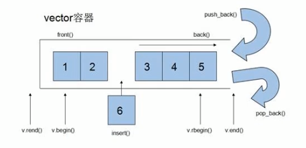
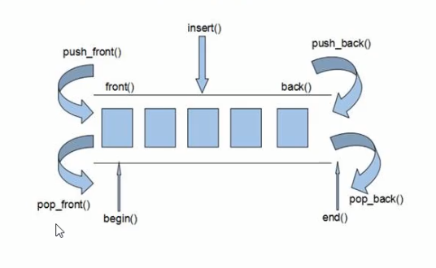
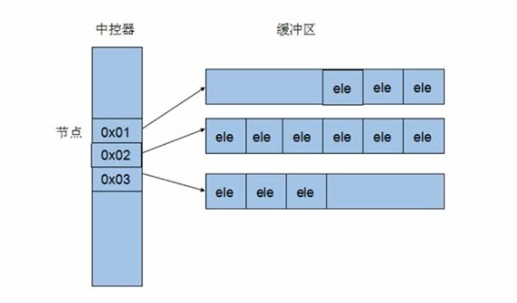
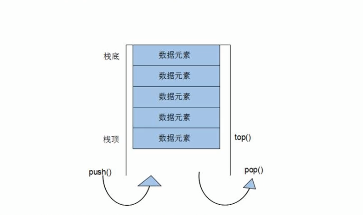
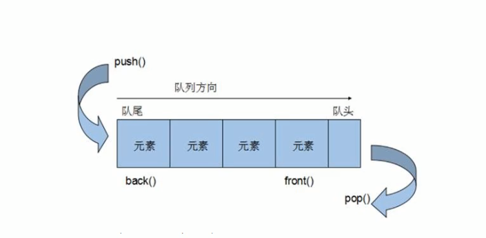
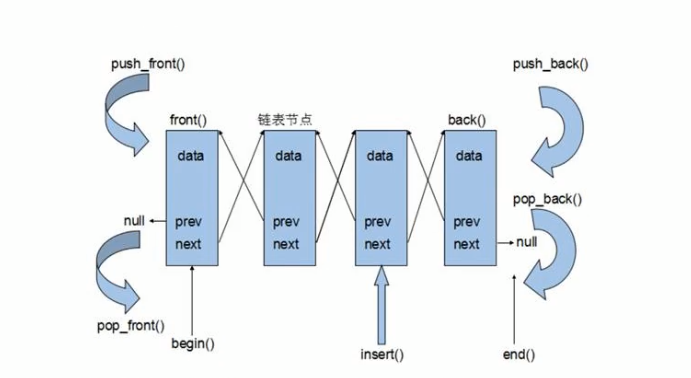

<h1 align="center"><b><p>C++学习笔记</p></b></h1>

***

# **C++提高编程**

* 本阶段主要针对C++==泛型编程==和==STL==技术详细讲解，探讨C++更深层的使用

## **1. 模板**

**概念：**

* 模板就是建立**通用的模具**，大大**提高复用性**
* C++提供两种模板机制：**函数模板**和**类模板**

**特点：**

* 模板不可以直接使用，它只是一个框架
* 模板的通用并不是万能的

### **1.1 函数模板**

* C++另一种编程思想称为==泛型编程==，主要利用的技术就是模板

**作用：**

* 建立一个通用的函数，其函数返回值类型和形参类型可以不具体制定，用一个**虚拟的类型**来代表。

**语法：**

```C++
template<typename T>
函数声明或定义
```

**解释：**

template	--	声明创建模板

typename  --	表示其后面的符号是一种数据类型，可以用 class 代替

T			   -- 	通用的数据类型，名称可以替换，通常为大写字母	

**示例：**

```C++
#include <iostream>
using namespace std;

// 函数模板
// 交换两个数
template<typename T>
void mySwap(T &a, T &b)
{
	T temp = a;
	a = b;
	b = temp;
}

int main()
{
	int a = 10;
	int b = 20;
	//利用函数模板交换数据
	// 两种方式使用函数模板
	// 1. 自动类型推导
	mySwap(a, b);
	cout << "a=" << a << endl;
	cout << "b=" << b << endl;
	// 2. 显示指定类型
	mySwap<int>(a, b);
	cout << "a=" << a << endl;
	cout << "b=" << b << endl;
	system("pause");
	return 0;
}
```

**总结：**

* 函数模板利用关键字 template
* 使用函数模板有两种方式：自动类型推导、显示指定类型
* 模板的目的是为了提高代码复用性，将类型参数化

#### **1.1.1 函数模板注意事项**

* 自动类型推导，必须要推导出一致的数据类型 T ，才可以使用

  ```c++
  #include <iostream>
  using namespace std;
  
  template<typename T>
  void mySwap(T &a, T &b)
  {
  	T temp = a;
  	a = b;
  	b = temp;
  }
  
  int main()
  {
      int a = 10;
  	char b = 'a';
      //mySwap(a, b); // 报错， 推导出不一致的数据类型
      system("pause");
  	return 0;
  }
  ```

* 模板必须要确定出 T 的数据类型才能使用

  ```C++
  #include <iostream>
  using namespace std;
  
  template<typename T>
  void mySwap()
  {
  	cout << "调用 mySwap 函数" << endl;
  }
  
  int main()
  {
      //mySwap(); // 报错，没有指定T的数据类型
      mySwap<int>();
      system("pause");
  	return 0;
  }
  ```

**总结：**

* 使用模板时必须要确定出通用数据类型 T ，并且能够推导出一致的类型

#### **1.1.2 普通函数和函数模板的区别**

**区别：**

* 普通函数调用时可以发生自动类型转换（隐式类型转换）
* 函数模板调用时，如果利用自动推导类型，不会发生隐式类型转换
* 函数模板调用时，如果利用指定类型的方式，可以发生隐式类型转换

**总结：**建议使用显示指定类型的方式，调用函数模板，因为可以自己确定通用类型 T

#### **1.1.3 普通函数与函数模板的调用规则**

**调用规则如下：**

1. 如果函数模板和普通函数都可以实现，优先使用普通函数
2. 可以通过空模板参数列表来强制调用函数模板
3. 函数模板也可以发生重载
4. 如果函数模板可以产生更好的匹配，优先调用函数模板

#### **1.1.4 模板的局限性**

**局限性：**

* 模板的通用性并不是万能的

```C++
// 例如自定义的类型 进行比较 模板就不能实现了
// 采用 模板的重载
class Person
{
public:
    int m_ID;
}
template<typename T>
bool myComplete(T &p1, T &p2)
{
    return p1 == p2;
}
// 重载
template<> bool myComplete(Person &p1, Person &p2)
{
    return (pi.m_ID == p2.m_ID);
}
```

**总结：**

* 利用具体化的模板，可以解决自定义类型的通用化
* 学习模板并不是为了写模板，而是在 STL 能够运用系统提供的模板

***

### **1.2 类模板**

**类模板的作用：**

* 建立一个通用类，类中的成员数据类型可以不具体指定，用一个**虚拟的类型**来代表

**语法：**

```C++
template<class T1, class T2, ..., class Tn = int>// 可以有多个, 可以有默认参数类型
class 类名 {}
```

**解释：**

* template		--	声明创建模板

* typename	  --	表示其后面的符号是一种数据类型，可以用 class 代替

* T				   --	通用的数据类型，名称可以替换，通常为大写字母

**示例：**

```C++
#include<iostream>
#include<string>
using namespace std;

// 类模板
template<class NameType, class AgeType>
class Person
{
public:
	Person(NameType _name, AgeType _age)
	{
		this->m_Name = _name;
		this->m_Age = _age;
	}

	void ShowPerson()
	{
		cout << "Name:" << this->m_Name << " , Age:" << this->m_Age << endl;
	}

public:
	NameType m_Name;
	AgeType m_Age;
};

int main()
{
	Person<string, int>p1("Jack", 18);
	p1.ShowPerson();

	system("pause");
	return 0;
}
```

#### **1.2.1 类模板与函数模板区别**

区别主要在两点：

1. 类模板没有自动类型推导的使用方式
2. 类模板在模板参数列表中可以有默认参数

**示例：**

```C++
#include<iostream>
#include<string>
using namespace std;

// 类模板
template<class NameType, class AgeType = int>
class Person
{
public:
	Person(NameType _name, AgeType _age)
	{
		this->m_Name = _name;
		this->m_Age = _age;
	}

	void ShowPerson()
	{
		cout << "Name:" << this->m_Name << " , Age:" << this->m_Age << endl;
	}

public:
	NameType m_Name;
	AgeType m_Age;
};

// 类模板没有自动类型推导的使用方式
// 类模板在模板参数列表中可以有默认参数
int main()
{
	//Person p1("Jack", 18); // 报错无法用数据类型推导
	Person<string, int> p1("Jack", 18); // 只能用显示指定类型
	p1.ShowPerson();

	Person<string> p2("Tom", 20);// 类模板的类型的默认参数 默认
	p2.ShowPerson();

	system("pause");
	return 0;
}
```

**总结：**

* 类模板使用只能用显示指定类型方式
* 类模板中模板参数列表可以有默认参数，切默认参数只能放到最后（与函数的默认参数相似）

#### **1.2.2 类模板中成员函数创建时机**

类模板中成员函数和普通类中的成员函数创建时机是有区别的：

* 普通类中的成员函数一开始就可以创建
* 类模板中的成员函数在调用时才创建

```C++
#include<iostream>
#include<string>
using namespace std;

class Person1
{
public:
	void showPerson1()
	{
		cout << "Show Person1" << endl;
	}
};

class Person2
{
public:
	void showPerson2()
	{
		cout << "Show Person2" << endl;
	}
};

// 类模板
template<class T>
class MyClass
{
public:
	T obj;

	void func1()
	{
		obj.showPerson1();
	}

	void func2()
	{
		obj.showPerson2();
	}
};
// 1. 类模板中的成员函数是在调用的时候才开始编译的

int main()
{
	MyClass<Person1> p1;
	p1.func1();

	MyClass<Person2> p2;
	p2.func2();

	system("pause");
	return 0;
}
```

**总结：**类模板中的成员函数并不是一开就创建的，而是在调用的时候才去创建

#### **1.2.3 类模板对象做函数参数**

一共三种传入方式：

1. 指定传入的类型	---	直接显示对象的数据类型
2. 参数模板化           ---    将对象中的参数变为模板进行传递
3. 整个类模板化       ---    将这个对象类型模板化进行传递

**示例：**

```C++
#include<iostream>
#include<string>
using namespace std;
// 类模板
template<class T1, class T2>
class Person
{
public:
	Person(T1 _name, T2 _age)
	{
		this->m_Name = _name;
		this->m_Age = _age;
	}
	void ShowPerson()
	{
		cout << "Name: " << this->m_Name << "\tAge: " << this->m_Age << endl;
	}
public:
	T1 m_Name;
	T2 m_Age;
};
// 指定传入类型 -- 常用
void printPerson01(Person<string, int> &p)
{
	p.ShowPerson();
}
// 参数模板化
template<class T1, class T2>
void printPerson02(Person<T1, T2> &p)
{
	p.ShowPerson();
	cout << "T1 Type:" << typeid(T1).name() << endl;
	cout << "T2 Type:" << typeid(T2).name() << endl;
}
// 整个类模板化
template<class T>
void printPerson03(T &p)
{
	p.ShowPerson();
	cout << "T Type:" << typeid(T).name() << endl;
}
int main()
{
	Person<string, int> p1("Tom", 18);
	//printPerson01(p1);
	//printPerson02(p1);
	printPerson03(p1);

	system("pause");
	return 0;
}
```

**总结：**

* 通过类模板创建的对象，可以有三种方式向函数中进行传参
* 使用比较广泛是第一种：指定传入的类型

#### **1.2.4 类模板与继承**

当类模板遇到继承的时候，需要注意以下几点：

1. 当子类继承的父类是一个类模板时，子类在声明的时候，要指定出父类中 T 的类型
2. 如果不指定，编译器无法给子类分配内存
3. 如果想灵活指定出父类中 T 的类型，子类也需变为类模板

**示例：**

```C++
#include<iostream>
#include<string>
using namespace std;

// 类模板与继承
template<class T>
class Base
{
	T m_t;
};
//class Son :public Base// 错误必须要知道父类中 T 的类型才能继承给子类
class Son1 :public Base<int>
{

};
// 子类也变成一个类模板
template<class T1, class T2>
class Son2 :public Base<T2>
{
public:
	Son2()
	{
		cout << "T1 Type:" << typeid(T1).name() << endl;
		cout << "T2 Type:" << typeid(T2).name() << endl;
	}
public:
	T1 obj;
};
int main()
{
	Son1 s1; // 此时 Base 的 T 只能是 int 类型
	Son2<int, char> s2; // 此时 Base 的 T 是 char 类型
	system("pause");
	return 0;
}
```

**总结：**如果父类是类模板，子类需要指定出父类中 T 的数据类型

#### **1.2.5 类模板成员函数类外实现**

学习目标：能够掌握类模板中的成员函数类外实现

```C++
#include<iostream>
#include<string>
using namespace std;
// 模板类
template<class T1, class T2>
class Person {
public:
	Person(T1 name, T2 age);
	void ShowPerson();
public:
	T1 m_Name;
	T2 m_Age;
};
// 构造函数类外实现
template<class T1, class T2>
Person<T1, T2>::Person(T1 name, T2 age)
{
	this->m_Name = name;
	this->m_Age = age;
}
// 成员函数类外实现
template<class T1, class T2>
void Person<T1, T2>::ShowPerson()
{
	cout << "Name:" < m_Name << ", Age:" << m_Age << endl;
}
```

**总结：**类模板中成员函数类外实现时，需要加上模板参数列表.

#### **1.2.6 类模板分文件编写**

**问题：**

* 类模板中成员函数创建时机是在调用阶段，导致分文件编写时链接不到

**解决：**

* **解决方式1：**直接包含.cpp源文件
* **解决方式2：**将声明和实现写到同一个文件中，并更改后缀名为 .hpp ，hpp是约定的名称并不是强制

**总结：**主流解决方式使用第二种，将类模板成员函数写到一个文件中，并将文件后缀名改为：.hpp

#### **1.2.7 类模板与友元**

**学习目标：**

* 掌握类模板配合友元函数的类内和类外实现

全局函数类内实现 - 直接在类内声明友元即可

全局函数类外实现 - 需要提前让编译器知道全局函数的存在

```C++
#include <iostream>
#include <string>
using namespace std;

// 提前让编译器知道Person类的存在
template<class T1, class T2> class Person;

template<class T1, class T2>
void PrintPerson(Person<T1, T2> &p)
{
	cout << typeid(T1).name() << "  " << typeid(T2).name()<< endl;
	
	cout << "Name:" << p.m_Name << ", Age:" << p.m_Age << endl;
}

template<class T1, class T2>
class Person {
	// 全局函数类外实现
	friend void PrintPerson<>(Person<T1, T2> &p);

	// 全局函数类内实现
	friend void PrintPerson2(Person<T1, T2> &p)
	{
		cout << typeid(T1).name() << "  " << typeid(T2).name() << endl;

		cout << "Name:" << p.m_Name << ", Age:" << p.m_Age << endl;
	}

public:
	Person(T1 name, T2 age)
	{
		this->m_Name = name;
		this->m_Age = age;
	}

private:
	T1 m_Name;
	T2 m_Age;
};

int main()
{
	Person<string, int> p1("Jack", 18);
	// 全局函数类外实现
	PrintPerson(p1);
	// 全局函数类内实现
	PrintPerson2(p1);

	system("pause");
	return 0;
}
```

**总结：**建议全局函数类内实现，用法简单，而且编译器可以直接识别

***

***

## **2. STL初识**

### **2.1 STL的诞生**

* 长久以来，软件界一直希望建立一种可重复利用的东西
* C++的**面向对象**和**泛型编程**思想，目的就是**复用性的提升**
* 大多情况下，数据结构和算法都未能有一套标准导致被迫从事大量重复工作
* 为了建立数据结构和算法的一套标准，诞生了**STL**

### **2.2 概念**

* STL(Standard Template Library, **标准模板库**)
* STL从广义上分为：**容器(container)、算法(algorithm)、迭代器(iterator)**
* **容器**和**算法**之间通过**迭代器**进行无缝连接
* STL几乎所有的代码都采用了模板类或者模板函数

### **2.3 STL六大组件**

STL大体分为六大组件，分别是：**容器、算法、迭代器、仿函数、适配器（配接器）、空间配置器**

1. **容器**：各种数据结构，如：vector、list、deque、set、map等，用来存放数据。
2. **算法**：各种常用的算法，如：sort、find、copy、for_each等。
3. **迭代器**：扮演了容器与算法之前的胶合剂。
4. **仿函数**：行为类似函数，可作为算法的某种策略。
5. **适配器**：一种用来修饰容器或者仿函数或迭代器接口的东西。
6. **空间配置器**：负责空间的配置与管理。

### **2.4 STL中容器、算法、迭代器**

**容器：**置物之所也

STL**容器**就是将运用**最广泛的一些数据结构**实现出来

常用的数据结构：**数组、链表、树、栈、队列、集合、映射表**等

这些容器分为**序列式容器**和**关联式容器**两种：

* **序列式容器**：强调值的排序，序列式容器中的每个元素均有固定位置。
* **关联式容器**：二叉树结构，各元素之间没有严格物理上的顺序关系。

**算法：**问题之解法也

有限的步骤，解决逻辑或数学上的问题，这一门学科我们叫做算法(Algorithms)。

算法分为：**质变算法**和**非质变算法**

* **质变算法**：是指运算过程中会更改区间内的元素的内容，例如：拷贝、替换、删除等等。
* **非质变算法**：是指运算过程中不会更改区间内的元素的内容，例如：查找、计数、遍历、寻找极值等等。

**迭代器：**容器和算法之间粘合剂

提供一种方法，使之能够依序寻访某个容器所含的各个元素，而又无需暴露该容器的内部表达方式。

每个容器都有自己专属的迭代器

迭代器使用非常类似于指针，初学阶段我们可以先理解迭代器为指针

**迭代器种类：**

|    **种类**    |                         **功能**                         |               **支持运算**                |
| :------------: | :------------------------------------------------------: | :---------------------------------------: |
|   输入迭代器   |                     对数据的只读访问                     |          只读，支持：++、==、!=           |
|   输出迭代器   |                     对数据的只写访问                     |              只写，支持：++               |
|   前向迭代器   |               读写操作，并能向前推进迭代器               |          读写，支持：++、==、!=           |
|   双向迭代器   |               读写操作，并能向前和向后操作               |            读写，支持：++、--             |
| 随机访问迭代器 | 读写操作，可以以跳跃的方式访问任意数据，功能最强的迭代器 | 读写，支持：++、--、[n]、-n、<、<=、>、>= |

常用的容器中迭代器种类为双向迭代器，和随机访问迭代器

### **2.5 容器、算法、迭代器初识**

了解STL中容器、算法、迭代器概念之后，我们利用代码感受STL的魅力

STL中最常用的容器为Vector，可以理解为数组，下面我们将学习如何向这个容器中插入数据，并遍历这个容器

#### **2.5.1 vector存放内置数据类型**

容器：==vector==

算法：==for_each==

迭代器：==vector<int>::iterator==

**叙述：**

* vector容器的**内存自增长**，与其他容器不同，其**内存空间只会增长，不会减小**。
* 关于 vector 的内存空间，有两个函数需要注意：size() 成员指当前拥有的元素个数，capacity() 成员指当前(容器必须分配新存储空间之前)可以存储的元素个数。reserve() 成员可以用来控制容器的预留空间。vector 另外一个特性在于它的内存空间会自增长，每当 vector 容器不得不分配新的存储空间时，会以加倍当前容量的分配策略实现重新分配。

**示例：**

```C++
#include <iostream>
#include <vector>
#include <algorithm>// 标准算法的头文件
using namespace std;

int main()
{
	vector<int> vec;
	// 尾部插入元素
	vec.push_back(10);
	vec.push_back(20);
	vec.push_back(30);
	vec.push_back(40);
	vec.push_back(50);
	// 插入元素 在第2个元素后面插入 25;
	vec.insert(vec.begin() + 2, 25);
	// 删除元素  删除第 2 个元素
	vec.erase(vec.begin() + 1);
	// 使用下标访问元素
	cout << "Vector Second Data:" << vec[2] << endl;
	// 容器大小
	cout << "Vector Size:" << vec.size() << endl;
	// 通过迭代器访问容器中的数据
	vector<int>::iterator itBegin = vec.begin();// 指向第一个元素
	vector<int>::iterator itEnd = vec.end(); // 指向最后一个元素的下一个元素
	// 第一种遍历方式
	while (itBegin != itEnd)
	{
		cout << *itBegin << endl;
		itBegin++;
	}
	// 第二种遍历方式
	for (vector<int>::iterator itBegin2 = vec.begin(); itBegin2 != vec.end(); itBegin2++)
	{
		cout << *itBegin2 << endl;
	}
	// 第三种遍历方式
	for_each(vec.begin(), vec.end(), [](int value)
	{
		cout << value << endl;
	});
	// 清空 容器  清空之后，vec.size()为0
	vec.clear(); 

	system("pause");
	return 0;
}
```

#### **2.5.2 vector存放自定义数据类型**

**示例：**

```C++
#include <iostream>
#include <vector>
#include <algorithm>
#include <string>

using namespace std;

// 自定义一个数据类型
class Person {
public:
	string	m_Name;
	int m_Age;

	Person(string name, int age)
	{
		this->m_Name = name;
		this->m_Age = age;
	}
};

int main()
{
	Person p1("Tom", 15);
	Person p2("Jack", 17);
	Person p3("Mark", 18);
	Person p4("Jame", 16);
	Person p5("XiaoMing", 26);
	// 容器存放对象
	vector<Person> vec;
	// 向容器中插入数据
	vec.push_back(p1);
	vec.push_back(p2);
	vec.push_back(p3);
	vec.push_back(p4);
	vec.push_back(p5);
	// 遍历容器中数据
	for (vector<Person>::iterator it = vec.begin(); it != vec.end(); it++)
	{
		// it 实际是元素数据类型的指针
		cout << "Name:" << it->m_Name << ", Age:" << it->m_Age << endl;
	}
	cout << "-------------------------" << endl;
	for_each(vec.begin(), vec.end(), [](Person p) {
		cout << "Name:" << p.m_Name << ", Age:" << p.m_Age << endl;
	});
	cout << "##################################" << endl;
	// 容器存放指针
	vector<Person *> vec1;
	vec1.push_back(&p1);
	vec1.push_back(&p2);
	vec1.push_back(&p3);
	vec1.push_back(&p4);
	vec1.push_back(&p5);
    // 遍历容器中数据
	for (vector<Person *>::iterator it = vec1.begin(); it != vec1.end(); it++)
	{
		Person * per = *it;
		cout << "Name:" << per->m_Name << ", Age:" << per->m_Age << endl;
	}
	cout << "-------------------------" << endl;
	for_each(vec1.begin(), vec1.end(), [](Person * p) {
		cout << "Name:" << p->m_Name << ", Age:" << p->m_Age << endl;
	});
	cout << "##################################" << endl;
	system("pause");
	return 0;
}
```

#### **2.5.4 vector容器中嵌套容器**

学习目标：容器中嵌套容器，我们将所有的数据进行遍历输出

**示例：**

```C++
#include <iostream>
#include <vector>
#include <algorithm>
#include <string>

using namespace std;
// 容器嵌套容器
int main()
{
	vector<vector<int>> vec;
	// 循环添加容器元素
	for (int i = 0; i < 5; i++)
	{
		vector<int> v;
		for (int j = 0; j < 5; j++)
		{
			v.insert(v.begin() + j, j + i);
		}
		vec.push_back(v);
	}
	// 遍历 容器元素
	for (vector<vector<int>>::iterator it = vec.begin(); it != vec.end(); it++)
	{
		vector<int> v = *it;
		for (vector<int>::iterator it1 = v.begin(); it1 != v.end(); it1++)
		{
			cout << *it1 << "  ";
		}
		cout << endl;
	}
	cout << "---------------------" << endl;
	for_each(vec.begin(), vec.end(), [](vector<int> v) {
		for_each(v.begin(), v.end(), [](int value) {
			cout << value << "  ";
		});
		cout << endl;
	});


	system("pause");
	return 0;
}
```

***

***

## **3. STL - 常用容器**

### **3.1 string容器**

#### **3.1.1 string基本概念**

**本质：**

* string 是 C++ 风格的字符串，而 string 本质上是一个类

**string 和 char * 区别**

* char * 是一个指针
* string 是一个类，类内部封装了 char * ，管理这个字符串，是一个 char * 型的容器

**特点：**

* string 类内部封装了很多成员方法

  例如：**查找 find，拷贝 copy，删除 delete，替换 replace，插入 insert

* string 管理 char * 所分配的内存，不用担心复制越界和取值越界等，由类内部进行负责

#### **3.1.2 string构造函数**

构造函数原型：

* ```C++
  string();					// 创建一个空的字符串， 例如：string str;
  ```

* ```C++
  string(const char* s);       // 使用字符串 s 初始化
  ```

* ```C++
  string(const string& str); 	// 使用一个 string 对象初始化另一个 string 对象
  ```

* ```C++
  string(int n, char c);    	// 使用 n 个字符 c 初始化
  ```

**示例：**

```C++
#include <iostream>
#include <string>
using namespace std;
// string 构造函数
int main()
{
	// 无参构造
	string s1;
	// char * 初始化字符串
	const char * chs = "Hello World.";
	string s2(chs);
	cout << "s2= " << s2 << endl;
	cout << "---------------------" << endl;
	// 字符串初始化字符串
	string s3(s2);
	cout << "s3= " << s3 << endl;
	cout << "---------------------" << endl;
	// 字符个数 初始化字符串
	string s4(10, 'a');
	cout << "s4= " << s4 << endl;
	cout << "---------------------" << endl;

	system("pause");
	return 0;
}
```

#### **3.1.3 string赋值操作**

功能描述：

* 给string字符串进行赋值

赋值的函数原型：

* ```C++
  string& operator=(const char* s);		// cahr * 类型字符串，赋值给当前字符串
  ```

* ```C++
  string& operator=(const string& s);     // 把字符串 s 赋值给当前字符串
  ```

* ```C++
  string& operator=(char c);             	// 字符赋值给当前字符串
  ```

* ```C++
  string& assign(const char* s);         	// 把字符串 s 赋值给当前字符串
  ```

* ```C++
  string& assign(const char* s, int n);  	// 把字符串 s 的前 n 个字符赋值给当前字符串
  ```

* ```C++
  string& assign(const string &s, int n);	// 把已存在变量字符串 s 的第 n 个字符以后的字符串赋值给当前字符串 
  ```

* ```C++
  string& assign(const string& s);        // 把字符串 s 赋值给当前字符串
  ```

* ```C++
  string& assign(int n, char c);         	// 用 n 个字符 c 赋给当前字符串
  ```

**示例：**

```C++
#include <iostream>
#include <string>

using namespace std;
// string 赋值
int main()
{
    // cahr * 类型字符串，赋值给当前字符串
	string str1;
	str1 = "Hello World.";
	cout << "str1= " << str1 << endl;
 	// 把字符串 s 赋值给当前字符串
	string str2;
	str2 = str1;
	cout << "str2= " << str2 << endl;
	// 字符赋值给当前字符串
	string str3;
	str3 = 'a';
	cout << "str3= " << str3 << endl;
	// 把字符串 s 赋值给当前字符串
	string str4;
	str4.assign("Hello C++123");
	cout << "str4= " << str4 << endl;
	// 把字符串 s 的前 n 个字符赋值给当前字符串
	string str5;
	str5.assign("Hello C++", 5);
	cout << "str5= " << str5 << endl;
	// 把字符串 s 赋值给当前字符串
	string str6;
	str6.assign(str5);
	cout << "str6= " << str6 << endl;
	// 用 n 个字符 c 赋给当前字符串
	string str7;
	str7.assign(10, 'w');
	cout << "str7= " << str7 << endl;
	// 把已存在变量字符串 s 的第 n 个字符以后的字符串赋值给当前字符串 
	string str8;
	str8.assign(str4, 5);
	cout << "str8= " << str8 << endl;

	system("pause");
	return 0;
}
```

#### **3.1.4 string字符串拼接**

**功能描述：**

* 实现在符串末尾拼接字符串

**函数原型：**

* ```C++
  string& operator+=(const char* str); 				// 重载 += 操作符
  ```

* ```C++
  string& operator+=(const char c);                  	// 重载 += 操作符
  ```

* ```C++
  string& operator+=(const string& str);             	// 重载 += 操作符
  ```

* ```C++
  string& append(const char* s);                     	// 把字符串 s 连接到当前字符串结尾
  ```

* ```C++
  string& append(const char* s, int n);             	// 把字符串 s 的前 n 个字符连接到当前字符串结尾
  ```

* ```C++
  string& append(const string &s);                   	// 同 operator+=(const string& str);
  ```

* ```C++
  string& append(const string &s, int pos, int n);  	// 字符串 s 中从 pos 开始的 n 个字符连接到字符串结尾
  ```

**示例：**

```C++
#include <iostream>
#include <string>

using namespace std;
// string 拼接
int main()
{
	string str1 = "I";
	// 重载 += 操作符
	str1 += " Love ";
	// 重载 += 操作符
	str1 += 'C';
	string str2("++");
	// 重载 += 操作符
	str1 += str2;
	//把字符串 s 连接到当前字符串结尾
	str1.append(", Python");
	//把字符串 s 的前 n 个字符连接到当前字符串结尾
	str1.append(", C#...", 4);
	string str3(", C, Java");
	str1.append(str3);
	// 字符串 s 中从 pos 开始的 n 个字符连接到字符串结尾
	string str4(".., MySql;...");
	str1.append(str4, 2, 8);
	cout << "str1= " << str1 << endl;

	system("pause");
	return 0;
}
```

#### **3.1.5 string查找和替换**

**功能描述：**

* 查找：查找指定字符串是否存在
* 替换：在指定的位置替换字符串

**函数原型：**

- ```C++
  int find(const string& str, int pos = 0) const; 	  	// 查找 str 第一次出现位置， 从 pos 开始查找
  ```

- ```C++
  int find(const char* s, int pos = 0) const;            	// 查找 s 第一次出现位置，从 pos 开始查找
  ```

- ```C++
  int find(const char* s, int pos, int n) const;         	// 从 pos 位置查找 s 的前 n 个字符第一次位置
  ```

- ```C++
  int find(const char c, int pos = 0) const;             	// 查找字符 c 第一次出现的位置
  ```

- ```C++
  int rfind(const string& str, int pos = npos) const;   	// 查找 str 最后一次位置，从 pos 开始查找
  ```

- ```C++
  int rfind(const char* s, int pos = npos) const;        	// 查找 s 最后一次出现的位置， 从 pos 开始查找
  ```

- ```C++
  int rfind(const char* s, int pos, int n) const;        	// 从 pos 查找 s 的前 n 个字符最后一次位置
  ```

- ```C++
  int rfind(const char c, int pos = 0) const;           	// 查找字符 c 最后一次出现的位置， 从 pos 开始查找
  ```

- ```C++
  string& replace(int pos, int n, const string& str);  	// 替换从 pos 开始的 n 个字符为字符串 str
  ```

- ```C++
  string& replace(int pos, int n, const char* s);       	// 替换从 pos 开始的 n 个字符为字符串 s
  ```

**示例：**

```C++
#include <iostream>
#include <string>

using namespace std;
// string查找和替换**
int main()
{
	string str("abcdefgde");
	int pos = -1;
	// 查找
	pos = str.find("de");
	cout << "pos: " << pos << endl;
	// rfind 和 find 区别
	// rfind 从右往左查，  find 从左往右查
	pos = str.rfind("de");
	cout << "pos: " << pos << endl;
	// 替换
	str.replace(1, 3, "1111"); // 从 1 号位置起 3个字符 替换为 "1111"
	cout << "str = " << str << endl;

	system("pause");
	return 0;
}
```

**总结：**

* find 查找是从左往右， rfind 从右往左，查找字符串第一次出现的位置
* find 和 rfind 找到字符串后返回查找的第一个字符位置，找不到返回 -1
* replace 在替换时，要指定从哪个位置起，多少个字符，替换成什么样的字符串

#### **3.1.6 string字符串比较**

**功能描述：**

* 字符串之间的比较

**比较方式：**

- 字符串比较是按照字符的ASCII码进行对比
- 相等返回 0 、 大于返回 1 、 小于返回 -1

**函数原型：**

* ```C++
  int compare(const string &s) const;  // 与字符串 s 比较
  ```

* ```C++
  int compare(const char *s) const;     // 与字符串 s 比较
  ```

  

**示例：**

```C++
#include <iostream>
#include <string>

using namespace std;
// string 字符串比较
int main()
{
	string str("abcdefg");
	string str1("abcdef");
	if (str.compare(str1) < 0)
	{
		cout << "str < str1" << endl;
	}
	else if (str.compare(str1) > 0)
	{
		cout << "str > str1" << endl;
	}
	else
	{
		cout << "str == str1" << endl;
	}

	system("pause");
	return 0;
}
```

**总结：**字符串对比主要用于比较两个字符串是否相等，判断谁大谁小的意义并不是很大

#### **3.1.7 string字符存取**

string 中单个字符存取方式有两种：

- ```C++
  char& operator[](int n);	//  通过 [] 方式取字符
  ```

- ```C++
  char& at(int n);			// 通过 at 方法获取字符
  ```

**示例：**

```C++
#include <iostream>
#include <string>

using namespace std;
// string 字符存取
int main()
{
	string str("abcdefg");
	cout << "str = " << str << endl;

	// 通过 [] 访问单个字符
	for (int i = 0; i < str.size(); i++)
	{
		cout << " " << str[i];
	}
	cout << endl;
	// 通过 at 方法访问单个字符
	for (int i = 0; i < str.size(); i++)
	{
		cout << " " << str.at(i);
	}
	cout << endl;
	// 修改
	str[1] = 'x';
	cout << "str = " << str << endl;

	str.at(0) = 'w';
	cout << "str = " << str << endl;

	system("pause");
	return 0;
}
```

#### **3.1.8 string插入和删除**

**功能描述：**

- 对 string 字符串进行插入和删除字符操作

**函数原型：**

- ```c++
  string& insert(int pos, const char* s);		// 插入字符串
  ```

- ```C++
  string& insert(int pos, const string& str);	// 插入字符串
  ```

- ```C++
  string& insert(int pos, int n, char c);		// 在指定位置插入 n 个字符 c
  ```

- ```C++
  string& erase(int pos, int n = npos);		// 删除从 pos 开始的 n 个字符
  ```

**示例：**

```C++
#include <iostream>
#include <string>

using namespace std;
// string 字符串插入和删除
int main()
{
	string str("abcdefg");
	cout << "str = " << str << endl;

	// 插入
	str.insert(1, "111");
	cout << "str = " << str << endl;
	str.insert(2, 2, 'x');
	cout << "str = " << str << endl;
	// 删除
	str.erase(1, 3);
	cout << "str = " << str << endl;

	system("pause");
	return 0;
}
```

#### **3.1.9 string子串**

**功能描述：**

- 从字符串中获取想要的子串

**函数原型：**

- ```C++
  string substr(int pos = 0, int n = npos) const;		// 返回由 pos 开始的 n 个字符组成的字符串
  ```

**示例：**

```C++
#include <iostream>
#include <string>

using namespace std;
// string 字符串子串
int main()
{
	string str("abcdefg");
	cout << "str = " << str << endl;

	string substr = str.substr(1, 3);
	cout << "substr = " << substr << endl;

	string email = "hello@emil.com";
	int pos = email.find('@');
	if (pos >= 0)
	{
		cout << "emil name: " << email.substr(0, pos) << endl;
	}
	else
	{
		cout << "not Email." << endl;
	}

	system("pause");
	return 0;
}
```

***

### **3.2 vector容器**

#### **3.2.1 vector基本概念**

**功能：**

- vector 数据结构和**数组非常相似**，也称为**单端数组**

**vector 与普通数组区别：**

- 不同之处在于数组是静态空间，而 vector 可以**动态扩展**

**动态扩展：**

- 并不是在原空间之后续接新空间，而是找更大的内存空间，然后将原数据拷贝到新空间，释放原空

  

- vector 容器的迭代器是支持随机访问的迭代器

#### **3.2.2 vector构造函数**

**功能描述：**

- 创建 vector 容器

**函数原型：**

- ```C++
  vector<T> v;					// 采用模板实现类实现，默认构造函数
  ```

- ```C++
  vector<T>(v.begin(), v.end());		// 将 v[begin(), end()) 区间中的元素拷贝给本身
  ```

- ```C++
  vector<T>(n, elem);				// 将构造函数将 n 个 elem 拷贝给本身
  ```

- ```C++
  vector<T>(const vector &vec);		// 拷贝构造函数
  ```

**示例：**

```C++
#include <iostream>
#include <string>
#include <vector>
#include <algorithm>

using namespace std;

void printVector(vector<int> vec)
{
	for_each(vec.begin(), vec.end(), [](int value) {
		cout << " " << value;
	});
	cout << endl;
}

// vector 构造函数
int main()
{
	vector<int> vec; // 默认构造， 无参构造
	for (int i = 0; i < 10; i++)
	{
		vec.push_back(i);
	}
	printVector(vec);

	vector<int> vec1(vec.begin() + 2, vec.end());
	printVector(vec1);
	vector<int> vec2(10, 5);
	printVector(vec2);
	vector<int> vec3(vec);
	printVector(vec3);
	system("pause");
	return 0;
}
```

#### **3.2.3 vector赋值操作**

**功能描述：**

- 给vector容器进行赋值

**函数原型：**

- ```C++
  vector& operator=(const vector &vec);		// 重载 = 号操作符
  ```

- ```C++
  assign(begin(), end());					// 将[beg, end) 区间中的数据拷贝赋值给本身
  ```

- ```C++
  assign(n, elem);						// 将 n 个 elem 拷贝赋值给本身
  ```

**示例：**

```C++
#include <iostream>
#include <string>
#include <vector>
#include <algorithm>

using namespace std;

void printVector(vector<int> vec)
{
	for_each(vec.begin(), vec.end(), [](int value) {
		cout << " " << value;
	});
	cout << endl;
}

// vector 赋值操作
int main()
{
	vector<int> vec; // 默认构造， 无参构造
	for (int i = 0; i < 10; i++)
	{
		vec.push_back(i);
	}
	printVector(vec);

	vector<int> vec1 = vec;
	printVector(vec1);
	vector<int> vec2;
	vec2.assign(vec.begin(), vec.end());
	printVector(vec2);
	vector<int> vec3;
	vec3.assign(10, 9);
	printVector(vec3);

	system("pause");
	return 0;
}
```

**总结：**vector 赋值方式比较简单，使用 operator= ，或者 assign 都可以

#### **3.2.4 vector容量和大小**

**功能描述：**

- 对 vector 容器的容量和大小操作

**函数原型：**

- ```C++
  bool empty(); 			//判断容器是否为空
  ```

- ```C++
  int capacity();			// 容器的容量
  ```

- ```C++
  int size();				// 返回容器中元素的个数
  ```

- ```C++
  resize(int num);		// 重新指定容器的长度为 num，若容器变长，则以默认值填充新位置，如果容器变短，则末尾超出容器长度的元素被删除
  ```

- ```C++
  resize(int num, elem);	// 重新指定容器的长度为 num，若容器变长，则以 elem 值填充新位置，如果容器变短，则末尾超出容器长度的元素被删除
  ```

**示例：**

```C++
#include <iostream>
#include <string>
#include <vector>
#include <algorithm>

using namespace std;

void printVector(vector<int> vec)
{
	for (vector<int>::iterator it = vec.begin(); it != vec.end(); it++)
	{
		cout << " " << *it;
	}
	//for_each(vec.begin(), vec.end(), [](int value) {
	//	cout << " " << value;
	//});
	cout << endl;
}

// vector 容量和大小
int main()
{
	vector<int> vec; // 默认构造， 无参构造
	for (int i = 0; i < 10; i++)
	{
		vec.push_back(i);
	}
	printVector(vec);

	if (vec.empty())
	{
		cout << "Vector is Empty." << endl;
	}
	else
	{
		cout << "Vector is Not Empty." << endl;

		cout << "vec size: " << vec.size() << endl; // 大小
		cout << "vec capacity: " << vec.capacity() << endl; // 容量 大于等于 大小
	}
	// 重新指定大小
	//vec.resize(15); // 如果重新指定的比原来的长了， 默认用 0 填充
	//printVector(vec);

	vec.resize(15, 100); // 如果重新指定的比原来的长了， 指定使用 100 填充
	printVector(vec);

	vec.resize(5);		// 如果重新指定的比原来的短了， 超出的部分被删除
	printVector(vec);

	system("pause");
	return 0;
}
```

**总结：**

- 判断是否为空 --- empty
- 返回元素个数 --- size
- 返回容器容量 --- capacity
- 重新指定大小 --- resize

#### **3.2.5 vector插入和删除**

**功能描述：**

- 对 vector 容器进行插入、删除操作

**函数原型：**

- ```C++
  push_back(T elem);									// 尾部插入元素 elem
  ```

- ```C++
  pop_back();											// 删除最后一个元素
  ```

- ```C++
  insert(const_iterator pos, elem);					// 迭代器指向位置 pos 插入元素 elem 
  ```

- ```C++
  insert(const_iterator pos, int count, elem);		// 迭代器指向位置 pos 插入 count 个元素 elem 
  ```

- ```C++
  erase(const_iterator start, const_iterator end);	// 删除迭代器从 start 到 end 之间的元素
  ```

- ```C++
  clear();										// 删除容器中的所有元素， 清空
  ```

**示例：**

```C++
#include <iostream>
#include <string>
#include <vector>
#include <algorithm>

using namespace std;

void printVector(vector<int> &vec)
{
	for (vector<int>::iterator it = vec.begin(); it != vec.end(); it++)
	{
		cout << " " << *it;
	}
	//for_each(vec.begin(), vec.end(), [](int value) {
	//	cout << " " << value;
	//});
	cout << endl;
}

// vector 插入和删除
int main()
{
	vector<int> vec; // 默认构造， 无参构造
	for (int i = 0; i < 10; i++)
	{
		// 尾部插入数据
		vec.push_back(i);
	}
	printVector(vec);
	// 尾部数据被删除
	vec.pop_back();
	printVector(vec);
	// 插入
	vec.insert(vec.begin() + 1, 100);
	printVector(vec);

	vec.insert(vec.begin(), 2, 1000);
	printVector(vec);
	// 删除
	vec.erase(vec.begin());
	printVector(vec);

	vec.erase(vec.begin(), vec.begin() + 3);
	printVector(vec);
	// 清空
    vec.clear();
    
	system("pause");
	return 0;
}
```

**总结：**

- 尾插 --- push_back
- 尾删 --- pop_back
- 插入 --- insert    (位置迭代器)
- 删除 --- erase   (位置迭代器)
- 清空 --- clear

#### **3.2.6 vector数据存取**

**功能描述：**

- 对 vector 中的数据的存取操作

**函数原型：**

- ```C++
  at(int index);		// 返回索引 index 所指的数据
  ```

- ```C++
  operator[](int index);			// 返回索引 index 所指的数据
  ```

- ```C++
  front();			// 返回容器中第一个元素
  ```

- ```C++
  back();				// 返回容器中最后一个元素
  ```

**示例：**

```C++
#include <iostream>
#include <string>
#include <vector>
#include <algorithm>

using namespace std;

void printVector(vector<int> &vec)
{
	for (vector<int>::iterator it = vec.begin(); it != vec.end(); it++)
	{
		cout << " " << *it;
	}
	//for_each(vec.begin(), vec.end(), [](int value) {
	//	cout << " " << value;
	//});
	cout << endl;
}

// vector 数据存取
int main()
{
	vector<int> vec; // 默认构造， 无参构造
	for (int i = 0; i < 10; i++)
	{
		// 尾部插入数据
		vec.push_back(i);
	}
	printVector(vec);

	int elem = vec[2];

	int elem1 = vec.at(3);
	cout << "[2]= " << elem << ",  at(3)= " << elem1 << endl;

	cout << "first= " << vec.front() << ",  end= " << vec.back() << endl;

	system("pause");
	return 0;
}
```

**总结：**

- 除了用迭代器获取 vector 容器中的元素， [] 和 at 也可以
- front 返回容器的第一个元素
- back 返回容器中最后一个元素

#### **3.2.7 vector互换容器**

**功能描述：**

- 实现两个容器内元素进行互换

**函数原型：**

- ```C++
  swap(vec); 	// 将 vec 与本身的元素互换
  ```

**示例：**

```C++
#include <iostream>
#include <string>
#include <vector>
#include <algorithm>

using namespace std;

void printVector(vector<int> &vec)
{
	for (vector<int>::iterator it = vec.begin(); it != vec.end(); it++)
	{
		cout << " " << *it;
	}
	//for_each(vec.begin(), vec.end(), [](int value) {
	//	cout << " " << value;
	//});
	cout << endl;
}

// vector 数据存取
int main()
{
	vector<int> vec; // 默认构造， 无参构造
	for (int i = 0; i < 10000; i++)
	{
		// 尾部插入数据
		vec.push_back(i);
	}
	//cout << "vec= ";
	//printVector(vec);

	//vector<int> vec1;
	//for (int i = 0; i < 5; i++)
	//{
	//	vec1.insert(vec1.begin() + i, i);
	//}
	//cout << "vec1= ";
	//printVector(vec1);
	//cout << "swap befor -> after" << endl;
	//vec1.swap(vec);
	//cout << "vec= ";
	//printVector(vec);
	//cout << "vec1= ";
	//printVector(vec1);
	// 可以巧用 swap 可以收缩内存空间
	cout << "vec capacity:" << vec.capacity() << endl; // 12138
	cout << "vec size:" << vec.size() << endl; // 10000
	vec.resize(3);
	cout << "vec capacity:" << vec.capacity() << endl; // 12138
	cout << "vec size:" << vec.size() << endl; // 3
	// vector<int>(vec) 匿名对象  当 匿名对象这行执行完了， 系统会自动帮助回收匿名对象所占的内存
	vector<int>(vec).swap(vec);
	cout << "vec capacity:" << vec.capacity() << endl; // 3
	cout << "vec size:" << vec.size() << endl; // 3


	system("pause");
	return 0;
}
```

**总结：**

- swap 可以使两个容器互换，可以达到实用的收缩内存效果

#### **3.2.8 vector预留空间**

**功能描述：**

- 减少 vector 在动态扩展容量时的扩展次数

**函数原型：**

- ```C++
  reserve(int len); 	// 容器预留 len 个元素长度，预留位置不初始化，元素不可访问
  ```

**示例：**

```C++
#include <iostream>
#include <string>
#include <vector>
#include <algorithm>

using namespace std;
// vector 预留空间
int main()
{
	vector<int> vec; // 默认构造， 无参构造
	int capacity = 0;
	int * p = NULL;
	int num = 0;
	vec.reserve(100000);
	for (int i = 0; i < 100000; i++)
	{
		// 尾部插入数据
		vec.push_back(i);
		if (p != &vec[0])
			//if (capacity != vec.capacity())
		{
			capacity = vec.capacity();
			p = &vec[0];
			num++;
		}
	}
	// 重新开辟的内存次数  reserve 之前：30次   之后：1次
	cout << "num: " << num << endl;
	cout << "vec capacity:" << vec.capacity() << endl;
	cout << "vec size:" << vec.size() << endl;

	system("pause");
	return 0;
}
```

***

### **3.3 deque容器**

#### **3.3.1 deque容器基本概念**

**功能：**

- 双端数组，可以对头端进行插入、删除操作

**deque 和 vector 区别：**

- vector 对于头部的插入、删除效率低，数据量越大，效率越低
- deque 相对而言，对头部的插入、删除速度会比 vector 快
- vector 访问元素时的速度会比 deque 快，这和两者的内部实现有关



deque 内部工作原理：

deque 内部有个**中控器**，维护每段缓冲区中的内容，缓冲区中存放真实数据

中控器维护的是每个缓冲区的地址，使得使用 deque 时像一片连续的内存空间



- deque 容器的迭代器也是支持随机访问的

#### **3.3.2 deque构造函数**

**功能描述：**

- deque 容器构造

**函数原型：**

- ```C++
  deque<T> deqT;					// 默认构造函数
  ```

- ```C++
  deque<T>(begin(), end());		// 构造函数将 [begin(), end()) 区间中的元素拷贝给本身 
  ```

- ```C++
  deque<T>(int n, elem);			// 构造函数将 n 个 elem 元素拷贝给本身
  ```

- ```C++
  deque<T>(const deque &deq);		// 拷贝构造函数
  ```

**示例：**

```C++
#include <iostream>
#include <deque>

using namespace std;
// deque 构造函数
//参数 是 const 状态 -> 迭代器 也需要是 const_iterator
void printDeque(const deque<int>& deq)
{
	for (deque<int>::const_iterator it = deq.begin(); it != deq.end(); it++)
	{
		cout << *it << " ";
	}
	cout << endl;
}

int main()
{
	deque<int> deq;

	for (int i = 0; i < 10; i++)
	{
		deq.push_back(i);
	}
	printDeque(deq);

	deque<int> deq1(deq.begin(), deq.end());
	printDeque(deq1);

	deque<int> deq2(10, 5);
	printDeque(deq2);

	deque<int> deq3(deq);
	printDeque(deq3);

	system("pause");
	return 0;
}
```

**总结：**deque 容器和 vector 容器的构造方式几乎一样，灵活使用即可

#### **3.3.3 deque赋值操作**

**功能描述：**

- 给 deque 容器进行赋值

**函数原型：**

- ```C++
  deque& operator=(const deque& deq);	// 重载等号操作符
  ```

- ```C++
  assign(begin(), end());				// 将[begin(), end()) 区间中的数据拷贝赋值给本身
  ```

- ```C++
  assign(int n, elem);				// 将 n 个 elem 拷贝赋值给本身
  ```

**示例**：

```C++
#include <iostream>
#include <deque>

using namespace std;
// deque 赋值操作
//参数 是 const 状态 -> 迭代器 也需要是 const_iterator
void printDeque(const deque<int>& deq)
{
	for (deque<int>::const_iterator it = deq.begin(); it != deq.end(); it++)
	{
		cout << *it << " ";
	}
	cout << endl;
}

int main()
{
	deque<int> deq;

	for (int i = 0; i < 10; i++)
	{
		deq.push_back(i);
	}
	printDeque(deq);

	deque<int> deq1 = deq;
	printDeque(deq1);

	deque<int> deq2;
	deq2.assign(deq.begin(), deq.end());
	printDeque(deq2);

	deque<int> deq3;
	deq3.assign(10, 5);
	printDeque(deq3);

	system("pause");
	return 0;
}
```

#### **3.3.4 deque大小操作**

**功能描述：**

- 对 deque 容器的大小进行操作

**函数原型：**

- ```C++
  bool empty();		// 判断容器是否为空
  ```

- ```C++
  int size();			// 返回容器中元素的个数
  ```

- ```C++
  void resize(int len);	// 重新指定容器的长度为 len，若容器变长，则以默认值填充，如果容器变短，则末尾超出容器长度的元素被删除
  ```

- ```C++
  void resize(int len, T elem);	// 重新指定容器的长度为 len，若容器变长，则以 elem 为默认值填充，如果容器变短，则末尾超出容器长度的元素被删除
  ```

**示例：**

```C++
#include <iostream>
#include <deque>

using namespace std;
// deque 大小操作
//参数 是 const 状态 -> 迭代器 也需要是 const_iterator
void printDeque(const deque<int>& deq)
{
	for (deque<int>::const_iterator it = deq.begin(); it != deq.end(); it++)
	{
		cout << *it << " ";
	}
	cout << endl;
}

int main()
{
	deque<int> deq;

	bool isEmpty = deq.empty();
	if (isEmpty)
	{
		cout << "deq is Empty." << endl;
	}
	else
	{
		cout << "deq is Not Empty." << endl;
	}	

	for (int i = 0; i < 10; i++)
	{
		deq.push_back(i);
	}
	printDeque(deq);

	cout << "Size= " << deq.size() << endl;
	
	deq.resize(20, 100);
	cout << "Size= " << deq.size() << endl;
	printDeque(deq);

	deq.resize(30);
	cout << "Size= " << deq.size() << endl;
	printDeque(deq);	

	system("pause");
	return 0;
}
```

**总结：**

- deque 没有容量的概念
- 判断是否为空 --- empty
- 返回元素个数 --- size
- 重新指定个数 --- resize

#### **3.3.5 deque插入和删除**

**功能描述：**

- 向 deque 容器中插入和删除数据

**函数原型：**

两端插入操作：

- ```C++
  void push_back(T elem);		// 在尾部添加一个数据
  ```

- ```c++
  void push_front(T elem);	// 在容器头部插入插入一个数据
  ```

- ```C++
  void pop_back();			// 删除容器最后一个元素
  ```

- ```C++
  void pop_front(); 			// 删除容器第一个元素
  ```

指定位置操作：

- ```C++
  deque<T>::iterator insert(pos = begin(), T elem);		// 在 pos 位置插入一个 elem 元素的拷贝，返回插入起始位置的迭代器
  ```

- ```C++
  deque<T>::iterator insert(pos = begin(), int n, T elem);	// 在 pos 位置插入 n 个 elem 元素，返回插入起始位置的迭代器
  ```

- ```C++
  deque<T>::iterator insert(pos = begin(), begin(), end());	// 在 pos 位置插入 [begin(), end()) 区间的数据，返插入起始位置迭代器
  ```

- ```C++
  void clear();						// 清空容器的所有数据
  ```

- ```C++
  deque<T>::iterator erase(begin(), end());		// 删除 [begin(), end()) 区间的数据，返回迭代器下一个数据位置
  ```

- ```c++
  deque<T>::iterator erase(pos = begin());	// 删除 pos 位置的数据，返回迭代器下一个数据的位置
  ```

**示例：**

```C++
#include <iostream>
#include <deque>
#include <algorithm>

using namespace std;
// deque 插入和删除
//参数 是 const 状态 -> 迭代器 也需要是 const_iterator
void printDeque(const deque<int>& deq)
{
	for (deque<int>::const_iterator it = deq.begin(); it != deq.end(); it++)
	{
		cout << *it << " ";
	}
	cout << endl;
}

int main()
{
	deque<int> deq;
	for (int i = 0; i < 5; i++)
	{
		// 尾插
		deq.push_back(i);
	}
	for (int i = 0; i < 5; i++)
	{
		// 头插
		deq.push_front(5 + i);
	}
	printDeque(deq);
	// 尾删
	deq.pop_back();
	// 头删
	deq.pop_front();
	printDeque(deq);
	// insert 插入数据
	cout << "insert Data: " << endl;
	deque<int>::iterator itetor0 = deq.insert(deq.begin() + 1, 100);
	for (; itetor0 != deq.end(); itetor0++)
	{
		cout << *itetor0 << " ";
	}
	cout << endl;
	printDeque(deq);
	deque<int>::iterator itetor1 = deq.insert(deq.begin() + 2, 2, 50);
	for (; itetor1 != deq.end(); itetor1++)
	{
		cout << *itetor1 << " ";
	}
	cout << endl;
	printDeque(deq);
	deque<int> deq1;
	deq1.push_front(10);
	deq1.push_back(11);
	deque<int>::iterator itetor2 = deq.insert(deq.begin(), deq1.begin(), deq1.end());
	for (; itetor2 != deq.end(); itetor2++)
	{
		cout << *itetor2 << " ";
	}
	cout << endl;

	printDeque(deq);

	// 删除
	cout << "delete Data: " << endl;
	deque<int>::iterator itetor3 = deq.erase(deq.begin() + 1);
	for (; itetor3 != deq.end(); itetor3++)
	{
		cout << *itetor3 << " ";
	}
	cout << endl;
	printDeque(deq);
	deque<int>::iterator itetor4 = deq.erase(deq.begin() + deq.size() - 2, deq.end());
	for (; itetor4 != deq.end(); itetor4++)
	{
		cout << *itetor4 << " ";
	}
	cout << endl;
	printDeque(deq);
	deq.clear();
	cout << (deq.empty() ? "true" : "false") << endl;

	system("pause");
	return 0;
}
```

**总结：**

- 插入和删除提供的位置是迭代器
- 尾插  --- push_back
- 尾删 --- pop_back
- 头插 --- push_front
- 头删 --- pop_front

#### **3.3.6 deque数据存取**

**功能描述：**

- 对 deque 中的数据的存取操作

**函数原型：**

- ```C++
  at(int index);		// 返回索引 index 所指的数据
  ```

- ```c++
  operator[int index];	// 返回索引 index 所指的数据
  ```

- ```C++
  front();			// 返回容器中第一个元素
  ```

- ```C++
  back();				// 返回容器中最后一个元素
  ```

**示例：**

```C++
#include <iostream>
#include <deque>
#include <algorithm>

using namespace std;
// reque 数据存取
//参数 是 const 状态 -> 迭代器 也需要是 const_iterator
void printDeque(const deque<int>& deq)
{
	for (deque<int>::const_iterator it = deq.begin(); it != deq.end(); it++)
	{
		cout << *it << " ";
	}
	cout << endl;
}

int main()
{
	deque<int> deq;
	// 尾插
	deq.push_back(10);
	// 头插
	deq.push_front(12);
	deq.push_front(15);
	printDeque(deq);

	int data1 = deq.at(1);
	cout << "data1= " << data1 << endl;
	// 修改最后一个元素
	deq.at(deq.size() - 1) = 100;
	int data2 = deq[0];
	cout << "data2= " << data2 << endl;
	// 修改第一个元素
	deq[0] = 50;
	// 查看第一个元素
	cout << "front1= " << deq.front() << endl;
	// 查看最后一个元素
	cout << "back= " << deq.back() << endl;
	// 修改第一个元素
	deq.front() = 51;
	// 查看第一个元素
	cout << "front2= " << deq.front() << endl;

	system("pause");
	return 0;
}
```

#### **3.3.7 deque排序**

**功能描述：**

- 利用算法实现对 deque 容器进行排序

**算法：**

- ```c++
  void sort(iterator begin(), iterator end());	// 对 begin() 和 end() 区间内元素进行排序， 默认升序
  ```

- ```c++
  void sort(iterator begin(), iterator end(), Compare<T a, T b> comp); // 对 begin() 和 end() 区间内元素进行排序，comp 提供比较函数
  ```

**示例：**

```C++
#include <iostream>
#include <deque>
#include <algorithm>

using namespace std;
// reque 数据存取
//参数 是 const 状态 -> 迭代器 也需要是 const_iterator
void printDeque(const deque<int>& deq)
{
	for (deque<int>::const_iterator it = deq.begin(); it != deq.end(); it++)
	{
		cout << *it << " ";
	}
	cout << endl;
}

int main()
{
	deque<int> deq;
	// 尾插
	deq.push_back(10);
	// 头插
	deq.push_front(12);
	deq.push_front(15);
	deq.insert(deq.begin(), 20);
	deq.insert(deq.begin() + 2, 30);
	printDeque(deq);
	// sort 默认升序排列
	sort(deq.begin(), deq.end());
	printDeque(deq);
	// sort 传入 比较函数 ，可以自定义 排序的顺序  升序 or 降序
	sort(deq.begin(), deq.end(), [](int a, int b) {
		return a > b;
	});
	printDeque(deq);

	system("pause");
	return 0;
}
```

**总结：**

- 包含头文件 #include <algorithm>
- sort 排序默认是升序
- 对于支持随机访问的迭代器的容器，都可以利用 sort 算法直接进行排序

***

### **3.4 stack容器**

#### **3.4.1 stack 基本概念**

**概念：**stack 是一种**先进后出**(First In Last Out, FILO)的数据结构，它只有一个出口



栈中进入数据称为 --- **入栈** (push)

栈中弹出数据称为 --- **出栈** (pop)

**属性：**

- 栈中只有顶端的元素才可以被外界使用
- 栈不允许有遍历行为
- 栈可以判断栈是否为空
- 栈可以返回元素的个数

#### **3.4.2 stack常用接口**

**功能描述：**

- 栈容器常用的对外接口

**构造函数：**

- ```c++
  stack<T> stk;		// stack 采用模板类实现，stack 对象的默认构造函数
  ```

- ```C++
  stack<T>(const stack &stk);		// 拷贝构造函数
  ```

**赋值操作：**

- ```C++
  stack& operator=(const stack &stk);		// 重载等号操作符
  ```

**数据存取：**

- ```C++
  void push(elem);		// 向栈顶添加元素
  ```

- ```C++
  void pop();			// 从栈顶移除第一个元素
  ```

- ```C++
  T top();			// 返回栈顶的第一个元素
  ```

**大小操作：**

- ```C++
  bool empty();		// 判断堆栈是否为空
  ```

- ```C++
  int size();			// 返回栈的大小
  ```

**示例：**

```C++
#include <iostream>
#include <stack>
#include <string>
using namespace std;

int main()
{
	// 构造函数
	stack<int> stk;
	cout << "Empty: " << (stk.empty() ? "true" : "false") << endl;
	stk.push(10);
	stk.push(20);
	cout << "Start Size: " << stk.size() << endl;
	while (!stk.empty())
	{
		cout << stk.top() << " ";
		stk.pop();
	}
	cout << endl;
	cout << "End Size: " << stk.size() << endl;

	system("pause");
	return 0;
}
```

**总结：**

- 入栈  ---  push
- 出栈  ---  pop
- 返回栈顶  ---  top
- 判断栈是否为空  ---  empty
- 返回栈大小  ---  size

***

### **3.5 queue容器**

#### **3.5.1 queue基本概念**

**概念：**queue 是一种**先进先出**(First In First Out, FIFO)的数据结构，它有不同的两个口，一个入口，一个出口



队列容器允许从一端新增元素，从另一端移除元素

队列中只有队头和队尾才可以被外界使用，因此队列不允许有遍历行为

队列中进数据称为 --- **入队** (push)

队列中出数据称为 --- **出队** (pop)

#### **3.5.2 queue常用接口**

**功能描述：**

- queue 容器常用的对外接口

**构造函数：**

- ```C++
  queue<T> que;		// queue 采用模板类实现， queue 对象的默认构造函数形式
  ```

- ```C++
  queue<T>(const queue &que);		// 拷贝构造函数
  ```

**赋值操作：**

- ```C++
  queue& operator=(const queue &que);		// 重载等号操作符
  ```

**数据存取：**

- ```C++
  void push(T elem);		// 往队尾添加元素
  ```

- ```C++
  void pop();		// 从对头移除第一个元素
  ```

- ```C++
  T back();		// 返回队尾的第一个元素
  ```

- ```C++
  T front();		// 返回队头的第一个元素
  ```

**大小操作：**

- ```C++
  bool empty(); 		// 判断队列是否为空
  ```

- ```C++
  int size();			// 返回队列的元素个数
  ```

**示例：**

```C++
#include <iostream>
#include <queue>
#include <string>
using namespace std;

int main()
{
	queue<int> que;

	que.push(10);
	que.push(20);
	cout << "front: " << que.front() << endl;
	cout << "back: " << que.back() << endl;
	cout << "Size: " << que.size() << endl;
	while (!que.empty())
	{
		cout << que.front() << " ";
		que.pop();
	}
	cout << endl;
	cout << "Empty: " << (que.empty() ? "true" : "false") << endl;

	system("pause");
	return 0;
}
```

***

### **3.6 list容器**

#### **3.6.1 list基本概念**

**功能：**将数据进行链式存储

**链表：**(list) 是一种物理存储单元上非连续的存储结构，数据元素的逻辑顺序是通过链表中的指针连接实现的

链表的组成：链表由一系列**结点**组成

结点的组成：一个是存储数据元素的**数据域**，另一个是存储下一个结点地址的**指针域**

STL中的链表是一个双向循环链表



由于链表的存储方式并不是连续的内存空间，因此链表 list 中的迭代器只支持前移和后移，属于**双向迭代器**

**list 的优点：**

- 采用动态存储分配，不会造成内存浪费和溢出
- 链表执行插入和删除操作十分方便，修改指针即可，不需要移动大量元素

**list 缺点：**

- 链表灵活，但是空间(指针域)和时间(遍历)额外耗费较大

list 有一个重要的性质，插入操作和删除操作都不会造成原有 list 迭代器的失效，这在 vector 是不成立的。

**总结：**STL中 **list 和 vector是两个最常被使用的容器**，各有优缺点

#### **3.6.2 list构造函数**

**功能描述：**

- 创建 list 容器

**函数原型：**

- ```C++
  list<T> lst;			// list 采用模板类实现， 对象的默认构造函数
  ```

- ```C++
  list<T>(begin(), end()); 	// 构造函数将 [begin(), end()) 区间中的元素拷贝给本身
  ```

- ```C++
  list<T>(int n, T elem);		// 构造函数将 n 个 elem 拷贝给本身
  ```

- ```C++
  list<T>(const list &lst);	// 拷贝构造函数
  ```

**示例：**

```C++
#include <iostream>
#include <list>
#include <string>

using namespace std;

void printList(const list<int> &lst)
{
	for (list<int>::const_iterator it = lst.begin(); it != lst.end(); it++)
	{
		cout << *it << " ";
	}
	cout << endl;
}

int main()
{
	list<int> lst;
	// 尾插
	lst.push_back(10);
	// 头插
	lst.push_front(20);
	printList(lst);

	list<int> lst1(lst.begin(), lst.end());
	printList(lst1);

	list<int> lst2(lst1);
	printList(lst2);

	list<int> lst3(5, 1000);
	printList(lst3);

	system("pause");
	return 0;
}
```

**总结：**list 构造方式同其他几个 STL 常用容器，熟练掌握即可

#### **3.6.3 list赋值和交换**

**功能描述：**

- 给 list 容器进行赋值，以及交换 list 容器

**函数原型：**

- ```C++
  assign(begin(), end());		// 将 [begin(), end()) 区间中的数据拷贝赋值给本身
  ```

- ```C++
  assign(int n, T elem);		// 将 n 个 elem 拷贝赋值给本身
  ```

- ```C++
  list& operator=(const list &lst);	// 重载等号操作符
  ```

- ```C++
  swap(lst);		// 将 lst 与本身互换
  ```

**示例：**

```C++
#include <iostream>
#include <list>
#include <string>

using namespace std;

void printList(const list<int> &lst)
{
	for (list<int>::const_iterator it = lst.begin(); it != lst.end(); it++)
	{
		cout << *it << " ";
	}
	cout << endl;
}

int main()
{
	list<int> lst;
	// 尾插
	lst.push_back(10);
	// 头插
	lst.push_front(20);
	cout << " lst: ";
	printList(lst);

	list<int> lst1 = lst;
	cout << "lst1: ";
	printList(lst1);

	list<int> lst2;
	lst2.assign(lst1.begin(), lst1.end());
	cout << "lst2: ";
	printList(lst2);

	list<int> lst3;
	lst3.assign(5, 50);
	cout << "lst3: ";
	printList(lst3);

	list<int> lst4;
	cout << "lst4: ";
	lst4.push_back(5);
	printList(lst4);

	// 交换 list 数据
	lst4.swap(lst3);
	cout << "lst3: ";
	printList(lst3);
	cout << "lst4: ";
	printList(lst4);

	system("pause");
	return 0;
}
```

#### **3.6.4 list大小操作**

**功能描述：**

- 对 list 容器的大小进行操作

**函数原型：**

- ```C++
  int size();		// 返回容器中元素的个数
  ```

- ```c++
  bool empty();	// 判断容器是否为空
  ```

- ```C++
  resize(int num);		// 重新指定容器的长度为 num，若容器变长，则以默认值填充新位置，如果容器变短，则末尾超出容器长度的元素被删除
  ```

- ```C++
  resize(int num, T elem);	// 重新指定容器的长度为 num，若容器变长，则以 elem 为默认值填充新位置，如果容器变短，则末尾超出容器长度的元素被删除
  ```

**示例：**

```C++
#include <iostream>
#include <list>
#include <string>
#include <algorithm>

using namespace std;

void printList(const list<int> &lst)
{
	//for (list<int>::const_iterator it = lst.begin(); it != lst.end(); it++)
	//{
	//	cout << *it << " ";
	//}
	//cout << endl;

	for_each(lst.begin(), lst.end(), [](int value){
		cout << value << " ";
	});
	cout << endl;
}

int main()
{
	list<int> lst;
	// 尾插
	lst.push_back(10);
	// 头插
	lst.push_front(20);
	cout << " lst: ";
	printList(lst);

	cout << "Size: " << lst.size() << endl;
	cout << "Empty: " << (lst.empty() ? "true" : "false") << endl;
	// 重新指定 list 大小
	lst.resize(3);
	printList(lst);
	// 重新指定 list 大小 并用默认参数 100 填充
	lst.resize(5, 100);
	printList(lst);
	lst.resize(4);
	printList(lst);

	system("pause");
	return 0;
}
```

**总结：**

- 判断是否为空  ---  empty
- 返回元素个数  ---  size
- 重新指定容器大小  ---  resize

#### **3.6.5 list插入和删除**

**功能描述：**

- 对 list 容器进行数据插入和删除

**函数原型：**

- ```c++
  push_back(T elem);		// 在容器尾部插入一个元素
  ```

- ```c++
  pop_back();				// 删除容器中最后一个元素
  ```

- ```C++
  push_front(T elem);		// 在容器头部插入一个元素
  ```

- ```C++
  pop_front();			// 删除容器中第一个元素
  ```

- ```c++
  insert(pos, elem);		// 在 pos 位置插入 elem 元素的拷贝，返回新数据的位置
  ```

- ```c++
  insert(pos, n, elem);	// 在 pos 位置插入 n 个 elem 数据，无返回值
  ```

- ```C++
  insert(pos, begin(), end());	// 在 pos 位置插入 [begin(), end()) 区间的数据，无返回值
  ```

- ```C++
  clear();				// 清空容器
  ```

- ```C++
  erase(begin(), end());		// 删除 [begin(), end()) 区间的数据，返回下一个数据的位置
  ```

- ```C++
  erase(pos);				// 	删除 pos 位置的数据， 返回下一个数据的位置
  ```

- ```C++
  remove(elem);			// 删除容器中所有与 elem 值匹配的元素
  ```

**示例：**

```C++
#include <iostream>
#include <list>
#include <string>
#include <algorithm>

using namespace std;

void printList(const list<int> &lst)
{
	for_each(lst.begin(), lst.end(), [](int value) {
		cout << value << " ";
	});
	cout << endl;
}

int main()
{
	list<int> lst;
	// 尾插
	lst.push_back(10);
	lst.push_back(15);
	// 头插
	lst.push_front(20);
	lst.push_front(23);
	lst.push_front(26);
	//cout << " lst: ";
	printList(lst);
	lst.pop_back();
	printList(lst);
	lst.pop_front();
	printList(lst);
	lst.insert(++lst.begin(), 30);
	printList(lst);
	lst.insert(lst.begin(), 3, 50);
	printList(lst);
	// 删除
	lst.erase(++lst.begin());
	printList(lst);
	lst.push_back(23);
	printList(lst);
	lst.remove(23);
	printList(lst);
	// 清空
	lst.clear();
	cout << "Size: " << lst.size() << endl;
	system("pause");
	return 0;
}
```

**总结：**

- 尾插  ---  push_back
- 尾删  ---  pop_back 
- 头插  ---  push_front
- 头删  ---  pop_front
- 插入  ---  insert
- 删除  ---  erase
- 移除  ---  remove
- 清空  ---  clear

#### **3.6.6 list数据存取**

**功能描述：**

- 对 list 容器中的数据进行存取

**函数原型：**

- ```C++
  front();		// 返回第一个元素
  ```

- ```C++
  back();			// 返回最后一个元素
  ```

**示例：**

```C++
#include <iostream>
#include <list>
#include <string>
#include <algorithm>

using namespace std;

void printList(const list<int> &lst)
{
	for_each(lst.begin(), lst.end(), [](int value) {
		cout << value << " ";
	});
	cout << endl;
}

int main()
{
	list<int> lst;
	// 尾插
	lst.push_back(10);
	lst.push_back(15);
	// 头插
	lst.push_front(20);
	lst.push_front(23);
	lst.push_front(26);
	//cout << " lst: ";
	printList(lst);

	// lst[0] 和 lst.at(0) 都不可以用 [] 访问 list 容器元素
	// 原因是list本质是链表，不是用连续线性空间存储数据，迭代器也是不支持随机访问的
	cout << "front: " << lst.front() << endl;
	cout << "back: " << lst.back() << endl;

	list<int>::iterator it = lst.begin();
	// 支持双向
	it++;
	it--;
	//it + 3; 不支持随机访问

	system("pause");
	return 0;
}
```

**总结：**

- list 容器中不可以通过 [] 或者 at 方式访问数据
- 返回第一个元素  ---  front
- 返回最后一个元素  ---  back

#### **3.6.7 list反转和排序**

**功能描述：**

- 将容器中的元素反转，以及将容器中的数据排序

**函数原型：**

- ```C++
  reverse();			// 反转链表
  ```

- ```C++
  sort();				// 链表排序
  ```

**示例：**

```C++
#include <iostream>
#include <list>
#include <string>
#include <algorithm>

using namespace std;

void printList(const list<int> &lst)
{
	for_each(lst.begin(), lst.end(), [](int value) {
		cout << value << " ";
	});
	cout << endl;
}

int main()
{
	list<int> lst;
	// 尾插
	lst.push_back(10);
	lst.push_back(15);
	// 头插
	lst.push_front(20);
	lst.push_front(23);
	lst.push_front(26);
	//cout << " lst: ";
	printList(lst);
	// 反转列表
	lst.reverse();
	printList(lst);
	// 排序列表   默认升序
	// 所有不支持随机访问迭代器的容器不可以用标准的算法
	//sort(lst.begin(), lst.end(), [](int a, int b)->bool {
	//	return a < b;
	//});
	lst.sort([](int a, int b)->bool {
		return a > b;
	});
	printList(lst);

	system("pause");
	return 0;
}
```

**总结：**

- 反转  ---  reverse
- 排序  ---  sort(成员函数)

***

### **3.7 set和multiset 容器**

#### **3.7.1 set基本概念**

**简介：**

- 所有元素都会在插入时自动被排序

**本质：**

- set和multiset 属于**关联式容器**，底层结构是用**二叉树**实现。

**set和multiset区别：**

- set 不允许容器有重复的元素
- multiset 允许容器中有重复的元素

#### **3.7.2 set构造和赋值**

**功能描述：**

- 创建 set 容器以及赋值

**构造：**

- ```C++
  set<T> st;		// 默认构造函数
  ```

- ```C++
  set<T>(const set &st);	// 拷贝构造
  ```

**赋值：**

- ```C++
  set& operator=(const set &st);	// 重载等号操作符
  ```

**示例：**

```C++
#include <iostream>
#include <set>
#include <string>
#include <algorithm>
using namespace std;

void printSet(const set<int> &s)
{
	for (set<int>::const_iterator it = s.begin(); it != s.end(); it++)
	{
		cout << (*it) << " ";
	}
	cout << endl;
}

int main()
{
	set<int> s1;
	s1.insert(10);
	s1.insert(11);
	s1.insert(50);
	s1.insert(12);
	s1.insert(13);
	s1.insert(14);
	// set容器  所有的容器在插入的时候会自动排序
	// set容器 不允许插入重复的数据
	printSet(s1);

	set<int> s2(s1);
	printSet(s2);

	set<int> s3 = s2;
	printSet(s3);

	system("pause");
	return 0;
}

```

**总结：**

- set 容器插入数据用 insert
- set 容器插入数据的时候数据会自动排序

#### **3.7.3 set大小和交换**

**功能描述：**

- 统计 set 容器大小以及交换 set 容器

**函数原型：**

- ```C++
  int size();		// 返回容器中元素的数目
  ```

- ```C++
  bool empty();	// 判断容器是否为空
  ```

- ```C++
  swap(st);		// 交换两个集合容器
  ```

**示例：**

```C++
#include <iostream>
#include <set>
#include <string>
#include <algorithm>
using namespace std;

void printSet(const set<int> &s)
{
	for (set<int>::const_iterator it = s.begin(); it != s.end(); it++)
	{
		cout << (*it) << " ";
	}
	cout << endl;
}

int main()
{
	set<int> s1;
	s1.insert(10);
	s1.insert(11);
	s1.insert(50);
	s1.insert(12);
	s1.insert(13);
	s1.insert(14);
	// set容器  所有的容器在插入的时候会自动排序
	// set容器 不允许插入重复的数据
	printSet(s1);

	cout << "Size: " << s1.size() << endl;
	cout << "Empty: " << s1.empty() << endl;

	set<int> st;
	st.insert(100);
	// 交换 set 容器数据
	s1.swap(st);
	cout << "s1: ";
	printSet(s1);
	cout << "st: ";
	printSet(st);

	system("pause");
	return 0;
}

```

**总结：**

- 统计容器大小  ---  size
- 判断是否为空  ---  empty
- 交换容器  ---  swap

#### **3.7.4 set插入和删除**

**功能描述：**

- 对 set 容器进行插入数据和删除数据

**函数原型：**

- ```C++
  insert(T elem);		// 向容器中插入元素 elem
  ```

- ```C++
  clear();			// 清除容器元素
  ```

- ```C++
  erase(pos);			// 删除 pos 迭代器所指的元素，返回下一个元素的迭代器
  ```

- ```C++
  erase(begin(), end());	// 删除区间 [begin(), end()) 的所有元素，返回下一个元素的迭代器
  ```

- ```C++
  erase(elem);		// 删除容器中值为 elem 的元素
  ```

**示例：**

```C++
#include <iostream>
#include <set>
#include <string>
#include <algorithm>
using namespace std;

void printSet(const set<int> &s)
{
	for (set<int>::const_iterator it = s.begin(); it != s.end(); it++)
	{
		cout << (*it) << " ";
	}
	cout << endl;
}

int main()
{
	set<int> s1;
	s1.insert(10);
	s1.insert(12);
	s1.insert(50);
	s1.insert(19);
	s1.insert(16);
	s1.insert(17);
	s1.insert(115);
	s1.insert(14);
	// set容器  所有的容器在插入的时候会自动排序
	// set容器 不允许插入重复的数据
	printSet(s1);
	//删除  set 是双向迭代器， 不是随机迭代器不支持随机访问
	s1.erase(s1.begin());

	s1.erase(++(++s1.begin()), --(--s1.end()));

	s1.erase(50);

	printSet(s1);

	s1.clear();
	cout << "Empty: " << (s1.empty() ? "True" : "False") << endl;

	system("pause");
	return 0;
}
```

**总结：**

- 插入  ---  insert
- 删除  ---  erase
- 清空  ---  clear

#### **3.7.5 set查找和统计**

**功能描述：**

- 对 set 容器查找数据以及统计数据

**函数原型：**

- ```C++
  find(key);	// 查找 key 是否存在，若存在返回该键的迭代器，若不存在，返回 set.end(); 迭代器
  ```

- ```c++
  int count(key);	// 统计 key 的元素个数， 返回是元素的个数
  ```

**示例：**

```C++
#include <iostream>
#include <set>
#include <string>
#include <algorithm>
using namespace std;

void printSet(const set<int> &s)
{
	for (set<int>::const_iterator it = s.begin(); it != s.end(); it++)
	{
		cout << (*it) << " ";
	}
	cout << endl;
}

int main()
{
	set<int> s1;
	s1.insert(10);
	s1.insert(12);
	s1.insert(50);
	s1.insert(19);
	s1.insert(16);
	s1.insert(17);
	s1.insert(115);
	s1.insert(14);
	// set容器  所有的容器在插入的时候会自动排序
	// set容器 不允许插入重复的数据
	printSet(s1);
	// 查找
	set<int>::iterator it = s1.find(50);
	if (it != s1.end())
	{
		// 找到了
		cout << "find" << endl;
	}
	else
	{
		// 未找到
		cout << "not find" << endl;
	}
	// 统计
	int num = s1.count(10);
	// 对于 set 的 num 要么是 0 要么是 1
	cout << "10 count: " << num << endl;

	system("pause");
	return 0;
}
```

**总结：**

- 查找  ---  find   (返回的是一个迭代器)
- 统计  --- count   (对于 set，结果为0或者1)

#### **3.7.6 set和multiset区别**

**学习目标：**

- 掌握 set 和 multiset 的区别

**区别：**

- set 不可以插入重复数据，而 multiset 可以
- set 插入数据的同时会返回插入结果，表示插入是否成功
- multiset 不会检测数据，因此可以插入重复数据

**示例：**

```C++
#include <iostream>
#include <set>
#include <string>
#include <algorithm>
using namespace std;

void printSet(const set<int> &s)
{
	for (set<int>::const_iterator it = s.begin(); it != s.end(); it++)
	{
		cout << (*it) << " ";
	}
	cout << endl;
}

int main()
{
	set<int> s1;
	pair<set<int>::iterator, bool> setPair = s1.insert(60);
	if (setPair.second)
	{
		cout << "one insert success." << endl;
	}
	else
	{
		cout << "one insert failed." << endl;
	}
	pair<set<int>::iterator, bool> setPair1 = s1.insert(60);
	//setPair.first
	if (setPair1.second)
	{
		cout << "two insert success." << endl;
	}
	else
	{
		cout << "two insert failed." << endl;
	}

	multiset<int> multSet;
	// multiset 允许插入重复的值
	multSet.insert(10);
	multSet.insert(10);
	for_each(multSet.begin(), multSet.end(), [](int value) {
		cout << value << " ";
	});
	cout << endl;

	system("pause");
	return 0;
}

```

**总结：**

- 如果不允许插入重复数据可以利用 set 容器
- 如果允许插入重复数据可以利用 multiset 容器

#### **3.7.7 pair对组创建**

**功能描述：**

- 成对出现的数据，利用对组可以返回两个数据

**两种创建方式：**

- ```C++
  pair<type1, type2> p(value1, value2);
  ```

- ```C++
  pair<type1, type2> p = make_pair(value1, value2);
  ```

**示例：**

```C++
#include <iostream>
#include <string>
using namespace std;

int main()
{
	pair<string, int> p1("Tom", 12);
	cout << "first: " << p1.first << ", second: " << p1.second << endl;

	pair<string, int> p2 = make_pair("Jack", 13);
	cout << "first: " << p2.first << ", second: " << p2.second << endl;

	system("pause");
	return 0;
}
```

**总结：**

- 两种方式可以创建对组， 记住一种即可

#### **3.7.8 set容器排序**

**学习目标：**

- 对 set 容器默认排序规则为从小到大，掌握如何改变排序规则

**主要技术点：**

- 利用仿函数，可以改变排序规则

**示例1：**set 存放内置数据类型

```C++
#include <iostream>
#include <string>
#include <set>
#include <algorithm>
using namespace std;

class myCompare {
public:
	// 仿函数
	bool operator()(int a, int b)
	{
		return a > b;
	}
};

int main()
{
	set<int> st1;
	st1.insert(1);
	st1.insert(10);
	st1.insert(4);
	st1.insert(9);
	st1.insert(20);
	for_each(st1.begin(), st1.end(), [](int value) {
		cout << value << " ";
	});
	cout << endl;
	// 利用仿函数可以指定 set 容器的排序规则
	set<int, myCompare> st2;
	st2.insert(1);
	st2.insert(10);
	st2.insert(4);
	st2.insert(9);
	st2.insert(20);
	for_each(st2.begin(), st2.end(), [](int value) {
		cout << value << " ";
	});
	cout << endl;
	system("pause");
	return 0;
}
```

**示例2：**set存放自定义数据类型

```c++
#include <iostream>
#include <string>
#include <set>
#include <algorithm>
using namespace std;

class Person
{
public:
	Person(string name, int age)
	{
		this->m_Name = name;
		this->m_Age = age;
	}
	string m_Name;
	int m_Age;
};

class PersonCompare
{
public:
	bool operator()(Person p1, Person p2)
	{
		if (p1.m_Name == p2.m_Name)
		{
			return p1.m_Age < p2.m_Age;
		}
		else
		{
			return p1.m_Name > p2.m_Name;
		}
	}
};

int main()
{
	// set 存放自定义数据类型 必须指定排序规则才可以插入数据
	set<Person, PersonCompare> stPerson;
	stPerson.insert(Person("Tom", 15));
	stPerson.insert(Person("Tom", 16));
	stPerson.insert(Person("Jack", 15));
	stPerson.insert(Person("Make", 12));
	stPerson.insert(Person("Mack", 12));
	for_each(stPerson.begin(), stPerson.end(), [](Person value) {
		cout << "name: " << value.m_Name << ", age: " << value.m_Age << endl;
	});

	system("pause");
	return 0;
}
```

***

### **3.8 map和multimap容器**

#### **3.8.1 map基本概念**

**简介：**

- map 中所有元素都是 pair
- pair 中的第一个元素为 key (键值)，起到索引作用，第二个元素为 value (实值)
- 所有的元素都会根据元素的键值自动排序

**本质：**

- map 和 multimap 属于**关联式容器**，底层结构是用**二叉树**实现。

**优点：**

- 可以根据 key 值快速查找 value 值

**map 和 multimap 区别：**

- map 不允许容器中有重复 key 值元素
- multimap 允许容器中有重复 key 值元素

#### **3.8.2 map构造和赋值**

**功能描述：**

- 对 map 容器进行构造和赋值

**函数原型：**

- **构造：**

  - ```C++
    map<T1, T2> mp;			// map 默认构造函数
    ```

  - ```C++
    map(const map &mp);		// 拷贝构造函数
    ```

- **赋值：**

  - ```C++
    map& operator=(const map &mp);	// 重载等号操作符
    ```

**示例：**

```c++
#include <iostream>
#include <string>
#include <map>

using namespace std;

class Person {
public:
	Person(string name)
	{
		this->m_Name = name;
	}
	string m_Name;
};

void printMap(const map<string, Person> &mp)
{
	for (map<string, Person>::const_iterator it = mp.begin(); it != mp.end(); it++)
	{
		cout << "Key: " << (*it).first << ", Value: " << (*it).second.m_Name << endl;
	}
	cout << "-------------------------------------" << endl;
}

int main()
{
	// 默认排序 升序
	map<string, Person> mp;
	mp.insert(pair<string, Person>("1001", Person("Tom")));
	mp.insert(pair<string, Person>("1013", Person("Jack")));
	mp.insert(pair<string, Person>("1002", Person("Jame")));
	mp.insert(pair<string, Person>("1005", Person("Mack")));
	printMap(mp);
	// 拷贝构造
	map<string, Person> mp2(mp);
	printMap(mp2);
	// 赋值
	map<string, Person> mp3 = mp;
	printMap(mp3);

	system("pause");
	return 0;
}
```

**总结：**map 中所有元素都是成对出现，插入数据时候要使用对组 pair

#### **3.8.3 map大小和交换**

**功能描述：**

- 统计 map 容器大小以及交换 map 容器

**函数原型：**

- ```C++
  int size();		// 返回容器中元素的个数
  ```

- ```C++
  bool empty();	// 判断容器是否为空
  ```

- ```C++
  swap(mp);		// 交换两个集合容器
  ```

**示例：**

```C++
#include <iostream>
#include <string>
#include <map>

using namespace std;

class Person {
public:
	Person(string name)
	{
		this->m_Name = name;
	}
	string m_Name;
};

void printMap(const map<string, Person> &mp)
{
	for (map<string, Person>::const_iterator it = mp.begin(); it != mp.end(); it++)
	{
		cout << "Key: " << (*it).first << ", Value: " << (*it).second.m_Name << endl;
	}
	cout << "-------------------------------------" << endl;
}

int main()
{
	// 默认排序 升序
	map<string, Person> mp;
	mp.insert(pair<string, Person>("1001", Person("Tom")));
	mp.insert(pair<string, Person>("1013", Person("Jack")));
	mp.insert(pair<string, Person>("1002", Person("Jame")));
	mp.insert(pair<string, Person>("1005", Person("Mack")));

	cout << "Size: " << mp.size() << endl;
	cout << "Empty: " << (mp.empty() ? "True" : "False") << endl;

	printMap(mp);
	cout << "swap befor" << endl;
	// 交换
	map<string, Person> mp2;
	mp2.insert(pair<string, Person>("1020", Person("Zhang")));
	printMap(mp2);
	cout << "swap after" << endl;
	mp.swap(mp2);
	printMap(mp);
	printMap(mp2);

	system("pause");
	return 0;
}
```

**总结：**

- 统计大小  ---  size
- 判断是否为空  ---  empty
- 交换容器  ---  swap

#### **3.8.4 map插入和删除**

**功能描述：**

- 对 map 容器进行插入和删除数据

**函数原型：**

- ```C++
  insert(elem);		// 在容器中插入元素
  ```

- ```C++
  clear();			// 清除所有元素
  ```

- ```C++
  erase(pos);			// 删除 pos 迭代器所指的元素，返回下一个元素的迭代器
  ```

- ```C++
  erase(begin(), end());	// 删除区间 [begin(), end()) 的所有元素，返回下一个元素的迭代器
  ```

- ```C++
  erase(key);				// 删除容器中值为 key 的元素
  ```

**示例：**

```C++
#include <iostream>
#include <string>
#include <map>

using namespace std;

class Person {
public:
	Person()
	{

	}
	Person(string name)
	{
		this->m_Name = name;
	}
	string m_Name;
};

void printMap(const map<string, Person> &mp)
{
	for (map<string, Person>::const_iterator it = mp.begin(); it != mp.end(); it++)
	{
		cout << "Key: " << (*it).first << ", Value: " << (*it).second.m_Name << endl;
	}
	cout << "-------------------------------------" << endl;
}

int main()
{
	// 默认排序 升序
	map<string, Person> mp;
	mp.insert(pair<string, Person>("1001", Person("Tom")));
	mp.insert(make_pair("10013", Person("Jack")));
	mp.insert(map<string, Person>::value_type("1002", Person("Jame")));
	// 不建议使用这样的方式插入数据,
	mp["1005"] = Person("Mack");

	// 这样输入一个元素，如果 key 不存在 则会在 map 容器中创建，并赋值给一个默认参数
	//cout << mp["001"].m_Name << endl;

	printMap(mp);

	mp.erase(mp.begin());
	printMap(mp);

	mp.erase("002");
	printMap(mp);

	mp.erase(++mp.begin(), --mp.end());
	printMap(mp);

	system("pause");
	return 0;
}
```

**总结：**

- map 容器插入方式有很多种，记住一种即可
- 插入  ---  insert
- 删除  ---  erase
- 清空  ---  clear

#### **3.8.5 map查找和统计**

**功能描述：**

- 对 map 容器进行查找数据以及统计数据

**函数原型：**

- ```C++
  find(key);		// 查找 key 是否存在，若存在，返回该键的元素的迭代器； 若不存在，返回 map.end()
  ```

- ```C++
  count(key);		// 统计 key 的元素个数
  ```

**示例：**

```C++
#include <iostream>
#include <string>
#include <map>

using namespace std;

class Person {
public:
	Person()
	{

	}
	Person(string name)
	{
		this->m_Name = name;
	}
	string m_Name;
};

void printMap(const map<string, Person> &mp)
{
	for (map<string, Person>::const_iterator it = mp.begin(); it != mp.end(); it++)
	{
		cout << "Key: " << (*it).first << ", Value: " << (*it).second.m_Name << endl;
	}
	cout << "-------------------------------------" << endl;
}

int main()
{
	// 默认排序 升序
	map<string, Person> mp;
	mp.insert(pair<string, Person>("1001", Person("Tom")));
	mp.insert(make_pair("10013", Person("Jack")));
	mp.insert(map<string, Person>::value_type("1002", Person("Jame")));

	map<string, Person>::iterator mpIt = mp.find("1002");
	if (mpIt != mp.end())
	{
		// 存在
		cout << "key:" << mpIt->first << ", value: " << mpIt->second.m_Name << endl;
	}
	else
	{
		// 不存在
		cout << "key not exist" << endl;
	}
	// 对于 map 容器， count 返回只有 0或者1， 因为map容器不允许重复的key插入
	// multimap 容器 可以有其他值
	int keyCount = mp.count("1001");
	cout << "key 1001 count: " << keyCount << endl;

	system("pause");
	return 0;
}
```

**总结：**

- 查找  ---  find   (返回的是一个迭代器)
- 统计  ---  count  (对于 map，结果为0或者1)

#### **3.8.6 map容器排序**

**学习目标：**

- map 容器默认排序规则是按照 key 值进行从小到大排序，掌握如何改变排序规则

**主要技术点：**

- 利用仿函数，可以改变排序规则

**示例：**

```C++
#include <iostream>
#include <string>
#include <map>
#include <algorithm>

using namespace std;

class Person {
public:
	Person()
	{

	}
	Person(string name)
	{
		this->m_Name = name;
	}
	string m_Name;
};

class myCompare
{
public:
	// 重载 () 操作符 ， 实现仿函数功能
	bool operator()(string a, string b)
	{
		return a > b;
	}
};

int main()
{
	// 默认排序 升序,
	map<string, Person> mp;
	mp.insert(pair<string, Person>("1001", Person("Tom")));
	mp.insert(make_pair("10013", Person("Jack")));
	mp.insert(map<string, Person>::value_type("1002", Person("Jame")));
	for_each(mp.begin(), mp.end(), [](pair<string, Person> value) {
		cout << "Key: " << value.first << ", Value: " << value.second.m_Name << endl;
	});
	cout << "-------------------------------------" << endl;
	// 传入仿函数  实现降序排列
	map<string, Person, myCompare> mp1;
	mp1.insert(pair<string, Person>("1001", Person("Tom")));
	mp1.insert(make_pair("10013", Person("Jack")));
	mp1.insert(map<string, Person>::value_type("1002", Person("Jame")));
	for_each(mp1.begin(), mp1.end(), [](pair<string, Person> value) {	
		cout << "Key: " << value.first << ", Value: " << value.second.m_Name << endl;
	});

	system("pause");
	return 0;
}
```

**总结：**

- 利用仿函数可以指定 map 容器的排序规则
- 利用自定义数据类型，map 必须要指定排序规则，同 set 容器

***

***

## **4. STL - 函数对象**

### **4.1 函数对象**

#### **4.1.1 函数对象概念**

**概念：**

- 重载**函数调用操作符**的类，其对象常称为**函数对象**
- **函数对象**使用重载 () 时，行为类似函数调用，也叫**仿函数**

**本质：**

- 函数对象（仿函数）是一个类，不是一个函数

#### **4.1.2 函数对象使用**

**特点：**

- 函数对象在使用时，可以像普通函数那样调用，也可以有参数，可以有返回值
- 函数对象超出普通函数的概念，函数对象可以有自己的状态
- 函数对象可以作为参数传递

**示例：**

```C++
#include <iostream>
#include <string>
using namespace std;


// 函数对象  （仿函数）

class MyAdd
{
public:
	int operator()(int a, int b)
	{
		return a + b;
	}
};

class MyPrint
{
public :
	MyPrint()
	{
		this->m_times = 0;
	}
	void operator()(string msg)
	{
		cout << msg << endl;
		m_times++;
	}
	int m_times = 0;
};

void Print(MyPrint &mp, string msg)
{
	mp(msg);
}

int main()
{
	// 函数对象在使用的时候，可以像普通函数一样调用，可以有参数，可以有返回值
	MyAdd myadd;
	cout << myadd(4, 6) << endl;
	cout << "-------------------------------------" << endl;
	// 函数对象超出普通函数的概念，函数对象可以有自己的状态
	MyPrint myPrint;
	myPrint("Hello World.");
	myPrint("Hello World.");
	myPrint("Hello World.");
	cout << "MyPrint Times: " << myPrint.m_times << endl;
	cout << "-------------------------------------" << endl;
	// 函数对象可以作为参数传递
	MyPrint myPrint1;
	Print(myPrint1, "Hello C++.");

	system("pause");
	return 0;
}
```

**总结：**

- 仿函数的写法非常灵活，可以作为参数进行传递。

***

### **4.2 谓词**

#### **4.2.1 谓词概念**

**概念：**

- 返回 bool 类型的仿函数称为**谓词**
- 如果 operator() 接收一个参数，那么叫做**一元谓词**
- 如果 operator() 接受两个参数，那么叫做**二元谓词**

#### **4.2.2 一元谓词**

**示例：**

```C++
#include <iostream>
#include <string>
#include <vector>
#include <algorithm>
using namespace std;

// 谓词  ->（仿函数的返回值类型是 bool 类型）
class GreateFive
{
public:
	// 一元谓词
	bool operator()(int value)
	{
		return value > 5;
	}
};
int main()
{
	vector<int> vec;
	for (int i = 0; i < 10; i++)
	{
		vec.push_back(i);
	}
	// 查找容器中有没有大于5的
	vector<int>::iterator it = find_if(vec.begin(), vec.end(), GreateFive());
	if (it == vec.end())
	{
		cout << "not find" << endl;
	}
	else
	{
		cout << "find, value: " << (*it) << endl;
	}
	system("pause");
	return 0;
}
```

**总结：**参数只有一个的返回值为 bool 类型的仿函数，称为**一元谓词**

#### **4.2.3 二元谓词**

**示例：**

```C++
#include <iostream>
#include <string>
#include <vector>
#include <algorithm>
using namespace std;

// 谓词  ->（仿函数的返回值类型是 bool 类型）
class MyCompare
{
public:
	// 二元谓词
	bool operator()(int value1, int value2)
	{
		return value1 > value2;
	}
};
int main()
{
	vector<int> vec;
	for (int i = 0; i < 10; i++)
	{
		vec.push_back(i);
	}
	vec.push_back(15);
	vec.push_back(10);
	vec.push_back(6);
	// 默认升序排列
	sort(vec.begin(), vec.end());
	for_each(vec.begin(), vec.end(), [](int value) {
		cout << value<<" ";
	});
	cout << endl;
	cout << "------------------------------" << endl;
	sort(vec.begin(), vec.end(), MyCompare());
	//sort(vec.begin(), vec.end(), [](int value1, int value2)->bool {
	//	return value1 > value2;
	//});
	for_each(vec.begin(), vec.end(), [](int value) {
		cout << value << " ";
	});
	cout << endl;

	system("pause");
	return 0;
}
```

**总结：**参数有两个的返回值为 bool 类型的仿函数，称为**二元谓词**

***

### **4.3 内建函数对象**

#### **4.3.1 内建函数对象意义**

**概念：**

- STL 内建了一些函数对象

**分类：**

- 算术仿函数
- 关系仿函数
- 逻辑仿函数

**用法：**

- 这些仿函数所产生的对象，用法和一般函数完全相同
- 使用内建函数对象，需要引入头文件 #include<functional>

#### **4.3.2 算术仿函数**

**功能描述：**

- 实现四则运算
- 其中 negate 是一元运算，其它都是二元运算

**仿函数原型：**

- ```C++
  template<class T> T plus<T>;	// 加法仿函数
  ```

- ```C++
  template<class T> T minus<T>;	// 减法仿函数
  ```

- ```c++
  template<class T> T multiplies<T>;	// 乘法仿函数
  ```

- ```c++
  template<class T> T divides<T>;	// 除法仿函数
  ```

- ```c++
  template<class T> T modulus<T>;	// 取模仿函数
  ```

- ```C++
  template<class T> T negate<T>;	// 取反仿函数
  ```

**示例：**

```C++
#include <iostream>
#include <functional>

using namespace std;

// 算术仿函数
int main()
{
	// negate 一元仿函数 取反仿函数
	negate<int> ne;
	cout << ne(50) << endl;
	// 二元仿函数  加法
	plus<int> pl;
	cout << pl(10, 13) << endl;
	// 减法
	minus<int> mi;
	cout << mi(20, 10) << endl;
	// 乘法
	multiplies<int> mu;
	cout << mu(15, 10) << endl;
	// 除法
	divides<int> di;
	cout << di(15, 10) << endl;
	// 取模
	modulus<int> mo;
	cout << mo(15, 10) << endl;
	system("pause");
	return 0;
}


```

**总结：**使用内建函数对象时，需要引用头文件 #include<functional>

#### **4.3.3 关系仿函数**

**功能描述：**

- 实现关系对比

**仿函数原型：**

- ```C++
  template<class T> bool equal_to<T>;	// 等于
  ```

- ```c++
  template<class T> bool not_equal_to<T>;	// 不等于
  ```

- ```c++
  template<class T> bool greater<T>;	// 大于
  ```

- ```c++
  template<class T> bool greater_equal<T>;	// 大于等于
  ```

- ```c++
  template<class T> bool less<T>;	// 小于
  ```

- ```c++
  template<class T> bool less_4equal<T>;	// 小于等于
  ```

**示例：**

```c++
#include <iostream>
#include <functional>
#include <vector>
#include <algorithm>

using namespace std;

void printVector(const vector<int> &vec)
{
	for_each(vec.begin(), vec.end(), [](int value) {
		cout << value << " ";
	});
	cout << endl;
}

// 关系仿函数
int main()
{
	// 大于
	vector<int> vec;
	vec.push_back(1);
	vec.push_back(5);
	vec.push_back(2);
	vec.push_back(4);
	vec.push_back(3);

	for (vector<int>::iterator it = vec.begin(); it != vec.end(); it++)
	{
		cout << *it << " ";
	}
	cout << endl;
	// 升序
	sort(vec.begin(), vec.end());
	printVector(vec);
	// 降序
	sort(vec.begin(), vec.end(), greater<int>());
	printVector(vec);
	cout << "-------------------" << endl;
	// 等于
	equal_to<int> et;
	cout << "3 == 3 result:" << (et(3, 3) ? "true" : "false") << endl;
	// 不等于
	not_equal_to<int> neq;
	cout << "3 != 3 result:" << (neq(3, 3) ? "true" : "false") << endl;
	// 大于
	greater<int>gr;
	cout << "5 > 3 result:" << (gr(5, 3) ? "true" : "false") << endl;
	// 大于等于
	greater_equal<int> grq;
	cout << "5 >= 3 result:" << (grq(5, 3) ? "true" : "false") << endl;
	// 小于
	less<int> le;
	cout << "5 < 3 result:" << (le(5, 3) ? "true" : "false") << endl;
	// 小于等于
	less_equal<int> leq;
	cout << "5 <= 3 result:" << (leq(5, 3) ? "true" : "false") << endl;
	system("pause");
	return 0;
}
```

**总结：**关系仿函数中最常用的就是 greater<> 大于

#### **4.3.4 逻辑仿函数**

**功能描述：**

- 实现逻辑运算

**函数原型：**

- ```c++
  template<class T> bool logical_and<T>;	// 逻辑与
  ```

- ```c++
  template<class T> bool logical_or<T>;	// 逻辑或
  ```

- ```c++
  template<class T> bool logical_not<T>;	// 逻辑非
  ```

**示例：**

```C++
#include <iostream>
#include <functional>
#include <vector>
#include <algorithm>

using namespace std;

void printVector(const vector<bool> &vec)
{
	for_each(vec.begin(), vec.end(), [](bool value) {
		cout << (value ? "true" : "false") << " ";
	});
	cout << endl;
}

// 逻辑仿函数
int main()
{
	// 逻辑非
	vector<bool> vec;
	vec.push_back(true);
	vec.push_back(false);
	vec.push_back(true);
	vec.push_back(false);
	printVector(vec);

	// 利用逻辑非 将 vec 搬运到 vec2 中
	vector<bool> vec2;
	// 搬运之前要先在目标容器中开辟空间
	vec2.resize(vec.size());

	transform(vec.begin(), vec.end(), vec2.begin(), logical_not<bool>());
	printVector(vec2);

	logical_and<bool> loa;
	cout << loa(1, 0) << endl;

	logical_not<bool> lon;
	cout << lon(false) << endl;

	logical_or<int> loo;
	cout << loo(1, 0) << endl;

	system("pause");
	return 0;
}
```

**总结：**逻辑仿函数实际应用比较少，了解即可

***

***

## **5. STL-常用算法**

**概述：**

- 算法主要由头文件 <algorithm> <functional> <numeric> 组成
- <algorithm> 是所有 STL 头文件中最大的一个，范围涉及比较、交换、查找、遍历操作、复制、修改等
- <numeric> 体积很小，只包括几个在序列上面进行简单数学运算的模板函数
- <functional> 定义了一些模板类，用以声明函数对象

***

### **5.1 常用遍历算法**

**学习目标：**

- 掌握常用的遍历算法

**算法简介：**

- ```C++
  for_each		// 遍历容器
  ```

- ```C++
  transform		// 搬运容器到另一个容器中
  ```

#### **5.1.1 for_each**

**功能描述：**

- 实现容器遍历

**函数原型：**

- ```C++
  // 遍历算法 遍历容器元素
  // begin 开始迭代
  // end 结束迭代
  // _func 函数或函数对象
  for_each(iterator begin, iterator end, _func);
  ```

**示例：**

```C++
#include <iostream>
using namespace std;
#include <vector>
#include <algorithm>

// 普通函数
void print01(int value)
{
	cout << value << " ";
}
// 仿函数
class print02
{
public:
	void operator()(int value)
	{
		cout << value << " ";
	}
};

int main()
{
	vector<int> vec;
	for (size_t i = 0; i < 10; i++)
	{
		vec.push_back(i);
	}
	// 普通函数
	for_each(vec.begin(), vec.end(), print01);
	cout << endl;
	// 仿函数
	for_each(vec.begin(), vec.end(), print02());
	cout << endl;
	// 匿名函数
	for_each(vec.begin(), vec.end(), [](int value) {
		cout << value << " ";
	});
	cout << endl;
	system("pause");
	return 0;
}
```

#### **5.1.2 transform**

**功能描述：**

- 搬运容器到另一个容器中

**函数原型：**

- ```C++
  // begin1 源容器开始迭代器
  // end1 源容器结束迭代器
  // begin2 目标容器开始迭代器
  // _func 函数或者函数对象
  transform(iterator begin1, iterator end1, iterator begin2, _func);
  ```

**示例：**

```C++
#include <iostream>
using namespace std;
#include <vector>
#include <algorithm>

// 仿函数
class print02
{
public:
	void operator()(int value)
	{
		cout << value << " ";
	}
};

// transform
class Transform
{
public:
	int operator()(int a)
	{
		return a + 10;
	}
};

int main()
{
	vector<int> vec;
	for (size_t i = 0; i < 10; i++)
	{
		vec.push_back(10-i);
	}
	// 仿函数
	for_each(vec.begin(), vec.end(), print02());
	cout << endl;
    // 目标容器
	vector<int> vec2;
    // 目标容器需要提前开辟空间，否则不能搬运
	vec2.resize(vec.size());
	transform(vec.begin(), vec.end(), vec2.begin(), Transform());
	// 仿函数
	for_each(vec2.begin(), vec2.end(), print02());
	cout << endl;
	system("pause");
	return 0;
}

```

**总结：**搬运目标容器必须要提前开辟空间，否则无法正常搬运

***

### **5.2 常用查找算法**

**学习目标：**

- 掌握常用的查找算法

**算法简介：**

- ```C++
  find		// 查找元素
  ```

- ```C++
  find_if		// 按条件查找元素
  ```

- ```C++
  adjacent_find	// 查找相邻重复元素
  ```

- ```C++
  binary_search	// 二分查找法
  ```

- ```C++
  count		// 统计元素个数
  ```

- ```C++
  count_if 	// 按条件统计元素个数
  ```

#### **5.2.1 find**

**功能描述：**

- 查找指定元素，找到返回指定元素的迭代器， 找不到返回结束迭代器 end()

**函数原型：**

```C++
// 按值查找元素，找到返回指定位置迭代器，找不到返回结束迭代器位置
// begin 开始迭代器
// end 结束迭代器
// value 查找的元素
find(iterator begin, iterator end, value);
```

**示例：**

```C++
#include <iostream>
using namespace std;
#include <vector>
#include <algorithm>
#include <string>

// 常用查找算法

// 查找内置数据类型
void test01()
{
	vector<int> vec;
	for (size_t i = 0; i < 10; i++)
	{
		vec.push_back(i);
	}
	// 查找容器中 是否有 5 这个元素
	vector<int>::iterator it = find(vec.begin(), vec.end(), 5);
	if (it == vec.end())
	{
		cout << "not find 5." << endl;
	}
	else
	{
		cout << "find 5." << endl;
	}
}

// 查找自定义数据类型
class Person
{
public:
	Person(string name, int age)
	{
		this->m_name = name;
		this->m_age = age;
	}
	// 重载 == 操作符
	bool operator==(const Person &p1)
	{
		if (this->m_name == p1.m_name && this->m_age == p1.m_age)
		{
			return true;
		}
		return false;
	}

	string m_name;
	int m_age;
};
void test02()
{
	vector<Person> vec;
	vec.push_back(Person("aaa", 10));
	vec.push_back(Person("bbb", 11));
	vec.push_back(Person("ccc", 12));
	vec.push_back(Person("ddd", 13));

	vector<Person>::iterator it = find(vec.begin(), vec.end(), Person("ccc", 12));
	if (it == vec.end())
	{
		cout << "not find Persion." << endl;
	}
	else
	{
		cout << "find Persion:name:" << it->m_name << " age:" << it->m_age << endl;
	}
}

int main()
{
    // 查找内置数据类型
	test01();
    // 查找自定义数据类型
	test02();

	system("pause");
	return 0;
}
```

**总结：**利用 find 可以在容器中找到指定元素，返回值是**迭代器**

#### **5.2.2 find_if**

**功能描述：**

- 按条件查找元素

**函数原型：**

- ```C++
  // 按条件查找元素， 找到返回指定位置的迭代器， 没找到返回 end()
  // begin 开始迭代器
  // end 结束迭代器
  // _Pred 函数或者谓词(返回 bool 类型的仿函数)
  find_if(iterator begin, iterator end, _Pred);
  ```

**示例：**

```C++
#include <iostream>
using namespace std;
#include <vector>
#include <algorithm>
#include <string>

// 常用查找算法 find_if

// 1. 内置数据类型
class GreaterFive
{
public:
	bool operator()(int val)
	{
		return val > 5;
	}
};
void test01()
{
	vector<int> vec;
	for (size_t i = 0; i < 10; i++)
	{
		vec.push_back(i);
	}

	vector<int>::iterator it = find_if(vec.begin(), vec.end(), GreaterFive());
	if (it == vec.end())
	{
		cout << "not find >5 data";
	}
	else
	{
		cout << "find >5 data:" << (*it) << endl;
	}
}

// 2. 自定义数据类型
class Persion
{
public:
	Persion(string name, int age)
	{
		this->m_Name = name;
		this->m_Age = age;
	}

	string m_Name;
	int m_Age;
};

class Greater20
{
public:
	bool operator()(const Persion &p)
	{
		if (p.m_Age > 20)
		{
			return true;
		}
		return false;
	}
};

void test02()
{
	vector<Persion> vec;
	vec.push_back(Persion("a", 10));
	vec.push_back(Persion("b", 25));
	vec.push_back(Persion("c", 13));

	vector<Persion>::iterator it = find_if(vec.begin(), vec.end(), Greater20());
	if (it == vec.end())
	{
		cout << "not find age > 20 Persion" << endl;
	}
	else
	{
		cout << "find age > 20 Persion: name:" << it->m_Name << " age:" << it->m_Age << endl;
	}

}

int main()
{
	// 1. 内置数据类型
	test01();

	// 2. 自定义数据类型
	test02();

	system("pause");
	return 0;
}
```

#### **5.2.3 adjacent_find**

**功能描述：**

- 查找相邻重复元素

**函数原型：**

- ```C++
  // 查找相邻重复元素， 返回相邻重复元素的第一个位置迭代器
  // begin 开始迭代器
  // end 结束迭代器
  adjacent_find(iterator begin, iterator end);
  ```

**示例：**

```C++
#include <iostream>
#include <string>
#include <vector>
#include <algorithm>

using namespace std;

// 常用查找算法 adjacent_find

int main()
{
	vector<int> vec;
	vec.push_back(0);
	vec.push_back(1);
	vec.push_back(2);
	vec.push_back(0);// 查找到的相邻重复元素的位置
	vec.push_back(0);
	vec.push_back(3);
	vec.push_back(4);

	vector<int>::iterator it = adjacent_find(vec.begin(), vec.end());
	if (it == vec.end())
	{
		cout << "not find adjacent data" << endl;
	}
	else
	{
		cout << "find adjacent data: " << (*it) << endl;
	}
	system("pause");
	return 0;
}
```

**总结：**如果面试题中出现查找相邻重复元素，记得用 STL 中的 adjacent_find 算法

#### **5.2.4 binary_search**

**功能描述：**

- 利用二分法查找指定元素是否存在

**函数原型：**

- ```C++
  // 查找指定元素是否存在  找到返回 true， 未找到返回 false
  // begin 开始迭代器
  // end 结束迭代器
  // value 查找的元素值
  bool binary_search(iterator begin, iterator end, value);
  ```

**示例：**

```C++
#include <iostream>
#include <string>
#include <vector>
#include <algorithm>
using namespace std;

// 常用查找算法 binary_search
int main()
{
	vector<int> vec;
	vec.push_back(0);
	vec.push_back(1);
	vec.push_back(2);
	vec.push_back(12);
	vec.push_back(10);
	vec.push_back(3);
	vec.push_back(4);

	sort(vec.begin(), vec.end());
	// 注意这个 容器 必须是一个有序的序列， 如果是无序的序列结果是未知
	bool result = binary_search(vec.begin(), vec.end(), 10);

	cout << (result ? "find" : "not find") << endl;

	system("pause");
	return 0;
}
```

**总结：**二分查找法效率很高，值得注意的是查找的容器中的元素必须是有序序列

#### **5.2.4 count**

**功能描述：**

- 统计元素个数

**函数原型：**

- ```C++
  // 统计元素出现的个数
  // begin 开始迭代器
  // end 结束迭代器
  // value 统计的元素
  int count(iterator bengin, iterator end, value);
  ```

**示例：**

```C++
#include <iostream>
#include <string>
#include <vector>
#include <algorithm>

using namespace std;

// 常用查找算法 count

// 统计内置数据类型
void test01()
{
	vector<int> vec;
	vec.push_back(40);
	vec.push_back(20);
	vec.push_back(30);
	vec.push_back(40);
	vec.push_back(70);
	vec.push_back(40);

	int num = count(vec.begin(), vec.end(), 40);
	cout << "40 num: " << num << endl;
}

// 统计自定义数据类型
class Person
{
public:
	Person(string name, int age)
	{
		this->m_Name = name;
		this->m_Age = age;
	}

	bool operator==(const Person &p)
	{
		if (this->m_Age == p.m_Age)
		{
			return true;
		}
		return false;
	}

	string m_Name;
	int m_Age;
};
void test02()
{
	vector<Person> vec;
	vec.push_back(Person("Tom", 10));
	vec.push_back(Person("Jack", 10));
	vec.push_back(Person("Jame", 15));
	vec.push_back(Person("Mack", 10));
	vec.push_back(Person("TLY", 15));

	Person p = Person("MLS", 15);
	// 和 p 同年龄的人

	int num = count(vec.begin(), vec.end(), p);
	cout << "same p age num: " << num << endl;
}

int main()
{
	// 统计内置数据类型
	test01();
	// 统计自定义数据类型
	test02();

	system("pause");
	return 0;
}
```

**总结：**统计自定义数据类型时候，需要重载 == 操作符， operator==

#### **5.2.6 count_if**

**功能描述：**

- 按条件统计元素个数

**函数原型：**

- ```C++
  // 按条件统计元素个数
  // begin 开始迭代器
  // end 结束迭代器
  // _Pred 谓词
  int count_if(iterator begin, iterator end, _Pred);
  ```

**示例：**

```C++
#include <iostream>
#include <string>
#include <vector>
#include <algorithm>

using namespace std;

// 常用查找算法 count_if

// 统计内置数据类型
class Greater20 {
public:
	bool operator()(int value)
	{
		return value > 20;
	}
};
void test01()
{
	vector<int> vec;
	vec.push_back(25);
	vec.push_back(20);
	vec.push_back(10);
	vec.push_back(40);
	vec.push_back(15);
	vec.push_back(30);

	int num = count_if(vec.begin(), vec.end(), Greater20());
	cout << ">20 num: " << num << endl;
}

// 统计自定义数据类型
class Person
{
public:
	Person(string name, int age)
	{
		this->m_Name = name;
		this->m_Age = age;
	}

	string m_Name;
	int m_Age;
};
class GeraterAge20
{
public:
	bool operator()(const Person &p)
	{
		return p.m_Age > 20;
	}
};
void test02()
{
	vector<Person> vec;
	vec.push_back(Person("Tom", 10));
	vec.push_back(Person("Jack", 20));
	vec.push_back(Person("Jame", 22));
	vec.push_back(Person("Mack", 10));
	vec.push_back(Person("TLY", 25));
	vec.push_back(Person("MLS", 15));
	// 年龄>20的人的个数
	int num = count_if(vec.begin(), vec.end(), GeraterAge20());
	cout << "Persion age>20 num: " << num << endl;
}

int main()
{
	// 统计内置数据类型
	test01();
	// 统计自定义数据类型
	test02();

	system("pause");
	return 0;
}
```

***

### **5.3 常用排序算法**

**学习目标：**

- 掌握常用的排序算法

**算法简介：**

- ```C++
  sort		// 对容器内元素进行排序
  ```

- ```C++
  random_shuffle		// 洗牌 -- 指定范围内的元素随机调整次序
  ```

- ```c++
  merge		// 容器元素合并，并存储到另一个容器
  ```

- ```c++
  reverse		// 翻转指定范围的元素
  ```

#### **5.3.1 sort**

**功能描述：**

- 对容器内元素进行排序

**函数原型：**

- ```C++
  // 对容器内元素进行拍戏， 默认升序
  // begin 开始迭代器
  // end 结束迭代器
  // _Pred 比较函数或函数对象
  sort(iterator begin, iterator end, _Pred);
  ```

**示例：**

```C++
#include <iostream>
#include <string>
#include <vector>
#include <algorithm>
#include <functional>

using namespace std;

// 常用排序算法 sort

class Person {
public:
	Person(int age)
	{
		this->m_Age = age;
	}
	int m_Age;

	bool operator>(const Person &p)
	{
		return this->m_Age > p.m_Age;
	}
	bool operator<(const Person &p)
	{
		return this->m_Age < p.m_Age;
	}
};

class GreaterPerson
{
public:
	bool operator()(const Person &p1, const Person &p2)
	{
		return p1.m_Age > p2.m_Age;
	}
};

int main()
{
	vector<int> vec;
	vec.push_back(1);
	vec.push_back(19);
	vec.push_back(9);
	vec.push_back(40);
	vec.push_back(2);
	for_each(vec.begin(), vec.end(), [](int value) {
		cout << value << " ";
	});
	cout << endl;

	// 降序
	sort(vec.begin(), vec.end(), [](int value1, int value2)->bool {
		return value1 > value2;
	});

	for_each(vec.begin(), vec.end(), [](int value) {
		cout << value << " ";
	});
	cout << endl;

	cout << "---------------------" << endl;
	vector<Person> vec2;
	vec2.push_back(Person(1));
	vec2.push_back(Person(5));
	vec2.push_back(Person(3));
	vec2.push_back(Person(7));
	vec2.push_back(Person(2));

	sort(vec2.begin(), vec2.end(), [](const Person &p1, const Person &p2)->bool {
		return p1.m_Age < p2.m_Age;
	});
	for_each(vec2.begin(), vec2.end(), [](Person value) {
		cout << value.m_Age << " ";
	});
	cout << endl;

	system("pause");
	return 0;
}
```

**总结：**自定义数据类型排序需要传入排序规则

#### **5.3.2 random_shuffle**

**功能描述：**

- 洗牌 -- 指定范围内的元素随即调整

**函数原型：**

- ```C++
  // 指定范围内的元素随即调整
  // begin 开始迭代器
  // end 结束迭代器
  random_shuffle(iterator begin, iterator end);
  ```

**示例：**

```C++
#include <iostream>
#include <string>
#include <vector>
#include <algorithm>
#include <functional>
#include <ctime>

using namespace std;

// 常用排序算法 random_shuffle

class Person {
public:
	Person(int age)
	{
		this->m_Age = age;
	}
	int m_Age;
};

class GreaterPerson
{
public:
	bool operator()(const Person &p1, const Person &p2)
	{
		return p1.m_Age > p2.m_Age;
	}
};

int main()
{
   	// 添加随机数种子 做真实随机数
	srand((unsigned int)time(NULL));
    
	vector<int> vec;
	vec.push_back(1);
	vec.push_back(19);
	vec.push_back(9);
	vec.push_back(40);
	vec.push_back(2);
	for_each(vec.begin(), vec.end(), [](int value) {
		cout << value << " ";
	});
	cout << endl;

	// 降序
	sort(vec.begin(), vec.end(), [](int value1, int value2)->bool {
		return value1 > value2;
	});

	for_each(vec.begin(), vec.end(), [](int value) {
		cout << value << " ";
	});
	cout << endl;
    // 打乱容器内元素顺序
	random_shuffle(vec.begin(), vec.end());
	for_each(vec.begin(), vec.end(), [](int value) {
		cout << value << " ";
	});
	cout << endl;

	cout << "---------------------" << endl;
	vector<Person> vec2;
	vec2.push_back(Person(1));
	vec2.push_back(Person(5));
	vec2.push_back(Person(3));
	vec2.push_back(Person(7));
	vec2.push_back(Person(2));

	sort(vec2.begin(), vec2.end(), [](const Person &p1, const Person &p2)->bool {
		return p1.m_Age < p2.m_Age;
	});
	for_each(vec2.begin(), vec2.end(), [](Person value) {
		cout << value.m_Age << " ";
	});
	cout << endl;
    // 打乱容器内元素顺序
	random_shuffle(vec2.begin(), vec2.end());
	for_each(vec2.begin(), vec2.end(), [](Person value) {
		cout << value.m_Age << " ";
	});
	cout << endl;

	system("pause");
	return 0;
}
```

**总结：**random_shuffle 洗牌算法比较实用，使用时记得加随机数种子

#### **5.3.3 merge**

**功能描述：**

- 两个容器元素合并，并存储到另一个容器中

**注意：两个容器必须是有序的**

**函数原型：**

- ```C++
  // 容器元素合并，并存储到另一个容器中，
  // begin1 容器1开始迭代器
  // end1 容器1结束迭代器
  // begin2 容器2开始迭代器
  // end2 容器2结束迭代器
  // destBegin 目标容器开始迭代器
  merge(iterator begin1, iterator end1,iterator begin2, iterator end2, iterator destBegin);
  ```

**示例：**

```C++
#include <iostream>
using namespace std;
#include <vector>
#include <algorithm>

// 常用排序算法 merge
int main()
{
	vector<int> vec1;
	vector<int> vec2;
	for (size_t i = 0; i < 10; i++)
	{
		vec1.push_back(i);
		vec2.push_back(i + 2);
	}
	vector<int> destVec;
    // 目标容器需要提前开辟空间
	destVec.resize(vec1.size() + vec2.size());
    // 合并两个有序序列
	merge(vec1.begin(), vec1.end(), vec2.begin(), vec2.end(), destVec.begin());
	for_each(destVec.begin(), destVec.end(), [](int value) {
		cout << value << " ";
	});
	cout << endl;

	system("pause");
	return 0;
}
```

**总结：**merge合并的两个容器必须是有序列，合并得到的目标容器也是一个有序序列

#### **5.3.4 reverse**

**功能描述：**

- 将容器内元素进行反转

**函数原型：**

```C++
// 反转指定范围内的元素
// begin 开始迭代器
// end 结束迭代器
reverse(iterator begin, iterator end);
```

**示例：**

```C++
#include <iostream>
using namespace std;
#include <vector>
#include <algorithm>

// 常用排序算法 reverse
int main()
{
	vector<int> vec1;
	for (size_t i = 0; i < 10; i++)
	{
		vec1.push_back(i);
	}

	// 反转
	reverse(vec1.begin(), vec1.end());
	for_each(vec1.begin(), vec1.end(), [](int value) {
		cout << value << " ";
	});
	cout << endl;

	system("pause");
	return 0;
}
```

****

### **5.4 常用拷贝和替换算法**

**学习目标：**

- 掌握常用的拷贝和替换算法

**算法简介：**

- ```c++
  copy		// 容器内指定范围的元素拷贝到另一容器中
  ```

- ```C++
  replace		// 将容器内指定范围的旧元素修改为新元素
  ```

- ```C++
  replace_if	// 容器内指定范围满足条件的元素替换为新元素
  ```

- ```C++
  swap		// 互换两个容器的元素
  ```

#### **5.4.1 copy**

**功能描述：**

- 容器内指定范围的元素拷贝到另一个容器中

**函数原型：**

```C++
// 拷贝指定范围内元素到目标容器内
// begin 开始迭代器
// end 结束迭代器
// destBegin 目标容器开始迭代器
copy(iterator begin, iterator end, iterator destBegin);
```

**示例：**

```C++
#include <iostream>
using namespace std;
#include <vector>
#include <algorithm>

// 常用拷贝和替换算法 copy
int main()
{
	vector<int> vec;
	for (size_t i = 0; i < 10; i++)
	{
		vec.push_back(i);
	}
	vector<int> vec1;
	// 目标容器需要提前开辟空间
	vec1.resize(vec.size());
	// 拷贝函数
	copy(vec.begin(), vec.end(), vec1.begin());
	for_each(vec1.begin(), vec1.end(), [](int value) {
		cout << value << " ";
	});
	cout << endl;
	system("pause");
	return 0;
}
```

#### **5.4.2 replace**

**功能描述：**

- 将容器内指定范围的旧元素修改为新元素

**函数原型：**

- ```C++
  // 将区间内旧元素替换为新元素
  // begin 开始迭代器
  // end 结束迭代器
  // oldValue 旧元素
  // newValue 新元素
  replace(iterator begin, iterator end, oldValue, newValue);
  ```

**示例：**

```C++
#include <iostream>
using namespace std;
#include <vector>
#include <algorithm>

// 常用拷贝和替换算法 replace
int main()
{
	vector<int> vec;
	vec.push_back(2);
	vec.push_back(2);
	vec.push_back(2);
	for (size_t i = 0; i < 10; i++)
	{
		vec.push_back(i);
	}
	// 替换函数
	replace(vec.begin(), vec.end(), 2, 200);
	for_each(vec.begin(), vec.end(), [](int value) {
		cout << value << " ";
	});
	cout << endl;
	system("pause");
	return 0;
}
```

**总结：**replace会替换区间内满足条件的所有元素

#### **5.4.3 replace_if**

**功能描述：**

- 将区间内满足条件的元素，替换成指定元素

**函数原型：**

- ```C++
  // 按条件替换元素，满足条件的替换成指定元素
  // begin 开始迭代器
  // end 结束迭代器
  // _Pred 谓词
  // newValue 替换的新元素
  replace_if(iterator begin, iterator end, _Pred, newValue);
  ```

**示例：**

```C++
#include <iostream>
using namespace std;
#include <vector>
#include <algorithm>


// 常用拷贝和替换算法 replace
class ReplaceIF {
public:
	bool operator()(int value)
	{
		return value % 2 == 0;
	}
};
int main()
{
	vector<int> vec;
	for (size_t i = 0; i < 10; i++)
	{
		vec.push_back(i);
	}
	// 替换函数
	// 将 %2 == 0 的数替换成 200
	replace_if(vec.begin(), vec.end(), ReplaceIF(), 200);
	for_each(vec.begin(), vec.end(), [](int value) {
		cout << value << " ";
	});
	cout << endl;
	system("pause");
	return 0;
}
```

#### **5.44 swap**

**功能描述：**

- 互换两个容器的元素

**函数原型：**

- ```C++
  // 互换两个容器的元素
  // c1 容器1
  // c2 容器2
  swap(container c1, container c2);
  ```

**示例：**

```C++
#include <iostream>
using namespace std;
#include <vector>
#include <algorithm>


// 常用拷贝和替换算法 swap
class ReplaceIF {
public:
	bool operator()(int value)
	{
		return value % 2 == 0;
	}
};
int main()
{
	vector<int> vec;
	for (size_t i = 0; i < 10; i++)
	{
		vec.push_back(i);
	}
	// swap 互换函数
	swap(vector<int>(), vec);

	for_each(vec.begin(), vec.end(), [](int value) {
		cout << value << " ";
	});
	cout << endl;
	system("pause");
	return 0;
}
```

**总结：**swap交换容器时， 注意交换的容器要同种类型

****

### **5.5  常用算数生成算法**

**学习目标：**

- 掌握常用的算术生成算法

**注意：**

- 算术生成算法属于小型算法，使用时包含头文件 #include<numeric>

**算法简介：**

- ```C++
  accumulate 		// 计算容器元素累计总和
  ```

- ```C++
  fill		// 向容器内添加元素
  ```

#### **5.5.1 accumulate**

**功能描述：**

- 计算区间内容器元素累计总和

**函数原型：**

- ```C++
  // 计算容器元素的总和
  // begin 开始迭代器
  // end 结束迭代器
  // value 起始值 -- 起始的累加值
  accumulate(iterator begin, iterator end, value);
  ```

**示例：**

```C++
#include <iostream>
using namespace std;
#include <vector>
#include <numeric>
#include <string>

// 常用的算术生成算法 accumulate
int main()
{
	vector<int> vec;
	for (size_t i = 0; i <= 100; i++)
	{
		vec.push_back(i);
	}
	// 5050	
	int sum = accumulate(vec.begin(), vec.end(), 50);
	cout << "sum = " << sum << endl;

    //使用string容器 报错
    
	system("pause");
	return 0;
}
```

#### **5.5.2 fill**

**功能**

***

***

