<h1 align="center"><b><p>OpenGL学习笔记</p></b></h1>

***

**注：本文基于 glfw 和 glad 库编写**

***

# **1. OpenGL 入门**

```C++
#include <glad/glad.h> 
#include <GLFW/glfw3.h>

#include <iostream>

// 输入函数
void processInput(GLFWwindow *window)
{
    // 检测是否 按下 Esc 键
    if(glfwGetKey(window, GLFW_KEY_ESCAPE) == GLFW_PRESS)
    {
        // 关闭 OpenGL 窗体
        glfwSetWindowShouldClose(window, true);
    }
}

int main()
{
    // 初始化GLFW
    glfwInit();
    // 配置GLFW
    // @param1: 代表选项的名称
    // @param2: 接受一个整型，用来设置这个选项的值    
    glfwWindowHint(GLFW_CONTEXT_VERSION_MAJOR, 3);
    glfwWindowHint(GLFW_CONTEXT_VERSION_MINOR, 3);
    glfwWindowHint(GLFW_OPENGL_PROFILE, GLFW_OPENGL_CORE_PROFILE);
#ifdef __APPLE__
	// Mac OS X 系统
	glfwWindowHint(GLFW_OPENGL_FORWARD_COMPAT, GL_TRUE);
#endif
    // 创建一个窗口对象
    // @param1: 窗口的宽
    // @param2: 窗口的高
    // @param3: 窗口的名称
    // @param4: 暂时忽略
    // @param5: 暂时忽略
    GLFWwindow* window = glfwCreateWindow(800, 600, "LearnOpenGL", NULL, NULL);
    if (window == NULL)
    {
        std::cout << "Failed to create GLFW window" << std::endl;
        glfwTerminate();
        return -1;
    }
    // 将我们窗口的上下文设置为当前线程的主上下文
    glfwMakeContextCurrent(window);
    // 初始化 GLAD -- GLAD是用来管理OpenGL的函数指针的
    if (!gladLoadGLLoader((GLADloadproc)glfwGetProcAddress))
    {
        std::cout << "Failed to initialize GLAD" << std::endl;
        return -1;
    }
    // 注册函数 -- 每当窗口调整大小的时候调用
    glfwSetFramebufferSizeCallback(window, [](GLFWwindow* curWindow, int curWidth, int curHeight) {
		glViewport(0, 0, curWidth, curHeight);
	});
    // 渲染循环
    while(!glfwWindowShouldClose(window))
    {
        // 输入
        processInput(window);
        // 设置清空屏幕所用的颜色 -- 状态设置函数
        glClearColor(0.2f, 0.3f, 0.3f, 1.0f);
        // 清除颜色缓冲之后，整个颜色缓冲都会被填充为glClearColor里所设置的颜色 -- 状态使用的函数
        glClear(GL_COLOR_BUFFER_BIT);
        
        glfwSwapBuffers(window);
        glfwPollEvents();    
    }
    // 渲染循环结束后我们需要正确释放/删除之前的分配的所有资源
    glfwTerminate();
    return 0;
}
```


# **2. 图形渲染管线**

**概念：**

- 把3D坐标转换成2D坐标
- 把2D坐标转换为实际的有颜色的像素

**图形渲染管线**可以被划分为几个阶段，每个阶段将会把前一个阶段的输出作为输入。所有这些阶段都是高度专门化的（它们都有一个特定的函数），并且很容易并行执行。正是由于它们具有并行执行的特性，当今大多数显卡都有成千上万的小处理核心，它们在GPU上为每一个（渲染管线）阶段运行各自的小程序，从而在图形渲染管线中快速处理你的数据。这些小程序叫做着色器(Shader)。

OpenGL着色器是用**OpenGL着色器语言(OpenGL Shading Language, GLSL)**写成的

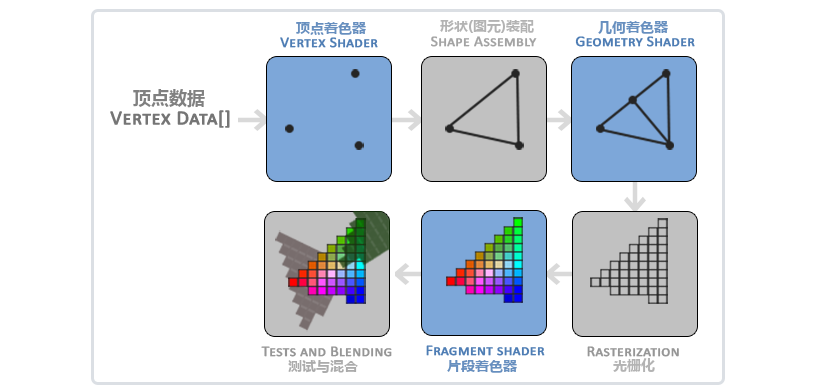

**图元装配(Primitive Assembly)**阶段将顶点着色器输出的所有顶点作为输入（如果是GL_POINTS，那么就是一个顶点），并所有的点装配成指定图元的形状；

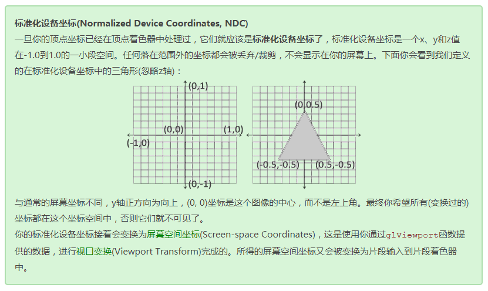

顶点缓冲对象是我们在OpenGL教程中第一个出现的OpenGL对象。就像OpenGL中的其它对象一样，这个缓冲有一个独一无二的ID，所以我们可以使用glGenBuffers函数和一个缓冲ID生成一个VBO对象：

```c++
unsigned int VBO;
glGenBuffers(1, &VBO);
```

OpenGL有很多缓冲对象类型，顶点缓冲对象的缓冲类型是GL_ARRAY_BUFFER。OpenGL允许我们同时绑定多个缓冲，只要它们是不同的缓冲类型。我们可以使用glBindBuffer函数把新创建的缓冲绑定到GL_ARRAY_BUFFER目标上：

```c++
glBindBuffer(GL_ARRAY_BUFFER, VBO);  
```

从这一刻起，我们使用的任何（在GL_ARRAY_BUFFER目标上的）缓冲调用都会用来配置当前绑定的缓冲(VBO)。然后我们可以调用glBufferData函数，它会把之前定义的顶点数据复制到缓冲的内存中：

```c++
glBufferData(GL_ARRAY_BUFFER, sizeof(vertices), vertices, GL_STATIC_DRAW);
```

glBufferData是一个专门用来把用户定义的数据复制到当前绑定缓冲的函数。它的第一个参数是目标缓冲的类型：顶点缓冲对象当前绑定到GL_ARRAY_BUFFER目标上。第二个参数指定传输数据的大小(以字节为单位)；用一个简单的`sizeof`计算出顶点数据大小就行。第三个参数是我们希望发送的实际数据。

第四个参数指定了我们希望显卡如何管理给定的数据。它有三种形式：

- **GL_STATIC_DRAW** ：数据不会或几乎不会改变。
- **GL_DYNAMIC_DRAW**：数据会被改变很多。
- **GL_STREAM_DRAW** ：数据每次绘制时都会改变。

三角形的位置数据不会改变，每次渲染调用时都保持原样，所以它的使用类型最好是GL_STATIC_DRAW。如果，比如说一个缓冲中的数据将频繁被改变，那么使用的类型就是GL_DYNAMIC_DRAW或GL_STREAM_DRAW，这样就能确保显卡把数据放在能够高速写入的内存部分。


## **2.1 顶点着色器**

**顶点着色器(Vertex Shader)**是几个可编程着色器中的一个。如果我们打算做渲染的话，现代OpenGL需要我们至少设置一个顶点和一个片段着色器。

```glsl
#version 330 core
layout (location = 0) in vec3 aPos;

void main()
{
    gl_Position = vec4(aPos.x, aPos.y, aPos.z, 1.0);
}
```


## **2.2 片段着色器**

**片段着色器(Fragment Shader)**是第二个也是最后一个我们打算创建的用于渲染三角形的着色器。片段着色器所做的是计算像素最后的颜色输出。

**片段着色器**的主要目的是计算一个像素的最终颜色，这也是所有OpenGL高级效果产生的地方。通常，片段着色器包含3D场景的数据（比如光照、阴影、光的颜色等等），这些数据可以被用来计算最终像素的颜色。

```glsl
#version 330 core
out vec4 FragColor;

void main()
{
    FragColor = vec4(1.0f, 0.5f, 0.2f, 1.0f);
} 
```


# **3. 纹理 Texture**


# **4. 变换**

## **4.1 向量**

**定义：**向量有一个方向(Direction)和大小(Magnitude，也叫做强度或长度)。

- **向量与标量的运算**

  **标量(Scalar)**只是一个数字（或者说是仅有一个分量的向量）。当把一个向量加/减/乘/除一个标量，我们可以简单的把向量的每个分量分别进行该运算。

  其中的+可以是+，-，·或÷，其中·是乘号。注意－和÷运算时不能颠倒（标量-/÷向量），因为颠倒的运算是没有定义的。

- **向量取反**

  对一个向量取反(Negate)会将其方向逆转。我们在一个向量的每个分量前加负号就可以实现取反了（或者说用-1数乘该向量）

- **向量加减**

  向量的加法可以被定义为是分量的(Component-wise)相加，即将一个向量中的每一个分量加上另一个向量的对应分量。

  向量的减法等于加上第二个向量的相反向量。

- **长度**

  我们使用勾股定理(Pythagoras Theorem)来获取向量的长度(Length)/大小(Magnitude)。如果你把向量的x与y分量画出来，该向量会和x与y分量为边形成一个三角形。

  有一个特殊类型的向量叫做单位向量(Unit Vector)。单位向量有一个特别的性质——它的长度是1。

  用任意向量的每个分量除以向量的长度得到它的单位向量，这种方法叫做一个向量的标准化(Normalizing)。

- **向量相乘**

  - **点乘**

    两个向量的点乘等于它们的数乘结果乘以两个向量之间夹角的余弦值。

  - **叉乘**

    叉乘只在3D空间中有定义，它需要两个不平行向量作为输入，生成一个正交于两个输入向量的第三个向量。如果输入的两个向量也是正交的，那么叉乘之后将会产生3个互相正交的向量。

## **4.2 矩阵**

**定义：**矩阵就是一个矩形的数字、符号或表达式数组。矩阵中每一项叫做矩阵的元素(Element)。

- **矩阵的加减**

  矩阵与标量之间的加减，标量值要加到矩阵的每一个元素上。矩阵与标量的减法也相似。

  矩阵与矩阵之间的加减就是两个矩阵对应元素的加减运算，所以总体的规则和与标量运算是差不多的，只不过在相同索引下的元素才能进行运算。这也就是说**加法和减法只对同维度的矩阵才是有定义的**。

- **矩阵的数乘**

  矩阵与标量之间的乘法也是矩阵的每一个元素分别乘以该标量。

  标量就是用它的值**缩放**(Scale)矩阵的所有元素

- **矩阵相乘**

  1. 只有当左侧矩阵的列数与右侧矩阵的行数相等，两个矩阵才能相乘。
  2. 矩阵相乘不遵守交换律(Commutative)，也就是说A⋅B≠B⋅A。
  3. 结果矩阵的维度是(n, m)，n等于左侧矩阵的行数，m等于右侧矩阵的列数。

## **4.3 矩阵与向量相乘**

- **单位矩阵**

  单位矩阵是一个除了对角线以外都是0的**N×N**矩阵。
  $$
  \left[
  \matrix{
  	1\quad0\quad0\quad0\\
  	0\quad1\quad0\quad0\\
  	0\quad0\quad1\quad0\\
  	0\quad0\quad0\quad1
  }
  \right]
  $$

- **缩放**

  对一个向量进行缩放(Scaling)就是对向量的长度进行缩放，而保持它的方向不变。

  每个轴的缩放因子(Scaling Factor)都不一样，这样的缩放操作是不均匀(Non-uniform)缩放。如果每个轴的缩放因子都一样那么就叫均匀缩放(Uniform Scale)。  
  $$
  \left[
  \matrix{
  	S_1 & 0 & 0 & 0\\
  	0 & S_2 & 0 & 0\\
  	0 & 0 & S_3 & 0\\
  	0 & 0 & 0 & 1
  }
  \right] \cdot \left[
  \matrix{
  	x\\
  	y\\
  	z\\
  	1
  }
  \right] = \left[
  \matrix{
  	S1 \cdot x\\
  	S2 \cdot y\\
  	S3 \cdot z\\
  	1
  }
  \right]
  $$
  
- **位移**

  位移(Translation)是在原始向量的基础上加上另一个向量从而获得一个在不同位置的新向量的过程，从而在位移向量基础上**移动**了原始向量。
  $$
  \left[
  \matrix{
  	1 & 0 & 0 & T_x\\
  	0 & 1 & 0 & T_y\\
  	0 & 0 & 1 & T_z\\
  	0 & 0 & 0 & 1
  }
  \right] \cdot \left[
  \matrix{
  	x\\
  	y\\
  	z\\
  	1
  }
  \right] = \left[
  \matrix{
  	x + T_x\\
  	y + T_y\\
  	z + T_z\\
  	1
  }
  \right]
  $$
  
  **齐次坐标(Homogeneous Coordinates)**
  
  向量的w分量也叫**齐次坐标**。想要从齐次向量得到3D向量，我们可以把x、y和z坐标分别除以w坐标。我们通常不会注意这个问题，因为w分量通常是1.0。使用齐次坐标有几点好处：它允许我们在3D向量上进行位移（如果没有w分量我们是不能位移向量的），而且我们会用w值创建3D视觉效果。
  
  如果一个向量的齐次坐标是0，这个坐标就是**方向向量(Direction Vector)**，因为w坐标是0，这个向量就不能位移（译注：这也就是我们说的不能位移一个方向）。
  
- **旋转**

  大多数旋转函数需要用弧度制的角，但幸运的是角度制的角也可以很容易地转化为弧度制的：

  - 弧度转角度：`角度 = 弧度 * (180.0f / PI)`
  - 角度转弧度：`弧度 = 角度 * (PI / 180.0f)`

  `PI`约等于3.14159265359。

  在3D空间中旋转需要定义一个角**和**一个旋转轴(Rotation Axis)。物体会沿着给定的旋转轴旋转特定角度。如果你想要更形象化的感受，可以试试向下看着一个特定的旋转轴，同时将你的头部旋转一定角度。当2D向量在3D空间中旋转时，我们把旋转轴设为z轴（尝试想象这种情况）。

  使用三角学，给定一个角度，可以把一个向量变换为一个经过旋转的新向量。这通常是使用一系列正弦和余弦函数（一般简称sin和cos）各种巧妙的组合得到的。当然，讨论如何生成变换矩阵超出了这个教程的范围。

  旋转矩阵在3D空间中每个单位轴都有不同定义，旋转角度用θθ表示：

  **沿x轴旋转：**
  $$
  \left[
  \matrix{
  	1&0&0&0\\
  	0&\cos\theta&-\sin\theta&0\\
  	0&\sin\theta&\cos\theta&0\\
  	0&0&0&1
  }
  \right]\cdot\left[
  \matrix{
  	x\\
  	y\\
  	z\\
  	1
  }
  \right]=\left[
  \matrix{
  	x\\
  	\cos\theta\cdot y-\sin\theta\cdot z\\
  	\sin\theta\cdot y+\cos\theta\cdot z\\
  	1
  }
  \right]
  $$
  **沿y轴旋转：**
  $$
  \left[
  \matrix{
  	\cos\theta&0&\sin\theta&0\\
  	0&1&0&0\\
  	-\sin\theta&0&\cos\theta&0\\
  	0&0&0&1
  }
  \right]\cdot\left[
  \matrix{
  	x\\
  	y\\
  	z\\
  	1
  }
  \right]=\left[
  \matrix{
  	\cos\theta\cdot x+\sin\theta\cdot z\\
  	x\\
  	-\sin\theta\cdot x+\cos\theta\cdot z\\
  	1
  }
  \right]
  $$
  **沿z轴旋转：**
  $$
  \left[
  \matrix{
  	\cos\theta&0&\sin\theta&0\\
  	0&1&0&0\\
  	-\sin\theta&0&\cos\theta&0\\
  	0&0&0&1
  }
  \right]\cdot\left[
  \matrix{
  	x\\
  	y\\
  	z\\
  	1
  }
  \right]=\left[
  \matrix{
  	\cos\theta\cdot x+\sin\theta\cdot z\\
  	\sin\theta\cdot x+\cos\theta\cdot y\\
  	z\\
  	1
  }
  \right]
  $$
  **任意旋转轴：**
  $$
  \left[
  \matrix{
  	\cos\theta+R_x^2(1-\cos\theta)&R_xR_y(1-\cos\theta)-R_z\sin\theta&R_xR_z(1-\cos\theta)+R_y\sin\theta&0\\
  	R_yR_x(1-\cos\theta)+R_z\sin\theta&\cos\theta+R_y^2(1-\cos\theta)&R_yR_z(1-\cos\theta)-R_x\sin\theta&0\\
  	R_zR_x(1-\cos\theta)-R_y\sin\theta&R_ZR_y(1-\cos\theta)+R_x\sin\theta&\cos\theta+R_x^2(1-\cos\theta)&0\\
  	0&0&0&1
  }
  \right]
  $$
  避免万向节死锁的真正解决方案是使用**四元数(Quaternion)**，它不仅更安全，而且计算会更有效率。

- ## **矩阵的组合**

  使用矩阵进行变换的真正力量在于，根据矩阵之间的乘法，我们可以把多个变换组合到一个矩阵中。让我们看看我们是否能生成一个变换矩阵，让它组合多个变换。假设我们有一个顶点(x, y, z)，我们希望将其缩放2倍，然后位移(1, 2, 3)个单位。我们需要一个位移和缩放矩阵来完成这些变换。结果的变换矩阵看起来像这样：
  $$
  Trans.Scale=\left[
  \matrix{
  	1&0&0&1\\
  	0&1&0&2\\
  	0&0&1&3\\
  	0&0&0&1
  }
  \right]\cdot\left[
  \matrix{
  	2&0&0&0\\
  	0&2&0&0\\
  	0&0&2&0\\
  	0&0&0&1
  }
  \right]=\left[
  \matrix{
  	2&0&0&2\\
  	0&2&0&2\\
  	0&0&2&3\\
  	0&0&0&1
  }
  \right]
  $$
  注意，当矩阵相乘时我们先写位移再写缩放变换的。矩阵乘法是不遵守交换律的，这意味着它们的顺序很重要。当矩阵相乘时，在最右边的矩阵是第一个与向量相乘的，所以你应该从右向左读这个乘法。建议您在组合矩阵时，先进行缩放操作，然后是旋转，最后才是位移，否则它们会（消极地）互相影响。比如，如果你先位移再缩放，位移的向量也会同样被缩放（译注：比如向某方向移动2米，2米也许会被缩放成1米）！

  用最终的变换矩阵左乘我们的向量会得到以下结果：
  $$
  \left[
  \matrix{
  	2&0&0&1\\
  	0&2&0&2\\
  	0&0&2&3\\
  	0&0&0&1
  }
  \right]\cdot\left[
  \matrix{
  	x\\
  	y\\
  	z\\
  	1
  }
  \right]=\left[
  \matrix{
  	2x+1\\
  	2y+2\\
  	2z+3\\
  	1
  }
  \right]
  $$
  不错！向量先缩放2倍，然后位移了(1, 2, 3)个单位。

## **4.4 GLM**

GLM库从0.9.9版本起，默认会将矩阵类型初始化为一个零矩阵（所有元素均为0），而不是单位矩阵（对角元素为1，其它元素为0）。如果你使用的是0.9.9或0.9.9以上的版本，你需要将所有的矩阵初始化改为 `glm::mat4 mat = glm::mat4(1.0f)`。如果你想与本教程的代码保持一致，请使用低于0.9.9版本的GLM，或者改用上述代码初始化所有的矩阵。

**头文件：**

```C++
#include <glm/glm.hpp>
#include <glm/gtc/matrix_transform.hpp>
#include <glm/gtc/type_ptr.hpp>

unsigned int transformLoc = glGetUniformLocation(ourShader.ID, "transform");
glUniformMatrix4fv(transformLoc, 1, GL_FALSE, glm::value_ptr(trans));


glm::mat4 trans;
trans = glm::translate(trans, glm::vec3(0.5f, -0.5f, 0.0f));
trans = glm::rotate(trans, (float)glfwGetTime(), glm::vec3(0.0f, 0.0f, 1.0f));

```

***

# **5. 坐标系统**

OpenGL希望在每次顶点着色器运行后，我们可见的所有顶点都为标准化设备坐标(Normalized Device Coordinate, NDC)。也就是说，每个顶点的**x**，**y**，**z**坐标都应该在**-1.0**到**1.0**之间，超出这个坐标范围的顶点都将不可见。我们通常会自己设定一个坐标的范围，之后再在顶点着色器中将这些坐标变换为标准化设备坐标。然后将这些标准化设备坐标传入光栅器(Rasterizer)，将它们变换为屏幕上的二维坐标或像素。

将坐标变换为标准化设备坐标，接着再转化为屏幕坐标的过程通常是分步进行的，也就是类似于流水线那样子。在流水线中，物体的顶点在最终转化为屏幕坐标之前还会被变换到多个坐标系统(Coordinate System)。将物体的坐标变换到几个**过渡**坐标系(Intermediate Coordinate System)的优点在于，在这些特定的坐标系统中，一些操作或运算更加方便和容易，这一点很快就会变得很明显。对我们来说比较重要的总共有5个不同的坐标系统：

- 局部空间(Local Space，或者称为物体空间(Object Space))
- 世界空间(World Space)
- 观察空间(View Space，或者称为视觉空间(Eye Space))
- 裁剪空间(Clip Space)
- 屏幕空间(Screen Space)

这就是一个顶点在最终被转化为片段之前需要经历的所有不同状态。

## **5.1 概述**

为了将坐标从一个坐标系变换到另一个坐标系，我们需要用到几个变换矩阵，最重要的几个分别是**模型(Model)**、**观察(View)**、**投影(Projection)**三个矩阵。我们的顶点坐标起始于**局部空间(Local Space)**，在这里它称为**局部坐标(Local Coordinate)**，它在之后会变为**世界坐标(World Coordinate)**，**观察坐标(View Coordinate)**，**裁剪坐标(Clip Coordinate)**，并最后以**屏幕坐标(Screen Coordinate)**的形式结束。下面的这张图展示了整个流程以及各个变换过程做了什么：

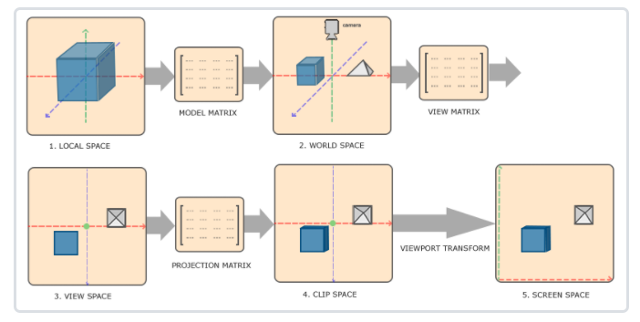

1. 局部坐标是对象相对于局部原点的坐标，也是物体起始的坐标。
2. 下一步是将局部坐标变换为世界空间坐标，世界空间坐标是处于一个更大的空间范围的。这些坐标相对于世界的全局原点，它们会和其它物体一起相对于世界的原点进行摆放。
3. 接下来我们将世界坐标变换为观察空间坐标，使得每个坐标都是从摄像机或者说观察者的角度进行观察的。
4. 坐标到达观察空间之后，我们需要将其投影到裁剪坐标。裁剪坐标会被处理至-1.0到1.0的范围内，并判断哪些顶点将会出现在屏幕上。
5. 最后，我们将裁剪坐标变换为屏幕坐标，我们将使用一个叫做**视口变换(Viewport Transform)**的过程。视口变换将位于-1.0到1.0范围的坐标变换到由**glViewport**函数所定义的坐标范围内。最后变换出来的坐标将会送到光栅器，将其转化为片段。

## **5.2 局部空间**

局部空间是指物体所在的坐标空间，即对象最开始所在的地方。想象你在一个建模软件（比如说Blender）中创建了一个立方体。你创建的立方体的原点有可能位于(0, 0, 0)，即便它有可能最后在程序中处于完全不同的位置。甚至有可能你创建的所有模型都以(0, 0, 0)为初始位置（译注：然而它们会最终出现在世界的不同位置）。所以，你的模型的所有顶点都是在**局部**空间中：它们相对于你的物体来说都是局部的。

我们一直使用的那个箱子的顶点是被设定在-0.5到0.5的坐标范围中，(0, 0)是它的原点。这些都是局部坐标。

## **5.3 世界空间**

如果我们将我们所有的物体导入到程序当中，它们有可能会全挤在世界的原点(0, 0, 0)上，这并不是我们想要的结果。我们想为每一个物体定义一个位置，从而能在更大的世界当中放置它们。世界空间中的坐标正如其名：是指顶点相对于（游戏）世界的坐标。如果你希望将物体分散在世界上摆放（特别是非常真实的那样），这就是你希望物体变换到的空间。物体的坐标将会从局部变换到世界空间；该变换是由**模型矩阵(Model Matrix)**实现的。

模型矩阵是一种变换矩阵，它能通过对物体进行位移、缩放、旋转来将它置于它本应该在的位置或朝向。你可以将它想像为变换一个房子，你需要先将它缩小（它在局部空间中太大了），并将其位移至郊区的一个小镇，然后在y轴上往左旋转一点以搭配附近的房子。你也可以把上一节将箱子到处摆放在场景中用的那个矩阵大致看作一个模型矩阵；我们将箱子的局部坐标变换到场景/世界中的不同位置。

## **5.4 观察空间**

观察空间经常被人们称之OpenGL的**摄像机(Camera)**（所以有时也称为**摄像机空间(Camera Space)**或**视觉空间(Eye Space)**）。观察空间是将世界空间坐标转化为用户视野前方的坐标而产生的结果。因此观察空间就是从摄像机的视角所观察到的空间。而这通常是由一系列的位移和旋转的组合来完成，平移/旋转场景从而使得特定的对象被变换到摄像机的前方。这些组合在一起的变换通常存储在一个**观察矩阵(View Matrix)**里，它被用来将世界坐标变换到观察空间。在下一节中我们将深入讨论如何创建一个这样的观察矩阵来模拟一个摄像机。

## **5.5 裁剪空间**

在一个顶点着色器运行的最后，OpenGL期望所有的坐标都能落在一个特定的范围内，且任何在这个范围之外的点都应该被裁剪掉(Clipped)。被裁剪掉的坐标就会被忽略，所以剩下的坐标就将变为屏幕上可见的片段。这也就是裁剪空间(Clip Space)名字的由来。

因为将所有可见的坐标都指定在-1.0到1.0的范围内不是很直观，所以我们会指定自己的坐标集(Coordinate Set)并将它变换回标准化设备坐标系，就像OpenGL期望的那样。

为了将顶点坐标从观察变换到裁剪空间，我们需要定义一个投影矩阵(Projection Matrix)，它指定了一个范围的坐标，比如在每个维度上的-1000到1000。投影矩阵接着会将在这个指定的范围内的坐标变换为标准化设备坐标的范围(-1.0, 1.0)。所有在范围外的坐标不会被映射到在-1.0到1.0的范围之间，所以会被裁剪掉。在上面这个投影矩阵所指定的范围内，坐标(1250, 500, 750)将是不可见的，这是由于它的x坐标超出了范围，它被转化为一个大于1.0的标准化设备坐标，所以被裁剪掉了。

`如果只是图元(Primitive)，例如三角形，的一部分超出了裁剪体积(Clipping Volume)，则OpenGL会重新构建这个三角形为一个或多个三角形让其能够适合这个裁剪范围。`

由投影矩阵创建的**观察箱(Viewing Box)**被称为**平截头体(Frustum)**，每个出现在平截头体范围内的坐标都会最终出现在用户的屏幕上。将特定范围内的坐标转化到标准化设备坐标系的过程（而且它很容易被映射到2D观察空间坐标）被称之为**投影(Projection**)，因为使用投影矩阵能将3D坐标投影(Project)到很容易映射到2D的标准化设备坐标系中。

一旦所有顶点被变换到裁剪空间，最终的操作——**透视除法(Perspective Division)**将会执行，在这个过程中我们将位置向量的x，y，z分量分别除以向量的齐次w分量；透视除法是将4D裁剪空间坐标变换为3D标准化设备坐标的过程。这一步会在每一个顶点着色器运行的最后被自动执行。

在这一阶段之后，最终的坐标将会被映射到屏幕空间中（使用glViewport中的设定），并被变换成片段。

将观察坐标变换为裁剪坐标的投影矩阵可以为两种不同的形式，每种形式都定义了不同的平截头体。我们可以选择创建一个正射投影矩阵(Orthographic Projection Matrix)或一个**透视投影矩阵(Perspective Projection Matrix)**。

## **5.6 正射投影**

正射投影矩阵定义了一个类似立方体的平截头箱，它定义了一个裁剪空间，在这空间之外的顶点都会被裁剪掉。创建一个正射投影矩阵需要指定可见平截头体的宽、高和长度。在使用正射投影矩阵变换至裁剪空间之后处于这个平截头体内的所有坐标将不会被裁剪掉。它的平截头体看起来像一个容器：

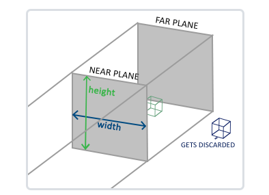

上面的平截头体定义了可见的坐标，它由由宽、高、近(Near)平面和远(Far)平面所指定。任何出现在近平面之前或远平面之后的坐标都会被裁剪掉。正射平截头体直接将平截头体内部的所有坐标映射为标准化设备坐标，因为每个向量的w分量都没有进行改变；如果w分量等于1.0，透视除法则不会改变这个坐标。

要创建一个正射投影矩阵，我们可以使用GLM的内置函数`glm::ortho`：

```C++
glm::ortho(0.0f, 800.0f, 0.0f, 600.0f, 0.1f, 100.0f);
```

前两个参数指定了平截头体的左右坐标，第三和第四参数指定了平截头体的底部和顶部。通过这四个参数我们定义了近平面和远平面的大小，然后第五和第六个参数则定义了近平面和远平面的距离。这个投影矩阵会将处于这些x，y，z值范围内的坐标变换为标准化设备坐标。

正射投影矩阵直接将坐标映射到2D平面中，即你的屏幕，但实际上一个直接的投影矩阵会产生不真实的结果，因为这个投影没有将**透视(Perspective)**考虑进去。所以我们需要**透视投影**矩阵来解决这个问题。

**右手坐标系：**

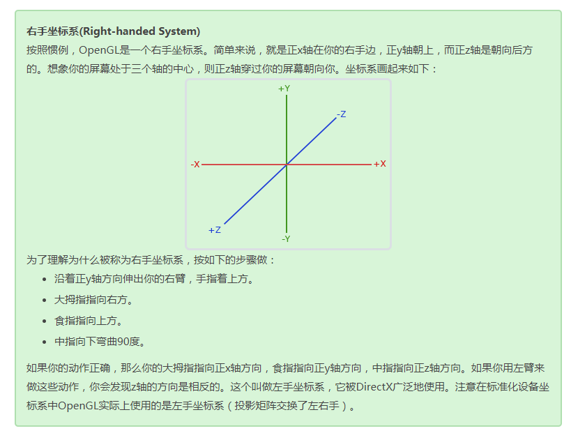

## **5.7 Z缓冲**

OpenGL存储它的所有深度信息于一个Z缓冲(Z-buffer)中，也被称为深度缓冲(Depth Buffer)。GLFW会自动为你生成这样一个缓冲（就像它也有一个颜色缓冲来存储输出图像的颜色）。深度值存储在每个片段里面（作为片段的**z**值），当片段想要输出它的颜色时，OpenGL会将它的深度值和z缓冲进行比较，如果当前的片段在其它片段之后，它将会被丢弃，否则将会覆盖。这个过程称为深度测试(Depth Testing)，它是由OpenGL自动完成的。

然而，如果我们想要确定OpenGL真的执行了深度测试，首先我们要告诉OpenGL我们想要启用深度测试；它默认是关闭的。我们可以通过glEnable函数来开启深度测试。glEnable和glDisable函数允许我们启用或禁用某个OpenGL功能。这个功能会一直保持启用/禁用状态，直到另一个调用来禁用/启用它。现在我们想启用深度测试，需要开启GL_DEPTH_TEST：

```c++
glEnable(GL_DEPTH_TEST);
```

因为我们使用了深度测试，我们也想要在每次渲染迭代之前清除深度缓冲（否则前一帧的深度信息仍然保存在缓冲中）。就像清除颜色缓冲一样，我们可以通过在glClear函数中指定DEPTH_BUFFER_BIT位来清除深度缓冲：

```c++
glClear(GL_COLOR_BUFFER_BIT | GL_DEPTH_BUFFER_BIT);
```

***

# **6. 摄像机**

## **6.1 摄像机/观察空间**

当我们讨论**摄像机/观察空间(Camera/View Space)**的时候，是在讨论以摄像机的视角作为场景原点时场景中所有的顶点坐标：观察矩阵把所有的世界坐标变换为相对于摄像机位置与方向的观察坐标。要定义一个摄像机，我们需要它在世界空间中的位置、观察的方向、一个指向它右测的向量以及一个指向它上方的向量。细心的读者可能已经注意到我们实际上创建了一个三个单位轴相互垂直的、以摄像机的位置为原点的坐标系。

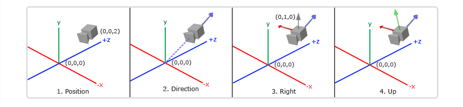

### **6.1.1 摄像机位置**

获取摄像机位置很简单。摄像机位置简单来说就是世界空间中一个指向摄像机位置的向量。我们把摄像机位置设置为上一节中的那个相同的位置：

```C++
glm::vec3 cameraPos = glm::vec3(0.0f, 0.0f, 3.0f);
```

`不要忘记正z轴是从屏幕指向你的，如果我们希望摄像机向后移动，我们就沿着z轴的正方向移动。`

### **6.1.2 摄像机方向**

下一个需要的向量是摄像机的方向，这里指的是摄像机指向哪个方向。现在我们让摄像机指向场景原点：(0, 0, 0)。还记得如果将两个矢量相减，我们就能得到这两个矢量的差吗？用场景原点向量减去摄像机位置向量的结果就是摄像机的指向向量。由于我们知道摄像机指向z轴负方向，但我们希望**方向向量(Direction Vector)**指向摄像机的z轴正方向。如果我们交换相减的顺序，我们就会获得一个指向摄像机正z轴方向的向量：

```C++
glm::vec3 cameraTarget = glm::vec3(0.0f, 0.0f, 0.0f);
glm::vec3 cameraDirection = glm::normalize(cameraPos - cameraTarget);
```

`方向向量(Direction Vector)并不是最好的名字，因为它实际上指向从它到目标向量的相反方向（译注：注意看前面的那个图，蓝色的方向向量大概指向z轴的正方向，与摄像机实际指向的方向是正好相反的）。`

### **6.1.3 右轴**

我们需要的另一个向量是一个**右向量**(Right Vector)，它代表摄像机空间的x轴的正方向。为获取右向量我们需要先使用一个小技巧：先定义一个**上向量**(Up Vector)。接下来把上向量和第二步得到的方向向量进行叉乘。两个向量叉乘的结果会同时垂直于两向量，因此我们会得到指向x轴正方向的那个向量（如果我们交换两个向量叉乘的顺序就会得到相反的指向x轴负方向的向量）：

```C++
glm::vec3 up = glm::vec3(0.0f, 1.0f, 0.0f); 
glm::vec3 cameraRight = glm::normalize(glm::cross(up, cameraDirection));
```

### **6.1.4 上轴**

现在我们已经有了x轴向量和z轴向量，获取一个指向摄像机的正y轴向量就相对简单了：我们把右向量和方向向量进行叉乘：

```C++
glm::vec3 cameraUp = glm::cross(cameraDirection, cameraRight);
```

在叉乘和一些小技巧的帮助下，我们创建了所有构成观察/摄像机空间的向量。对于想学到更多数学原理的读者，提示一下，在线性代数中这个处理叫做**格拉姆—施密特正交化(Gram-Schmidt Process)**。使用这些摄像机向量我们就可以创建一个LookAt矩阵了，它在创建摄像机的时候非常有用。

## **6.2 LookAt**

使用矩阵的好处之一是如果你使用3个相互垂直（或非线性）的轴定义了一个坐标空间，你可以用这3个轴外加一个平移向量来创建一个矩阵，并且你可以用这个矩阵乘以任何向量来将其变换到那个坐标空间。这正是**LookAt**矩阵所做的，现在我们有了3个相互垂直的轴和一个定义摄像机空间的位置坐标，我们可以创建我们自己的LookAt矩阵了：
$$
LookAt=\left[
\matrix{
	R_x&R_y&R_z&0\\
	U_x&U_y&U_z&0\\
	D_x&D_y&D_z&0\\
	0&0&0&1
}
\right]\times\left[
\matrix{
	1&0&0&-P_x\\
	0&1&0&-P_y\\
	0&0&1&-P_z\\
	0&0&0&1\\
}
\right]
$$
其中RR是右向量，UU是上向量，DD是方向向量PP是摄像机位置向量。注意，位置向量是相反的，因为我们最终希望把世界平移到与我们自身移动的相反方向。把这个LookAt矩阵作为观察矩阵可以很高效地把所有世界坐标变换到刚刚定义的观察空间。LookAt矩阵就像它的名字表达的那样：它会创建一个看着(Look at)给定目标的观察矩阵。

幸运的是，GLM已经提供了这些支持。我们要做的只是定义一个摄像机位置，一个目标位置和一个表示世界空间中的上向量的向量（我们计算右向量使用的那个上向量）。接着GLM就会创建一个LookAt矩阵，我们可以把它当作我们的观察矩阵：

```C++
glm::mat4 view; 
view = glm::lookAt(glm::vec3(0.0f, 0.0f, 3.0f),
                   glm::vec3(0.0f, 0.0f, 0.0f),
                   glm::vec3(0.0f, 1.0f, 0.0f));
```

**glm::LookAt函数**需要一个位置、目标和上向量。它会创建一个和在上一节使用的一样的观察矩阵。

在讨论用户输入之前，我们先来做些有意思的事，把我们的摄像机在场景中旋转。我们会将摄像机的注视点保持在(0, 0, 0)。

我们需要用到一点三角学的知识来在每一帧创建一个x和z坐标，它会代表圆上的一点，我们将会使用它作为摄像机的位置。通过重新计算x和y坐标，我们会遍历圆上的所有点，这样摄像机就会绕着场景旋转了。我们预先定义这个圆的半径radius，在每次渲染迭代中使用GLFW的glfwGetTime函数重新创建观察矩阵，来扩大这个圆。

```C++
float radius = 10.0f;
float camX = sin(glfwGetTime()) * radius;
float camZ = cos(glfwGetTime()) * radius;
glm::mat4 view;
view = glm::lookAt(glm::vec3(camX, 0.0, camZ),
                glm::vec3(0.0, 0.0, 0.0),
                glm::vec3(0.0, 1.0, 0.0)); 
```

## **6.3 移动**

跟踪两个全局变量来计算出deltaTime值：

```C++
float deltaTime = 0.0f; // 当前帧与上一帧的时间差
float lastFrame = 0.0f; // 上一帧的时间
```

在每一帧中我们计算出新的deltaTime以备后用。

```C++
float currentFrame = glfwGetTime();
deltaTime = currentFrame - lastFrame;
lastFrame = currentFrame;
```

### **6.3.1 欧拉角**

欧拉角(Euler Angle)是可以表示3D空间中任何旋转的3个值，由莱昂哈德·欧拉(Leonhard Euler)在18世纪提出。一共有3种欧拉角：**俯仰角(Pitch)**、**偏航角(Yaw)**和**滚转角(Roll)**，下面的图片展示了它们的含义：

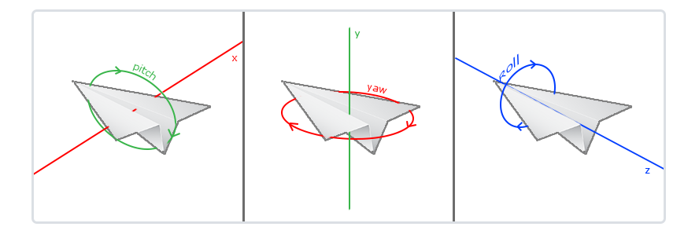

**俯仰角**是描述我们如何往上或往下看的角，可以在第一张图中看到。第二张图展示了**偏航角**，偏航角表示我们往左和往右看的程度。滚转角代表我们如何**翻滚**摄像机，通常在太空飞船的摄像机中使用。每个欧拉角都有一个值来表示，把三个角结合起来我们就能够计算3D空间中任何的旋转向量了。

对于我们的摄像机系统来说，我们只关心俯仰角和偏航角，所以我们不会讨论滚转角。给定一个俯仰角和偏航角，我们可以把它们转换为一个代表新的方向向量的3D向量。俯仰角和偏航角转换为方向向量的处理需要一些三角学知识，我们先从最基本的情况开始：

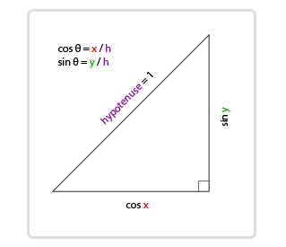

如果我们把斜边边长定义为1，我们就能知道邻边的长度是$$\cos x/h=\cos x/1=\cos x$$，它的对边是$$\sin y/h=\sin y/1=\sin y\sin⁡ y/h=\sin⁡ y/1=\sin⁡ y$$。这样我们获得了能够得到x和y方向长度的通用公式，它们取决于所给的角度。我们使用它来计算方向向量的分量：

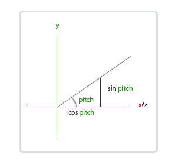

这个三角形看起来和前面的三角形很像，所以如果我们想象自己在xz平面上，看向y轴，我们可以基于第一个三角形计算来计算它的长度/y方向的强度(Strength)（我们往上或往下看多少）。从图中我们可以看到对于一个给定俯仰角的y值等于$$\sin\theta$$：

```C++
direction.y = sin(glm::radians(pitch)); // 注意我们先把角度转为弧度
```

这里我们只更新了y值，仔细观察x和z分量也被影响了。从三角形中我们可以看到它们的值等于：

```C++
direction.x = cos(glm::radians(pitch));
direction.z = cos(glm::radians(pitch));
```

看看我们是否能够为偏航角找到需要的分量：

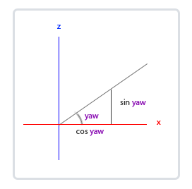

就像俯仰角的三角形一样，我们可以看到x分量取决于$$\cos(yaw)$$的值，z值同样取决于偏航角的正弦值。把这个加到前面的值中，会得到基于俯仰角和偏航角的方向向量：

```C++
// 译注：direction代表摄像机的前轴(Front)，这个前轴是和本文第一幅图片的第二个摄像机的方向向量是相反的
direction.x = cos(glm::radians(pitch)) * cos(glm::radians(yaw)); 
direction.y = sin(glm::radians(pitch));
direction.z = cos(glm::radians(pitch)) * sin(glm::radians(yaw));
```

这样我们就有了一个可以把俯仰角和偏航角转化为用来自由旋转视角的摄像机的3维方向向量了

### **6.3.2 鼠标输入**

偏航角和俯仰角是通过鼠标（或手柄）移动获得的，水平的移动影响偏航角，竖直的移动影响俯仰角。它的原理就是，储存上一帧鼠标的位置，在当前帧中我们当前计算鼠标位置与上一帧的位置相差多少。如果水平/竖直差别越大那么俯仰角或偏航角就改变越大，也就是摄像机需要移动更多的距离。

首先我们要告诉GLFW，它应该隐藏光标，并捕捉(Capture)它。捕捉光标表示的是，如果焦点在你的程序上（译注：即表示你正在操作这个程序，Windows中拥有焦点的程序标题栏通常是有颜色的那个，而失去焦点的程序标题栏则是灰色的），光标应该停留在窗口中（除非程序失去焦点或者退出）。我们可以用一个简单地配置调用来完成：

```C++
glfwSetInputMode(window, GLFW_CURSOR, GLFW_CURSOR_DISABLED);
```

在调用这个函数之后，无论我们怎么去移动鼠标，光标都不会显示了，它也不会离开窗口。对于FPS摄像机系统来说非常完美。

为了计算俯仰角和偏航角，我们需要让GLFW监听鼠标移动事件。（和键盘输入相似）我们会用一个回调函数来完成，函数的原型如下：

```c++
void mouse_callback(GLFWwindow* window, double xpos, double ypos);
```

这里的xpos和ypos代表当前鼠标的位置。当我们用GLFW注册了回调函数之后，鼠标一移动mouse_callback函数就会被调用：

```c++
glfwSetCursorPosCallback(window, mouse_callback);
```

在处理FPS风格摄像机的鼠标输入的时候，我们必须在最终获取方向向量之前做下面这几步：

1. 计算鼠标距上一帧的偏移量。
2. 把偏移量添加到摄像机的俯仰角和偏航角中。
3. 对偏航角和俯仰角进行最大和最小值的限制。
4. 计算方向向量。

我们需要一个鼠标滚轮的回调函数：

```c++
void scroll_callback(GLFWwindow* window, double xoffset, double yoffset)
{
  if(fov >= 1.0f && fov <= 45.0f)
    fov -= yoffset;
  if(fov <= 1.0f)
    fov = 1.0f;
  if(fov >= 45.0f)
    fov = 45.0f;
}
```

当滚动鼠标滚轮的时候，yoffset值代表我们竖直滚动的大小。当scroll_callback函数被调用后，我们改变全局变量fov变量的内容。因为`45.0f`是默认的视野值，我们将会把缩放级别(Zoom Level)限制在`1.0f`到`45.0f`。

我们现在在每一帧都必须把透视投影矩阵上传到GPU，但现在使用fov变量作为它的视野：

```C++
projection = glm::perspective(glm::radians(fov), 800.0f / 600.0f, 0.1f, 100.0f);
```

最后不要忘记注册鼠标滚轮的回调函数：

```C++
glfwSetScrollCallback(window, scroll_callback);
```

***

# **7. 颜色**

现实世界中有无数种颜色，每一个物体都有它们自己的颜色。我们需要使用（有限的）数值来模拟真实世界中（无限）的颜色，所以并不是所有现实世界中的颜色都可以用数值来表示的。然而我们仍能通过数值来表现出非常多的颜色，甚至你可能都不会注意到与现实的颜色有任何的差异。颜色可以数字化的由红色(Red)、绿色(Green)和蓝色(Blue)三个分量组成，它们通常被缩写为RGB。仅仅用这三个值就可以组合出任意一种颜色。

例如，要获取一个**珊瑚红(Coral)**色的话，我们可以定义这样的一个颜色向量：

```C++
glm::vec3 coral(1.0f, 0.5f, 0.31f);
```

我们在现实生活中看到某一物体的颜色并不是这个物体真正拥有的颜色，而是它所反射的(Reflected)颜色。换句话说，那些不能被物体所吸收(Absorb)的颜色（被拒绝的颜色）就是我们能够感知到的物体的颜色。例如，太阳光能被看见的白光其实是由许多不同的颜色组合而成的（如下图所示）。如果我们将白光照在一个蓝色的玩具上，这个蓝色的玩具会吸收白光中除了蓝色以外的所有子颜色，不被吸收的蓝色光被反射到我们的眼中，让这个玩具看起来是蓝色的。下图显示的是一个珊瑚红的玩具，它以不同强度反射了多个颜色。

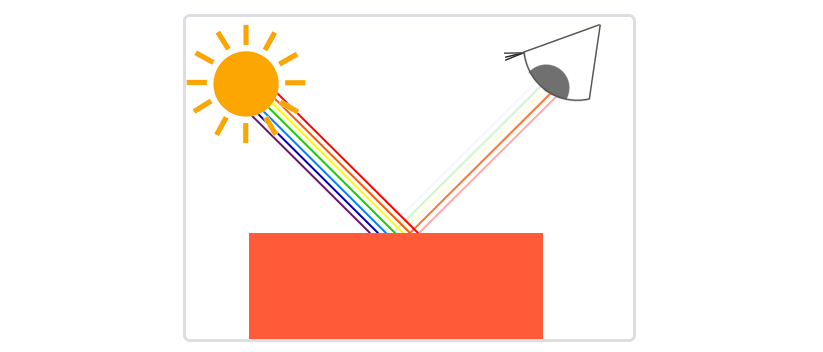

你可以看到，白色的阳光实际上是所有可见颜色的集合，物体吸收了其中的大部分颜色。它仅反射了代表物体颜色的部分，被反射颜色的组合就是我们所感知到的颜色（此例中为珊瑚红）。

这些颜色反射的定律被直接地运用在图形领域。当我们在OpenGL中创建一个光源时，我们希望给光源一个颜色。在上一段中我们有一个白色的太阳，所以我们也将光源设置为白色。当我们把光源的颜色与物体的颜色值相乘，所得到的就是这个物体所反射的颜色（也就是我们所感知到的颜色）。让我们再次审视我们的玩具（这一次它还是珊瑚红），看看如何在图形学中计算出它的反射颜色。我们将这两个颜色向量作分量相乘，结果就是最终的颜色向量了：

```C++
glm::vec3 lightColor(1.0f, 1.0f, 1.0f);
glm::vec3 toyColor(1.0f, 0.5f, 0.31f);
glm::vec3 result = lightColor * toyColor; // = (1.0f, 0.5f, 0.31f);
```

我们可以看到玩具的颜色**吸收**了白色光源中很大一部分的颜色，但它根据自身的颜色值对红、绿、蓝三个分量都做出了一定的反射。这也表现了现实中颜色的工作原理。由此，我们可以定义物体的颜色为**物体从一个光源反射各个颜色分量的大小**。现在，如果我们使用绿色的光源又会发生什么呢？

```c++
glm::vec3 lightColor(0.0f, 1.0f, 0.0f);
glm::vec3 toyColor(1.0f, 0.5f, 0.31f);
glm::vec3 result = lightColor * toyColor; // = (0.0f, 0.5f, 0.0f);
```

可以看到，并没有红色和蓝色的光让我们的玩具来吸收或反射。这个玩具吸收了光线中一半的绿色值，但仍然也反射了一半的绿色值。玩具现在看上去是深绿色(Dark-greenish)的。我们可以看到，如果我们用绿色光源来照射玩具，那么只有绿色分量能被反射和感知到，红色和蓝色都不能被我们所感知到。这样做的结果是，一个珊瑚红的玩具突然变成了深绿色物体。现在我们来看另一个例子，使用**深橄榄绿色(Dark olive-green)**的光源：

```C++
glm::vec3 lightColor(0.33f, 0.42f, 0.18f);
glm::vec3 toyColor(1.0f, 0.5f, 0.31f);
glm::vec3 result = lightColor * toyColor; // = (0.33f, 0.21f, 0.06f);
```

可以看到，我们可以使用不同的光源颜色来让物体显现出意想不到的颜色。

## **7.1 创建一个光照场景**

我们首先需要一个顶点着色器来绘制箱子。与之前的顶点着色器相比，容器的顶点位置是保持不变的（虽然这一次我们不需要纹理坐标了），因此顶点着色器中没有新的代码。我们将会使用之前教程顶点着色器的精简版：

```glsl
#version 330 core
layout (location = 0) in vec3 aPos;

uniform mat4 model;
uniform mat4 view;
uniform mat4 projection;

void main()
{
    gl_Position = projection * view * model * vec4(aPos, 1.0);
}
```

记得更新你的顶点数据和属性指针使其与新的顶点着色器保持一致（当然你可以继续留着纹理数据和属性指针。在这一节中我们将不会用到它们，但有一个全新的开始也不是什么坏主意）。

因为我们还要创建一个表示灯（光源）的立方体，所以我们还要为这个灯创建一个专门的VAO。当然我们也可以让这个灯和其它物体使用同一个VAO，简单地对它的model（模型）矩阵做一些变换就好了，然而接下来的教程中我们会频繁地对顶点数据和属性指针做出修改，我们并不想让这些修改影响到灯（我们只关心灯的顶点位置），因此我们有必要为灯创建一个新的VAO。

```c++
unsigned int lightVAO;
glGenVertexArrays(1, &lightVAO);
glBindVertexArray(lightVAO);
// 只需要绑定VBO不用再次设置VBO的数据，因为箱子的VBO数据中已经包含了正确的立方体顶点数据
glBindBuffer(GL_ARRAY_BUFFER, VBO);
// 设置灯立方体的顶点属性（对我们的灯来说仅仅只有位置数据）
glVertexAttribPointer(0, 3, GL_FLOAT, GL_FALSE, 3 * sizeof(float), (void*)0);
glEnableVertexAttribArray(0);
```

这段代码对你来说应该非常直观。现在我们已经创建了表示灯和被照物体箱子，我们只需要再定义一个片段着色器就行了：

```glsl
#version 330 core
out vec4 FragColor;

uniform vec3 objectColor;
uniform vec3 lightColor;

void main()
{
    FragColor = vec4(lightColor * objectColor, 1.0);
}
```

这个片段着色器从uniform变量中接受物体的颜色和光源的颜色。正如本节一开始所讨论的那样，我们将光源的颜色和物体（反射的）颜色相乘。这个着色器理解起来应该很容易。我们把物体的颜色设置为之前提到的珊瑚红色，并把光源设置为白色。

```c++
// 在此之前不要忘记首先 use 对应的着色器程序（来设定uniform）
lightingShader.use();
lightingShader.setVec3("objectColor", 1.0f, 0.5f, 0.31f);
lightingShader.setVec3("lightColor",  1.0f, 1.0f, 1.0f);
```

要注意的是，当我们修改顶点或者片段着色器后，灯的位置或颜色也会随之改变，这并不是我们想要的效果。我们不希望灯的颜色在接下来的教程中因光照计算的结果而受到影响，而是希望它能够与其它的计算分离。我们希望灯一直保持明亮，不受其它颜色变化的影响（这样它才更像是一个真实的光源）。

为了实现这个目标，我们需要为灯的绘制创建另外的一套着色器，从而能保证它能够在其它光照着色器发生改变的时候不受影响。顶点着色器与我们当前的顶点着色器是一样的，所以你可以直接把现在的顶点着色器用在灯上。灯的片段着色器给灯定义了一个不变的常量白色，保证了灯的颜色一直是亮的：

```glsl
#version 330 core
out vec4 FragColor;

void main()
{
    FragColor = vec4(1.0); // 将向量的四个分量全部设置为1.0
}
```

当我们想要绘制我们的物体的时候，我们需要使用刚刚定义的光照着色器来绘制箱子（或者可能是其它的物体）。当我们想要绘制灯的时候，我们会使用灯的着色器。在之后的教程里我们会逐步更新这个光照着色器，从而能够慢慢地实现更真实的效果。

使用这个灯立方体的主要目的是为了让我们知道光源在场景中的具体位置。我们通常在场景中定义一个光源的位置，但这只是一个位置，它并没有视觉意义。为了显示真正的灯，我们将表示光源的立方体绘制在与光源相同的位置。我们将使用我们为它新建的片段着色器来绘制它，让它一直处于白色的状态，不受场景中的光照影响。

我们声明一个全局`vec3`变量来表示光源在场景的世界空间坐标中的位置：

```c++
glm::vec3 lightPos(1.2f, 1.0f, 2.0f);
```

然后我们把灯位移到这里，然后将它缩小一点，让它不那么明显：

```c++
model = glm::mat4();
model = glm::translate(model, lightPos);
model = glm::scale(model, glm::vec3(0.2f));
```

绘制灯立方体的代码应该与下面的类似：

```C++
lampShader.use();
// 设置模型、视图和投影矩阵uniform
...
// 绘制灯立方体对象
glBindVertexArray(lightVAO);
glDrawArrays(GL_TRIANGLES, 0, 36);
```

***

# **8. 基础光照**

**冯氏光照模型(Phong Lighting Model)**的主要结构由3个分量组成：**环境(Ambient)**、**漫反射(Diffuse)**和**镜面(Specular)**光照。

- **环境光照(Ambient Lighting)**：即使在黑暗的情况下，世界上通常也仍然有一些光亮（月亮、远处的光），所以物体几乎永远不会是完全黑暗的。为了模拟这个，我们会使用一个环境光照常量，它永远会给物体一些颜色。
- **漫反射光照(Diffuse Lighting)**：模拟光源对物体的方向性影响(Directional Impact)。它是冯氏光照模型中视觉上最显著的分量。物体的某一部分越是正对着光源，它就会越亮。
- **镜面光照(Specular Lighting)**：模拟有光泽物体上面出现的亮点。镜面光照的颜色相比于物体的颜色会更倾向于光的颜色。

## **8.1 环境光照**

光通常都不是来自于同一个光源，而是来自于我们周围分散的很多光源，即使它们可能并不是那么显而易见。光的一个属性是，它可以向很多方向发散并反弹，从而能够到达不是非常直接临近的点。所以，光能够在其它的表面上**反射**，对一个物体产生间接的影响。考虑到这种情况的算法叫做全局照明(Global Illumination)算法，但是这种算法既开销高昂又极其复杂。

由于我们现在对那种又复杂又开销高昂的算法不是很感兴趣，所以我们将会先使用一个简化的全局照明模型，即环境光照。正如你在上一节所学到的，我们使用一个很小的常量（光照）颜色，添加到物体片段的最终颜色中，这样子的话即便场景中没有直接的光源也能看起来存在有一些发散的光。

把环境光照添加到场景里非常简单。我们用光的颜色乘以一个很小的常量环境因子，再乘以物体的颜色，然后将最终结果作为片段的颜色：

```glsl
void main()
{
    float ambientStrength = 0.1;
    vec3 ambient = ambientStrength * lightColor;

    vec3 result = ambient * objectColor;
    FragColor = vec4(result, 1.0);
}
```

## **8.2 漫反射光照**

环境光照本身不能提供最有趣的结果，但是漫反射光照就能开始对物体产生显著的视觉影响了。漫反射光照使物体上与光线方向越接近的片段能从光源处获得更多的亮度。为了能够更好的理解漫反射光照，请看下图：

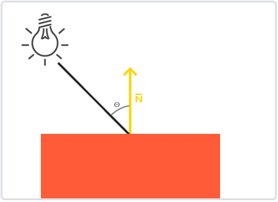

图左上方有一个光源，它所发出的光线落在物体的一个片段上。我们需要测量这个光线是以什么角度接触到这个片段的。如果光线垂直于物体表面，这束光对物体的影响会最大化（译注：更亮）。为了测量光线和片段的角度，我们使用一个叫做**法向量(Normal Vector)**的东西，它是垂直于片段表面的一个向量（这里以黄色箭头表示），我们在后面再讲这个东西。这两个向量之间的角度很容易就能够通过点乘计算出来。

你可能记得在[变换](https://learnopengl-cn.github.io/01 Getting started/07 Transformations/)那一节教程里，我们知道两个单位向量的夹角越小，它们点乘的结果越倾向于1。当两个向量的夹角为90度的时候，点乘会变为0。这同样适用于θ，θ越大，光对片段颜色的影响就应该越小。

点乘返回一个标量，我们可以用它计算光线对片段颜色的影响。不同片段朝向光源的方向的不同，这些片段被照亮的情况也不同。

所以，计算漫反射光照需要什么？

- 法向量：一个垂直于顶点表面的向量。
- 定向的光线：作为光源的位置与片段的位置之间向量差的方向向量。为了计算这个光线，我们需要光的位置向量和片段的位置向量。

## **8.3 法向量**

法向量是一个垂直于顶点表面的（单位）向量。由于顶点本身并没有表面（它只是空间中一个独立的点），我们利用它周围的顶点来计算出这个顶点的表面。我们能够使用一个小技巧，使用叉乘对立方体所有的顶点计算法向量，但是由于3D立方体不是一个复杂的形状，所以我们可以简单地把法线数据手工添加到顶点数据中。更新后的顶点数据数组可以在[这里](https://learnopengl.com/code_viewer.php?code=lighting/basic_lighting_vertex_data)找到。试着去想象一下，这些法向量真的是垂直于立方体各个平面的表面的（一个立方体由6个平面组成）。

由于我们向顶点数组添加了额外的数据，所以我们应该更新光照的顶点着色器：

```glsl
#version 330 core
layout (location = 0) in vec3 aPos;
layout (location = 1) in vec3 aNormal;
...
```

现在我们已经向每个顶点添加了一个法向量并更新了顶点着色器，我们还要更新顶点属性指针。注意，灯使用同样的顶点数组作为它的顶点数据，然而灯的着色器并没有使用新添加的法向量。我们不需要更新灯的着色器或者是属性的配置，但是我们必须至少修改一下顶点属性指针来适应新的顶点数组的大小：

```c++
glVertexAttribPointer(0, 3, GL_FLOAT, GL_FALSE, 6 * sizeof(float), (void*)0);
glEnableVertexAttribArray(0);
```

我们只想使用每个顶点的前三个float，并且忽略后三个float，所以我们只需要把**步长**参数改成`float`大小的6倍就行了。

`虽然对灯的着色器使用不能完全利用的顶点数据看起来不是那么高效，但这些顶点数据已经从箱子对象载入后开始就储存在GPU的内存里了，所以我们并不需要储存新数据到GPU内存中。这实际上比给灯专门分配一个新的VBO更高效了。`

所有光照的计算都是在片段着色器里进行，所以我们需要将法向量由顶点着色器传递到片段着色器。我们这么做：

```glsl
out vec3 Normal;

void main()
{
    gl_Position = projection * view * model * vec4(aPos, 1.0);
    Normal = aNormal;
}
```

接下来，在片段着色器中定义相应的输入变量：

```glsl
in vec3 Normal;
```

## **8.4 计算漫反射**

我们现在对每个顶点都有了法向量，但是我们仍然需要光源的位置向量和片段的位置向量。由于光源的位置是一个静态变量，我们可以简单地在片段着色器中把它声明为uniform：

```glsl
uniform vec3 lightPos;
```

然后在渲染循环中（渲染循环的外面也可以，因为它不会改变）更新uniform。我们使用在前面声明的lightPos向量作为光源位置：

```c++
lightingShader.setVec3("lightPos", lightPos);
```

最后，我们还需要片段的位置。我们会在世界空间中进行所有的光照计算，因此我们需要一个在世界空间中的顶点位置。我们可以通过把顶点位置属性乘以模型矩阵（不是观察和投影矩阵）来把它变换到世界空间坐标。这个在顶点着色器中很容易完成，所以我们声明一个输出变量，并计算它的世界空间坐标：

```glsl
out vec3 FragPos;  
out vec3 Normal;

void main()
{
    gl_Position = projection * view * model * vec4(aPos, 1.0);
    FragPos = vec3(model * vec4(aPos, 1.0));
    Normal = aNormal;
}
```

最后，在片段着色器中添加相应的输入变量。

```glsl
in vec3 FragPos;
```

现在，所有需要的变量都设置好了，我们可以在片段着色器中添加光照计算了。

我们需要做的第一件事是计算光源和片段位置之间的方向向量。前面提到，光的方向向量是光源位置向量与片段位置向量之间的向量差。你可能记得在[变换](https://learnopengl-cn.github.io/01 Getting started/07 Transformations/)教程中，我们能够简单地通过让两个向量相减的方式计算向量差。我们同样希望确保所有相关向量最后都转换为单位向量，所以我们把法线和最终的方向向量都进行标准化：

```glsl
vec3 norm = normalize(Normal);
vec3 lightDir = normalize(lightPos - FragPos);
```

当计算光照时我们通常不关心一个向量的模长或它的位置，我们只关心它们的方向。所以，几乎所有的计算都使用单位向量完成，因为这简化了大部分的计算（比如点乘）。所以当进行光照计算时，确保你总是对相关向量进行标准化，来保证它们是真正地单位向量。忘记对向量进行标准化是一个十分常见的错误。

下一步，我们对norm和lightDir向量进行点乘，计算光源对当前片段实际的漫发射影响。结果值再乘以光的颜色，得到漫反射分量。两个向量之间的角度越大，漫反射分量就会越小：

```glsl
float diff = max(dot(norm, lightDir), 0.0);
vec3 diffuse = diff * lightColor;
```

如果两个向量之间的角度大于90度，点乘的结果就会变成负数，这样会导致漫反射分量变为负数。为此，我们使用max函数返回两个参数之间较大的参数，从而保证漫反射分量不会变成负数。负数颜色的光照是没有定义的，所以最好避免它，除非你是那种古怪的艺术家。

现在我们有了环境光分量和漫反射分量，我们把它们相加，然后把结果乘以物体的颜色，来获得片段最后的输出颜色。

```glsl
vec3 result = (ambient + diffuse) * objectColor;
FragColor = vec4(result, 1.0);
```

法向量只是一个方向向量，不能表达空间中的特定位置。同时，法向量没有齐次坐标（顶点位置中的w分量）。这意味着，位移不应该影响到法向量。因此，如果我们打算把法向量乘以一个模型矩阵，我们就要从矩阵中移除位移部分，只选用模型矩阵左上角3×3的矩阵（注意，我们也可以把法向量的w分量设置为0，再乘以4×4矩阵；这同样可以移除位移）。对于法向量，我们只希望对它实施缩放和旋转变换。

其次，如果模型矩阵执行了不等比缩放，顶点的改变会导致法向量不再垂直于表面了。因此，我们不能用这样的模型矩阵来变换法向量。下面的图展示了应用了不等比缩放的模型矩阵对法向量的影响：

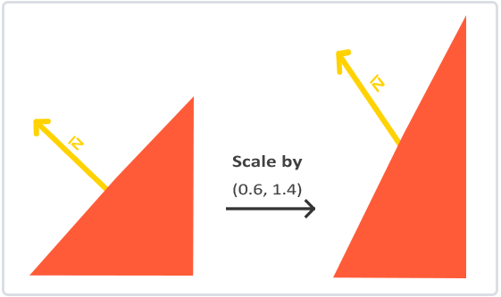

每当我们应用一个不等比缩放时（注意：等比缩放不会破坏法线，因为法线的方向没被改变，仅仅改变了法线的长度，而这很容易通过标准化来修复），法向量就不会再垂直于对应的表面了，这样光照就会被破坏。

修复这个行为的诀窍是使用一个为法向量专门定制的模型矩阵。这个矩阵称之为法线矩阵(Normal Matrix)，它使用了一些线性代数的操作来移除对法向量错误缩放的影响。如果你想知道这个矩阵是如何计算出来的，建议去阅读这个[文章](http://www.lighthouse3d.com/tutorials/glsl-tutorial/the-normal-matrix/)。

法线矩阵被定义为「模型矩阵左上角的逆矩阵的转置矩阵」。真是拗口，如果你不明白这是什么意思，别担心，我们还没有讨论逆矩阵(Inverse Matrix)和转置矩阵(Transpose Matrix)。注意，大部分的资源都会将法线矩阵定义为应用到模型-观察矩阵(Model-view Matrix)上的操作，但是由于我们只在世界空间中进行操作（不是在观察空间），我们只使用模型矩阵。

在顶点着色器中，我们可以使用inverse和transpose函数自己生成这个法线矩阵，这两个函数对所有类型矩阵都有效。注意我们还要把被处理过的矩阵强制转换为3×3矩阵，来保证它失去了位移属性以及能够乘以`vec3`的法向量。

```glsl
Normal = mat3(transpose(inverse(model))) * aNormal;
```

在漫反射光照部分，光照表现并没有问题，这是因为我们没有对物体本身执行任何缩放操作，所以并不是必须要使用一个法线矩阵，仅仅让模型矩阵乘以法线也可以。可是，如果你进行了不等比缩放，使用法线矩阵去乘以法向量就是必不可少的了。

`即使是对于着色器来说，逆矩阵也是一个开销比较大的运算，因此，只要可能就应该避免在着色器中进行逆矩阵运算，它们必须为你场景中的每个顶点都进行这样的处理。用作学习目这样做是可以的，但是对于一个对效率有要求的应用来说，在绘制之前你最好用CPU计算出法线矩阵，然后通过uniform把值传递给着色器（像模型矩阵一样）。`

## **8.5 镜面光照**

如果你还没被这些光照计算搞得精疲力尽，我们就再把镜面高光(Specular Highlight)加进来，这样冯氏光照才算完整。

和漫反射光照一样，镜面光照也是依据光的方向向量和物体的法向量来决定的，但是它也依赖于观察方向，例如玩家是从什么方向看着这个片段的。镜面光照是基于光的反射特性。如果我们想象物体表面像一面镜子一样，那么，无论我们从哪里去看那个表面所反射的光，镜面光照都会达到最大化。你可以从下面的图片看到效果：

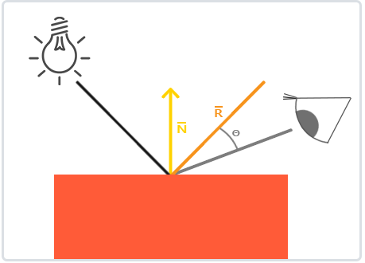

我们通过反射法向量周围光的方向来计算反射向量。然后我们计算反射向量和视线方向的角度差，如果夹角越小，那么镜面光的影响就会越大。它的作用效果就是，当我们去看光被物体所反射的那个方向的时候，我们会看到一个高光。

观察向量是镜面光照附加的一个变量，我们可以使用观察者世界空间位置和片段的位置来计算它。之后，我们计算镜面光强度，用它乘以光源的颜色，再将它加上环境光和漫反射分量。

我们选择在世界空间进行光照计算，但是大多数人趋向于在观察空间进行光照计算。在观察空间计算的好处是，观察者的位置总是(0, 0, 0)，所以这样你直接就获得了观察者位置。可是我发现在学习的时候在世界空间中计算光照更符合直觉。如果你仍然希望在观察空间计算光照的话，你需要将所有相关的向量都用观察矩阵进行变换（记得也要改变法线矩阵）。

为了得到观察者的世界空间坐标，我们简单地使用摄像机对象的位置坐标代替（它当然就是观察者）。所以我们把另一个uniform添加到片段着色器，把相应的摄像机位置坐标传给片段着色器：

```glsl
uniform vec3 viewPos;
lightingShader.setVec3("viewPos", camera.Position);
```

现在我们已经获得所有需要的变量，可以计算高光强度了。首先，我们定义一个镜面强度(Specular Intensity)变量，给镜面高光一个中等亮度颜色，让它不要产生过度的影响。

```glsl
float specularStrength = 0.5;
```

如果我们把它设置为1.0f，我们会得到一个非常亮的镜面光分量，这对于一个珊瑚色的立方体来说有点太多了。下一节教程中我们会讨论如何合理设置这些光照强度，以及它们是如何影响物体的。下一步，我们计算视线方向向量，和对应的沿着法线轴的反射向量：

```glsl
vec3 viewDir = normalize(viewPos - FragPos);
vec3 reflectDir = reflect(-lightDir, norm);
```

需要注意的是我们对`lightDir`向量进行了取反。`reflect`函数要求第一个向量是**从**光源指向片段位置的向量，但是`lightDir`当前正好相反，是从片段**指向**光源（由先前我们计算`lightDir`向量时，减法的顺序决定）。为了保证我们得到正确的`reflect`向量，我们通过对`lightDir`向量取反来获得相反的方向。第二个参数要求是一个法向量，所以我们提供的是已标准化的`norm`向量。

剩下要做的是计算镜面分量。下面的代码完成了这件事：

```glsl
float spec = pow(max(dot(viewDir, reflectDir), 0.0), 32);
vec3 specular = specularStrength * spec * lightColor;
```

我们先计算视线方向与反射方向的点乘（并确保它不是负值），然后取它的32次幂。这个32是高光的反光度(Shininess)。一个物体的反光度越高，反射光的能力越强，散射得越少，高光点就会越小。

我们不希望镜面成分过于显眼，所以我们把指数保持为32。剩下的最后一件事情是把它加到环境光分量和漫反射分量里，再用结果乘以物体的颜色：

```glsl
vec3 result = (ambient + diffuse + specular) * objectColor;
FragColor = vec4(result, 1.0);
```

我们现在为冯氏光照计算了全部的光照分量。

***

# **9. 材质**

当描述一个物体的时候，我们可以用这三个分量来定义一个材质颜色(Material Color)：环境光照(Ambient Lighting)、漫反射光照(Diffuse Lighting)和镜面光照(Specular Lighting)。通过为每个分量指定一个颜色，我们就能够对物体的颜色输出有着精细的控制了。现在，我们再添加反光度(Shininess)这个分量到上述的三个颜色中，这就有我们需要的所有材质属性了：

```glsl
#version 330 core
struct Material {
    vec3 ambient;
    vec3 diffuse;
    vec3 specular;
    float shininess;
}; 
uniform Material material;
```

在片段着色器中，我们创建一个结构体(Struct)来储存物体的材质属性。

## **9.1 设置材质**

我们在片段着色器中创建了一个材质结构体的uniform，所以下面我们希望修改一下光照的计算来顺应新的材质属性。由于所有材质变量都储存在结构体中，我们可以从uniform变量material中访问它们：

```glsl
void main()
{    
    // 环境光
    vec3 ambient = lightColor * material.ambient;

    // 漫反射 
    vec3 norm = normalize(Normal);
    vec3 lightDir = normalize(lightPos - FragPos);
    float diff = max(dot(norm, lightDir), 0.0);
    vec3 diffuse = lightColor * (diff * material.diffuse);

    // 镜面光
    vec3 viewDir = normalize(viewPos - FragPos);
    vec3 reflectDir = reflect(-lightDir, norm);  
    float spec = pow(max(dot(viewDir, reflectDir), 0.0), material.shininess);
    vec3 specular = lightColor * (spec * material.specular);  

    vec3 result = ambient + diffuse + specular;
    FragColor = vec4(result, 1.0);
}
```

可以看到，我们现在在需要的地方访问了材质结构体中的所有属性，并且这次是根据材质的颜色来计算最终的输出颜色的。物体的每个材质属性都乘上了它们对应的光照分量。

我们现在可以在程序中设置适当的uniform，对物体设置材质了。GLSL中的结构体在设置uniform时并没有什么特别之处。结构体只是作为uniform变量的一个封装，所以如果想填充这个结构体的话，我们仍需要对每个单独的uniform进行设置，但这次要带上结构体名的前缀：

```c++
lightingShader.setVec3("material.ambient",  1.0f, 0.5f, 0.31f);
lightingShader.setVec3("material.diffuse",  1.0f, 0.5f, 0.31f);
lightingShader.setVec3("material.specular", 0.5f, 0.5f, 0.5f);
lightingShader.setFloat("material.shininess", 32.0f);
```

我们将环境光和漫反射分量设置成我们想要让物体所拥有的颜色，而将镜面分量设置为一个中等亮度的颜色，我们不希望镜面分量在这个物体上过于强烈。我们将反光度保持为32。现在我们能够程序中非常容易地修改物体的材质了。

## **9.2 光的属性**

这个物体太亮了。物体过亮的原因是环境光、漫反射和镜面光这三个颜色对任何一个光源都会去全力反射。光源对环境光、漫反射和镜面光分量也具有着不同的强度。前面的教程，我们通过使用一个强度值改变环境光和镜面光强度的方式解决了这个问题。我们想做一个类似的系统，但是这次是要为每个光照分量都指定一个强度向量。如果我们假设lightColor是`vec3(1.0)`，代码会看起来像这样：

```glsl
vec3 ambient  = vec3(1.0) * material.ambient;
vec3 diffuse  = vec3(1.0) * (diff * material.diffuse);
vec3 specular = vec3(1.0) * (spec * material.specular);
```

所以物体的每个材质属性对每一个光照分量都返回了最大的强度。对单个光源来说，这些`vec3(1.0)`值同样可以分别改变，而这通常就是我们想要的。现在，物体的环境光分量完全地影响了立方体的颜色，可是环境光分量实际上不应该对最终的颜色有这么大的影响，所以我们会将光源的环境光强度设置为一个小一点的值，从而限制环境光颜色：

```
vec3 ambient = vec3(0.1) * material.ambient;
```

我们可以用同样的方式修改光源的漫反射和镜面光强度。这和我们在[上一节](https://learnopengl-cn.github.io/02 Lighting/02 Basic Lighting/)中所做的极为相似，你可以说我们已经创建了一些光照属性来影响每个单独的光照分量。我们希望为光照属性创建一个与材质结构体类似的结构体：

```glsl
struct Light {
    vec3 position;

    vec3 ambient;
    vec3 diffuse;
    vec3 specular;
};

uniform Light light;
```

一个光源对它的ambient、diffuse和specular光照有着不同的强度。环境光照通常会设置为一个比较低的强度，因为我们不希望环境光颜色太过显眼。光源的漫反射分量通常设置为光所具有的颜色，通常是一个比较明亮的白色。镜面光分量通常会保持为`vec3(1.0)`，以最大强度发光。注意我们也将光源的位置添加到了结构体中。

和材质uniform一样，我们需要更新片段着色器：

```glsl
vec3 ambient  = light.ambient * material.ambient;
vec3 diffuse  = light.diffuse * (diff * material.diffuse);
vec3 specular = light.specular * (spec * material.specular);
```

我们接下来在程序中设置光照强度：

```c++
lightingShader.setVec3("light.ambient",  0.2f, 0.2f, 0.2f);
lightingShader.setVec3("light.diffuse",  0.5f, 0.5f, 0.5f); // 将光照调暗了一些以搭配场景
lightingShader.setVec3("light.specular", 1.0f, 1.0f, 1.0f); 
```

我们可以利用sin和glfwGetTime函数改变光源的环境光和漫反射颜色，从而很容易地让光源的颜色随着时间变化：

```c++
glm::vec3 lightColor;
lightColor.x = sin(glfwGetTime() * 2.0f);
lightColor.y = sin(glfwGetTime() * 0.7f);
lightColor.z = sin(glfwGetTime() * 1.3f);

glm::vec3 diffuseColor = lightColor   * glm::vec3(0.5f); // 降低影响
glm::vec3 ambientColor = diffuseColor * glm::vec3(0.2f); // 很低的影响

lightingShader.setVec3("light.ambient", ambientColor);
lightingShader.setVec3("light.diffuse", diffuseColor);
```

***

# **10. 光照贴图**

引入**漫反射**和**镜面光**贴图(Map)。这允许我们对物体的漫反射分量（以及间接地对环境光分量，它们几乎总是一样的）和镜面光分量有着更精确的控制。

## **10.1 漫反射贴图**

我们也移除了环境光材质颜色向量，因为环境光颜色在几乎所有情况下都等于漫反射颜色，所以我们不需要将它们分开储存：

```glsl
struct Material {
    sampler2D diffuse;
    vec3      specular;
    float     shininess;
}; 
...
in vec2 TexCoords;
```

注意我们将在片段着色器中再次需要纹理坐标，所以我们声明一个额外的输入变量。接下来我们只需要从纹理中采样片段的漫反射颜色值即可：

```glsl
vec3 diffuse = light.diffuse * diff * vec3(texture(material.diffuse, TexCoords));
```

不要忘记将环境光得材质颜色设置为漫反射材质颜色同样的值。

```glsl
vec3 ambient = light.ambient * vec3(texture(material.diffuse, TexCoords));
```

这就是使用漫反射贴图的全部步骤了。你可以看到，这并不是什么新的东西，但这能够极大地提高视觉品质。为了让它正常工作，我们还需要使用纹理坐标更新顶点数据，将它们作为顶点属性传递到片段着色器，加载材质并绑定材质到合适的纹理单元。

更新后的顶点数据可以在[这里](https://learnopengl.com/code_viewer.php?code=lighting/vertex_data_textures)找到。顶点数据现在包含了顶点位置、法向量和立方体顶点处的纹理坐标。让我们更新顶点着色器来以顶点属性的形式接受纹理坐标，并将它们传递到片段着色器中：

```glsl
#version 330 core
layout (location = 0) in vec3 aPos;
layout (location = 1) in vec3 aNormal;
layout (location = 2) in vec2 aTexCoords;
...
out vec2 TexCoords;

void main()
{
    ...
    TexCoords = aTexCoords;
}
```

记得去更新两个VAO的顶点属性指针来匹配新的顶点数据，并加载箱子图像为一个纹理。在绘制箱子之前，我们希望将要用的纹理单元赋值到material.diffuse这个uniform采样器，并绑定箱子的纹理到这个纹理单元：

```c++
lightingShader.setInt("material.diffuse", 0);
...
glActiveTexture(GL_TEXTURE0);
glBindTexture(GL_TEXTURE_2D, diffuseMap);
```

***

## **10.2 镜面光贴图**

镜面高光的强度可以通过图像每个像素的亮度来获取。镜面光贴图上的每个像素都可以由一个颜色向量来表示，比如说黑色代表颜色向量`vec3(0.0)`，灰色代表颜色向量`vec3(0.5)`。在片段着色器中，我们接下来会取样对应的颜色值并将它乘以光源的镜面强度。一个像素越「白」，乘积就会越大，物体的镜面光分量就会越亮。

由于箱子大部分都由木头所组成，而且木头材质应该没有镜面高光，所以漫反射纹理的整个木头部分全部都转换成了黑色。箱子钢制边框的镜面光强度是有细微变化的，钢铁本身会比较容易受到镜面高光的影响，而裂缝则不会。

`从实际角度来说，木头其实也有镜面高光，尽管它的反光度(Shininess)很小（更多的光被散射），影响也比较小，但是为了教学目的，我们可以假设木头不会对镜面光有任何反应。`

使用**Photoshop**或**Gimp**之类的工具，将漫反射纹理转换为镜面光纹理还是比较容易的，只需要剪切掉一些部分，将图像转换为黑白的，并增加亮度/对比度就好了。

***

## **10.3 采样镜面光贴图**

镜面光贴图和其它的纹理非常类似，所以代码也和漫反射贴图的代码很类似。记得要保证正确地加载图像并生成一个纹理对象。由于我们正在同一个片段着色器中使用另一个纹理采样器，我们必须要对镜面光贴图使用一个不同的纹理单元（见[纹理](https://learnopengl-cn.github.io/01 Getting started/06 Textures/)），所以我们在渲染之前先把它绑定到合适的纹理单元上：

```c++
lightingShader.setInt("material.specular", 1);
...
glActiveTexture(GL_TEXTURE1);
glBindTexture(GL_TEXTURE_2D, specularMap);
```

接下来更新片段着色器的材质属性，让其接受一个`sampler2D`而不是`vec3`作为镜面光分量：

```glsl
struct Material {
    sampler2D diffuse;
    sampler2D specular;
    float     shininess;
};
```

最后我们希望采样镜面光贴图，来获取片段所对应的镜面光强度：

```glsl
vec3 ambient  = light.ambient  * vec3(texture(material.diffuse, TexCoords));
vec3 diffuse  = light.diffuse  * diff * vec3(texture(material.diffuse, TexCoords));  
vec3 specular = light.specular * spec * vec3(texture(material.specular, TexCoords));
FragColor = vec4(ambient + diffuse + specular, 1.0);
```

通过使用镜面光贴图我们可以可以对物体设置大量的细节，比如物体的哪些部分需要有**闪闪发光**的属性，我们甚至可以设置它们对应的强度。镜面光贴图能够在漫反射贴图之上给予我们更高一层的控制。

如果你想另辟蹊径，你也可以在镜面光贴图中使用真正的颜色，不仅设置每个片段的镜面光强度，还设置了镜面高光的颜色。从现实角度来说，镜面高光的颜色大部分（甚至全部）都是由光源本身所决定的，所以这样并不能生成非常真实的视觉效果（这也是为什么图像通常是黑白的，我们只关心强度）。

***

# **11. 投光物**

我们目前使用的光照都来自于空间中的一个点。它能给我们不错的效果，但现实世界中，我们有很多种类的光照，每种的表现都不同。将光**投射**(Cast)到物体的光源叫做投光物(Light Caster)。在这一节中，我们将会讨论几种不同类型的投光物。学会模拟不同种类的光源是又一个能够进一步丰富场景的工具。

我们首先将会讨论定向光(Directional Light)，接下来是点光源(Point Light)，它是我们之前学习的光源的拓展，最后我们将会讨论聚光(Spotlight)。

## **11.1 平行光**

当一个光源处于很远的地方时，来自光源的每条光线就会近似于互相平行。不论物体和/或者观察者的位置，看起来好像所有的光都来自于同一个方向。当我们使用一个假设光源处于**无限**远处的模型时，它就被称为定向光，因为它的所有光线都有着相同的方向，它与光源的位置是没有关系的。

因为所有的光线都是平行的，所以物体与光源的相对位置是不重要的，因为对场景中每一个物体光的方向都是一致的。由于光的位置向量保持一致，场景中每个物体的光照计算将会是类似的。

我们可以定义一个光线方向向量而不是位置向量来模拟一个定向光。着色器的计算基本保持不变，但这次我们将直接使用光的direction向量而不是通过direction来计算lightDir向量。

```glsl
struct Light {
    // vec3 position; // 使用定向光就不再需要了
    vec3 direction;

    vec3 ambient;
    vec3 diffuse;
    vec3 specular;
};
...
void main()
{
  vec3 lightDir = normalize(-light.direction);
  ...
}
```

注意我们首先对light.direction向量取反。我们目前使用的光照计算需求一个从片段**至**光源的光线方向，但人们更习惯定义定向光为一个**从**光源出发的全局方向。所以我们需要对全局光照方向向量取反来改变它的方向，它现在是一个指向光源的方向向量了。而且，记得对向量进行标准化，假设输入向量为一个单位向量是很不明智的。

最终的lightDir向量将和以前一样用在漫反射和镜面光计算中。

为了清楚地展示定向光对多个物体具有相同的影响，我们将会再次使用[坐标系统](https://learnopengl-cn.github.io/01 Getting started/08 Coordinate Systems/)章节最后的那个箱子派对的场景。如果你错过了派对，我们先定义了十个不同的箱子位置，并对每个箱子都生成了一个不同的模型矩阵，每个模型矩阵都包含了对应的局部-世界坐标变换：

```c++
for(unsigned int i = 0; i < 10; i++)
{
    glm::mat4 model;
    model = glm::translate(model, cubePositions[i]);
    float angle = 20.0f * i;
    model = glm::rotate(model, glm::radians(angle), glm::vec3(1.0f, 0.3f, 0.5f));
    lightingShader.setMat4("model", model);

    glDrawArrays(GL_TRIANGLES, 0, 36);
}
```

同时，不要忘记定义光源的方向（注意我们将方向定义为**从**光源出发的方向，你可以很容易看到光的方向朝下）。

```c++
lightingShader.setVec3("light.direction", -0.2f, -1.0f, -0.3f);
```

我们一直将光的位置和位置向量定义为`vec3`，但一些人会喜欢将所有的向量都定义为`vec4`。当我们将位置向量定义为一个`vec4`时，很重要的一点是要将w分量设置为1.0，这样变换和投影才能正确应用。然而，当我们定义一个方向向量为`vec4`的时候，我们不想让位移有任何的效果（因为它仅仅代表的是方向），所以我们将w分量设置为0.0。

方向向量就会像这样来表示：`vec4(0.2f, 1.0f, 0.3f, 0.0f)`。这也可以作为一个快速检测光照类型的工具：你可以检测w分量是否等于1.0，来检测它是否是光的位置向量；w分量等于0.0，则它是光的方向向量，这样就能根据这个来调整光照计算了：

```glsl
if(lightVector.w == 0.0) // 注意浮点数据类型的误差
  // 执行定向光照计算
else if(lightVector.w == 1.0)
  // 根据光源的位置做光照计算（与上一节一样）
```

你知道吗：这正是旧OpenGL（固定函数式）决定光源是定向光还是位置光源(Positional Light Source)的方法，并根据它来调整光照。

***

## **11.2 点光源**

定向光对于照亮整个场景的全局光源是非常棒的，但除了定向光之外我们也需要一些分散在场景中的点光源(Point Light)。点光源是处于世界中某一个位置的光源，它会朝着所有方向发光，但光线会随着距离逐渐衰减。想象作为投光物的灯泡和火把，它们都是点光源。

我们在给定位置有一个光源，它会从它的光源位置开始朝着所有方向散射光线。然而，我们定义的光源模拟的是永远不会衰减的光线，这看起来像是光源亮度非常的强。在大部分的3D模拟中，我们都希望模拟的光源仅照亮光源附近的区域而不是整个场景。

***

## **11.3 衰减**

随着光线传播距离的增长逐渐削减光的强度通常叫做衰减(Attenuation)。随距离减少光强度的一种方式是使用一个线性方程。这样的方程能够随着距离的增长线性地减少光的强度，从而让远处的物体更暗。然而，这样的线性方程通常会看起来比较假。在现实世界中，灯在近处通常会非常亮，但随着距离的增加光源的亮度一开始会下降非常快，但在远处时剩余的光强度就会下降的非常缓慢了。所以，我们需要一个不同的公式来减少光的强度。

幸运的是一些聪明的人已经帮我们解决了这个问题。下面这个公式根据片段距光源的距离计算了衰减值，之后我们会将它乘以光的强度向量：
$$
F_{att}=  \frac{1.0}{K_c+K_l*d+Kq*d^2}
$$
在这里$d$代表了片段距光源的距离。接下来为了计算衰减值，我们定义3个（可配置的）项：常数项$K_c$、一次项$K_l$和二次项$K_q$

- 常数项通常保持为1.0，它的主要作用是保证分母永远不会比1小，否则的话在某些距离上它反而会增加强度，这肯定不是我们想要的效果。
- 一次项会与距离值相乘，以线性的方式减少强度。
- 二次项会与距离的平方相乘，让光源以二次递减的方式减少强度。二次项在距离比较小的时候影响会比一次项小很多，但当距离值比较大的时候它就会比一次项更大了。

由于二次项的存在，光线会在大部分时候以线性的方式衰退，直到距离变得足够大，让二次项超过一次项，光的强度会以更快的速度下降。这样的结果就是，光在近距离时亮度很高，但随着距离变远亮度迅速降低，最后会以更慢的速度减少亮度。下面这张图显示了在100的距离内衰减的效果：

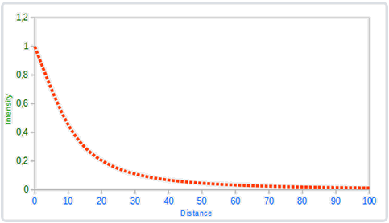

你可以看到光在近距离的时候有着最高的强度，但随着距离增长，它的强度明显减弱，并缓慢地在距离大约100的时候强度接近0。这正是我们想要的。

| 距离 | 常数项 | 一次项 |  二次项  |
| :--: | :----: | :----: | :------: |
|  7   |  1.0   |  0.7   |   1.8    |
|  13  |  1.0   |  0.35  |   0.44   |
|  20  |  1.0   |  0.22  |   0.20   |
|  32  |  1.0   |  0.14  |   0.07   |
|  50  |  1.0   |  0.09  |  0.032   |
|  65  |  1.0   |  0.07  |  0.017   |
| 100  |  1.0   | 0.045  |  0.0075  |
| 160  |  1.0   | 0.027  |  0.0028  |
| 200  |  1.0   | 0.022  |  0.0019  |
| 325  |  1.0   | 0.014  |  0.0007  |
| 600  |  1.0   | 0.007  |  0.0002  |
| 3250 |  1.0   | 0.0014 | 0.000007 |

你可以看到，常数项$K_c$在所有的情况下都是1.0。一次项$K_l$为了覆盖更远的距离通常都很小，二次项$K_q$甚至更小。尝试对这些值进行实验，看看它们在你的实现中有什么效果。在我们的环境中，32到100的距离对大多数的光源都足够了。

为了实现衰减，在片段着色器中我们还需要三个额外的值：也就是公式中的常数项、一次项和二次项。它们最好储存在之前定义的Light结构体中。注意我们使用上一节中计算lightDir的方法，而不是上面**定向光**部分的。

```glsl
struct Light {
    vec3 position;  

    vec3 ambient;
    vec3 diffuse;
    vec3 specular;

    float constant;
    float linear;
    float quadratic;
};
```

然后我们将在OpenGL中设置这些项：我们希望光源能够覆盖50的距离，所以我们会使用表格中对应的常数项、一次项和二次项：

```c++
lightingShader.setFloat("light.constant",  1.0f);
lightingShader.setFloat("light.linear",    0.09f);
lightingShader.setFloat("light.quadratic", 0.032f);
```

在片段着色器中实现衰减还是比较直接的：我们根据公式计算衰减值，之后再分别乘以环境光、漫反射和镜面光分量。

我们仍需要公式中距光源的距离，还记得我们是怎么计算一个向量的长度的吗？我们可以通过获取片段和光源之间的向量差，并获取结果向量的长度作为距离项。我们可以使用GLSL内建的length函数来完成这一点：

```glsl
float distance    = length(light.position - FragPos);
float attenuation = 1.0 / (light.constant + light.linear * distance + 
                light.quadratic * (distance * distance));
```

接下来，我们将包含这个衰减值到光照计算中，将它分别乘以环境光、漫反射和镜面光颜色。

我们可以将环境光分量保持不变，让环境光照不会随着距离减少，但是如果我们使用多于一个的光源，所有的环境光分量将会开始叠加，所以在这种情况下我们也希望衰减环境光照。简单实验一下，看看什么才能在你的环境中效果最好。

```glsl
ambient  *= attenuation; 
diffuse  *= attenuation;
specular *= attenuation;
```

点光源就是一个能够配置位置和衰减的光源。它是我们光照工具箱中的又一个光照类型。

***

## **11.4 聚光**

我们要讨论的最后一种类型的光是聚光(Spotlight)。聚光是位于环境中某个位置的光源，它只朝一个特定方向而不是所有方向照射光线。这样的结果就是只有在聚光方向的特定半径内的物体才会被照亮，其它的物体都会保持黑暗。聚光很好的例子就是路灯或手电筒。

OpenGL中聚光是用一个世界空间位置、一个方向和一个切光角(Cutoff Angle)来表示的，切光角指定了聚光的半径（译注：是圆锥的半径不是距光源距离那个半径）。对于每个片段，我们会计算片段是否位于聚光的切光方向之间（也就是在锥形内），如果是的话，我们就会相应地照亮片段。下面这张图会让你明白聚光是如何工作的：

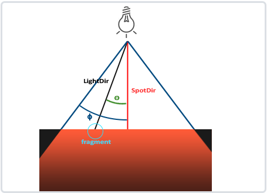

- `LightDir`：从片段指向光源的向量。
- `SpotDir`：聚光所指向的方向。
- `Phi`$\phi$：指定了聚光半径的切光角。落在这个角度之外的物体都不会被这个聚光所照亮。
- `Theta`$\theta$：LightDir向量和SpotDir向量之间的夹角。在聚光内部的话$\theta$值应该比$\phi$值小。

所以我们要做的就是计算LightDir向量和SpotDir向量之间的点积（还记得它会返回两个单位向量夹角的余弦值吗？），并将它与切光角ϕϕ值对比。你现在应该了解聚光究竟是什么了，下面我们将以手电筒的形式创建一个聚光。

***

## **11.5 手电筒**

手电筒(Flashlight)是一个位于观察者位置的聚光，通常它都会瞄准玩家视角的正前方。基本上说，手电筒就是普通的聚光，但它的位置和方向会随着玩家的位置和朝向不断更新。

所以，在片段着色器中我们需要的值有聚光的位置向量（来计算光的方向向量）、聚光的方向向量和一个切光角。我们可以将它们储存在Light结构体中：

```glsl
struct Light {
    vec3  position;
    vec3  direction;
    float cutOff;
    ...
};
```

接下来我们将合适的值传到着色器中：

```c++
lightingShader.setVec3("light.position",  camera.Position);
lightingShader.setVec3("light.direction", camera.Front);
lightingShader.setFloat("light.cutOff",   glm::cos(glm::radians(12.5f)));
```

你可以看到，我们并没有给切光角设置一个角度值，反而是用角度值计算了一个余弦值，将余弦结果传递到片段着色器中。这样做的原因是在片段着色器中，我们会计算`LightDir`和`SpotDir`向量的点积，这个点积返回的将是一个余弦值而不是角度值，所以我们不能直接使用角度值和余弦值进行比较。为了获取角度值我们需要计算点积结果的反余弦，这是一个开销很大的计算。所以为了节约一点性能开销，我们将会计算切光角对应的余弦值，并将它的结果传入片段着色器中。由于这两个角度现在都由余弦角来表示了，我们可以直接对它们进行比较而不用进行任何开销高昂的计算。

接下来就是计算θθ值，并将它和切光角ϕϕ对比，来决定是否在聚光的内部：

```glsl
float theta = dot(lightDir, normalize(-light.direction));

if(theta > light.cutOff) 
{       
  // 执行光照计算
}
else  // 否则，使用环境光，让场景在聚光之外时不至于完全黑暗
  color = vec4(light.ambient * vec3(texture(material.diffuse, TexCoords)), 1.0);
```

我们首先计算了lightDir和取反的direction向量（取反的是因为我们想让向量指向光源而不是从光源出发）之间的点积。记住要对所有的相关向量标准化。

你可能奇怪为什么在if条件中使用的是 > 符号而不是 < 符号。theta不应该比光的切光角更小才是在聚光内部吗？这并没有错，但不要忘记角度值现在都由余弦值来表示的。一个0度的角度表示的是1.0的余弦值，而一个90度的角度表示的是0.0的余弦值，你可以在下图中看到：

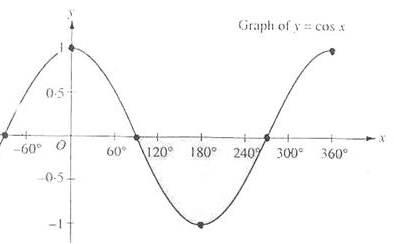

你现在可以看到，余弦值越接近1.0，它的角度就越小。这也就解释了为什么theta要比切光值更大了。切光值目前设置为12.5的余弦，约等于0.9978，所以在0.9979到1.0内的theta值才能保证片段在聚光内，从而被照亮。

***

## **11.6 平滑/软化边缘**

为了创建一种看起来边缘平滑的聚光，我们需要模拟聚光有一个内圆锥(Inner Cone)和一个外圆锥(Outer Cone)。我们可以将内圆锥设置为上一部分中的那个圆锥，但我们也需要一个外圆锥，来让光从内圆锥逐渐减暗，直到外圆锥的边界。

为了创建一个外圆锥，我们只需要再定义一个余弦值来代表聚光方向向量和外圆锥向量（等于它的半径）的夹角。然后，如果一个片段处于内外圆锥之间，将会给它计算出一个0.0到1.0之间的强度值。如果片段在内圆锥之内，它的强度就是1.0，如果在外圆锥之外强度值就是0.0。

我们可以用下面这个公式来计算这个值：
$$
I=\frac{\theta-\upsilon}{\xi}
$$
这里$\xi$(Epsilon)是内（$\phi$）和外圆锥（$γ$）之间的余弦值差（$ϵ=ϕ−γ$)。最终的$I$值就是在当前片段聚光的强度。

很难去表现这个公式是怎么工作的，所以我们用一些实例值来看看：

| $θ$   | $θ$（角度） | $ϕ$（内光切） | $ϕ$（角度） | $γ$（外光切） | $γ$（角度） | $ϵ$                    | II                            |
| :---- | :---------- | :------------ | :---------- | :------------ | :---------- | :--------------------- | :---------------------------- |
| 0.87  | 30          | 0.91          | 25          | 0.82          | 35          | 0.91 - 0.82 = 0.09     | 0.87 - 0.82 / 0.09 = 0.56     |
| 0.9   | 26          | 0.91          | 25          | 0.82          | 35          | 0.91 - 0.82 = 0.09     | 0.9 - 0.82 / 0.09 = 0.89      |
| 0.97  | 14          | 0.91          | 25          | 0.82          | 35          | 0.91 - 0.82 = 0.09     | 0.97 - 0.82 / 0.09 = 1.67     |
| 0.83  | 34          | 0.91          | 25          | 0.82          | 35          | 0.91 - 0.82 = 0.09     | 0.83 - 0.82 / 0.09 = 0.11     |
| 0.64  | 50          | 0.91          | 25          | 0.82          | 35          | 0.91 - 0.82 = 0.09     | 0.64 - 0.82 / 0.09 = -2.0     |
| 0.966 | 15          | 0.9978        | 12.5        | 0.953         | 17.5        | 0.966 - 0.953 = 0.0448 | 0.966 - 0.953 / 0.0448 = 0.29 |

你可以看到，我们基本是在内外余弦值之间根据θθ插值。如果你仍不明白发生了什么，不必担心，只需要记住这个公式就好了，在你更聪明的时候再回来看看。

我们现在有了一个在聚光外是负的，在内圆锥内大于1.0的，在边缘处于两者之间的强度值了。如果我们正确地约束(Clamp)这个值，在片段着色器中就不再需要`if-else`了，我们能够使用计算出来的强度值直接乘以光照分量：

```glsl
float theta     = dot(lightDir, normalize(-light.direction));
float epsilon   = light.cutOff - light.outerCutOff;
float intensity = clamp((theta - light.outerCutOff) / epsilon, 0.0, 1.0);    
...
// 将不对环境光做出影响，让它总是能有一点光
diffuse  *= intensity;
specular *= intensity;
...
```

注意我们使用了clamp函数，它把第一个参数约束(Clamp)在了0.0到1.0之间。这保证强度值不会在[0, 1]区间之外。

***

# **12. 多光源**

为了在场景中使用多个光源，我们希望将光照计算封装到GLSL函数中。这样做的原因是，每一种光源都需要一种不同的计算方法，而一旦我们想对多个光源进行光照计算时，代码很快就会变得非常复杂。如果我们只在main函数中进行所有的这些计算，代码很快就会变得难以理解。

GLSL中的函数和C函数很相似，它有一个函数名、一个返回值类型，如果函数不是在main函数之前声明的，我们还必须在代码文件顶部声明一个原型。我们对每个光照类型都创建一个不同的函数：定向光、点光源和聚光。

当我们在场景中使用多个光源时，通常使用以下方法：我们需要有一个单独的颜色向量代表片段的输出颜色。对于每一个光源，它对片段的贡献颜色将会加到片段的输出颜色向量上。所以场景中的每个光源都会计算它们各自对片段的影响，并结合为一个最终的输出颜色。大体的结构会像是这样：

```glsl
out vec4 FragColor;

void main()
{
  // 定义一个输出颜色值
  vec3 output;
  // 将定向光的贡献加到输出中
  output += someFunctionToCalculateDirectionalLight();
  // 对所有的点光源也做相同的事情
  for(int i = 0; i < nr_of_point_lights; i++)
    output += someFunctionToCalculatePointLight();
  // 也加上其它的光源（比如聚光）
  output += someFunctionToCalculateSpotLight();

  FragColor = vec4(output, 1.0);
}
```

实际的代码对每一种实现都可能不同，但大体的结构都是差不多的。我们定义了几个函数，用来计算每个光源的影响，并将最终的结果颜色加到输出颜色向量上。例如，如果两个光源都很靠近一个片段，那么它们所结合的贡献将会形成一个比单个光源照亮时更加明亮的片段。

## **12.1 定向光**

我么需要在片段着色器中定义一个函数来计算定向光对相应片段的贡献：它接受一些参数并计算一个定向光照颜色。

首先，我们需要定义一个定向光源最少所需要的变量。我们可以将这些变量储存在一个叫做DirLight的结构体中，并将它定义为一个uniform。

```glsl
struct DirLight {
    vec3 direction;

    vec3 ambient;
    vec3 diffuse;
    vec3 specular;
};  
uniform DirLight dirLight;
```

接下来我们可以将dirLight传入一个有着一下原型的函数。

```glsl
vec3 CalcDirLight(DirLight light, vec3 normal, vec3 viewDir);
```

和C/C++一样，如果我们想调用一个函数（这里是在main函数中调用），这个函数需要在调用者的行数之前被定义过。在这个例子中我们更喜欢在main函数以下定义函数，所以上面要求就不满足了。所以，我们需要在main函数之上定义函数的原型，这和C语言中是一样的。

你可以看到，这个函数需要一个DirLight结构体和其它两个向量来进行计算。

```glsl
vec3 CalcDirLight(DirLight light, vec3 normal, vec3 viewDir)
{
    vec3 lightDir = normalize(-light.direction);
    // 漫反射着色
    float diff = max(dot(normal, lightDir), 0.0);
    // 镜面光着色
    vec3 reflectDir = reflect(-lightDir, normal);
    float spec = pow(max(dot(viewDir, reflectDir), 0.0), material.shininess);
    // 合并结果
    vec3 ambient  = light.ambient  * vec3(texture(material.diffuse, TexCoords));
    vec3 diffuse  = light.diffuse  * diff * vec3(texture(material.diffuse, TexCoords));
    vec3 specular = light.specular * spec * vec3(texture(material.specular, TexCoords));
    return (ambient + diffuse + specular);
}
```

我们基本上只是从上一节中复制了代码，并使用函数参数的两个向量来计算定向光的贡献向量。最终环境光、漫反射和镜面光的贡献将会合并为单个颜色向量返回。

***

## **12.2 点光源**

和定向光一样，我们也希望定义一个用于计算点光源对相应片段贡献，以及衰减，的函数。同样，我们定义一个包含了点光源所需所有变量的结构体：

```glsl
struct PointLight {
    vec3 position;

    float constant;
    float linear;
    float quadratic;

    vec3 ambient;
    vec3 diffuse;
    vec3 specular;
};  
#define NR_POINT_LIGHTS 4
uniform PointLight pointLights[NR_POINT_LIGHTS];
```

你可以看到，我们在GLSL中使用了预处理指令来定义了我们场景中点光源的数量。接着我们使用了这个NR_POINT_LIGHTS常量来创建了一个PointLight结构体的数组。GLSL中的数组和C数组一样，可以使用一对方括号来创建。现在我们有四个待填充数据的PointLight结构体。

我们也可以定义**一个**大的结构体（而不是为每种类型的光源定义不同的结构体），包含**所有**不同种光照类型所需的变量，并将这个结构体用到所有的函数中，只需要忽略用不到的变量就行了。然而，我个人觉得当前的方法会更直观一点，不仅能够节省一些代码，而且由于不是所有光照类型都需要所有的变量，这样也能节省一些内存。

点光源函数的原型如下：

```glsl
vec3 CalcPointLight(PointLight light, vec3 normal, vec3 fragPos, vec3 viewDir);
```

这个函数从参数中获取所需的所有数据，并返回一个代表该点光源对片段的颜色贡献的`vec3`。我们再一次聪明地从之前的教程中复制粘贴代码，完成了下面这样的函数：

```glsl
vec3 CalcPointLight(PointLight light, vec3 normal, vec3 fragPos, vec3 viewDir)
{
    vec3 lightDir = normalize(light.position - fragPos);
    // 漫反射着色
    float diff = max(dot(normal, lightDir), 0.0);
    // 镜面光着色
    vec3 reflectDir = reflect(-lightDir, normal);
    float spec = pow(max(dot(viewDir, reflectDir), 0.0), material.shininess);
    // 衰减
    float distance    = length(light.position - fragPos);
    float attenuation = 1.0 / (light.constant + light.linear * distance + 
                 light.quadratic * (distance * distance));    
    // 合并结果
    vec3 ambient  = light.ambient  * vec3(texture(material.diffuse, TexCoords));
    vec3 diffuse  = light.diffuse  * diff * vec3(texture(material.diffuse, TexCoords));
    vec3 specular = light.specular * spec * vec3(texture(material.specular, TexCoords));
    ambient  *= attenuation;
    diffuse  *= attenuation;
    specular *= attenuation;
    return (ambient + diffuse + specular);
}
```

将这些功能抽象到这样一个函数中的优点是，我们能够不用重复的代码而很容易地计算多个点光源的光照了。在main函数中，我们只需要创建一个循环，遍历整个点光源数组，对每个点光源调用CalcPointLight就可以了。

***

## **12.3 合并结果**

现在我们已经定义了一个计算定向光的函数和一个计算点光源的函数了，我们可以将它们合并放到main函数中。

```glsl
void main()
{
    // 属性
    vec3 norm = normalize(Normal);
    vec3 viewDir = normalize(viewPos - FragPos);

    // 第一阶段：定向光照
    vec3 result = CalcDirLight(dirLight, norm, viewDir);
    // 第二阶段：点光源
    for(int i = 0; i < NR_POINT_LIGHTS; i++)
        result += CalcPointLight(pointLights[i], norm, FragPos, viewDir);    
    // 第三阶段：聚光
    //result += CalcSpotLight(spotLight, norm, FragPos, viewDir);    

    FragColor = vec4(result, 1.0);
}
```

每个光源类型都将它们的贡献加到了最终的输出颜色上，直到所有的光源都处理完了。最终的颜色包含了场景中所有光源的颜色影响所合并的结果。如果你想的话，你也可以实现一个聚光，并将它的效果加到输出颜色中。我们会将CalcSpotLight函数留给读者作为练习。

设置定向光结构体的uniform应该非常熟悉了，但是你可能会在想我们该如何设置点光源的uniform值，因为点光源的uniform现在是一个PointLight的数组了。这并不是我们以前讨论过的话题。

很幸运的是，这并不是很复杂，设置一个结构体数组的uniform和设置一个结构体的uniform是很相似的，但是这一次在访问uniform位置的时候，我们需要定义对应的数组下标值：

```glsl
lightingShader.setFloat("pointLights[0].constant", 1.0f);
```

在这里我们索引了pointLights数组中的第一个PointLight，并获取了constant变量的位置。但这也意味着不幸的是我们必须对这四个点光源手动设置uniform值，这让点光源本身就产生了28个uniform调用，非常冗长。你也可以尝试将这些抽象出去一点，定义一个点光源类，让它来为你设置uniform值，但最后你仍然要用这种方式设置所有光源的uniform值。

别忘了，我们还需要为每个点光源定义一个位置向量，所以我们让它们在场景中分散一点。我们会定义另一个`glm::vec3`数组来包含点光源的位置：

```glsl
glm::vec3 pointLightPositions[] = {
    glm::vec3( 0.7f,  0.2f,  2.0f),
    glm::vec3( 2.3f, -3.3f, -4.0f),
    glm::vec3(-4.0f,  2.0f, -12.0f),
    glm::vec3( 0.0f,  0.0f, -3.0f)
};
```

接下来我们从pointLights数组中索引对应的PointLight，将它的position值设置为刚刚定义的位置值数组中的其中一个。同时我们还要保证现在绘制的是四个灯立方体而不是仅仅一个。只要对每个灯物体创建一个不同的模型矩阵就可以了，和我们之前对箱子的处理类似。

***

# **13. 深度测试**

在**[坐标系统]**小节中，我们渲染了一个3D箱子，并且运用了深度缓冲(Depth Buffer)来防止被阻挡的面渲染到其它面的前面。在这一节中，我们将会更加深入地讨论这些储存在深度缓冲（或z缓冲(z-buffer)）中的深度值(Depth Value)，以及它们是如何确定一个片段是处于其它片段后方的。

深度缓冲就像颜色缓冲(Color Buffer)（储存所有的片段颜色：视觉输出）一样，在每个片段中储存了信息，并且（通常）和颜色缓冲有着一样的宽度和高度。深度缓冲是由窗口系统自动创建的，它会以16、24或32位float的形式储存它的深度值。在大部分的系统中，深度缓冲的精度都是24位的。

当深度测试(Depth Testing)被启用的时候，OpenGL会将一个片段的的深度值与深度缓冲的内容进行对比。OpenGL会执行一个深度测试，如果这个测试通过了的话，深度缓冲将会更新为新的深度值。如果深度测试失败了，片段将会被丢弃。

深度缓冲是在片段着色器运行之后在屏幕空间中运行的。屏幕空间坐标与通过OpenGL的glViewport所定义的视口密切相关，并且可以直接使用GLSL内建变量gl_FragCoord从片段着色器中直接访问。gl_FragCoord的x和y分量代表了片段的屏幕空间坐标（其中(0, 0)位于左下角）。gl_FragCoord中也包含了一个z分量，它包含了片段真正的深度值。z值就是需要与深度缓冲内容所对比的那个值。

现在大部分的GPU都提供一个叫做提前深度测试(Early Depth Testing)的硬件特性。提前深度测试允许深度测试在片段着色器之前运行。只要我们清楚一个片段永远不会是可见的（它在其他物体之后），我们就能提前丢弃这个片段。

片段着色器通常开销都是很大的，所以我们应该尽可能避免运行它们。当使用提前深度测试时，片段着色器的一个限制是你不能写入片段的深度值。如果一个片段着色器对它的深度值进行了写入，提前深度测试是不可能的。OpenGL不能提前知道深度值。

深度测试默认是禁用的，所以如果要启用深度测试的话，我们需要用GL_DEPTH_TEST选项来启用它：

```c++
glEnable(GL_DEPTH_TEST);
```

当它启用的时候，如果一个片段通过了深度测试的话，OpenGL会在深度缓冲中储存该片段的z值；如果没有通过深度缓冲，则会丢弃该片段。如果你启用了深度缓冲，你还应该在每个渲染迭代之前使用GL_DEPTH_BUFFER_BIT来清除深度缓冲，否则你会仍在使用上一次渲染迭代中的写入的深度值：

```c++
glClear(GL_COLOR_BUFFER_BIT | GL_DEPTH_BUFFER_BIT);
```

可以想象，在某些情况下你会需要对所有片段都执行深度测试并丢弃相应的片段，但**不**希望更新深度缓冲。基本上来说，你在使用一个只读的(Read-only)深度缓冲。OpenGL允许我们禁用深度缓冲的写入，只需要设置它的深度掩码(Depth Mask)设置为`GL_FALSE`就可以了：

```c++
glDepthMask(GL_FALSE);
```

注意这只在深度测试被启用的时候才有效果。

## **13.1 深度测试函数**

OpenGL允许我们修改深度测试中使用的比较运算符。这允许我们来控制OpenGL什么时候该通过或丢弃一个片段，什么时候去更新深度缓冲。我们可以调用glDepthFunc函数来设置比较运算符（或者说深度函数(Depth Function)）：

```c++
glDepthFunc(GL_LESS);
```

这个函数接受下面表格中的比较运算符：

| 函数        | 描述                                         |
| :---------- | :------------------------------------------- |
| GL_ALWAYS   | 永远通过深度测试                             |
| GL_NEVER    | 永远不通过深度测试                           |
| GL_LESS     | 在片段深度值小于缓冲的深度值时通过测试       |
| GL_EQUAL    | 在片段深度值等于缓冲区的深度值时通过测试     |
| GL_LEQUAL   | 在片段深度值小于等于缓冲区的深度值时通过测试 |
| GL_GREATER  | 在片段深度值大于缓冲区的深度值时通过测试     |
| GL_NOTEQUAL | 在片段深度值不等于缓冲区的深度值时通过测试   |
| GL_GEQUAL   | 在片段深度值大于等于缓冲区的深度值时通过测试 |

默认情况下使用的深度函数是GL_LESS，它将会丢弃深度值大于等于当前深度缓冲值的所有片段。

让我们看看改变深度函数会对视觉输出有什么影响。我们将使用一个新的代码配置，它会显示一个没有光照的基本场景，里面有两个有纹理的立方体，放置在一个有纹理的地板上。

在源代码中，我们将深度函数改为GL_ALWAYS：

```c++
glEnable(GL_DEPTH_TEST);
glDepthFunc(GL_ALWAYS);
```

这将会模拟我们没有启用深度测试时所得到的结果。深度测试将会永远通过，所以最后绘制的片段将会总是会渲染在之前绘制片段的上面，即使之前绘制的片段本就应该渲染在最前面。

***

## **13.2 深度值精度**

深度缓冲包含了一个介于0.0和1.0之间的深度值，它将会与观察者视角所看见的场景中所有物体的z值进行比较。观察空间的z值可能是投影平截头体的**近平面**(Near)和**远平面**(Far)之间的任何值。我们需要一种方式来将这些观察空间的z值变换到[0, 1]范围之间，其中的一种方式就是将它们线性变换到[0, 1]范围之间。下面这个（线性）方程将z值变换到了0.0到1.0之间的深度值：
$$
F_{depth}=\frac{z-near}{far-near}
$$
这里的nearnear和farfar值是我们之前提供给投影矩阵设置可视平截头体的（见[坐标系统](https://learnopengl-cn.github.io/01 Getting started/08 Coordinate Systems/)）那个 *near* 和 *far* 值。这个方程需要平截头体中的一个z值，并将它变换到了[0, 1]的范围中。z值和对应的深度值之间的关系可以在下图中看到：

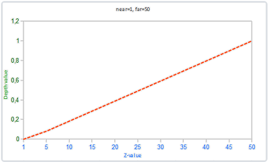

注意所有的方程都会将非常近的物体的深度值设置为接近0.0的值，而当物体非常接近远平面的时候，它的深度值会非常接近1.0。

然而，在实践中是几乎永远不会使用这样的线性深度缓冲(Linear Depth Buffer)的。要想有正确的投影性质，需要使用一个非线性的深度方程，它是与 1/z 成正比的。它做的就是在z值很小的时候提供非常高的精度，而在z值很远的时候提供更少的精度。花时间想想这个：我们真的需要对1000单位远的深度值和只有1单位远的充满细节的物体使用相同的精度吗？线性方程并不会考虑这一点。

由于非线性方程与 1/z 成正比，在1.0和2.0之间的z值将会变换至1.0到0.5之间的深度值，这就是一个float提供给我们的一半精度了，这在z值很小的情况下提供了非常大的精度。在50.0和100.0之间的z值将会只占2%的float精度，这正是我们所需要的。这样的一个考虑了远近距离的方程是这样的：

$$
F_{depth}=\frac{1/z-1/near}{1/far-1/near}
$$
如果你不知道这个方程是怎么回事也不用担心。重要的是要记住深度缓冲中的值在屏幕空间中不是线性的（在透视矩阵应用之前在观察空间中是线性的）。深度缓冲中0.5的值并不代表着物体的z值是位于平截头体的中间了，这个顶点的z值实际上非常接近近平面！你可以在下图中看到z值和最终的深度缓冲值之间的非线性关系：

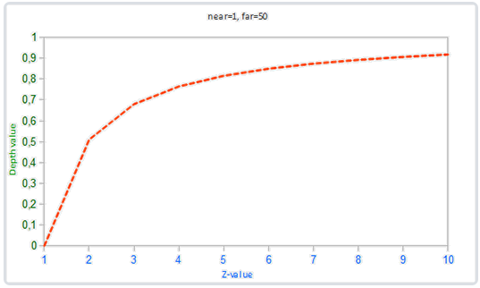

可以看到，深度值很大一部分是由很小的z值所决定的，这给了近处的物体很大的深度精度。这个（从观察者的视角）变换z值的方程是嵌入在投影矩阵中的，所以当我们想将一个顶点坐标从观察空间至裁剪空间的时候这个非线性方程就被应用了。

如果我们想要可视化深度缓冲的话，非线性方程的效果很快就会变得很清楚。

***

## **13.3 深度缓冲的可视化**

我们知道片段着色器中，内建gl_FragCoord向量的z值包含了那个特定片段的深度值。如果我们将这个深度值输出为颜色，我们可以显示场景中所有片段的深度值。我们可以根据片段的深度值返回一个颜色向量来完成这一工作：

```glsl
void main()
{
    FragColor = vec4(vec3(gl_FragCoord.z), 1.0);
}
```

如果你再次运行程序的话，你可能会注意到所有东西都是白色的，看起来就想我们所有的深度值都是最大的1.0。所以为什么没有靠近0.0（即变暗）的深度值呢？

你可能还记得在上一部分中说到，屏幕空间中的深度值是非线性的，即它在z值很小的时候有很高的精度，而z值很大的时候有较低的精度。片段的深度值会随着距离迅速增加，所以几乎所有的顶点的深度值都是接近于1.0的。如果我们小心地靠近物体，你可能会最终注意到颜色会渐渐变暗，显示它们的z值在逐渐变小。

然而，我们也可以让片段非线性的深度值变换为线性的。要实现这个，我们需要仅仅反转深度值的投影变换。这也就意味着我们需要首先将深度值从[0, 1]范围重新变换到[-1, 1]范围的标准化设备坐标（裁剪空间）。接下来我们需要像投影矩阵那样反转这个非线性方程（方程2），并将这个反转的方程应用到最终的深度值上。最终的结果就是一个线性的深度值了。听起来是可行的，对吧？

首先我们将深度值变换为NDC，不是非常困难：

```glsl
float z = depth * 2.0 - 1.0;
```

接下来使用获取到的z值，应用逆变换来获取线性的深度值：

```glsl
float linearDepth = (2.0 * near * far) / (far + near - z * (far - near));
```

这个方程是用投影矩阵推导得出的，它使用了方程2来非线性化深度值，返回一个near与far之间的深度值。这篇注重数学的[文章](http://www.songho.ca/opengl/gl_projectionmatrix.html)为感兴趣的读者详细解释了投影矩阵，它也展示了这些方程是怎么来的。

将屏幕空间中非线性的深度值变换至线性深度值的完整片段着色器如下：

```glsl
#version 330 core
out vec4 FragColor;

float near = 0.1; 
float far  = 100.0; 

float LinearizeDepth(float depth) 
{
    float z = depth * 2.0 - 1.0; // back to NDC 
    return (2.0 * near * far) / (far + near - z * (far - near));    
}

void main()
{             
    float depth = LinearizeDepth(gl_FragCoord.z) / far; // 为了演示除以 far
    FragColor = vec4(vec3(depth), 1.0);
}
```

由于线性化的深度值处于near与far之间，它的大部分值都会大于1.0并显示为完全的白色。通过在main函数中将线性深度值除以far，我们近似地将线性深度值转化到[0, 1]的范围之间。这样子我们就能逐渐看到一个片段越接近投影平截头体的远平面，它就会变得越亮，更适用于展示目的。

***

## **13.4 深度冲突**

一个很常见的视觉错误会在两个平面或者三角形非常紧密地平行排列在一起时会发生，深度缓冲没有足够的精度来决定两个形状哪个在前面。结果就是这两个形状不断地在切换前后顺序，这会导致很奇怪的花纹。这个现象叫做深度冲突(Z-fighting)，因为它看起来像是这两个形状在争夺(Fight)谁该处于顶端。

在我们一直使用的场景中，有几个地方的深度冲突还是非常明显的。箱子被放置在地板的同一高度上，这也就意味着箱子的底面和地板是共面的(Coplanar)。这两个面的深度值都是一样的，所以深度测试没有办法决定应该显示哪一个。

深度冲突是深度缓冲的一个常见问题，当物体在远处时效果会更明显（因为深度缓冲在z值比较大的时候有着更小的精度）。深度冲突不能够被完全避免，但一般会有一些技巧有助于在你的场景中减轻或者完全避免深度冲突。

- **防止深度冲突**

  第一个也是最重要的技巧是**永远不要把多个物体摆得太靠近，以至于它们的一些三角形会重叠**。通过在两个物体之间设置一个用户无法注意到的偏移值，你可以完全避免这两个物体之间的深度冲突。在箱子和地板的例子中，我们可以将箱子沿着正y轴稍微移动一点。箱子位置的这点微小改变将不太可能被注意到，但它能够完全减少深度冲突的发生。然而，这需要对每个物体都手动调整，并且需要进行彻底的测试来保证场景中没有物体会产生深度冲突。

  第二个技巧是**尽可能将近平面设置远一些**。在前面我们提到了精度在靠近**近**平面时是非常高的，所以如果我们将**近**平面远离观察者，我们将会对整个平截头体有着更大的精度。然而，将近平面设置太远将会导致近处的物体被裁剪掉，所以这通常需要实验和微调来决定最适合你的场景的**近**平面距离。

  另外一个很好的技巧是牺牲一些性能，**使用更高精度的深度缓冲**。大部分深度缓冲的精度都是24位的，但现在大部分的显卡都支持32位的深度缓冲，这将会极大地提高精度。所以，牺牲掉一些性能，你就能获得更高精度的深度测试，减少深度冲突。

***

# **14. 模板测试**

当片段着色器处理完一个片段之后，**模板测试(Stencil Test)**会开始执行，和深度测试一样，它也可能会丢弃片段。接下来，被保留的片段会进入深度测试，它可能会丢弃更多的片段。模板测试是根据又一个缓冲来进行的，它叫做模板缓冲(Stencil Buffer)，我们可以在渲染的时候更新它来获得一些很有意思的效果。

一个模板缓冲中，（通常）每个模板值(Stencil Value)是8位的。所以每个像素/片段一共能有256种不同的模板值。我们可以将这些模板值设置为我们想要的值，然后当某一个片段有某一个模板值的时候，我们就可以选择丢弃或是保留这个片段了。

每个窗口库都需要为你配置一个模板缓冲。GLFW自动做了这件事，所以我们不需要告诉GLFW来创建一个，但其它的窗口库可能不会默认给你创建一个模板库，所以记得要查看库的文档。

模板缓冲首先会被清除为0，之后在模板缓冲中使用1填充了一个空心矩形。场景中的片段将会只在片段的模板值为1的时候会被渲染（其它的都被丢弃了）。

模板缓冲操作允许我们在渲染片段时将模板缓冲设定为一个特定的值。通过在渲染时修改模板缓冲的内容，我们**写入**了模板缓冲。在同一个（或者接下来的）渲染迭代中，我们可以**读取**这些值，来决定丢弃还是保留某个片段。使用模板缓冲的时候你可以尽情发挥，但大体的步骤如下：

- 启用模板缓冲的写入。
- 渲染物体，更新模板缓冲的内容。
- 禁用模板缓冲的写入。
- 渲染（其它）物体，这次根据模板缓冲的内容丢弃特定的片段。

所以，通过使用模板缓冲，我们可以根据场景中已绘制的其它物体的片段，来决定是否丢弃特定的片段。

你可以启用GL_STENCIL_TEST来启用模板测试。在这一行代码之后，所有的渲染调用都会以某种方式影响着模板缓冲。

```c++
glEnable(GL_STENCIL_TEST);
```

注意，和颜色和深度缓冲一样，你也需要在每次迭代之前清除模板缓冲。

```c++
glClear(GL_COLOR_BUFFER_BIT | GL_DEPTH_BUFFER_BIT | GL_STENCIL_BUFFER_BIT);
```

和深度测试的glDepthMask函数一样，模板缓冲也有一个类似的函数。glStencilMask允许我们设置一个位掩码(Bitmask)，它会与将要写入缓冲的模板值进行与(AND)运算。默认情况下设置的位掩码所有位都为1，不影响输出，但如果我们将它设置为`0x00`，写入缓冲的所有模板值最后都会变成0.这与深度测试中的glDepthMask(GL_FALSE)是等价的。

```c++
glStencilMask(0xFF); // 每一位写入模板缓冲时都保持原样
glStencilMask(0x00); // 每一位在写入模板缓冲时都会变成0（禁用写入）
```

大部分情况下你都只会使用`0x00`或者`0xFF`作为模板掩码(Stencil Mask)，但是知道有选项可以设置自定义的位掩码总是好的。

***

## **14.1 模板函数**

和深度测试一样，我们对模板缓冲应该通过还是失败，以及它应该如何影响模板缓冲，也是有一定控制的。一共有两个函数能够用来配置模板测试：glStencilFunc和glStencilOp。

glStencilFunc(GLenum func, GLint ref, GLuint mask)一共包含三个参数：

- `func`：设置模板测试函数(Stencil Test Function)。这个测试函数将会应用到已储存的模板值上和glStencilFunc函数的`ref`值上。可用的选项有：GL_NEVER、GL_LESS、GL_LEQUAL、GL_GREATER、GL_GEQUAL、GL_EQUAL、GL_NOTEQUAL和GL_ALWAYS。它们的语义和深度缓冲的函数类似。
- `ref`：设置了模板测试的参考值(Reference Value)。模板缓冲的内容将会与这个值进行比较。
- `mask`：设置一个掩码，它将会与参考值和储存的模板值在测试比较它们之前进行与(AND)运算。初始情况下所有位都为1。

在一开始的那个简单的模板例子中，函数被设置为：

```c++
glStencilFunc(GL_EQUAL, 1, 0xFF)
```

这会告诉OpenGL，只要一个片段的模板值等于(`GL_EQUAL`)参考值1，片段将会通过测试并被绘制，否则会被丢弃。

但是glStencilFunc仅仅描述了OpenGL应该对模板缓冲内容做什么，而不是我们应该如何更新缓冲。这就需要glStencilOp这个函数了。

glStencilOp(GLenum sfail, GLenum dpfail, GLenum dppass)一共包含三个选项，我们能够设定每个选项应该采取的行为：

- `sfail`：模板测试失败时采取的行为。
- `dpfail`：模板测试通过，但深度测试失败时采取的行为。
- `dppass`：模板测试和深度测试都通过时采取的行为。

每个选项都可以选用以下的其中一种行为：

| 行为         | 描述                                               |
| :----------- | :------------------------------------------------- |
| GL_KEEP      | 保持当前储存的模板值                               |
| GL_ZERO      | 将模板值设置为0                                    |
| GL_REPLACE   | 将模板值设置为glStencilFunc函数设置的`ref`值       |
| GL_INCR      | 如果模板值小于最大值则将模板值加1                  |
| GL_INCR_WRAP | 与GL_INCR一样，但如果模板值超过了最大值则归零      |
| GL_DECR      | 如果模板值大于最小值则将模板值减1                  |
| GL_DECR_WRAP | 与GL_DECR一样，但如果模板值小于0则将其设置为最大值 |
| GL_INVERT    | 按位翻转当前的模板缓冲值                           |

默认情况下glStencilOp是设置为`(GL_KEEP, GL_KEEP, GL_KEEP)`的，所以不论任何测试的结果是如何，模板缓冲都会保留它的值。默认的行为不会更新模板缓冲，所以如果你想写入模板缓冲的话，你需要至少对其中一个选项设置不同的值。

所以，通过使用glStencilFunc和glStencilOp，我们可以精确地指定更新模板缓冲的时机与行为了，我们也可以指定什么时候该让模板缓冲通过，即什么时候片段需要被丢弃。

***

## **14.2 物体轮廓**

仅仅看了前面的部分你还是不太可能能够完全理解模板测试的工作原理，所以我们将会展示一个使用模板测试就可以完成的有用特性，它叫做**物体轮廓(Object Outlining)**。

物体轮廓所能做的事情正如它名字所描述的那样。我们将会为每个（或者一个）物体在它的周围创建一个很小的有色边框。当你想要在策略游戏中选中一个单位进行操作的，想要告诉玩家选中的是哪个单位的时候，这个效果就非常有用了。为物体创建轮廓的步骤如下：

1. 在绘制（需要添加轮廓的）物体之前，将模板函数设置为GL_ALWAYS，每当物体的片段被渲染时，将模板缓冲更新为1。
2. 渲染物体。
3. 禁用模板写入以及深度测试。
4. 将每个物体缩放一点点。
5. 使用一个不同的片段着色器，输出一个单独的（边框）颜色。
6. 再次绘制物体，但只在它们片段的模板值不等于1时才绘制。
7. 再次启用模板写入和深度测试。

这个过程将每个物体的片段的模板缓冲设置为1，当我们想要绘制边框的时候，我们主要绘制放大版本的物体中模板测试通过的部分，也就是物体的边框的位置。我们主要使用模板缓冲丢弃了放大版本中属于原物体片段的部分。

所以我们首先来创建一个很简单的片段着色器，它会输出一个边框颜色。我们简单地给它设置一个硬编码的颜色值，将这个着色器命名为shaderSingleColor：

```glsl
void main()
{
    FragColor = vec4(0.04, 0.28, 0.26, 1.0);
}
```

我们只想给那两个箱子加上边框，所以我们让地板不参与这个过程。我们希望首先绘制地板，再绘制两个箱子（并写入模板缓冲），之后绘制放大的箱子（并丢弃覆盖了之前绘制的箱子片段的那些片段）。

我们首先启用模板测试，并设置测试通过或失败时的行为：

```c++
glEnable(GL_STENCIL_TEST);
glStencilOp(GL_KEEP, GL_KEEP, GL_REPLACE);
```

如果其中的一个测试失败了，我们什么都不做，我们仅仅保留当前储存在模板缓冲中的值。如果模板测试和深度测试都通过了，那么我们希望将储存的模板值设置为参考值，参考值能够通过glStencilFunc来设置，我们之后会设置为1。

我们将模板缓冲清除为0，对箱子中所有绘制的片段，将模板值更新为1：

```c++
glStencilFunc(GL_ALWAYS, 1, 0xFF); // 所有的片段都应该更新模板缓冲
glStencilMask(0xFF); // 启用模板缓冲写入
normalShader.use();
DrawTwoContainers();
```

通过使用GL_ALWAYS模板测试函数，我们保证了箱子的每个片段都会将模板缓冲的模板值更新为1。因为片段永远会通过模板测试，在绘制片段的地方，模板缓冲会被更新为参考值。

现在模板缓冲在箱子被绘制的地方都更新为1了，我们将要绘制放大的箱子，但这次要禁用模板缓冲的写入：

```c++
glStencilFunc(GL_NOTEQUAL, 1, 0xFF);
glStencilMask(0x00); // 禁止模板缓冲的写入
glDisable(GL_DEPTH_TEST);
shaderSingleColor.use(); 
DrawTwoScaledUpContainers();
```

我们将模板函数设置为GL_NOTEQUAL，它会保证我们只绘制箱子上模板值不为1的部分，即只绘制箱子在之前绘制的箱子之外的部分。注意我们也禁用了深度测试，让放大的箱子，即边框，不会被地板所覆盖。

记得要在完成之后重新启用深度缓冲。

场景中物体轮廓的完整步骤会看起来像这样：

```c++
glEnable(GL_DEPTH_TEST);
glStencilOp(GL_KEEP, GL_KEEP, GL_REPLACE);  

glClear(GL_COLOR_BUFFER_BIT | GL_DEPTH_BUFFER_BIT | GL_STENCIL_BUFFER_BIT); 

glStencilMask(0x00); // 记得保证我们在绘制地板的时候不会更新模板缓冲
normalShader.use();
DrawFloor()  

glStencilFunc(GL_ALWAYS, 1, 0xFF); 
glStencilMask(0xFF); 
DrawTwoContainers();

glStencilFunc(GL_NOTEQUAL, 1, 0xFF);
glStencilMask(0x00); 
glDisable(GL_DEPTH_TEST);
shaderSingleColor.use(); 
DrawTwoScaledUpContainers();
glStencilMask(0xFF);
glEnable(GL_DEPTH_TEST);  
```

只要你理解了模板缓冲背后的大体思路，这个代码片段就不是那么难理解了。如果还是不能理解的话，尝试再次仔细阅读之前的部分，并尝试通过上面使用的范例，完全理解每个函数的功能。

***

# **15. 混合**

OpenGL中，混合(Blending)通常是实现物体透明度(Transparency)的一种技术。透明就是说一个物体（或者其中的一部分）不是纯色(Solid Color)的，它的颜色是物体本身的颜色和它背后其它物体的颜色的不同强度结合。一个有色玻璃窗是一个透明的物体，玻璃有它自己的颜色，但它最终的颜色还包含了玻璃之后所有物体的颜色。这也是混合这一名字的出处，我们混合(Blend)（不同物体的）多种颜色为一种颜色。所以透明度能让我们看穿物体。

透明的物体可以是完全透明的（让所有的颜色穿过），或者是半透明的（它让颜色通过，同时也会显示自身的颜色）。一个物体的透明度是通过它颜色的aplha值来决定的。Alpha颜色值是颜色向量的第四个分量，你可能已经看到过它很多遍了。在这个教程之前我们都将这个第四个分量设置为1.0，让这个物体的透明度为0.0，而当alpha值为0.0时物体将会是完全透明的。当alpha值为0.5时，物体的颜色有50%是来自物体自身的颜色，50%来自背后物体的颜色。

我们目前一直使用的纹理有三个颜色分量：红、绿、蓝。但一些材质会有一个内嵌的alpha通道，对每个纹素(Texel)都包含了一个alpha值。这个alpha值精确地告诉我们纹理各个部分的透明度。比如说，下面这个**[窗户纹理]**中的玻璃部分的alpha值为0.25（它在一般情况下是完全的红色，但由于它有75%的透明度，能让很大一部分的网站背景颜色穿过，让它看起来不那么红了），边框的alpha值是0.0。


我们很快就会将这个窗户纹理添加到场景中，但是首先我们需要讨论一个更简单的技术，来实现只有完全透明和完全不透明的纹理的透明度。

## **15.1 丢弃片段**

有些图片并不需要半透明，只需要根据纹理颜色值，显示一部分，或者不显示一部分，没有中间情况。比如说草，如果想不太费劲地创建草这种东西，你需要将一个草的纹理贴在一个2D四边形(Quad)上，然后将这个四边形放到场景中。然而，草的形状和2D四边形的形状并不完全相同，所以你只想显示草纹理的某些部分，而忽略剩下的部分。

下面这个纹理正是这样的，它要么是完全不透明的（alpha值为1.0），要么是完全透明的（alpha值为0.0），没有中间情况。你可以看到，只要不是草的部分，这个图片显示的都是网站的背景颜色而不是它本身的颜色。

所以当添加像草这样的植被到场景中时，我们不希望看到草的方形图像，而是只显示草的部分，并能看透图像其余的部分。我们想要丢弃(Discard)显示纹理中透明部分的片段，不将这些片段存储到颜色缓冲中。在此之前，我们还要学习如何加载一个透明的纹理。

要想加载有alpha值的纹理，我们并不需要改很多东西，`stb_image`在纹理有alpha通道的时候会自动加载，但我们仍要在纹理生成过程中告诉OpenGL，我们的纹理现在使用alpha通道了：

```c++
glTexImage2D(GL_TEXTURE_2D, 0, GL_RGBA, width, height, 0, GL_RGBA, GL_UNSIGNED_BYTE, data);
```

同样，保证你在片段着色器中获取了纹理的全部4个颜色分量，而不仅仅是RGB分量：

```glsl
void main()
{
    // FragColor = vec4(vec3(texture(texture1, TexCoords)), 1.0);
    FragColor = texture(texture1, TexCoords);
}
```

既然我们已经知道该如何加载透明的纹理了，是时候将它带入实战了，我们将会在[深度测试](https://learnopengl-cn.github.io/04 Advanced OpenGL/01 Depth testing/)小节的场景中加入几棵草。

我们会创建一个vector，向里面添加几个`glm::vec3`变量来代表草的位置：

```c++
vector<glm::vec3> vegetation;
vegetation.push_back(glm::vec3(-1.5f,  0.0f, -0.48f));
vegetation.push_back(glm::vec3( 1.5f,  0.0f,  0.51f));
vegetation.push_back(glm::vec3( 0.0f,  0.0f,  0.7f));
vegetation.push_back(glm::vec3(-0.3f,  0.0f, -2.3f));
vegetation.push_back(glm::vec3( 0.5f,  0.0f, -0.6f));
```

每个草都被渲染到了一个四边形上，贴上草的纹理。这并不能完美地表示3D的草，但这比加载复杂的模型要快多了。使用一些小技巧，比如在同一个位置加入一些旋转后的草四边形，你仍然能获得比较好的结果的。

因为草的纹理是添加到四边形对象上的，我们还需要创建另外一个VAO，填充VBO，设置正确的顶点属性指针。接下来，在绘制完地板和两个立方体后，我们将会绘制草：

```c++
glBindVertexArray(vegetationVAO);
glBindTexture(GL_TEXTURE_2D, grassTexture);  
for(unsigned int i = 0; i < vegetation.size(); i++) 
{
    model = glm::mat4(1.0f);
    model = glm::translate(model, vegetation[i]);               
    shader.setMat4("model", model);
    glDrawArrays(GL_TRIANGLES, 0, 6);
}
```

GLSL给了我们`discard`命令，一旦被调用，它就会保证片段不会被进一步处理，所以就不会进入颜色缓冲。有了这个指令，我们就能够在片段着色器中检测一个片段的alpha值是否低于某个阈值，如果是的话，则丢弃这个片段，就好像它不存在一样：

```glsl
#version 330 core
out vec4 FragColor;

in vec2 TexCoords;

uniform sampler2D texture1;

void main()
{             
    vec4 texColor = texture(texture1, TexCoords);
    if(texColor.a < 0.1)
        discard;
    FragColor = texColor;
}
```

这里，我们检测被采样的纹理颜色的alpha值是否低于0.1的阈值，如果是的话，则丢弃这个片段。片段着色器保证了它只会渲染不是（几乎）完全透明的片段。

注意，当采样纹理的边缘的时候，OpenGL会对边缘的值和纹理下一个重复的值进行插值（因为我们将它的环绕方式设置为了GL_REPEAT。这通常是没问题的，但是由于我们使用了透明值，纹理图像的顶部将会与底部边缘的纯色值进行插值。这样的结果是一个半透明的有色边框，你可能会看见它环绕着你的纹理四边形。要想避免这个，每当你alpha纹理的时候，请将纹理的环绕方式设置为GL_CLAMP_TO_EDGE：

```c++
glTexParameteri( GL_TEXTURE_2D, GL_TEXTURE_WRAP_S, GL_CLAMP_TO_EDGE);
glTexParameteri( GL_TEXTURE_2D, GL_TEXTURE_WRAP_T, GL_CLAMP_TO_EDGE);
```

***

## **15.2 混合**

虽然直接丢弃片段很好，但它不能让我们渲染半透明的图像。我们要么渲染一个片段，要么完全丢弃它。要想渲染有多个透明度级别的图像，我们需要启用混合(Blending)。和OpenGL大多数的功能一样，我们可以启用GL_BLEND来启用混合：

```c++
glEnable(GL_BLEND);
```

启用了混合之后，我们需要告诉OpenGL它该**如何**混合。

OpenGL中的混合是通过下面这个方程来实现的：
$$
\overline{C}_{result}=\overline{C}_{source}*F_{source}+\overline{C}_{destination}*F_{destination}
$$

- $\overline{C}_{source}$：源颜色向量。这是源自纹理的颜色向量。
- $\overline{C}_{destination}$：目标颜色向量。这是当前储存在颜色缓冲中的颜色向量。
- $F_{source}$：源因子值。指定了alpha值对源颜色的影响。
- $F_{destination}$：目标因子值。指定了alpha值对目标颜色的影响。

片段着色器运行完成后，并且所有的测试都通过之后，这个混合方程(Blend Equation)才会应用到片段颜色输出与当前颜色缓冲中的值（当前片段之前储存的之前片段的颜色）上。源颜色和目标颜色将会由OpenGL自动设定，但源因子和目标因子的值可以由我们来决定。我们先来看一个简单的例子：


我们有两个方形，我们希望将这个半透明的绿色方形绘制在红色方形之上。红色的方形将会是目标颜色（所以它应该先在颜色缓冲中），我们将要在这个红色方形之上绘制这个绿色方形。

问题来了：我们将因子值设置为什么？嘛，我们至少想让绿色方形乘以它的alpha值，所以我们想要将FsrcFsrc设置为源颜色向量的alpha值，也就是0.6。接下来就应该清楚了，目标方形的贡献应该为剩下的alpha值。如果绿色方形对最终颜色贡献了60%，那么红色方块应该对最终颜色贡献了40%，即`1.0 - 0.6`。所以我们将FdestinationFdestination设置为1减去源颜色向量的alpha值。这个方程变成了：
$$
\overline{C}_{result}=\left[
\matrix{
  0.0\\
  1.0\\
  0.0\\
  0.6
}\right]*0.6+\left[
\matrix{
  1.0\\
  0.0\\
  0.0\\
  1.0
}\right]*(1-0.6)
$$
结果就是重叠方形的片段包含了一个60%绿色，40%红色的一种脏兮兮的颜色：


最终的颜色将会被储存到颜色缓冲中，替代之前的颜色。

这样子很不错，但我们该如何让OpenGL使用这样的因子呢？正好有一个专门的函数，叫做glBlendFunc。

glBlendFunc(GLenum sfactor, GLenum dfactor)函数接受两个参数，来设置源和目标因子。OpenGL为我们定义了很多个选项，我们将在下面列出大部分最常用的选项。注意常数颜色向量$\overline{C}_{constant}$可以通过glBlendColor函数来另外设置。

| 选项                          | 值                                                        |
| :---------------------------- | :-------------------------------------------------------- |
| `GL_ZERO`                     | 因子等于00                                                |
| `GL_ONE`                      | 因子等于11                                                |
| `GL_SRC_COLOR`                | 因子等于源颜色向量$$\overline{C}_{constant}$$             |
| `GL_ONE_MINUS_SRC_COLOR`      | 因子等于$$1−\overline{C}_{source}$$                       |
| `GL_DST_COLOR`                | 因子等于目标颜色向量$$\overline{C}_{destination}$$        |
| `GL_ONE_MINUS_DST_COLOR`      | 因子等于$$1−\overline{C}_{destination}$$                  |
| `GL_SRC_ALPHA`                | 因子等于$$\overline{C}_{source}$$的$$alpha$$分量          |
| `GL_ONE_MINUS_SRC_ALPHA`      | 因子等于$$1−1−\overline{C}_{source}$$的$$alpha$$分量      |
| `GL_DST_ALPHA`                | 因子等于$$\overline{C}_{destination}$$的$$alpha$$分量     |
| `GL_ONE_MINUS_DST_ALPHA`      | 因子等于$$1−1−\overline{C}_{destination}$$的$$alpha$$分量 |
| `GL_CONSTANT_COLOR`           | 因子等于常数颜色向量$$\overline{C}_{constant}$$           |
| `GL_ONE_MINUS_CONSTANT_COLOR` | 因子等于$$1−\overline{C}_{constant}$$                     |
| `GL_CONSTANT_ALPHA`           | 因子等于$$\overline{C}_{constant}$$的$$alpha$$分量        |
| `GL_ONE_MINUS_CONSTANT_ALPHA` | 因子等于$$1−1− \overline{C}_{constant}$$的$$alpha$$分量   |

为了获得之前两个方形的混合结果，我们需要使用源颜色向量的$alpha$作为源因子，使用$1−alpha$作为目标因子。这将会产生以下的glBlendFunc：

```c++
glBlendFunc(GL_SRC_ALPHA, GL_ONE_MINUS_SRC_ALPHA);
```

也可以使用glBlendFuncSeparate为RGB和alpha通道分别设置不同的选项：

```c++
glBlendFuncSeparate(GL_SRC_ALPHA, GL_ONE_MINUS_SRC_ALPHA, GL_ONE, GL_ZERO);
```

这个函数和我们之前设置的那样设置了RGB分量，但这样只能让最终的alpha分量被源颜色向量的alpha值所影响到。

OpenGL甚至给了我们更多的灵活性，允许我们改变方程中源和目标部分的运算符。当前源和目标是相加的，但如果愿意的话，我们也可以让它们相减。glBlendEquation(GLenum mode)允许我们设置运算符，它提供了三个选项：

- GL_FUNC_ADD：默认选项，将两个分量相加：$\overline{C}_{result}=Src+Dst$。
- GL_FUNC_SUBTRACT：将两个分量相减： $\overline{C}_{result}=Src−Dst$。
- GL_FUNC_REVERSE_SUBTRACT：将两个分量相减，但顺序相反：$\overline{C}_{result}=Dst−Src$。

通常我们都可以省略调用glBlendEquation，因为GL_FUNC_ADD对大部分的操作来说都是我们希望的混合方程，但如果你真的想打破主流，其它的方程也可能符合你的要求。

***

## **15.3 渲染半透明纹理**

既然我们已经知道OpenGL是如何处理混合的了，是时候将我们的知识运用到实战中了，我们将会在场景中添加几个半透明的窗户。我们将使用本节开始的那个场景，但是这次不再是渲染草的纹理了，我们现在将使用本节开始时的那个[透明的窗户](https://learnopengl-cn.github.io/img/04/03/blending_transparent_window.png)纹理。

首先，在初始化时我们启用混合，并设定相应的混合函数：

```c++
glEnable(GL_BLEND);
glBlendFunc(GL_SRC_ALPHA, GL_ONE_MINUS_SRC_ALPHA);
```

由于启用了混合，我们就不需要丢弃片段了，所以我们把片段着色器还原：

```glsl
#version 330 core
out vec4 FragColor;

in vec2 TexCoords;

uniform sampler2D texture1;

void main()
{             
    FragColor = texture(texture1, TexCoords);
}
```

现在（每当OpenGL渲染了一个片段时）它都会将当前片段的颜色和当前颜色缓冲中的片段颜色根据alpha值来进行混合。

如果你仔细看的话，你可能会注意到有些不对劲。最前面窗户的透明部分遮蔽了背后的窗户？这为什么会发生呢？

发生这一现象的原因是，深度测试和混合一起使用的话会产生一些麻烦。当写入深度缓冲时，深度缓冲不会检查片段是否是透明的，所以透明的部分会和其它值一样写入到深度缓冲中。结果就是窗户的整个四边形不论透明度都会进行深度测试。即使透明的部分应该显示背后的窗户，深度测试仍然丢弃了它们。

所以我们不能随意地决定如何渲染窗户，让深度缓冲解决所有的问题了。这也是混合变得有些麻烦的部分。要想保证窗户中能够显示它们背后的窗户，我们需要首先绘制背后的这部分窗户。这也就是说在绘制的时候，我们必须先手动将窗户按照最远到最近来排序，再按照顺序渲染。

**注意，对于草这种全透明的物体，我们可以选择丢弃透明的片段而不是混合它们，这样就解决了这些头疼的问题（没有深度问题）。**

***

## **15.4 不要打乱顺序**

要想让混合在多个物体上工作，我们需要最先绘制最远的物体，最后绘制最近的物体。普通不需要混合的物体仍然可以使用深度缓冲正常绘制，所以它们不需要排序。但我们仍要保证它们在绘制（排序的）透明物体之前已经绘制完毕了。当绘制一个有不透明和透明物体的场景的时候，大体的原则如下：

1. 先绘制所有不透明的物体。
2. 对所有透明的物体排序。
3. 按顺序绘制所有透明的物体。

排序透明物体的一种方法是，从观察者视角获取物体的距离。这可以通过计算摄像机位置向量和物体的位置向量之间的距离所获得。接下来我们把距离和它对应的位置向量存储到一个STL库的map数据结构中。map会自动根据键值(Key)对它的值排序，所以只要我们添加了所有的位置，并以它的距离作为键，它们就会自动根据距离值排序了。

```c++
std::map<float, glm::vec3> sorted;
for (unsigned int i = 0; i < windows.size(); i++)
{
    float distance = glm::length(camera.Position - windows[i]);
    sorted[distance] = windows[i];
}
```

结果就是一个排序后的容器对象，它根据distance键值从低到高储存了每个窗户的位置。

之后，这次在渲染的时候，我们将以逆序（从远到近）从map中获取值，之后以正确的顺序绘制对应的窗户：

```c++
for(std::map<float,glm::vec3>::reverse_iterator it = sorted.rbegin(); it != sorted.rend(); ++it) 
{
    model = glm::mat4();
    model = glm::translate(model, it->second);              
    shader.setMat4("model", model);
    glDrawArrays(GL_TRIANGLES, 0, 6);
}
```

我们使用了map的一个反向迭代器(Reverse Iterator)，反向遍历其中的条目，并将每个窗户四边形位移到对应的窗户位置上。

虽然按照距离排序物体这种方法对我们这个场景能够正常工作，但它并没有考虑旋转、缩放或者其它的变换，奇怪形状的物体需要一个不同的计量，而不是仅仅一个位置向量。

在场景中排序物体是一个很困难的技术，很大程度上由你场景的类型所决定，更别说它额外需要消耗的处理能力了。完整渲染一个包含不透明和透明物体的场景并不是那么容易。更高级的技术还有次序无关透明度(Order Independent Transparency, OIT)，但这超出本教程的范围了。现在，你还是必须要普通地混合你的物体，但如果你很小心，并且知道目前方法的限制的话，你仍然能够获得一个比较不错的混合实现。

***

# **16. 面剔除**

尝试在脑子中想象一个3D立方体，数数你从任意方向最多能同时看到几个面。如果你的想象力不是过于丰富了，你应该能得出最大的面数是3。你可以从任意位置和任意方向看向这个球体，但你永远不能看到3个以上的面。所以我们为什么要浪费时间绘制我们不能看见的那3个面呢？如果我们能够以某种方式丢弃这几个看不见的面，我们能省下超过50%的片段着色器执行数！

我说的是**超过**50%而不是50%，因为从特定角度来看的话只能看见2个甚至是1个面。在这种情况下，我们就能省下超过50%了。

这是一个很好的主意，但我们仍有一个问题需要解决：我们如何知道一个物体的某一个面不能从观察者视角看到呢？
如果我们想象任何一个闭合形状，它的每一个面都有两侧，每一侧要么**面向**用户，要么背对用户。如果我们能够只绘制**面向**观察者的面呢？

这正是面剔除(Face Culling)所做的。OpenGL能够检查所有面向(Front Facing)观察者的面，并渲染它们，而丢弃那些背向(Back Facing)的面，节省我们很多的片段着色器调用（它们的开销很大！）。但我们仍要告诉OpenGL哪些面是正向面(Front Face)，哪些面是背向面(Back Face)。OpenGL使用了一个很聪明的技巧，分析顶点数据的环绕顺序(Winding Order)。

## **16.1 环绕顺序**

当我们定义一组三角形顶点时，我们会以特定的环绕顺序来定义它们，可能是顺时针(Clockwise)的，也可能是逆时针(Counter-clockwise)的。每个三角形由3个顶点所组成，我们会从三角形中间来看，为这3个顶点设定一个环绕顺序。


可以看到，我们首先定义了顶点1，之后我们可以选择定义顶点2或者顶点3，这个选择将定义了这个三角形的环绕顺序。下面的代码展示了这点：

```c++
float vertices[] = {
    // 顺时针
    vertices[0], // 顶点1
    vertices[1], // 顶点2
    vertices[2], // 顶点3
    // 逆时针
    vertices[0], // 顶点1
    vertices[2], // 顶点3
    vertices[1]  // 顶点2  
};
```

每组组成三角形图元的三个顶点就包含了一个环绕顺序。OpenGL在渲染图元的时候将使用这个信息来决定一个三角形是一个正向三角形还是背向三角形。默认情况下，逆时针顶点所定义的三角形将会被处理为正向三角形。

当你定义顶点顺序的时候，你应该想象对应的三角形是面向你的，所以你定义的三角形从正面看去应该是逆时针的。这样定义顶点很棒的一点是，实际的环绕顺序是在光栅化阶段进行的，也就是顶点着色器运行之后。这些顶点就是从**观察者视角**所见的了。

观察者所面向的所有三角形顶点就是我们所指定的正确环绕顺序了，而立方体另一面的三角形顶点则是以相反的环绕顺序所渲染的。这样的结果就是，我们所面向的三角形将会是正向三角形，而背面的三角形则是背向三角形。下面这张图显示了这个效果：


在顶点数据中，我们将两个三角形都以逆时针顺序定义（正面的三角形是1、2、3，背面的三角形也是1、2、3（如果我们从正面看这个三角形的话））。然而，如果从观察者当前视角使用1、2、3的顺序来绘制的话，从观察者的方向来看，背面的三角形将会是以顺时针顺序渲染的。虽然背面的三角形是以逆时针定义的，它现在是以顺时针顺序渲染的了。这正是我们想要剔除（Cull，丢弃）的不可见面了！

在顶点数据中，我们定义的是两个逆时针顺序的三角形。然而，从观察者的方面看，后面的三角形是顺时针的，如果我们仍以1、2、3的顺序以观察者当面的视野看的话。即使我们以逆时针顺序定义后面的三角形，它现在还是变为顺时针。它正是我们打算剔除（丢弃）的不可见的面！

***

## **16.2 面剔除**

在本节的开头我们就说过，OpenGL能够丢弃那些渲染为背向三角形的三角形图元。既然已经知道如何设置顶点的环绕顺序了，我们就可以使用OpenGL的面剔除选项了，它默认是禁用状态的。

在之前教程中使用的立方体顶点数据并不是按照逆时针环绕顺序定义的，所以我更新了顶点数据，来反映逆时针的环绕顺序，尝试想象这些顶点，确认在每个三角形中它们都是以逆时针定义的，这是一个很好的习惯。

要想启用面剔除，我们只需要启用OpenGL的GL_CULL_FACE选项：

```
glEnable(GL_CULL_FACE);
```

从这一句代码之后，所有背向面都将被丢弃（尝试飞进立方体内部，看看所有的内面是不是都被丢弃了）。目前我们在渲染片段的时候能够节省50%以上的性能，但注意这只对像立方体这样的封闭形状有效。当我们想要绘制[上一节](https://learnopengl-cn.github.io/04 Advanced OpenGL/03 Blending/)中的草时，我们必须要再次禁用面剔除，因为它们的正向面和背向面都应该是可见的。

OpenGL允许我们改变需要剔除的面的类型。如果我们只想剔除正向面而不是背向面会怎么样？我们可以调用glCullFace来定义这一行为：

```c++
glCullFace(GL_FRONT);
```

glCullFace函数有三个可用的选项：

- `GL_BACK`：只剔除背向面。
- `GL_FRONT`：只剔除正向面。
- `GL_FRONT_AND_BACK`：剔除正向面和背向面。

glCullFace的初始值是GL_BACK。除了需要剔除的面之外，我们也可以通过调用glFrontFace，告诉OpenGL我们希望将顺时针的面（而不是逆时针的面）定义为正向面：

```c++
glFrontFace(GL_CCW);
```

默认值是GL_CCW，它代表的是逆时针的环绕顺序，另一个选项是GL_CW，它（显然）代表的是顺时针顺序。

我们可以来做一个实验，告诉OpenGL现在顺时针顺序代表的是正向面：

```c++
glEnable(GL_CULL_FACE);
glCullFace(GL_BACK);
glFrontFace(GL_CW);
```

注意你可以仍使用默认的逆时针环绕顺序，但剔除正向面，来达到相同的效果：

```c++
glEnable(GL_CULL_FACE);
glCullFace(GL_FRONT);
```

可以看到，面剔除是一个提高OpenGL程序性能的很棒的工具。但你需要记住哪些物体能够从面剔除中获益，而哪些物体不应该被剔除。

***

# **17. 帧缓冲**

到目前为止，我们已经使用了很多屏幕缓冲了：用于写入颜色值的颜色缓冲、用于写入深度信息的深度缓冲和允许我们根据一些条件丢弃特定片段的模板缓冲。这些缓冲结合起来叫做帧缓冲(Framebuffer)，它被储存在内存中。OpenGL允许我们定义我们自己的帧缓冲，也就是说我们能够定义我们自己的颜色缓冲，甚至是深度缓冲和模板缓冲。

我们目前所做的所有操作都是在默认帧缓冲的渲染缓冲上进行的。默认的帧缓冲是在你创建窗口的时候生成和配置的（GLFW帮我们做了这些）。有了我们自己的帧缓冲，我们就能够有更多方式来渲染了。

你可能不能很快理解帧缓冲的应用，但渲染你的场景到不同的帧缓冲能够让我们在场景中加入类似镜子的东西，或者做出很酷的后期处理效果。首先我们会讨论它是如何工作的，之后我们将来实现这些炫酷的后期处理效果。

## **17.1 创建一个帧缓冲**

和OpenGL中的其它对象一样，我们会使用一个叫做glGenFramebuffers的函数来创建一个帧缓冲对象(Framebuffer Object, FBO)：

```c++
unsigned int fbo;
glGenFramebuffers(1, &fbo);
```

这种创建和使用对象的方式我们已经见过很多次了，所以它的使用函数也和其它的对象类似。首先我们创建一个帧缓冲对象，将它绑定为激活的(Active)帧缓冲，做一些操作，之后解绑帧缓冲。我们使用glBindFramebuffer来绑定帧缓冲。

```c++
glBindFramebuffer(GL_FRAMEBUFFER, fbo);
```

在绑定到GL_FRAMEBUFFER目标之后，所有的**读取**和**写入**帧缓冲的操作将会影响当前绑定的帧缓冲。我们也可以使用GL_READ_FRAMEBUFFER或GL_DRAW_FRAMEBUFFER，将一个帧缓冲分别绑定到读取目标或写入目标。绑定到GL_READ_FRAMEBUFFER的帧缓冲将会使用在所有像是glReadPixels的读取操作中，而绑定到GL_DRAW_FRAMEBUFFER的帧缓冲将会被用作渲染、清除等写入操作的目标。大部分情况你都不需要区分它们，通常都会使用GL_FRAMEBUFFER，绑定到两个上。

不幸的是，我们现在还不能使用我们的帧缓冲，因为它还不完整(Complete)，一个完整的帧缓冲需要满足以下的条件：

- 附加至少一个缓冲（颜色、深度或模板缓冲）。
- 至少有一个颜色附件(Attachment)。
- 所有的附件都必须是完整的（保留了内存）。
- 每个缓冲都应该有相同的样本数。

从上面的条件中可以知道，我们需要为帧缓冲创建一些附件，并将附件附加到帧缓冲上。在完成所有的条件之后，我们可以以GL_FRAMEBUFFER为参数调用glCheckFramebufferStatus，检查帧缓冲是否完整。它将会检测当前绑定的帧缓冲，并返回规范中值的其中之一。如果它返回的是GL_FRAMEBUFFER_COMPLETE，帧缓冲就是完整的了。

```c++
if(glCheckFramebufferStatus(GL_FRAMEBUFFER) == GL_FRAMEBUFFER_COMPLETE)
  // 执行胜利的舞蹈
```

之后所有的渲染操作将会渲染到当前绑定帧缓冲的附件中。由于我们的帧缓冲不是默认帧缓冲，渲染指令将不会对窗口的视觉输出有任何影响。出于这个原因，渲染到一个不同的帧缓冲被叫做离屏渲染(Off-screen Rendering)。要保证所有的渲染操作在主窗口中有视觉效果，我们需要再次激活默认帧缓冲，将它绑定到`0`。

```c++
glBindFramebuffer(GL_FRAMEBUFFER, 0);
```

在完成所有的帧缓冲操作之后，不要忘记删除这个帧缓冲对象：

```c++
glDeleteFramebuffers(1, &fbo);
```

在完整性检查执行之前，我们需要给帧缓冲附加一个附件。附件是一个内存位置，它能够作为帧缓冲的一个缓冲，可以将它想象为一个图像。当创建一个附件的时候我们有两个选项：纹理或渲染缓冲对象(Renderbuffer Object)。

## **17.2 纹理附件**

当把一个纹理附加到帧缓冲的时候，所有的渲染指令将会写入到这个纹理中，就想它是一个普通的颜色/深度或模板缓冲一样。使用纹理的优点是，所有渲染操作的结果将会被储存在一个纹理图像中，我们之后可以在着色器中很方便地使用它。

为帧缓冲创建一个纹理和创建一个普通的纹理差不多：

```c++
unsigned int texture;
glGenTextures(1, &texture);
glBindTexture(GL_TEXTURE_2D, texture);

glTexImage2D(GL_TEXTURE_2D, 0, GL_RGB, 800, 600, 0, GL_RGB, GL_UNSIGNED_BYTE, NULL);

glTexParameteri(GL_TEXTURE_2D, GL_TEXTURE_MIN_FILTER, GL_LINEAR);
glTexParameteri(GL_TEXTURE_2D, GL_TEXTURE_MAG_FILTER, GL_LINEAR);
```

主要的区别就是，我们将维度设置为了屏幕大小（尽管这不是必须的），并且我们给纹理的`data`参数传递了`NULL`。对于这个纹理，我们仅仅分配了内存而没有填充它。填充这个纹理将会在我们渲染到帧缓冲之后来进行。同样注意我们并不关心环绕方式或多级渐远纹理，我们在大多数情况下都不会需要它们。

如果你想将你的屏幕渲染到一个更小或更大的纹理上，你需要（在渲染到你的帧缓冲之前）再次调用glViewport，使用纹理的新维度作为参数，否则只有一小部分的纹理或屏幕会被渲染到这个纹理上。

现在我们已经创建好一个纹理了，要做的最后一件事就是将它附加到帧缓冲上了：

```c++
glFramebufferTexture2D(GL_FRAMEBUFFER, GL_COLOR_ATTACHMENT0, GL_TEXTURE_2D, texture, 0);
```

glFrameBufferTexture2D有以下的参数：

- `target`：帧缓冲的目标（绘制、读取或者两者皆有）
- `attachment`：我们想要附加的附件类型。当前我们正在附加一个颜色附件。注意最后的`0`意味着我们可以附加多个颜色附件。我们将在之后的教程中提到。
- `textarget`：你希望附加的纹理类型
- `texture`：要附加的纹理本身
- `level`：多级渐远纹理的级别。我们将它保留为0。

除了颜色附件之外，我们还可以附加一个深度和模板缓冲纹理到帧缓冲对象中。要附加深度缓冲的话，我们将附件类型设置为GL_DEPTH_ATTACHMENT。注意纹理的格式(Format)和内部格式(Internalformat)类型将变为GL_DEPTH_COMPONENT，来反映深度缓冲的储存格式。要附加模板缓冲的话，你要将第二个参数设置为GL_STENCIL_ATTACHMENT，并将纹理的格式设定为GL_STENCIL_INDEX。

也可以将深度缓冲和模板缓冲附加为一个单独的纹理。纹理的每32位数值将包含24位的深度信息和8位的模板信息。要将深度和模板缓冲附加为一个纹理的话，我们使用GL_DEPTH_STENCIL_ATTACHMENT类型，并配置纹理的格式，让它包含合并的深度和模板值。将一个深度和模板缓冲附加为一个纹理到帧缓冲的例子可以在下面找到：

```c++
glTexImage2D(
  GL_TEXTURE_2D, 0, GL_DEPTH24_STENCIL8, 800, 600, 0, 
  GL_DEPTH_STENCIL, GL_UNSIGNED_INT_24_8, NULL
);

glFramebufferTexture2D(GL_FRAMEBUFFER, GL_DEPTH_STENCIL_ATTACHMENT, GL_TEXTURE_2D, texture, 0);
```

## **17.3 渲染缓冲对象附件**

渲染缓冲对象(Renderbuffer Object)是在纹理之后引入到OpenGL中，作为一个可用的帧缓冲附件类型的，所以在过去纹理是唯一可用的附件。和纹理图像一样，渲染缓冲对象是一个真正的缓冲，即一系列的字节、整数、像素等。渲染缓冲对象附加的好处是，它会将数据储存为OpenGL原生的渲染格式，它是为离屏渲染到帧缓冲优化过的。

渲染缓冲对象直接将所有的渲染数据储存到它的缓冲中，不会做任何针对纹理格式的转换，让它变为一个更快的可写储存介质。然而，渲染缓冲对象通常都是只写的，所以你不能读取它们（比如使用纹理访问）。当然你仍然还是能够使用glReadPixels来读取它，这会从当前绑定的帧缓冲，而不是附件本身，中返回特定区域的像素。

因为它的数据已经是原生的格式了，当写入或者复制它的数据到其它缓冲中时是非常快的。所以，交换缓冲这样的操作在使用渲染缓冲对象时会非常快。我们在每个渲染迭代最后使用的glfwSwapBuffers，也可以通过渲染缓冲对象实现：只需要写入一个渲染缓冲图像，并在最后交换到另外一个渲染缓冲就可以了。渲染缓冲对象对这种操作非常完美。

创建一个渲染缓冲对象的代码和帧缓冲的代码很类似：

```c++
unsigned int rbo;
glGenRenderbuffers(1, &rbo);
```

类似，我们需要绑定这个渲染缓冲对象，让之后所有的渲染缓冲操作影响当前的rbo：

```C++
glBindRenderbuffer(GL_RENDERBUFFER, rbo);
```

由于渲染缓冲对象通常都是只写的，它们会经常用于深度和模板附件，因为大部分时间我们都不需要从深度和模板缓冲中读取值，只关心深度和模板测试。我们**需要**深度和模板值用于测试，但不需要对它们进行**采样**，所以渲染缓冲对象非常适合它们。当我们不需要从这些缓冲中采样的时候，通常都会选择渲染缓冲对象，因为它会更优化一点。

创建一个深度和模板渲染缓冲对象可以通过调用glRenderbufferStorage函数来完成：

```C++
glRenderbufferStorage(GL_RENDERBUFFER, GL_DEPTH24_STENCIL8, 800, 600);
```

创建一个渲染缓冲对象和纹理对象类似，不同的是这个对象是专门被设计作为图像使用的，而不是纹理那样的通用数据缓冲(General Purpose Data Buffer)。这里我们选择GL_DEPTH24_STENCIL8作为内部格式，它封装了24位的深度和8位的模板缓冲。

最后一件事就是附加这个渲染缓冲对象：

```C++
glFramebufferRenderbuffer(GL_FRAMEBUFFER, GL_DEPTH_STENCIL_ATTACHMENT, GL_RENDERBUFFER, rbo);
```

渲染缓冲对象能为你的帧缓冲对象提供一些优化，但知道什么时候使用渲染缓冲对象，什么时候使用纹理是很重要的。通常的规则是，如果你不需要从一个缓冲中采样数据，那么对这个缓冲使用渲染缓冲对象会是明智的选择。如果你需要从缓冲中采样颜色或深度值等数据，那么你应该选择纹理附件。性能方面它不会产生非常大的影响的。

## **17.4 渲染到纹理**

既然我们已经知道帧缓冲（大概）是怎么工作的了，是时候实践它们了。我们将会将场景渲染到一个附加到帧缓冲对象上的颜色纹理中，之后将在一个横跨整个屏幕的四边形上绘制这个纹理。这样视觉输出和没使用帧缓冲时是完全一样的，但这次是打印到了一个四边形上。这为什么很有用呢？我们会在下一部分中知道原因。

首先要创建一个帧缓冲对象，并绑定它，这些都很直观：

```C++
unsigned int framebuffer;
glGenFramebuffers(1, &framebuffer);
glBindFramebuffer(GL_FRAMEBUFFER, framebuffer);
```

接下来我们需要创建一个纹理图像，我们将它作为一个颜色附件附加到帧缓冲上。我们将纹理的维度设置为窗口的宽度和高度，并且不初始化它的数据：

```C++
// 生成纹理
unsigned int texColorBuffer;
glGenTextures(1, &texColorBuffer);
glBindTexture(GL_TEXTURE_2D, texColorBuffer);
glTexImage2D(GL_TEXTURE_2D, 0, GL_RGB, 800, 600, 0, GL_RGB, GL_UNSIGNED_BYTE, NULL);
glTexParameteri(GL_TEXTURE_2D, GL_TEXTURE_MIN_FILTER, GL_LINEAR );
glTexParameteri(GL_TEXTURE_2D, GL_TEXTURE_MAG_FILTER, GL_LINEAR);
glBindTexture(GL_TEXTURE_2D, 0);

// 将它附加到当前绑定的帧缓冲对象
glFramebufferTexture2D(GL_FRAMEBUFFER, GL_COLOR_ATTACHMENT0, GL_TEXTURE_2D, texColorBuffer, 0);  
```

我们还希望OpenGL能够进行深度测试（如果你需要的话还有模板测试），所以我们还需要添加一个深度（和模板）附件到帧缓冲中。由于我们只希望采样颜色缓冲，而不是其它的缓冲，我们可以为它们创建一个渲染缓冲对象。还记得当我们不需要采样缓冲的时候，渲染缓冲对象是更好的选择吗？

创建一个渲染缓冲对象不是非常复杂。我们需要记住的唯一事情是，我们将它创建为一个深度**和**模板附件渲染缓冲对象。我们将它的**内部**格式设置为GL_DEPTH24_STENCIL8，对我们来说这个精度已经足够了。

```C++
unsigned int rbo;
glGenRenderbuffers(1, &rbo);
glBindRenderbuffer(GL_RENDERBUFFER, rbo); 
glRenderbufferStorage(GL_RENDERBUFFER, GL_DEPTH24_STENCIL8, 800, 600);  
glBindRenderbuffer(GL_RENDERBUFFER, 0);
```

当我们为渲染缓冲对象分配了足够的内存之后，我们可以解绑这个渲染缓冲。

接下来，作为完成帧缓冲之前的最后一步，我们将渲染缓冲对象附加到帧缓冲的深度**和**模板附件上：

```C++
glFramebufferRenderbuffer(GL_FRAMEBUFFER, GL_DEPTH_STENCIL_ATTACHMENT, GL_RENDERBUFFER, rbo);
```

最后，我们希望检查帧缓冲是否是完整的，如果不是，我们将打印错误信息。

```C++
if(glCheckFramebufferStatus(GL_FRAMEBUFFER) != GL_FRAMEBUFFER_COMPLETE)
    std::cout << "ERROR::FRAMEBUFFER:: Framebuffer is not complete!" << std::endl;
glBindFramebuffer(GL_FRAMEBUFFER, 0);
```

记得要解绑帧缓冲，保证我们不会不小心渲染到错误的帧缓冲上。

现在这个帧缓冲就完整了，我们只需要绑定这个帧缓冲对象，让渲染到帧缓冲的缓冲中而不是默认的帧缓冲中。之后的渲染指令将会影响当前绑定的帧缓冲。所有的深度和模板操作都会从当前绑定的帧缓冲的深度和模板附件中（如果有的话）读取。如果你忽略了深度缓冲，那么所有的深度测试操作将不再工作，因为当前绑定的帧缓冲中不存在深度缓冲。

所以，要想绘制场景到一个纹理上，我们需要采取以下的步骤：

1. 将新的帧缓冲绑定为激活的帧缓冲，和往常一样渲染场景
2. 绑定默认的帧缓冲
3. 绘制一个横跨整个屏幕的四边形，将帧缓冲的颜色缓冲作为它的纹理。

为了绘制这个四边形，我们将会新创建一套简单的着色器。我们将不会包含任何花哨的矩阵变换，因为我们提供的是标准化设备坐标的[顶点坐标]，所以我们可以直接将它们设定为顶点着色器的输出。顶点着色器是这样的：

```glsl
#version 330 core
layout (location = 0) in vec2 aPos;
layout (location = 1) in vec2 aTexCoords;

out vec2 TexCoords;

void main()
{
    gl_Position = vec4(aPos.x, aPos.y, 0.0, 1.0); 
    TexCoords = aTexCoords;
}
```

并没有太复杂的东西。片段着色器会更加基础，我们做的唯一一件事就是从纹理中采样：

```glsl
#version 330 core
out vec4 FragColor;

in vec2 TexCoords;

uniform sampler2D screenTexture;

void main()
{ 
    FragColor = texture(screenTexture, TexCoords);
}
```

接着就靠你来为屏幕四边形创建并配置一个VAO了。帧缓冲的一个渲染迭代将会有以下的结构：

```glsl
// 第一处理阶段(Pass)
glBindFramebuffer(GL_FRAMEBUFFER, framebuffer);
glClearColor(0.1f, 0.1f, 0.1f, 1.0f);
glClear(GL_COLOR_BUFFER_BIT | GL_DEPTH_BUFFER_BIT); // 我们现在不使用模板缓冲
glEnable(GL_DEPTH_TEST);
DrawScene();    

// 第二处理阶段
glBindFramebuffer(GL_FRAMEBUFFER, 0); // 返回默认
glClearColor(1.0f, 1.0f, 1.0f, 1.0f); 
glClear(GL_COLOR_BUFFER_BIT);

screenShader.use();  
glBindVertexArray(quadVAO);
glDisable(GL_DEPTH_TEST);
glBindTexture(GL_TEXTURE_2D, textureColorbuffer);
glDrawArrays(GL_TRIANGLES, 0, 6);  
```

要注意一些事情。第一，由于我们使用的每个帧缓冲都有它自己一套缓冲，我们希望设置合适的位，调用glClear，清除这些缓冲。第二，当绘制四边形时，我们将禁用深度测试，因为我们是在绘制一个简单的四边形，并不需要关系深度测试。在绘制普通场景的时候我们将会重新启用深度测试。

所以这个有什么用处呢？因为我们能够以一个纹理图像的方式访问已渲染场景中的每个像素，我们可以在片段着色器中创建出非常有趣的效果。这些有趣效果统称为后期处理(Post-processing)效果。

## **17.5 后期处理**

既然整个场景都被渲染到了一个纹理上，我们可以简单地通过修改纹理数据创建出一些非常有意思的效果。在这一部分中，我们将会向你展示一些流行的后期处理效果，并告诉你改如何使用创造力创建你自己的效果。

让我们先从最简单的后期处理效果开始。

## **17.6 反相**

我们现在能够访问渲染输出的每个颜色，所以在（译注：屏幕的）片段着色器中返回这些颜色的反相(Inversion)并不是很难。我们将会从屏幕纹理中取颜色值，然后用1.0减去它，对它进行反相：

```glsl
void main()
{
    FragColor = vec4(vec3(1.0 - texture(screenTexture, TexCoords)), 1.0);
}
```

尽管反相是一个相对简单的后期处理效果，它已经能创造一些奇怪的效果了。

## **17.7 灰度**

另外一个很有趣的效果是，移除场景中除了黑白灰以外所有的颜色，让整个图像灰度化(Grayscale)。很简单的实现方式是，取所有的颜色分量，将它们平均化：

```glsl
void main()
{
    FragColor = texture(screenTexture, TexCoords);
    float average = (FragColor.r + FragColor.g + FragColor.b) / 3.0;
    FragColor = vec4(average, average, average, 1.0);
}
```

这已经能创造很好的结果了，但人眼会对绿色更加敏感一些，而对蓝色不那么敏感，所以为了获取物理上更精确的效果，我们需要使用加权的(Weighted)通道：

```glsl
void main()
{
    FragColor = texture(screenTexture, TexCoords);
    float average = 0.2126 * FragColor.r + 0.7152 * FragColor.g + 0.0722 * FragColor.b;
    FragColor = vec4(average, average, average, 1.0);
}
```

你可能不会立刻发现有什么差别，但在更复杂的场景中，这样的加权灰度效果会更真实一点。

## **17.8 核效果**

在一个纹理图像上做后期处理的另外一个好处是，我们可以从纹理的其它地方采样颜色值。比如说我们可以在当前纹理坐标的周围取一小块区域，对当前纹理值周围的多个纹理值进行采样。我们可以结合它们创建出很有意思的效果。

核(Kernel)（或卷积矩阵(Convolution Matrix)）是一个类矩阵的数值数组，它的中心为当前的像素，它会用它的核值乘以周围的像素值，并将结果相加变成一个值。所以，基本上我们是在对当前像素周围的纹理坐标添加一个小的偏移量，并根据核将结果合并。下面是核的一个例子：
$$
\left[
\matrix{
2&2&2\\
2&-15&2\\
2&2&2
}
\right]
$$
这个核取了8个周围像素值，将它们乘以2，而把当前的像素乘以-15。这个核的例子将周围的像素乘上了一个权重，并将当前像素乘以一个比较大的负权重来平衡结果。

你在网上找到的大部分核将所有的权重加起来之后都应该会等于1，如果它们加起来不等于1，这就意味着最终的纹理颜色将会比原纹理值更亮或者更暗了。

核是后期处理一个非常有用的工具，它们使用和实验起来都很简单，网上也能找到很多例子。我们需要稍微修改一下片段着色器，让它能够支持核。我们假设使用的核都是3x3核（实际上大部分核都是）：

```glsl
const float offset = 1.0 / 300.0;  

void main()
{
    vec2 offsets[9] = vec2[](
        vec2(-offset,  offset), // 左上
        vec2( 0.0f,    offset), // 正上
        vec2( offset,  offset), // 右上
        vec2(-offset,  0.0f),   // 左
        vec2( 0.0f,    0.0f),   // 中
        vec2( offset,  0.0f),   // 右
        vec2(-offset, -offset), // 左下
        vec2( 0.0f,   -offset), // 正下
        vec2( offset, -offset)  // 右下
    );

    float kernel[9] = float[](
        -1, -1, -1,
        -1,  9, -1,
        -1, -1, -1
    );

    vec3 sampleTex[9];
    for(int i = 0; i < 9; i++)
    {
        sampleTex[i] = vec3(texture(screenTexture, TexCoords.st + offsets[i]));
    }
    vec3 col = vec3(0.0);
    for(int i = 0; i < 9; i++)
        col += sampleTex[i] * kernel[i];

    FragColor = vec4(col, 1.0);
}
```

在片段着色器中，我们首先为周围的纹理坐标创建了一个9个`vec2`偏移量的数组。偏移量是一个常量，你可以按照你的喜好自定义它。之后我们定义一个核，在这个例子中是一个锐化(Sharpen)核，它会采样周围的所有像素，锐化每个颜色值。最后，在采样时我们将每个偏移量加到当前纹理坐标上，获取需要采样的纹理，之后将这些纹理值乘以加权的核值，并将它们加到一起。

## **17.9 模糊**

创建**模糊(Blur)**效果的核是这样的：
$$
\left[
\matrix{
1&2&1\\
2&4&2\\
1&2&1
}
\right]/16
$$


由于所有值的和是16，所以直接返回合并的采样颜色将产生非常亮的颜色，所以我们需要将核的每个值都除以16。最终的核数组将会是：

```c++
float kernel[9] = float[](
    1.0 / 16, 2.0 / 16, 1.0 / 16,
    2.0 / 16, 4.0 / 16, 2.0 / 16,
    1.0 / 16, 2.0 / 16, 1.0 / 16  
);
```

通过在片段着色器中改变核的float数组，我们完全改变了后期处理效果。

你可以看到，只要我们有了这个核的实现，创建炫酷的后期处理特效是非常容易的事。我们再来看最后一个很流行的效果来结束本节的讨论。

## **17.10 边缘检测**

下面的边缘检测(Edge-detection)核和锐化核非常相似：
$$
\left[
\matrix{
1&1&1\\
1&-8&1\\
1&1&1
}\right]
$$


这个核高亮了所有的边缘，而暗化了其它部分，在我们只关心图像的边角的时候是非常有用的。

你可能不会奇怪，像是Photoshop这样的图像修改工具/滤镜使用的也是这样的核。因为显卡处理片段的时候有着极强的并行处理能力，我们可以很轻松地在实时的情况下逐像素对图像进行处理。所以图像编辑工具在图像处理的时候会更倾向于使用显卡。

`注意，核在对屏幕纹理的边缘进行采样的时候，由于还会对中心像素周围的8个像素进行采样，其实会取到纹理之外的像素。由于环绕方式默认是GL_REPEAT，所以在没有设置的情况下取到的是屏幕另一边的像素，而另一边的像素本不应该对中心像素产生影响，这就可能会在屏幕边缘产生很奇怪的条纹。为了消除这一问题，我们可以将屏幕纹理的环绕方式都设置为GL_CLAMP_TO_EDGE。这样子在取到纹理外的像素时，就能够重复边缘的像素来更精确地估计最终的值了。`

***

# **18. 立方体贴图**

我们已经使用2D纹理很长时间了，但除此之外仍有更多的纹理类型等着我们探索。在本节中，我们将讨论的是将多个纹理组合起来映射到一张纹理上的一种纹理类型：立方体贴图(Cube Map)。

简单来说，立方体贴图就是一个包含了6个2D纹理的纹理，每个2D纹理都组成了立方体的一个面：一个有纹理的立方体。你可能会奇怪，这样一个立方体有什么用途呢？为什么要把6张纹理合并到一张纹理中，而不是直接使用6个单独的纹理呢？立方体贴图有一个非常有用的特性，它可以通过一个方向向量来进行索引/采样。假设我们有一个1x1x1的单位立方体，方向向量的原点位于它的中心。使用一个橘黄色的方向向量来从立方体贴图上采样一个纹理值会像是这样：


方向向量的大小并不重要，只要提供了方向，OpenGL就会获取方向向量（最终）所击中的纹素，并返回对应的采样纹理值。

如果我们假设将这样的立方体贴图应用到一个立方体上，采样立方体贴图所使用的方向向量将和立方体（插值的）顶点位置非常相像。这样子，只要立方体的中心位于原点，我们就能使用立方体的实际位置向量来对立方体贴图进行采样了。接下来，我们可以将所有顶点的纹理坐标当做是立方体的顶点位置。最终得到的结果就是可以访问立方体贴图上正确面(Face)纹理的一个纹理坐标。

## **18.1 创建立方体贴图**

立方体贴图是和其它纹理一样的，所以如果想创建一个立方体贴图的话，我们需要生成一个纹理，并将其绑定到纹理目标上，之后再做其它的纹理操作。这次要绑定到GL_TEXTURE_CUBE_MAP：

```c++
unsigned int textureID;
glGenTextures(1, &textureID);
glBindTexture(GL_TEXTURE_CUBE_MAP, textureID);
```

因为立方体贴图包含有6个纹理，每个面一个，我们需要调用glTexImage2D函数6次，参数和之前教程中很类似。但这一次我们将纹理目标(**target**)参数设置为立方体贴图的一个特定的面，告诉OpenGL我们在对立方体贴图的哪一个面创建纹理。这就意味着我们需要对立方体贴图的每一个面都调用一次glTexImage2D。

由于我们有6个面，OpenGL给我们提供了6个特殊的纹理目标，专门对应立方体贴图的一个面。

| 纹理目标                         | 方位 |
| :------------------------------- | :--- |
| `GL_TEXTURE_CUBE_MAP_POSITIVE_X` | 右   |
| `GL_TEXTURE_CUBE_MAP_NEGATIVE_X` | 左   |
| `GL_TEXTURE_CUBE_MAP_POSITIVE_Y` | 上   |
| `GL_TEXTURE_CUBE_MAP_NEGATIVE_Y` | 下   |
| `GL_TEXTURE_CUBE_MAP_POSITIVE_Z` | 后   |
| `GL_TEXTURE_CUBE_MAP_NEGATIVE_Z` | 前   |

和OpenGL的很多枚举(Enum)一样，它们背后的int值是线性递增的，所以如果我们有一个纹理位置的数组或者vector，我们就可以从GL_TEXTURE_CUBE_MAP_POSITIVE_X开始遍历它们，在每个迭代中对枚举值加1，遍历了整个纹理目标：

```c++
int width, height, nrChannels;
unsigned char *data;  
for(unsigned int i = 0; i < textures_faces.size(); i++)
{
    data = stbi_load(textures_faces[i].c_str(), &width, &height, &nrChannels, 0);
    glTexImage2D(
        GL_TEXTURE_CUBE_MAP_POSITIVE_X + i, 
        0, GL_RGB, width, height, 0, GL_RGB, GL_UNSIGNED_BYTE, data
    );
}
```

这里我们有一个叫做textures_faces的vector，它包含了立方体贴图所需的所有纹理路径，并以表中的顺序排列。这将为当前绑定的立方体贴图中的每个面生成一个纹理。

因为立方体贴图和其它纹理没什么不同，我们也需要设定它的环绕和过滤方式：

```c++
glTexParameteri(GL_TEXTURE_CUBE_MAP, GL_TEXTURE_MAG_FILTER, GL_LINEAR);
glTexParameteri(GL_TEXTURE_CUBE_MAP, GL_TEXTURE_MIN_FILTER, GL_LINEAR);
glTexParameteri(GL_TEXTURE_CUBE_MAP, GL_TEXTURE_WRAP_S, GL_CLAMP_TO_EDGE);
glTexParameteri(GL_TEXTURE_CUBE_MAP, GL_TEXTURE_WRAP_T, GL_CLAMP_TO_EDGE);
glTexParameteri(GL_TEXTURE_CUBE_MAP, GL_TEXTURE_WRAP_R, GL_CLAMP_TO_EDGE);
```

不要被GL_TEXTURE_WRAP_R吓到，它仅仅是为纹理的**R**坐标设置了环绕方式，它对应的是纹理的第三个维度（和位置的**z**一样）。我们将环绕方式设置为GL_CLAMP_TO_EDGE，这是因为正好处于两个面之间的纹理坐标可能不能击中一个面（由于一些硬件限制），所以通过使用GL_CLAMP_TO_EDGE，OpenGL将在我们对两个面之间采样的时候，永远返回它们的边界值。

在绘制使用立方体贴图的物体之前，我们要先激活对应的纹理单元，并绑定立方体贴图，这和普通的2D纹理没什么区别。

在片段着色器中，我们使用了一个不同类型的采样器，`samplerCube`，我们将使用texture函数使用它进行采样，但这次我们将使用一个`vec3`的方向向量而不是`vec2`。使用立方体贴图的片段着色器会像是这样的：

```glsl
in vec3 textureDir; // 代表3D纹理坐标的方向向量
uniform samplerCube cubemap; // 立方体贴图的纹理采样器

void main()
{             
    FragColor = texture(cubemap, textureDir);
}
```

看起来很棒，但为什么要用它呢？恰巧有一些很有意思的技术，使用立方体贴图来实现的话会简单多了。其中一个技术就是创建一个天空盒(Skybox)。

## **18.2 天空盒**

天空盒是一个包含了整个场景的（大）立方体，它包含周围环境的6个图像，让玩家以为他处在一个比实际大得多的环境当中。游戏中使用天空盒的例子有群山、白云或星空。下面这张截图中展示的是星空的天空盒，它来自于『上古卷轴3』：


你可能现在已经猜到了，立方体贴图能完美满足天空盒的需求：我们有一个6面的立方体，每个面都需要一个纹理。在上面的图片中，他们使用了夜空的几张图片，让玩家产生其位于广袤宇宙中的错觉，但实际上他只是在一个小小的盒子当中。

你可以在网上找到很多像这样的天空盒资源。天空盒图像通常有以下的形式：


如果你将这六个面折成一个立方体，你就会得到一个完全贴图的立方体，模拟一个巨大的场景。一些资源可能会提供了这样格式的天空盒，你必须手动提取六个面的图像，但在大部分情况下它们都是6张单独的纹理图像。

## **18.3 加载天空盒**

因为天空盒本身就是一个立方体贴图，加载天空盒和之前加载立方体贴图时并没有什么不同。为了加载天空盒，我们将使用下面的函数，它接受一个包含6个纹理路径的vector：

```c++
unsigned int loadCubemap(vector<std::string> faces)
{
    unsigned int textureID;
    glGenTextures(1, &textureID);
    glBindTexture(GL_TEXTURE_CUBE_MAP, textureID);

    int width, height, nrChannels;
    for (unsigned int i = 0; i < faces.size(); i++)
    {
        unsigned char *data = stbi_load(faces[i].c_str(), &width, &height, &nrChannels, 0);
        if (data)
        {
            glTexImage2D(GL_TEXTURE_CUBE_MAP_POSITIVE_X + i, 
                         0, GL_RGB, width, height, 0, GL_RGB, GL_UNSIGNED_BYTE, data
            );
            stbi_image_free(data);
        }
        else
        {
            std::cout << "Cubemap texture failed to load at path: " << faces[i] << std::endl;
            stbi_image_free(data);
        }
    }
    glTexParameteri(GL_TEXTURE_CUBE_MAP, GL_TEXTURE_MIN_FILTER, GL_LINEAR);
    glTexParameteri(GL_TEXTURE_CUBE_MAP, GL_TEXTURE_MAG_FILTER, GL_LINEAR);
    glTexParameteri(GL_TEXTURE_CUBE_MAP, GL_TEXTURE_WRAP_S, GL_CLAMP_TO_EDGE);
    glTexParameteri(GL_TEXTURE_CUBE_MAP, GL_TEXTURE_WRAP_T, GL_CLAMP_TO_EDGE);
    glTexParameteri(GL_TEXTURE_CUBE_MAP, GL_TEXTURE_WRAP_R, GL_CLAMP_TO_EDGE);

    return textureID;
}
```

函数本身应该很熟悉了。它基本就是上一部分中立方体贴图的代码，只不过合并到了一个便于管理的函数中。

之后，在调用这个函数之前，我们需要将合适的纹理路径按照立方体贴图枚举指定的顺序加载到一个vector中。

```c++
vector<std::string> faces
{
    "right.jpg",
    "left.jpg",
    "top.jpg",
    "bottom.jpg",
    "front.jpg",
    "back.jpg"
};
unsigned int cubemapTexture = loadCubemap(faces);
```

现在我们就将这个天空盒加载为一个立方体贴图了，它的id是cubemapTexture。我们可以将它绑定到一个立方体中，替换掉用了很长时间的难看的纯色背景。

## **18.4 显示天空盒**

由于天空盒是绘制在一个立方体上的，和其它物体一样，我们需要另一个VAO、VBO以及新的一组顶点。

用于贴图3D立方体的立方体贴图可以使用立方体的位置作为纹理坐标来采样。当立方体处于原点(0, 0, 0)时，它的每一个位置向量都是从原点出发的方向向量。这个方向向量正是获取立方体上特定位置的纹理值所需要的。正是因为这个，我们只需要提供位置向量而不用纹理坐标了。

要渲染天空盒的话，我们需要一组新的着色器，它们都不是很复杂。因为我们只有一个顶点属性，顶点着色器非常简单：

```glsl
#version 330 core
layout (location = 0) in vec3 aPos;

out vec3 TexCoords;

uniform mat4 projection;
uniform mat4 view;

void main()
{
    TexCoords = aPos;
    gl_Position = projection * view * vec4(aPos, 1.0);
}
```

注意，顶点着色器中很有意思的部分是，我们将输入的位置向量作为输出给片段着色器的纹理坐标。片段着色器会将它作为输入来采样`samplerCube`：

```glsl
#version 330 core
out vec4 FragColor;

in vec3 TexCoords;

uniform samplerCube skybox;

void main()
{    
    FragColor = texture(skybox, TexCoords);
}
```

片段着色器非常直观。我们将顶点属性的位置向量作为纹理的方向向量，并使用它从立方体贴图中采样纹理值。

有了立方体贴图纹理，渲染天空盒现在就非常简单了，我们只需要绑定立方体贴图纹理，skybox采样器就会自动填充上天空盒立方体贴图了。绘制天空盒时，我们需要将它变为场景中的第一个渲染的物体，并且禁用深度写入。这样子天空盒就会永远被绘制在其它物体的背后了。

```c++
glDepthMask(GL_FALSE);
skyboxShader.use();
// ... 设置观察和投影矩阵
glBindVertexArray(skyboxVAO);
glBindTexture(GL_TEXTURE_CUBE_MAP, cubemapTexture);
glDrawArrays(GL_TRIANGLES, 0, 36);
glDepthMask(GL_TRUE);
// ... 绘制剩下的场景
```

如果你运行一下的话你就会发现出现了一些问题。我们希望天空盒是以玩家为中心的，这样不论玩家移动了多远，天空盒都不会变近，让玩家产生周围环境非常大的印象。然而，当前的观察矩阵会旋转、缩放和位移来变换天空盒的所有位置，所以当玩家移动的时候，立方体贴图也会移动！我们希望移除观察矩阵中的位移部分，让移动不会影响天空盒的位置向量。

你可能还记得在[基础光照]小节中，我们通过取4x4矩阵左上角的3x3矩阵来移除变换矩阵的位移部分。我们可以将观察矩阵转换为3x3矩阵（移除位移），再将其转换回4x4矩阵，来达到类似的效果。

```c++
glm::mat4 view = glm::mat4(glm::mat3(camera.GetViewMatrix()));
```

这将移除任何的位移，但保留旋转变换，让玩家仍然能够环顾场景。

有了天空盒，最终的效果就是一个看起来巨大的场景了。如果你在箱子周围转一转，你就能立刻感受到距离感，极大地提升了场景的真实度。

## **18.5 优化**

目前我们是首先渲染天空盒，之后再渲染场景中的其它物体。这样子能够工作，但不是非常高效。如果我们先渲染天空盒，我们就会对屏幕上的每一个像素运行一遍片段着色器，即便只有一小部分的天空盒最终是可见的。可以使用提前深度测试(Early Depth Testing)轻松丢弃掉的片段能够节省我们很多宝贵的带宽。

所以，我们将会最后渲染天空盒，以获得轻微的性能提升。这样子的话，深度缓冲就会填充满所有物体的深度值了，我们只需要在提前深度测试通过的地方渲染天空盒的片段就可以了，很大程度上减少了片段着色器的调用。问题是，天空盒只是一个1x1x1的立方体，它很可能会不通过大部分的深度测试，导致渲染失败。不用深度测试来进行渲染不是解决方案，因为天空盒将会复写场景中的其它物体。我们需要欺骗深度缓冲，让它认为天空盒有着最大的深度值1.0，只要它前面有一个物体，深度测试就会失败。

在**[坐标系统]**小节中我们说过，**透视除法**是在顶点着色器运行之后执行的，将gl_Position的`xyz`坐标除以w分量。我们又从**[深度测试]**小节中知道，相除结果的z分量等于顶点的深度值。使用这些信息，我们可以将输出位置的z分量等于它的w分量，让z分量永远等于1.0，这样子的话，当透视除法执行之后，z分量会变为`w / w = 1.0`。

```glsl
void main()
{
    TexCoords = aPos;
    vec4 pos = projection * view * vec4(aPos, 1.0);
    gl_Position = pos.xyww;
}
```

最终的**标准化设备坐标**将永远会有一个等于1.0的z值：最大的深度值。结果就是天空盒只会在没有可见物体的地方渲染了（只有这样才能通过深度测试，其它所有的东西都在天空盒前面）。

我们还要改变一下深度函数，将它从默认的GL_LESS改为GL_LEQUAL。深度缓冲将会填充上天空盒的1.0值，所以我们需要保证天空盒在值小于或等于深度缓冲而不是小于时通过深度测试。

## **18.6 环境映射**

我们现在将整个环境映射到了一个纹理对象上了，能利用这个信息的不仅仅只有天空盒。通过使用环境的立方体贴图，我们可以给物体反射和折射的属性。这样使用环境立方体贴图的技术叫做环境映射(Environment Mapping)，其中最流行的两个是反射(Reflection)和折射(Refraction)。

## **18.7 反射**

反射这个属性表现为物体（或物体的一部分）反射它周围环境，即根据观察者的视角，物体的颜色或多或少等于它的环境。镜子就是一个反射性物体：它会根据观察者的视角反射它周围的环境。

反射的原理并不难。下面这张图展示了我们如何计算反射向量，并如何使用这个向量来从立方体贴图中采样：


我们根据观察方向向量I¯I¯和物体的法向量N¯N¯，来计算反射向量R¯R¯。我们可以使用GLSL内建的reflect函数来计算这个反射向量。最终的R¯R¯向量将会作为索引/采样立方体贴图的方向向量，返回环境的颜色值。最终的结果是物体看起来反射了天空盒。

因为我们已经在场景中配置好天空盒了，创建反射效果并不会很难。我们将会改变箱子的片段着色器，让箱子有反射性：

```glsl
#version 330 core
out vec4 FragColor;

in vec3 Normal;
in vec3 Position;

uniform vec3 cameraPos;
uniform samplerCube skybox;

void main()
{             
    vec3 I = normalize(Position - cameraPos);
    vec3 R = reflect(I, normalize(Normal));
    FragColor = vec4(texture(skybox, R).rgb, 1.0);
}
```

我们先计算了观察/摄像机方向向量`I`，并使用它来计算反射向量`R`，之后我们将使用`R`来从天空盒立方体贴图中采样。注意，我们现在又有了片段的插值Normal和Position变量，所以我们需要更新一下顶点着色器。

```glsl
#version 330 core
layout (location = 0) in vec3 aPos;
layout (location = 1) in vec3 aNormal;

out vec3 Normal;
out vec3 Position;

uniform mat4 model;
uniform mat4 view;
uniform mat4 projection;

void main()
{
    Normal = mat3(transpose(inverse(model))) * aNormal;
    Position = vec3(model * vec4(aPos, 1.0));
    gl_Position = projection * view * model * vec4(aPos, 1.0);
}
```

我们现在使用了一个法向量，所以我们将再次使用法线矩阵(Normal Matrix)来变换它们。Position输出向量是一个世界空间的位置向量。顶点着色器的这个Position输出将用来在片段着色器内计算观察方向向量。

因为我们使用了法线，你还需要更新一下顶点数据，并更新属性指针。还要记得去设置cameraPos这个uniform。

接下来，我们在渲染箱子之前先绑定立方体贴图纹理：

```c++
glBindVertexArray(cubeVAO);
glBindTexture(GL_TEXTURE_CUBE_MAP, skyboxTexture);          
glDrawArrays(GL_TRIANGLES, 0, 36);
```

编译并运行代码，你将会得到一个像是镜子一样的箱子。周围的天空盒被完美地反射在箱子上。

当反射应用到一整个物体上（像是箱子）时，这个物体看起来就像是钢或者铬这样的高反射性材质。如果我们加载[模型加载](https://learnopengl-cn.github.io/03 Model Loading/03 Model/)小节中的纳米装模型，我们会得到一种整个套装都是使用铬做成的效果：


这看起来非常棒，但在现实中大部分的模型都不具有完全反射性。我们可以引入反射贴图(Reflection Map)，来给模型更多的细节。与漫反射和镜面光贴图一样，反射贴图也是可以采样的纹理图像，它决定这片段的反射性。通过使用反射贴图，我们可以知道模型的哪些部分该以什么强度显示反射。在本节的练习中，将由你来为我们之前创建的模型加载器中引入反射贴图，显著提升纳米装模型的细节。

## **18.8 折射**

环境映射的另一种形式是折射，它和反射很相似。折射是光线由于传播介质的改变而产生的方向变化。在常见的类水表面上所产生的现象就是折射，光线不是直直地传播，而是弯曲了一点。将你的半只胳膊伸进水里，观察出来的就是这种效果。

折射是通过[斯涅尔定律](Snell's Law)来描述的，使用环境贴图的话看起来像是这样：


同样，我们有一个观察向量$\overline{I}$，一个法向量$\overline{N}$，而这次是折射向量$\overline{R}$。可以看到，观察向量的方向轻微弯曲了。弯折后的向量$\overline{R}$将会用来从立方体贴图中采样。

折射可以使用GLSL的内建refract函数来轻松实现，它需要一个法向量、一个观察方向和两个材质之间的折射率(Refractive Index)。

折射率决定了材质中光线弯曲的程度，每个材质都有自己的折射率。一些最常见的折射率可以在下表中找到：

| 材质 | 折射率 |
| :--- | :----- |
| 空气 | 1.00   |
| 水   | 1.33   |
| 冰   | 1.309  |
| 玻璃 | 1.52   |
| 钻石 | 2.42   |

我们使用这些折射率来计算光传播的两种材质间的比值。在我们的例子中，光线/视线从**空气**进入**玻璃**（如果我们假设箱子是玻璃制的），所以比值为1.001.52=0.6581.001.52=0.658。

我们已经绑定了立方体贴图，提供了顶点数据和法线，并设置了摄像机位置的uniform。唯一要修改的就是片段着色器：

```glsl
void main()
{             
    float ratio = 1.00 / 1.52;
    vec3 I = normalize(Position - cameraPos);
    vec3 R = refract(I, normalize(Normal), ratio);
    FragColor = vec4(texture(skybox, R).rgb, 1.0);
}
```

通过改变折射率，你可以创建完全不同的视觉效果。编译程序并运行，但结果并不是很有趣，因为我们只使用了一个简单的箱子，它不太能显示折射的效果，现在看起来只是有点像一个放大镜。对纳米装使用相同的着色器却能够展现出了我们期待的效果：一个类玻璃的物体。

你可以想象出有了光照、反射、折射和顶点移动的正确组合，你可以创建出非常漂亮的水。注意，如果要想获得物理上精确的结果，我们还需要在光线离开物体的时候再次折射，现在我们使用的只是单面折射(Single-side Refraction)，但它对大部分场合都是没问题的。

## **18.9 动态环境贴图**

现在我们使用的都是静态图像的组合来作为天空盒，看起来很不错，但它没有在场景中包括可移动的物体。我们一直都没有注意到这一点，因为我们只使用了一个物体。如果我们有一个镜子一样的物体，周围还有多个物体，镜子中可见的只有天空盒，看起来就像它是场景中唯一一个物体一样。

通过使用帧缓冲，我们能够为物体的6个不同角度创建出场景的纹理，并在每个渲染迭代中将它们储存到一个立方体贴图中。之后我们就可以使用这个（动态生成的）立方体贴图来创建出更真实的，包含其它物体的，反射和折射表面了。这就叫做**动态环境映射(Dynamic Environment Mapping)**，因为我们动态创建了物体周围的立方体贴图，并将其用作环境贴图。

虽然它看起来很棒，但它有一个很大的缺点：我们需要为使用环境贴图的物体渲染场景6次，这是对程序是非常大的性能开销。现代的程序通常会尽可能使用天空盒，并在可能的时候使用预编译的立方体贴图，只要它们能产生一点动态环境贴图的效果。虽然动态环境贴图是一个很棒的技术，但是要想在不降低性能的情况下让它工作还是需要非常多的技巧的。

***

# **19. 高级数据**

我们在OpenGL中大量使用缓冲来储存数据已经有很长时间了。操作缓冲其实还有更有意思的方式，而且使用纹理将大量数据传入着色器也有更有趣的方法。这一节中，我们将讨论一些更有意思的缓冲函数，以及我们该如何使用纹理对象来储存大量的数据（纹理的部分还没有完成）。

OpenGL中的缓冲只是一个管理特定内存块的对象，没有其它更多的功能了。在我们将它绑定到一个缓冲目标(Buffer Target)时，我们才赋予了其意义。当我们绑定一个缓冲到GL_ARRAY_BUFFER时，它就是一个顶点数组缓冲，但我们也可以很容易地将其绑定到GL_ELEMENT_ARRAY_BUFFER。OpenGL内部会为每个目标储存一个缓冲，并且会根据目标的不同，以不同的方式处理缓冲。

到目前为止，我们一直是调用glBufferData函数来填充缓冲对象所管理的内存，这个函数会分配一块内存，并将数据添加到这块内存中。如果我们将它的`data`参数设置为`NULL`，那么这个函数将只会分配内存，但不进行填充。这在我们需要**预留**(Reserve)特定大小的内存，之后回到这个缓冲一点一点填充的时候会很有用。

除了使用一次函数调用填充整个缓冲之外，我们也可以使用glBufferSubData，填充缓冲的特定区域。这个函数需要一个缓冲目标、一个偏移量、数据的大小和数据本身作为它的参数。这个函数不同的地方在于，我们可以提供一个偏移量，指定从**何处**开始填充这个缓冲。这能够让我们插入或者更新缓冲内存的某一部分。要注意的是，缓冲需要有足够的已分配内存，所以对一个缓冲调用glBufferSubData之前必须要先调用glBufferData。

```C++
glBufferSubData(GL_ARRAY_BUFFER, 24, sizeof(data), &data); // 范围：[24,24+sizeof(data)]
```

将数据导入缓冲的另外一种方法是，请求缓冲内存的指针，直接将数据复制到缓冲当中。通过调用glMapBuffer函数，OpenGL会返回当前绑定缓冲的内存指针，供我们操作：

```c++
float data[] = {
  0.5f, 1.0f, -0.35f
  ...
};
glBindBuffer(GL_ARRAY_BUFFER, buffer);
// 获取指针
void *ptr = glMapBuffer(GL_ARRAY_BUFFER, GL_WRITE_ONLY);
// 复制数据到内存
memcpy(ptr, data, sizeof(data));
// 记得告诉OpenGL我们不再需要这个指针了
glUnmapBuffer(GL_ARRAY_BUFFER);
```

当我们使用glUnmapBuffer函数，告诉OpenGL我们已经完成指针操作之后，OpenGL就会知道你已经完成了。在解除映射(Unmapping)之后，指针将会不再可用，并且如果OpenGL能够成功将您的数据映射到缓冲中，这个函数将会返回GL_TRUE。

如果要直接映射数据到缓冲，而不事先将其存储到临时内存中，glMapBuffer这个函数会很有用。比如说，你可以从文件中读取数据，并直接将它们复制到缓冲内存中。

## **19.1 分批顶点属性**

通过使用glVertexAttribPointer，我们能够指定顶点数组缓冲内容的属性布局。在顶点数组缓冲中，我们对属性进行了交错(Interleave)处理，也就是说，我们将每一个顶点的位置、发现和/或纹理坐标紧密放置在一起。既然我们现在已经对缓冲有了更多的了解，我们可以采取另一种方式。

我们可以做的是，将每一种属性类型的向量数据打包(Batch)为一个大的区块，而不是对它们进行交错储存。与交错布局123123123123不同，我们将采用分批(Batched)的方式111122223333。

当从文件中加载顶点数据的时候，你通常获取到的是一个位置数组、一个法线数组和/或一个纹理坐标数组。我们需要花点力气才能将这些数组转化为一个大的交错数据数组。使用分批的方式会是更简单的解决方案，我们可以很容易使用glBufferSubData函数实现：

```c++
float positions[] = { ... };
float normals[] = { ... };
float tex[] = { ... };
// 填充缓冲
glBufferSubData(GL_ARRAY_BUFFER, 0, sizeof(positions), &positions);
glBufferSubData(GL_ARRAY_BUFFER, sizeof(positions), sizeof(normals), &normals);
glBufferSubData(GL_ARRAY_BUFFER, sizeof(positions) + sizeof(normals), sizeof(tex), &tex);
```

这样子我们就能直接将属性数组作为一个整体传递给缓冲，而不需要事先处理它们了。我们仍可以将它们合并为一个大的数组，再使用glBufferData来填充缓冲，但对于这种工作，使用glBufferSubData会更合适一点。

我们还需要更新顶点属性指针来反映这些改变：

```c++
glVertexAttribPointer(0, 3, GL_FLOAT, GL_FALSE, 3 * sizeof(float), 0);  
glVertexAttribPointer(1, 3, GL_FLOAT, GL_FALSE, 3 * sizeof(float), (void*)(sizeof(positions)));  
glVertexAttribPointer(
  2, 2, GL_FLOAT, GL_FALSE, 2 * sizeof(float), (void*)(sizeof(positions) + sizeof(normals)));
```

注意`stride`参数等于顶点属性的大小，因为下一个顶点属性向量能在3个（或2个）分量之后找到。

这给了我们设置顶点属性的另一种方法。使用哪种方法都不会对OpenGL有什么立刻的好处，它只是设置顶点属性的一种更整洁的方式。具体使用的方法将完全取决于你的喜好与程序类型。

## **19.2 复制缓冲**

当你的缓冲已经填充好数据之后，你可能会想与其它的缓冲共享其中的数据，或者想要将缓冲的内容复制到另一个缓冲当中。glCopyBufferSubData能够让我们相对容易地从一个缓冲中复制数据到另一个缓冲中。这个函数的原型如下：

```c++
void glCopyBufferSubData(GLenum readtarget, GLenum writetarget, GLintptr readoffset,
                         GLintptr writeoffset, GLsizeiptr size);
```

`readtarget`和`writetarget`参数需要填入复制源和复制目标的缓冲目标。比如说，我们可以将VERTEX_ARRAY_BUFFER缓冲复制到VERTEX_ELEMENT_ARRAY_BUFFER缓冲，分别将这些缓冲目标设置为读和写的目标。当前绑定到这些缓冲目标的缓冲将会被影响到。

但如果我们想读写数据的两个不同缓冲都为顶点数组缓冲该怎么办呢？我们不能同时将两个缓冲绑定到同一个缓冲目标上。正是出于这个原因，OpenGL提供给我们另外两个缓冲目标，叫做GL_COPY_READ_BUFFER和GL_COPY_WRITE_BUFFER。我们接下来就可以将需要的缓冲绑定到这两个缓冲目标上，并将这两个目标作为`readtarget`和`writetarget`参数。

接下来glCopyBufferSubData会从`readtarget`中读取`size`大小的数据，并将其写入`writetarget`缓冲的`writeoffset`偏移量处。下面这个例子展示了如何复制两个顶点数组缓冲：

```c++
float vertexData[] = { ... };
glBindBuffer(GL_COPY_READ_BUFFER, vbo1);
glBindBuffer(GL_COPY_WRITE_BUFFER, vbo2);
glCopyBufferSubData(GL_COPY_READ_BUFFER, GL_COPY_WRITE_BUFFER, 0, 0, sizeof(vertexData));
```

我们也可以只将`writetarget`缓冲绑定为新的缓冲目标类型之一：

```c++
float vertexData[] = { ... };
glBindBuffer(GL_ARRAY_BUFFER, vbo1);
glBindBuffer(GL_COPY_WRITE_BUFFER, vbo2);
glCopyBufferSubData(GL_ARRAY_BUFFER, GL_COPY_WRITE_BUFFER, 0, 0, sizeof(vertexData));
```

有了这些关于如何操作缓冲的额外知识，我们已经能够以更有意思的方式使用它们了。当你越深入OpenGL时，这些新的缓冲方法将会变得更加有用。

***

# **20. 高级GLSL**

## **20.1 GLSL的内建变量**

着色器都是最简化的，如果需要当前着色器以外地方的数据的话，我们必须要将数据传进来。我们已经学会使用顶点属性、uniform和采样器来完成这一任务了。然而，除此之外，GLSL还定义了另外几个以`gl_`为前缀的变量，它们能提供给我们更多的方式来读取/写入数据。我们已经在前面教程中接触过其中的两个了：顶点着色器的输出向量gl_Position，和片段着色器的gl_FragCoord。

我们将会讨论几个有趣的GLSL内建输入和输出变量，并会解释它们能够怎样帮助你。注意，我们将不会讨论GLSL中存在的所有内建变量，如果你想知道所有的内建变量的话，请查看OpenGL的[wiki](http://www.opengl.org/wiki/Built-in_Variable_(GLSL))。

## **20.2 顶点着色器变量**

我们已经见过gl_Position了，它是顶点着色器的裁剪空间输出位置向量。如果你想在屏幕上显示任何东西，在顶点着色器中设置gl_Position是必须的步骤。这已经是它的全部功能了。

### **1. gl_PointSize**

我们能够选用的其中一个图元是GL_POINTS，如果使用它的话，每一个顶点都是一个图元，都会被渲染为一个点。我们可以通过OpenGL的glPointSize函数来设置渲染出来的点的大小，但我们也可以在顶点着色器中修改这个值。

GLSL定义了一个叫做gl_PointSize输出变量，它是一个float变量，你可以使用它来设置点的宽高（像素）。在顶点着色器中修改点的大小的话，你就能对每个顶点设置不同的值了。

在顶点着色器中修改点大小的功能默认是禁用的，如果你需要启用它的话，你需要启用OpenGL的GL_PROGRAM_POINT_SIZE：

```c++
glEnable(GL_PROGRAM_POINT_SIZE);
```

一个简单的例子就是将点的大小设置为裁剪空间位置的z值，也就是顶点距观察者的距离。点的大小会随着观察者距顶点距离变远而增大。

```glsl
void main()
{
    gl_Position = projection * view * model * vec4(aPos, 1.0);    
    gl_PointSize = gl_Position.z;    
}
```

### **2. gl_VertexID**

gl_Position和gl_PointSize都是**输出变量**，因为它们的值是作为顶点着色器的输出被读取的。我们可以对它们进行写入，来改变结果。顶点着色器还为我们提供了一个有趣的**输入变量**，我们只能对它进行读取，它叫做gl_VertexID。

整型变量gl_VertexID储存了正在绘制顶点的当前ID。当（使用glDrawElements）进行索引渲染的时候，这个变量会存储正在绘制顶点的当前索引。当（使用glDrawArrays）不使用索引进行绘制的时候，这个变量会储存从渲染调用开始的已处理顶点数量。

虽然现在它没有什么具体的用途，但知道我们能够访问这个信息总是好的。

***

## **20.3 片段着色器变量**

在片段着色器中，我们也能访问到一些有趣的变量。GLSL提供给我们两个有趣的输入变量：gl_FragCoord和gl_FrontFacing。

### **1. gl_FragCoord**

在讨论深度测试的时候，我们已经见过gl_FragCoord很多次了，因为gl_FragCoord的z分量等于对应片段的深度值。然而，我们也能使用它的x和y分量来实现一些有趣的效果。

gl_FragCoord的x和y分量是片段的窗口空间(Window-space)坐标，其原点为窗口的左下角。我们已经使用glViewport设定了一个800x600的窗口了，所以片段窗口空间坐标的x分量将在0到800之间，y分量在0到600之间。

通过利用片段着色器，我们可以根据片段的窗口坐标，计算出不同的颜色。gl_FragCoord的一个常见用处是用于对比不同片段计算的视觉输出效果，这在技术演示中可以经常看到。比如说，我们能够将屏幕分成两部分，在窗口的左侧渲染一种输出，在窗口的右侧渲染另一种输出。下面这个例子片段着色器会根据窗口坐标输出不同的颜色：

```glsl
void main()
{             
    if(gl_FragCoord.x < 400)
        FragColor = vec4(1.0, 0.0, 0.0, 1.0);
    else
        FragColor = vec4(0.0, 1.0, 0.0, 1.0);        
}
```

### **2. gl_FrontFacing**

片段着色器另外一个很有意思的输入变量是gl_FrontFacing。在**[面剔除]**教程中，我们提到OpenGL能够根据顶点的环绕顺序来决定一个面是正向还是背向面。如果我们不（启用GL_FACE_CULL来）使用面剔除，那么gl_FrontFacing将会告诉我们当前片段是属于正向面的一部分还是背向面的一部分。举例来说，我们能够对正向面计算出不同的颜色。

gl_FrontFacing变量是一个bool，如果当前片段是正向面的一部分那么就是`true`，否则就是`false`。比如说，我们可以这样子创建一个立方体，在内部和外部使用不同的纹理：

```glsl
#version 330 core
out vec4 FragColor;

in vec2 TexCoords;

uniform sampler2D frontTexture;
uniform sampler2D backTexture;

void main()
{             
    if(gl_FrontFacing)
        FragColor = texture(frontTexture, TexCoords);
    else
        FragColor = texture(backTexture, TexCoords);
}
```

### **3. gl_FragDepth**

输入变量gl_FragCoord能让我们读取当前片段的窗口空间坐标，并获取它的深度值，但是它是一个只读(Read-only)变量。我们不能修改片段的窗口空间坐标，但实际上修改片段的深度值还是可能的。GLSL提供给我们一个叫做gl_FragDepth的输出变量，我们可以使用它来在着色器内设置片段的深度值。

要想设置深度值，我们直接写入一个0.0到1.0之间的float值到输出变量就可以了：

```glsl
gl_FragDepth = 0.0; // 这个片段现在的深度值为 0.0
```

如果着色器没有写入值到gl_FragDepth，它会自动取用`gl_FragCoord.z`的值。

然而，由我们自己设置深度值有一个很大的缺点，只要我们在片段着色器中对gl_FragDepth进行写入，OpenGL就会（像[深度测试](https://learnopengl-cn.github.io/04 Advanced OpenGL/01 Depth testing/)小节中讨论的那样）禁用所有的提前深度测试(Early Depth Testing)。它被禁用的原因是，OpenGL无法在片段着色器运行**之前**得知片段将拥有的深度值，因为片段着色器可能会完全修改这个深度值。

在写入gl_FragDepth时，你就需要考虑到它所带来的性能影响。然而，从OpenGL 4.2起，我们仍可以对两者进行一定的调和，在片段着色器的顶部使用深度条件(Depth Condition)重新声明gl_FragDepth变量：

```glsl
layout (depth_<condition>) out float gl_FragDepth;
```

`condition`可以为下面的值：

| 条件        | 描述                                                         |
| :---------- | :----------------------------------------------------------- |
| `any`       | 默认值。提前深度测试是禁用的，你会损失很多性能               |
| `greater`   | 你只能让深度值比`gl_FragCoord.z`更大                         |
| `less`      | 你只能让深度值比`gl_FragCoord.z`更小                         |
| `unchanged` | 如果你要写入`gl_FragDepth`，你将只能写入`gl_FragCoord.z`的值 |

通过将深度条件设置为`greater`或者`less`，OpenGL就能假设你只会写入比当前片段深度值更大或者更小的值了。这样子的话，当深度值比片段的深度值要小的时候，OpenGL仍是能够进行提前深度测试的。

下面这个例子中，我们对片段的深度值进行了递增，但仍然也保留了一些提前深度测试：

```glsl
#version 420 core // 注意GLSL的版本！
out vec4 FragColor;
layout (depth_greater) out float gl_FragDepth;

void main()
{             
    FragColor = vec4(1.0);
    gl_FragDepth = gl_FragCoord.z + 0.1;
}  
```

注意这个特性只在OpenGL 4.2版本或以上才提供。

***

## **20.4 接口块**

到目前为止，每当我们希望从顶点着色器向片段着色器发送数据时，我们都声明了几个对应的输入/输出变量。将它们一个一个声明是着色器间发送数据最简单的方式了，但当程序变得更大时，你希望发送的可能就不只是几个变量了，它还可能包括数组和结构体。

为了帮助我们管理这些变量，GLSL为我们提供了一个叫做接口块(Interface Block)的东西，来方便我们组合这些变量。接口块的声明和struct的声明有点相像，不同的是，现在根据它是一个输入还是输出块(Block)，使用in或out关键字来定义的。

```glsl
#version 330 core
layout (location = 0) in vec3 aPos;
layout (location = 1) in vec2 aTexCoords;

uniform mat4 model;
uniform mat4 view;
uniform mat4 projection;

out VS_OUT
{
    vec2 TexCoords;
} vs_out;

void main()
{
    gl_Position = projection * view * model * vec4(aPos, 1.0);    
    vs_out.TexCoords = aTexCoords;
}  
```

这次我们声明了一个叫做vs_out的接口块，它打包了我们希望发送到下一个着色器中的所有输出变量。这只是一个很简单的例子，但你可以想象一下，它能够帮助你管理着色器的输入和输出。当我们希望将着色器的输入或输出打包为数组时，它也会非常有用，我们将在[下一节](https://learnopengl-cn.github.io/04 Advanced OpenGL/09 Geometry Shader/)讨论几何着色器(Geometry Shader)时见到。

之后，我们还需要在下一个着色器，即片段着色器，中定义一个输入接口块。块名(Block Name)应该是和着色器中一样的（VS_OUT），但实例名(Instance Name)（顶点着色器中用的是vs_out）可以是随意的，但要避免使用误导性的名称，比如对实际上包含输入变量的接口块命名为vs_out。

```glsl
#version 330 core
out vec4 FragColor;

in VS_OUT
{
    vec2 TexCoords;
} fs_in;

uniform sampler2D texture;

void main()
{             
    FragColor = texture(texture, fs_in.TexCoords);   
}
```

只要两个接口块的名字一样，它们对应的输入和输出将会匹配起来。这是帮助你管理代码的又一个有用特性，它在几何着色器这样穿插特定着色器阶段的场景下会很有用。

***

## **20.5 Uniform缓冲对象**

我们已经使用OpenGL很长时间了，学会了一些很酷的技巧，但也遇到了一些很麻烦的地方。比如说，当使用多于一个的着色器时，尽管大部分的uniform变量都是相同的，我们还是需要不断地设置它们，所以为什么要这么麻烦地重复设置它们呢？

OpenGL为我们提供了一个叫做Uniform缓冲对象(Uniform Buffer Object)的工具，它允许我们定义一系列在多个着色器中相同的**全局**Uniform变量。当使用Uniform缓冲对象的时候，我们只需要设置相关的uniform**一次**。当然，我们仍需要手动设置每个着色器中不同的uniform。并且创建和配置Uniform缓冲对象会有一点繁琐。

因为Uniform缓冲对象仍是一个缓冲，我们可以使用glGenBuffers来创建它，将它绑定到GL_UNIFORM_BUFFER缓冲目标，并将所有相关的uniform数据存入缓冲。在Uniform缓冲对象中储存数据是有一些规则的，我们将会在之后讨论它。首先，我们将使用一个简单的顶点着色器，将projection和view矩阵存储到所谓的Uniform块(Uniform Block)中：

```glsl
#version 330 core
layout (location = 0) in vec3 aPos;

layout (std140) uniform Matrices
{
    mat4 projection;
    mat4 view;
};

uniform mat4 model;

void main()
{
    gl_Position = projection * view * model * vec4(aPos, 1.0);
}
```

在我们大多数的例子中，我们都会在每个渲染迭代中，对每个着色器设置projection和view Uniform矩阵。这是利用Uniform缓冲对象的一个非常完美的例子，因为现在我们只需要存储这些矩阵一次就可以了。

这里，我们声明了一个叫做Matrices的Uniform块，它储存了两个4x4矩阵。Uniform块中的变量可以直接访问，不需要加块名作为前缀。接下来，我们在OpenGL代码中将这些矩阵值存入缓冲中，每个声明了这个Uniform块的着色器都能够访问这些矩阵。

你现在可能会在想`layout (std140)`这个语句是什么意思。它的意思是说，当前定义的Uniform块对它的内容使用一个特定的内存布局。这个语句设置了Uniform块布局(Uniform Block Layout)。

***

## **20.6 Uniform块布局**

Uniform块的内容是储存在一个缓冲对象中的，它实际上只是一块预留内存。因为这块内存并不会保存它具体保存的是什么类型的数据，我们还需要告诉OpenGL内存的哪一部分对应着着色器中的哪一个uniform变量。

假设着色器中有以下的这个Uniform块：

```glsl
layout (std140) uniform ExampleBlock
{
    float value;
    vec3  vector;
    mat4  matrix;
    float values[3];
    bool  boolean;
    int   integer;
};
```

我们需要知道的是每个变量的大小（字节）和（从块起始位置的）偏移量，来让我们能够按顺序将它们放进缓冲中。每个元素的大小都是在OpenGL中有清楚地声明的，而且直接对应C++数据类型，其中向量和矩阵都是大的float数组。OpenGL没有声明的是这些变量间的间距(Spacing)。这允许硬件能够在它认为合适的位置放置变量。比如说，一些硬件可能会将一个vec3放置在float边上。不是所有的硬件都能这样处理，可能会在附加这个float之前，先将vec3填充(Pad)为一个4个float的数组。这个特性本身很棒，但是会对我们造成麻烦。

默认情况下，GLSL会使用一个叫做共享(Shared)布局的Uniform内存布局，共享是因为一旦硬件定义了偏移量，它们在多个程序中是**共享**并一致的。使用共享布局时，GLSL是可以为了优化而对uniform变量的位置进行变动的，只要变量的顺序保持不变。因为我们无法知道每个uniform变量的偏移量，我们也就不知道如何准确地填充我们的Uniform缓冲了。我们能够使用像是glGetUniformIndices这样的函数来查询这个信息，但这超出本节的范围了。

虽然共享布局给了我们很多节省空间的优化，但是我们需要查询每个uniform变量的偏移量，这会产生非常多的工作量。通常的做法是，不使用共享布局，而是使用std140布局。std140布局声明了每个变量的偏移量都是由一系列规则所决定的，这**显式地**声明了每个变量类型的内存布局。由于这是显式提及的，我们可以手动计算出每个变量的偏移量。

每个变量都有一个基准对齐量(Base Alignment)，它等于一个变量在Uniform块中所占据的空间（包括填充量(Padding)），这个基准对齐量是使用std140布局的规则计算出来的。接下来，对每个变量，我们再计算它的对齐偏移量(Aligned Offset)，它是一个变量从块起始位置的字节偏移量。一个变量的对齐字节偏移量**必须**等于基准对齐量的倍数。

我们将会在下面列出最常见的规则。GLSL中的每个变量，比如说int、float和bool，都被定义为4字节量。每4个字节将会用一个`N`来表示。

| 类型                | 布局规则                                                     |
| :------------------ | :----------------------------------------------------------- |
| 标量，比如int和bool | 每个标量的基准对齐量为N。                                    |
| 向量                | 2N或者4N。这意味着vec3的基准对齐量为4N。                     |
| 标量或向量的数组    | 每个元素的基准对齐量与vec4的相同。                           |
| 矩阵                | 储存为列向量的数组，每个向量的基准对齐量与vec4的相同。       |
| 结构体              | 等于所有元素根据规则计算后的大小，但会填充到vec4大小的倍数。 |

和OpenGL大多数的规范一样，使用例子就能更容易地理解。我们会使用之前引入的那个叫做ExampleBlock的Uniform块，并使用std140布局计算出每个成员的对齐偏移量：

```glsl
layout (std140) uniform ExampleBlock
{
                     // 基准对齐量       // 对齐偏移量
    float value;     // 4               // 0 
    vec3 vector;     // 16              // 16  (必须是16的倍数，所以 4->16)
    mat4 matrix;     // 16              // 32  (列 0)
                     // 16              // 48  (列 1)
                     // 16              // 64  (列 2)
                     // 16              // 80  (列 3)
    float values[3]; // 16              // 96  (values[0])
                     // 16              // 112 (values[1])
                     // 16              // 128 (values[2])
    bool boolean;    // 4               // 144
    int integer;     // 4               // 148
}; 
```

作为练习，尝试去自己计算一下偏移量，并和表格进行对比。使用计算后的偏移量值，根据std140布局的规则，我们就能使用像是glBufferSubData的函数将变量数据按照偏移量填充进缓冲中了。虽然std140布局不是最高效的布局，但它保证了内存布局在每个声明了这个Uniform块的程序中是一致的。

通过在Uniform块定义之前添加`layout (std140)`语句，我们告诉OpenGL这个Uniform块使用的是std140布局。除此之外还可以选择两个布局，但它们都需要我们在填充缓冲之前先查询每个偏移量。我们已经见过`shared`布局了，剩下的一个布局是`packed`。当使用紧凑(Packed)布局时，是不能保证这个布局在每个程序中保持不变的（即非共享），因为它允许编译器去将uniform变量从Uniform块中优化掉，这在每个着色器中都可能是不同的。

***

## **20.7 使用Uniform缓冲**

我们已经讨论了如何在着色器中定义Uniform块，并设定它们的内存布局了，但我们还没有讨论该如何使用它们。

首先，我们需要调用glGenBuffers，创建一个Uniform缓冲对象。一旦我们有了一个缓冲对象，我们需要将它绑定到GL_UNIFORM_BUFFER目标，并调用glBufferData，分配足够的内存。

```
unsigned int uboExampleBlock;
glGenBuffers(1, &uboExampleBlock);
glBindBuffer(GL_UNIFORM_BUFFER, uboExampleBlock);
glBufferData(GL_UNIFORM_BUFFER, 152, NULL, GL_STATIC_DRAW); // 分配152字节的内存
glBindBuffer(GL_UNIFORM_BUFFER, 0);
```

现在，每当我们需要对缓冲更新或者插入数据，我们都会绑定到uboExampleBlock，并使用glBufferSubData来更新它的内存。我们只需要更新这个Uniform缓冲一次，所有使用这个缓冲的着色器就都使用的是更新后的数据了。但是，如何才能让OpenGL知道哪个Uniform缓冲对应的是哪个Uniform块呢？

在OpenGL上下文中，定义了一些绑定点(Binding Point)，我们可以将一个Uniform缓冲链接至它。在创建Uniform缓冲之后，我们将它绑定到其中一个绑定点上，并将着色器中的Uniform块绑定到相同的绑定点，把它们连接到一起。下面的这个图示展示了这个：


你可以看到，我们可以绑定多个Uniform缓冲到不同的绑定点上。因为着色器A和着色器B都有一个链接到绑定点0的Uniform块，它们的Uniform块将会共享相同的uniform数据，uboMatrices，前提条件是两个着色器都定义了相同的Matrices Uniform块。

为了将Uniform块绑定到一个特定的绑定点中，我们需要调用glUniformBlockBinding函数，它的第一个参数是一个程序对象，之后是一个Uniform块索引和链接到的绑定点。Uniform块索引(Uniform Block Index)是着色器中已定义Uniform块的位置值索引。这可以通过调用glGetUniformBlockIndex来获取，它接受一个程序对象和Uniform块的名称。我们可以用以下方式将图示中的Lights Uniform块链接到绑定点2：

```c++
unsigned int lights_index = glGetUniformBlockIndex(shaderA.ID, "Lights");   
glUniformBlockBinding(shaderA.ID, lights_index, 2);
```

注意我们需要对**每个**着色器重复这一步骤。

从OpenGL 4.2版本起，你也可以添加一个布局标识符，显式地将Uniform块的绑定点储存在着色器中，这样就不用再调用glGetUniformBlockIndex和glUniformBlockBinding了。下面的代码显式地设置了Lights Uniform块的绑定点。

```glsl
layout(std140, binding = 2) uniform Lights { ... };
```

接下来，我们还需要绑定Uniform缓冲对象到相同的绑定点上，这可以使用glBindBufferBase或glBindBufferRange来完成。

```c++
glBindBufferBase(GL_UNIFORM_BUFFER, 2, uboExampleBlock); 
// 或
glBindBufferRange(GL_UNIFORM_BUFFER, 2, uboExampleBlock, 0, 152);
```

glBindbufferBase需要一个目标，一个绑定点索引和一个Uniform缓冲对象作为它的参数。这个函数将uboExampleBlock链接到绑定点2上，自此，绑定点的两端都链接上了。你也可以使用glBindBufferRange函数，它需要一个附加的偏移量和大小参数，这样子你可以绑定Uniform缓冲的特定一部分到绑定点中。通过使用glBindBufferRange函数，你可以让多个不同的Uniform块绑定到同一个Uniform缓冲对象上。

现在，所有的东西都配置完毕了，我们可以开始向Uniform缓冲中添加数据了。只要我们需要，就可以使用glBufferSubData函数，用一个字节数组添加所有的数据，或者更新缓冲的一部分。要想更新uniform变量boolean，我们可以用以下方式更新Uniform缓冲对象：

```c++
glBindBuffer(GL_UNIFORM_BUFFER, uboExampleBlock);
int b = true; // GLSL中的bool是4字节的，所以我们将它存为一个integer
glBufferSubData(GL_UNIFORM_BUFFER, 144, 4, &b); 
glBindBuffer(GL_UNIFORM_BUFFER, 0);
```

同样的步骤也能应用到Uniform块中其它的uniform变量上，但需要使用不同的范围参数。

***

# **21. 几何着色器**

在顶点和片段着色器之间有一个可选的几何着色器(Geometry Shader)，几何着色器的输入是一个图元（如点或三角形）的一组顶点。几何着色器可以在顶点发送到下一着色器阶段之前对它们随意变换。然而，几何着色器最有趣的地方在于，它能够将（这一组）顶点变换为完全不同的图元，并且还能生成比原来更多的顶点。

废话不多说，我们直接先看一个几何着色器的例子：

```glsl
#version 330 core
layout (points) in;
layout (line_strip, max_vertices = 2) out;

void main() {    
    gl_Position = gl_in[0].gl_Position + vec4(-0.1, 0.0, 0.0, 0.0); 
    EmitVertex();

    gl_Position = gl_in[0].gl_Position + vec4( 0.1, 0.0, 0.0, 0.0);
    EmitVertex();

    EndPrimitive();
}
```

在几何着色器的顶部，我们需要声明从顶点着色器输入的图元类型。这需要在in关键字前声明一个布局修饰符(Layout Qualifier)。这个输入布局修饰符可以从顶点着色器接收下列任何一个图元值：

- `points`：绘制GL_POINTS图元时（1）。
- `lines`：绘制GL_LINES或GL_LINE_STRIP时（2）
- `lines_adjacency`：GL_LINES_ADJACENCY或GL_LINE_STRIP_ADJACENCY（4）
- `triangles`：GL_TRIANGLES、GL_TRIANGLE_STRIP或GL_TRIANGLE_FAN（3）
- `triangles_adjacency`：GL_TRIANGLES_ADJACENCY或GL_TRIANGLE_STRIP_ADJACENCY（6）

以上是能提供给glDrawArrays渲染函数的几乎所有图元了。如果我们想要将顶点绘制为GL_TRIANGLES，我们就要将输入修饰符设置为`triangles`。括号内的数字表示的是一个图元所包含的最小顶点数。

接下来，我们还需要指定几何着色器输出的图元类型，这需要在out关键字前面加一个布局修饰符。和输入布局修饰符一样，输出布局修饰符也可以接受几个图元值：

- `points`
- `line_strip`
- `triangle_strip`

有了这3个输出修饰符，我们就可以使用输入图元创建几乎任意的形状了。要生成一个三角形的话，我们将输出定义为`triangle_strip`，并输出3个顶点。

几何着色器同时希望我们设置一个它最大能够输出的顶点数量（如果你超过了这个值，OpenGL将不会绘制**多出的**顶点），这个也可以在out关键字的布局修饰符中设置。在这个例子中，我们将输出一个`line_strip`，并将最大顶点数设置为2个。

如果你不知道什么是线条(Line Strip)：线条连接了一组点，形成一条连续的线，它最少要由两个点来组成。在渲染函数中每多加一个点，就会在这个点与前一个点之间形成一条新的线。在下面这张图中，我们有5个顶点：


如果使用的是上面定义的着色器，那么这将只能输出一条线段，因为最大顶点数等于2。

为了生成更有意义的结果，我们需要某种方式来获取前一着色器阶段的输出。GLSL提供给我们一个内建(Built-in)变量，在内部看起来（可能）是这样的：

```glsl
in gl_Vertex
{
    vec4  gl_Position;
    float gl_PointSize;
    float gl_ClipDistance[];
} gl_in[];
```

这里，它被声明为一个接口块（Interface Block，我们在[上一节](https://learnopengl-cn.github.io/04 Advanced OpenGL/08 Advanced GLSL/)已经讨论过），它包含了几个很有意思的变量，其中最有趣的一个是gl_Position，它是和顶点着色器输出非常相似的一个向量。

要注意的是，它被声明为一个数组，因为大多数的渲染图元包含多于1个的顶点，而几何着色器的输入是一个图元的**所有**顶点。

有了之前顶点着色器阶段的顶点数据，我们就可以使用2个几何着色器函数，EmitVertex和EndPrimitive，来生成新的数据了。几何着色器希望你能够生成并输出至少一个定义为输出的图元。在我们的例子中，我们需要至少生成一个线条图元。

```glsl
void main() {
    gl_Position = gl_in[0].gl_Position + vec4(-0.1, 0.0, 0.0, 0.0); 
    EmitVertex();

    gl_Position = gl_in[0].gl_Position + vec4( 0.1, 0.0, 0.0, 0.0);
    EmitVertex();

    EndPrimitive();
}
```

每次我们调用EmitVertex时，gl_Position中的向量会被添加到图元中来。当EndPrimitive被调用时，所有发射出的(Emitted)顶点都会合成为指定的输出渲染图元。在一个或多个EmitVertex调用之后重复调用EndPrimitive能够生成多个图元。在这个例子中，我们发射了两个顶点，它们从原始顶点位置平移了一段距离，之后调用了EndPrimitive，将这两个顶点合成为一个包含两个顶点的线条。


