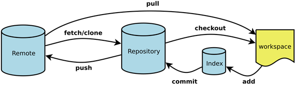

<h1 align="center"><b><p>Git学习笔记</p></b></h1>

***

# **Git图解**



# **一、新建代码仓库**

\# 在当前目录新建一个Git代码库

```git
git init
```

\# 新建一个目录，将其初始化为Git代码库

```
git init [project-name] 
```

\# 下载一个项目和它的整个代码历史

```
git clone [url]
```

***

# **二、配置**

Git的设置文件为.gitconfig，它可以在用户主目录下（全局配置），也可以在项目目录下（项目配置）。

\# 显示当前的Git配置

```
git config --list
```

 \# 编辑Git配置文件

```
git config -e [--global]
```

 \# 设置提交代码时的用户信息

```
git config [--global] user.name "[name]" 

git config [--global] user.email "[email address]"
```

\# 查看生成的公钥：

```
cat ~/.ssh/id_rsa.pub
```

***

# **三、增加/删除文件** 

\# 添加指定文件到暂存区

```
git add [file1] [file2] ...
```

 \# 添加指定目录到暂存区，包括子目录

```
git add [dir]
```

 \# 添加当前目录的所有文件到暂存区

```
git add 
```

\# 添加工作目录下的所有文件

```
git add -A
```

 \# 添加每个变化前，都会要求确认

\# 对于同一个文件的多处变化，可以实现分次提交

```
git add -p
```

\# 删除工作区文件，并且将这次删除放入暂存区

```
git rm [file1] [file2] ...
```

 \# 停止追踪指定文件，但该文件会保留在工作区

```
git rm --cached [file]
```

 \# 改名文件，并且将这个改名放入暂存区

```
git mv [file-original] [file-renamed]
```

\# 添加子模块

```
git submodule add  仓库地址   路径
```

\# 下载子模块

```
git submodule update --init --recursive
```


***

# **四、代码提交**

 \# 提交暂存区到仓库区

```
git commit -m [message]
```

 \# 提交暂存区的指定文件到仓库区

```
git commit [file1] [file2] ... -m [message]
```

 \# 提交工作区自上次commit之后的变化，直接到仓库区

```
git commit -a
```

 \# 提交时显示所有diff信息

```
git commit -v
```

 \# 使用一次新的commit，替代上一次提交

\# 如果代码没有任何新变化，则用来改写上一次commit的提交信息

```
git commit --amend -m [message]
```

 \# 重做上一次commit，并包括指定文件的新变化

```
git commit --amend [file1] [file2] ...
```

***

# **五、分支**

 \# 列出所有本地分支

```
git branch
```

 \# 列出所有远程分支

```
git branch -r
```

 \# 列出所有本地分支和远程分支

```
git branch -a
```

 \# 新建一个分支，但依然停留在当前分支

```
$ git branch [branch-name]
```

 \# 新建一个分支，并切换到该分支

```
git checkout -b [branch]
```

 \# 新建一个分支，指向指定commit

```
git branch [branch] [commit]
```

 \# 新建一个分支，与指定的远程分支建立追踪关系

```
git branch --track [branch] [remote-branch]
```

 \# 切换到指定分支，并更新工作区

```
git checkout [branch-name]
```

 \# 切换到上一个分支

```
git checkout -
```

\# 建立追踪关系，在现有分支与指定的远程分支之间

```
git branch --set-upstream [branch] [remote-branch]
```

\# 合并指定分支到当前分支

```
git merge [branch]
```

 \# 选择一个commit，合并进当前分支

```
git cherry-pick [commit]
```

 \# 把新建的本地分支push到远程服务器，远程分支与本地分支同名（当然可以随意起名）：

```
git push origin [local branch name]:[remote branch name]
```

 \# 删除分支

```
git branch -D [branch-name]
```

 \# 删除远程分支

```
git push origin --delete [branch-name]

git branch -dr [remote/branch]
```

***

# **六、标签**

\# 列出所有tag

```
git tag
```

 \# 新建一个tag在当前commit

```
git tag [tag]
```

\# 新建一个tag在指定commit

```
git tag [tag] [commit]
```

 \# 删除本地tag

```
git tag -d [tag]
```

\# 删除远程tag

```
git push origin :refs/tags/[tagName]
```

\# 查看tag信息

```
git show [tag]
```

 \# 提交指定tag

```
git push [remote] [tag]
```

 \# 提交所有tag

```
git push [remote] --tags
```

 \# 新建一个分支，指向某个tag

```
git checkout -b [branch] [tag]
```

***

# **七、查看信息**

\# 显示有变更的文件

```
git status
```

 \# 显示当前分支的版本历史

```
git log
```

 \# 显示commit历史，以及每次commit发生变更的文件

```
git log --stat
git log --graph

// 可列出文件的所有改动历史 (直接进入文件所在的目录)
git log --pretty=oneline 文件名
```

 \# 搜索提交历史，根据关键词

```
git log -S [keyword]
```

 \# 显示某个commit之后的所有变动，每个commit占据一行

```
git log [tag] HEAD --pretty=format:%s
```

\# 显示某个commit之后的所有变动，其"提交说明"必须符合搜索条件

```
git log [tag] HEAD --grep feature
```

 \# 显示某个文件的版本历史，包括文件改名

```
$ git log --follow [file]
$ git whatchanged [file]
```

 \# 显示指定文件相关的每一次diff

```
git log -p [file]
```

 \# 显示过去5次提交

```
git log -5 --pretty --oneline
```

 \# 显示所有提交过的用户，按提交次数排序

```
git shortlog -sn
```

 \# 显示指定文件是什么人在什么时间修改过

```
git blame [file]
```

 \# 显示暂存区和工作区的差异

```
git diff
```

 \# 显示暂存区和上一个commit的差异

```
git diff --cached [file]
```

 \# 显示工作区与当前分支最新commit之间的差异

```
git diff HEAD
```

 \# 显示两次提交之间的差异

```
git diff [first-branch]...[second-branch]
```

 \# 显示今天你写了多少行代码

```
git diff --shortstat "@{0 day ago}"
```

 \# 显示某次提交的元数据和内容变化

```
git show [commit]
```

 \# 显示某次提交发生变化的文件

```
git show --name-only [commit]
```

 \# 显示某次提交时，某个文件的内容

```
git show [commit]:[filename]
```

 \# 显示当前分支的最近几次提交

```
git reflog
```

***

# **八、远程同步**

 \# 下载远程仓库的所有变动

```
git fetch [remote]
```

 \# 显示所有远程仓库

```
git remote -v
```

 \# 显示某个远程仓库的信息

```
git remote show [remote]
```

\# 增加一个新的远程仓库，并命名

```
git remote add [shortname] [url]
```

 \# 取回远程仓库的变化，并与本地分支合并

```
git pull [remote] [branch]
```

 \# 上传本地指定分支到远程仓库

```
git push [remote] [branch]
```

 \# 强行推送当前分支到远程仓库，即使有冲突

```
git push [remote] --force
```

 \# 推送所有分支到远程仓库

```
git push [remote] --all
```

  \# 合并两个远程仓库的分支

```
git merge [other remote branch] --allow-unrelated-histories
```

***

# **九、撤销**

 \# 恢复暂存区的指定文件到工作区

```
git checkout [file]
```

 \# 恢复某个commit的指定文件到暂存区和工作区

```
git checkout [commit] [file]
```

 \# 恢复暂存区的所有文件到工作区

```
git checkout .
```

 \# 重置暂存区的指定文件，与上一次commit保持一致，但工作区不变

```
git reset [file]
```

 \# 重置暂存区与工作区，与上一次commit保持一致

```
git reset --hard
```

 \# 重置当前分支的指针为指定commit，同时重置暂存区，但工作区不变

```
git reset [commit]
```

\# 重置当前分支的HEAD为指定commit，同时重置暂存区和工作区，与指定commit一致

```
git reset --hard [commit]
```

 \# 重置当前HEAD为指定commit，但保持暂存区和工作区不变

```
git reset --keep [commit]
```

 \# 已经git add的文件，可以用这个取消add

```
git reset HEAD 
```

 \# 执行完commit后，想撤回commit

\# HEAD^的意思是上一个版本，也可以写成HEAD~1

\# 如果你进行了2次commit，想都撤回，可以使用HEAD~2

\# --mixed : 不删除工作空间改动代码，撤销commit，并且撤销git add.

\# --soft : 不删除工作空间改动代码，撤销commit，不撤销git add . 

\# --hard : 删除工作空间改动代码，撤销commit，撤销git add .

```
git reset --soft HEAD^
```

\# 取消某次合并

```
git reset --merge
```

 \#如果commit注释写错了，只是想改一下注释，只需要：

```
git commit --amend
```

此时会进入默认vim编辑器，修改注释完毕后保存就好了。

 \# 新建一个commit，用来撤销指定commit

\# 后者的所有变化都将被前者抵消，并且应用到当前分支

```
git revert [commit]
```

 \# 暂时将未提交的变化移除，稍后再移入

```
git stash

git stash pop
```

 \2. 本地新增了一堆文件(并没有git add到暂存区)，想放弃修改。

单个文件/文件夹：

```
rm filename / rm dir -rf
```

所有文件/文件夹：

```
git clean -xdf
```

// 删除新增的文件，如果文件已经已经git add到暂存区，并不会删除！

***

# **十、其他**

 \# 生成一个可供发布的压缩包

```
git archive
```

git fetch命令用于从另一个存储库下载对象和引用。

使用语法

```
git fetch [<options>] [<repository> [<refspec>…]]

git fetch [<options>] <group>

git fetch --multiple [<options>] [(<repository> | <group>)…]

git fetch --all [<options>]
```

 

**描述:**

从一个或多个其他存储库中获取分支和/或标签(统称为“引用”)以及完成其历史所必需的对象。 远程跟踪分支已更新(Git术语叫做commit)，需要将这些更新取回本地，这时就要用到git fetch命令。

默认情况下，还会获取指向正在获取的历史记录的任何标签; 效果是获取指向您感兴趣的分支的标签。可以使用--tags或--no-tags选项或通过配置远程.<name>.tagOpt 来更改此默认行为。 通过使用显式提取标签的refspec，可以获取不指向您感兴趣的分支的标签。

git fetch可以从单个命名的存储库或URL中获取，也可以从多个存储库中获取，如果给定了<group>，并且配置文件中有一个远程<group>条目。

获取的参考名称以及它们所指向的对象名称被写入到.git/FETCH_HEAD中。 此信息可能由脚本或其他git命令使用，如git-pull。

1. 更新远程跟踪分支

```
git fetch origin
```

 上述命令从远程refs/heads/命名空间复制所有分支，并将它们存储到本地的refs/remotes/ origin/命名空间中，除非使用分支.<name>.fetch选项来指定非默认的refspec。

2. 明确使用refspec

```
git fetch origin +pu:pu maint:tmp
```

此更新(或根据需要创建)通过从远程存储库的分支(分别)pu和maint提取来分支本地存储库中的pu和tmp。

即使没有快进，pu分支将被更新，因为它的前缀是加号; tmp不会。

3. 在远程分支上窥视，无需在本地存储库中配置远程

```
git fetch git://git.kernel.org/pub/scm/git/git.git maint

git log FETCH_HEAD 
```

第一个命令从 git://git.kernel.org/pub/scm/git/git.git 从存储库中获取maint分支，第二个命令使用FETCH_HEAD来检查具有git-log的分支。

4. 将某个远程主机的更新

```
git fetch <远程主机名>
```

要更新所有分支，命令可以简写为：

```
git fetch
```

上面命令将某个远程主机的更新，全部取回本地。默认情况下，git fetch取回所有分支的更新。如果只想取回特定分支的更新，可以指定分支名,如下所示 - 

```
git fetch <远程主机名> <分支名>
```

比如，取回origin主机的master分支。

```
git fetch origin master
```

所取回的更新，在本地主机上要用”远程主机名/分支名”的形式读取。比如origin主机的master分支，就可以用origin/master读取。

git branch命令的-r选项，可以用来查看远程分支，-a选项查看所有分支。

```
git branch –r origin/master

git branch –a * master remotes/origin/master 
```

上面命令表示，本地主机的当前分支是master，远程分支是origin/master。

取回远程主机的更新以后，可以在它的基础上，使用git checkout命令创建一个新的分支。

```
git checkout -b newBrach origin/master 
```

上面命令表示，在origin/master的基础上，创建一个新分支:newBrach。

此外，也可以使用git merge命令或者git rebase命令，在本地分支上合并远程分支。

```
git merge origin/master  //默认情况下，Git执行"快进式合并"（fast-farward merge）
// 使用--no-ff参数后，会执行正常合并，为了保证版本演进的清晰，建议采用这种方法。
git merge --no-ff origin/master

// 合并策略：resolve、recursive、octopus、ours、subtree
// 参数： ours、theirs、patience、no-renames
git merge 要合并进来的分支名 -s 合并策略 -X 参数

```

\# 或者

```
git rebase origin/master 
```

上面命令表示在当前分支上，合并origin/master。