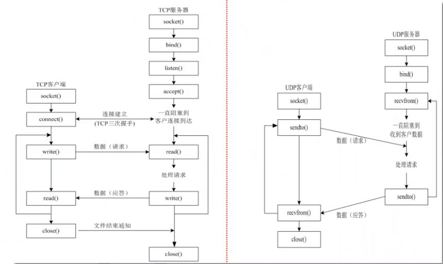

# UDP网络编程


***

***

# TCP**网络编程**

## **1. TCP介绍、编程流程**

**TCP介绍：**

- 面向连接的流式协议：可靠、出错重传、且每收到一个数据都要做出相应的确认。
- 通信之前需要建立链接。
- 服务器被动链接，客户端主动链接。

**TCP和UDP区别：**

|                    | **TCP** | **UDP** |
| :----------------: | :-----: | :-----: |
|  **是否面向链接**  |   是    |   否    |
|    **是否可靠**    |   是    |   否    |
| **是否广播、多播** |   否    |   是    |
|      **效率**      |   低    |   高    |




**TCP编程流程：**

- **服务器：**
  1. 创建套接字(socket)
  2. 将套接字与服务器网络信息结构绑定(bind)
  3. 将套接字设置为监听状态(listen)
  4. 阻塞等待客户端的连接请求(accept)
  5. 进行通信(recv / send)
  6. 通信完毕，关闭套接字(close)
- **客户端：**
  1. 创建套接字(socket)
  2. 发送客户端连接请求(connect)
  3. 进行通信(recv / send)
  4. 通信完毕，关闭套接字(close)

***

## **2. TCP编程**

**API介绍：**

```c
/*	功能： 创建一个套接字，返回一个文件描述符

	参数：
		domain: 通信域、协议族
			AF_UNIX		本地通信
			AF_INET		ipv4网络协议
			AF_INET6	ipv6网络协议
			AF_PACKET	底层接口
		type： 套接字类型
			SOCK_STREAM	流式套接字(tcp)
			SOCK_DGRAM	数据报套接字(ucp)
			SOCK_RAW	原始套接字(用于链路层)
		protocol: 附加协议，如果不需要，则设置为0
		
	返回值：
		成功： 文件描述符
		失败： -1
*/
int socket(int domain, int type, int protocol);
```

**案例：**

```c
#include <stdio.h>
#include <sys/socket.h>
#include <sys/types.h>
#include <stdlib.h>

int main(int argc, char *argv[])
{
    int socketfd;
    if((socketfd = socket(AF_INET, SOCK_STREAM, 0)) == -1)
    {
        perror("failed to create socket.");
        exit(1);
    }

    printf("socket = %d", socketfd);

    return 0;
}
```

***

## **3. TCP客户端**

**conncet函数:**

```c
/*
	功能： 客户端发送链接请求
	参数：
		sockfd	文件描述符，socket函数的返回值
		addr	要连接的服务器的网络信息结构体(需要自己设置)
        len		addr的长度
	返回值：
		成功： 0
		失败： -1
*/
int connect(int sockfd, const struct sockaddr *addr, socklen_t len);
```

注意：

- connect建立连接之后不会产生新的套接字
- 连接成功后才可以开始传输TCP数据
- 头文件 `#include <sys/socket.h>`

**send函数：**

```c
/*
	功能： 用于发送数据
	参数：
		sockfd	已建立连接的套接字描述符
		buff	发送数据的地址
		nbytes	发送数据的大小(以字节为单位)
		flags	套接字标志位(常为0)
			0				阻塞
			MSG_DONTWAIT	非阻塞
	返回值：
		成功发送的字节数
*/
ssize_t send(int sockfd, const void *buff, size_t nbytes, int flags);
```

**注意：**

- 不能用TCP协议发送0长度的数据包

**recv函数：**

```c
/*
	功能： 用于接收网络数据
	参数：
		sockfd	套接字描述符
		buff	接收网络数据的缓冲区的地址
		nbytes	接收缓冲区的大小(以字节为单位)
		flags	套接字标志(常为0)
	返回值：
		成功接收到的字节长度
*/
ssize_t recv(int sockfd, void *buff, size_t nbytes, int flags);
```

**示例：**

```c
#include <stdio.h>
#include <sys/socket.h>
#include <sys/types.h>
#include <stdlib.h>
#include <arpa/inet.h>
#include <netinet/in.h>
#include <string.h>
#include <unistd.h>

int main(int argc, char *argv[])
{
    // socket
    int socketfd;
    if((socketfd = socket(AF_INET, SOCK_STREAM, 0)) == -1)
    {
        perror("failed to create socket.\n");
        exit(1);
    }
    printf("socket = %d\n", socketfd);

    // connect
    struct sockaddr_in serveraddr;
    serveraddr.sin_family = AF_INET;
    serveraddr.sin_addr.s_addr = inet_addr("10.192.91.40");
    serveraddr.sin_port = htons(atoi("11060"));
    socklen_t addrLen = sizeof(serveraddr);
    if(connect(socketfd, (struct sockaddr *)&serveraddr, addrLen) == -1)
    {
        perror("failed to connect server.\n");
        exit(1);
    }

    while (1)
    {
        // recv
        char text[128] = "";
        if(recv(socketfd, text, 128, 0) == -1)
        {
            perror("failed to recv data.\n");
            exit(1);
        }
        printf("recv data: %s\n", text);

         // send
        char buff[128] = "";

        fgets(buff, 128, stdin);
        buff[strlen(buff) - 1] = '\0';
        if(send(socketfd, buff, strlen(buff), 0) == -1)
        {
            perror("failed to send data.\n");
            exit(1);
        }
    }    
    // close
    close(socketfd);
    return 0;
}
```

***

## **4. TCP服务器**

**作为TCP服务器需要具备的条件：**

1. 具备一个可以明确的地址。
2. 让操作系统知道是一个服务器，而不是客户端
3. 等待连接的到来

对于面向对象连接的TCP协议来说，连接的建立才真正意味着数据通信的开始。

**bind函数：**

```c
/*
	功能： 将套接字与网络信息结构绑定
	参数：
		sockfd	文件描述符，socket的返回值
		addr	网络信息结构体
			通用结构体： struct sockaddr
			网络信息结构体： 
				#include <netinet/in.h>
				struct sockaddr_in
		addrlen： addr的长度
	返回值：
		成功： 0
		失败： -1
*/
int bind(int sockfd, const struct sockaddr *addr, socklen_t addrlen);
```

**listen函数：**

```c
/*
	功能：
		将套节字由主动改为被动
		使操作系统为该套接字设置一个连接队列，用来记录所有连接到该套接字的连接
	参数：
		sockfd	监听套接字
		backlog	连接队列的长度
	返回值：
		成功： 0
		失败： -1
*/
int listen(int sockfd, int backlog);
```

**accept函数：**

```c
/*
	功能：
		从已连接队列中取出一个已经建立的连接，如果没有任何连接可用，则进入睡眠等待(阻塞)
	参数：
		sockfd	套接字文件描述符
		addr	用于存放客户端套接字地址结构
		addrlen	套接字地址结构长度的地址
	返回值：
		成功： 新的文件描述符(只要有客户端连接，就会产生新的文件描述符)
		失败： -1
*/
int accept(int sockfd, struct sockaddr *addr, socklen_t *addrlen);
```

**案例：**

```c
#include <stdio.h>
#include <sys/socket.h>
#include <sys/types.h>
#include <stdlib.h>
#include <arpa/inet.h>
#include <netinet/in.h>
#include <string.h>
#include <unistd.h>


int main(int argc, char *argv[])
{
    // socket
    int socketfd;
    if((socketfd = socket(AF_INET, SOCK_STREAM, 0)) == -1)
    {
        perror("failed to create socket.\n");
        exit(1);
    }
    printf("socket = %d\n", socketfd);

    // bind
    struct sockaddr_in serveraddr;
    serveraddr.sin_family = AF_INET;
    serveraddr.sin_addr.s_addr = inet_addr("192.168.218.129");
    serveraddr.sin_port = htons(atoi("30010"));
    socklen_t addrLen = sizeof(serveraddr);
    if(bind(socketfd, (struct sockaddr *)&serveraddr, addrLen) == -1)
    {
        perror("failed to bind.\n");
        close(socketfd);
        exit(1);
    }

    // listen
    if(listen(socketfd, 5) == -1)
    {
        perror("failed to listen.");
        close(socketfd);
        exit(1);
    }

    // accept
    int acceptfd;
    struct sockaddr_in clientaddr;
    if((acceptfd = accept(socketfd, (struct sockaddr *)&clientaddr, &addrLen)) == -1)
    {
        perror("failed to accept.");
        exit(1);
    }
    printf("ip::%s, port::%d\n", inet_ntoa(clientaddr.sin_addr), ntohs(clientaddr.sin_port));

    while (1)
    {
        // recv
        char text[128] = "";
        if(recv(acceptfd, text, 128, 0) == -1)
        {
            perror("failed to recv data.\n");
            exit(1);
        }
        printf("recv data: %s\n", text);

        // send
        strcat(text, "*-*"); 
        if(send(acceptfd, text, strlen(text), 0) == -1)
        {
            perror("failed to send data.\n");
            exit(1);
        }
    }
   
    // close
    close(acceptfd);    
    close(socketfd);
    return 0;
}
```

**close函数：**

```c
#include <unistd.h>
/*
	功能： 关闭套接字
	参数： 
		sockfd	套接字文件描述符
*/
int close(int sockfd);
```

- 使用close函数即可关闭套接字
  1. 关闭一个代表已连接套接字将导致另一端收到一个0长度的数据包。
- 做服务器时
  1. 关闭监听套接字将导致服务器无法接收新的连接，但不会影响已经建立的连接
  2. 关闭accept返回的已连接套接字将导致它所代表的连接被关闭，但不会影响服务器的监听
- 做客户端时
  1. 关闭连接就是关闭通信，不意味着其他

## **5. 三次握手**

**图解：**


## **6. 四次挥手**

**图解：**


## **7. TCP并发服务器**

**TCP原始不能实现并发的原因：**

- 由于TCP服务器端有两个读阻塞函数，accept和recv，两个函数需要先后运行，所以导致运行一个函数的时候另一个函数无法执行，所以无法保证一边连接客户端，一遍与其他客户端通信

**如何实现TCP并发服务器：**

1. 使用多进程实现TCP并发服务器。
2. 使用多线程实现TCP并发服务器。

### **7.1 多进程实现并发**

```c
#include <stdio.h>
#include <sys/socket.h>
#include <sys/types.h>
#include <stdlib.h>
#include <arpa/inet.h>
#include <netinet/in.h>
#include <string.h>
#include <unistd.h>
#include <sys/wait.h>
#include <signal.h>

// 信号 监听 回收子进程的资源
void handler(int sig)
{
    wait(NULL);
}


int main(int argc, char *argv[])
{
    // socket
    int socketfd;
    if((socketfd = socket(AF_INET, SOCK_STREAM, 0)) == -1)
    {
        perror("failed to create socket.\n");
        exit(1);
    }
    printf("socket = %d\n", socketfd);

    // bind
    struct sockaddr_in serveraddr;
    serveraddr.sin_family = AF_INET;
    serveraddr.sin_addr.s_addr = inet_addr("192.168.218.129");
    serveraddr.sin_port = htons(atoi("30010"));
    socklen_t addrLen = sizeof(serveraddr);
    if(bind(socketfd, (struct sockaddr *)&serveraddr, addrLen) == -1)
    {
        perror("failed to bind.\n");
        close(socketfd);
        exit(1);
    }

    // listen
    if(listen(socketfd, 5) == -1)
    {
        perror("failed to listen.");
        close(socketfd);
        exit(1);
    }
	// 信号 监听子进程是否关闭
    signal(SIGCHLD, handler);

    // accept
    int acceptfd;
    struct sockaddr_in clientaddr;

    while (1)
    {
        if((acceptfd = accept(socketfd, (struct sockaddr *)&clientaddr, &addrLen)) == -1)
        {
            perror("failed to accept.");
            exit(1);
        }
        printf("ip::%s, port::%d\n", inet_ntoa(clientaddr.sin_addr), ntohs(clientaddr.sin_port));
        pid_t pid;
        if((pid=fork()) < 0)
        {
            printf("failed to fork");
            continue;
        }
        else if(pid > 0) // parent proc
        {
             
        }
        else if(pid == 0)
        {
            while (1)
            {
                // recv
                char text[128] = "";
                if(recv(acceptfd, text, 128, 0) == -1)
                {
                    perror("failed to recv data.\n");
                    exit(1);
                }
                printf("recv data: %s\n", text);

                // send
                strcat(text, "*-*"); 
                if(send(acceptfd, text, strlen(text), 0) == -1)
                {
                    perror("failed to send data.\n");
                    exit(1);
                }
            }
        }
    }
   
    // close
    close(acceptfd);
    
    close(socketfd);

    return 0;
}
```


### **7.2 多线程实现并发**

**示例：**

```c
#include <stdio.h>
#include <sys/socket.h>
#include <sys/types.h>
#include <stdlib.h>
#include <arpa/inet.h>
#include <netinet/in.h>
#include <string.h>
#include <unistd.h>

// 编译的时候 : gcc .c -o out -lpthread
#include <pthread.h>
#include <bits/pthreadtypes.h>


typedef struct
{
    struct sockaddr_in addr;
    int acceptfd;
}MSG;

void *threadFunc(void *arg)
{
    MSG msg = *(MSG *)arg;
    while (1)
    {
        // recv
        char text[128] = "";
        if(recv(msg.acceptfd, text, 128, 0) == -1)
        {
            perror("failed to recv data.\n");
            break;
        }
        printf("recv data: %s\n", text);

        // send
        strcat(text, "*-*"); 
        if(send(msg.acceptfd, text, strlen(text), 0) == -1)
        {
            perror("failed to send data.\n");
            break;
        }
    }
    // close
    if(msg.acceptfd > 0)
        close(msg.acceptfd);
}

int main(int argc, char *argv[])
{
    // socket
    int socketfd;
    if((socketfd = socket(AF_INET, SOCK_STREAM, 0)) == -1)
    {
        perror("failed to create socket.\n");
        exit(1);
    }
    printf("socket = %d\n", socketfd);

    // bind
    struct sockaddr_in serveraddr;
    serveraddr.sin_family = AF_INET;
    serveraddr.sin_addr.s_addr = inet_addr("192.168.218.129");
    serveraddr.sin_port = htons(atoi("30010"));
    socklen_t addrLen = sizeof(serveraddr);
    if(bind(socketfd, (struct sockaddr *)&serveraddr, addrLen) == -1)
    {
        perror("failed to bind.\n");
        close(socketfd);
        exit(1);
    }

    // listen
    if(listen(socketfd, 5) == -1)
    {
        perror("failed to listen.");
        close(socketfd);
        exit(1);
    }

    // accept
    int acceptfd;
    struct sockaddr_in clientaddr;

    while(1)
    {
        if((acceptfd = accept(socketfd, (struct sockaddr *)&clientaddr, &addrLen)) == -1)
        {
            perror("failed to accept.");
            exit(1);
        }
        printf("ip::%s, port::%d\n", inet_ntoa(clientaddr.sin_addr), ntohs(clientaddr.sin_port));

        // create thread
        MSG msg;
        msg.addr = clientaddr;
        msg.acceptfd = acceptfd;

        pthread_t thread;
        
        if(pthread_create(&thread, NULL, threadFunc, &msg) != 0)
        {
            perror("failed to create thread");
            continue;
        }
        pthread_detach(thread);    
    }
    close(socketfd);

    return 0;
}
```

**注意：**

- pthread库不是Linux系统默认的库，链接时需要使用静态库libpthread.a,所以在使用pthread_creat()创建线程，以及调用pthread_atfork()函数建立fork处理程序时，需要链接该库。
  	在编译中要加 -lpthread 参数
  	例：gcc thread.c -o thread -lpthread

***

# **8. 原始套接字**

**概述(SOCK_RAW)：**

1. 一种不同于SOCK_STREAM、SOCK_DGRAM的套接字，它实现于系统核心
2. 可以接收本机往卡上所有的数据帧(数据包)，对于监听网络流量和分析网络数据很有作用
3. 开发人员可以发送自己组装的数据包到网络上
4. 广泛应用于高级网络编程
5. 网络专家、黑客常会用此来编写奇特的网络程序

**原始套接字可以收发：**

1. 内核没有处理的数据包，因此要访问其它协议
2. 发送的数据需要使用，原始套接字(SOCK_RAW)

## 8.1 创建原始套接字

```c
/*
	功能：创建链路层的原始套接字
	参数：
		protocol	附加协议
			#include <netinet/ether.h>
			ETH_P_ALL	所有协议的数据包
			ETH_P_IP	ip数据包
			ETH_P_ARP	arp数据包
	返回值：
		成功：文件描述符
		失败：-1
*/
int socket(PF_PACKET, SOCK_RAW, protocol);
```

**案例：**

```c
#include <stdio.h>
#include <sys/socket.h>
#include <sys/types.h>
#include <stdlib.h>
#include <arpa/inet.h>
#include <netinet/in.h>
#include <unistd.h>
#include <netinet/ether.h>

int main(int argc, char *argv[])
{
    // socket
    int sockfd;
    if((sockfd = socket(AF_PACKET, SOCK_RAW, htons(ETH_P_ALL))) == -1)
    {
        perror("failed to create socket");
        exit(1);
    }
    printf("sockfd = %d\n", sockfd);


    // close
    close(sockfd);
    return 0;
}
```

**注意：**

- 执行原始套接字需要管理员权限


